# cve-2015-5122 漏洞分析 - goabout2 - 博客园

> 原文：[`www.cnblogs.com/goabout2/p/4655252.html`](https://www.cnblogs.com/goabout2/p/4655252.html)

HackTem 爆出的第二枚 0day，分析了下，做个记录。

Poc 中一开始会分配一个 Array 类型的 _ar 结构。

 

第一次赋值

此时在 a[0 ] –a[1e-1] 处已被赋值为 Vector.<uint>(62)结构。

 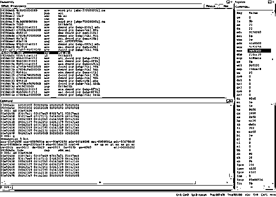

任意查询可发现给 vector 的长度已被赋值为 62 生成的 array  0~1e

 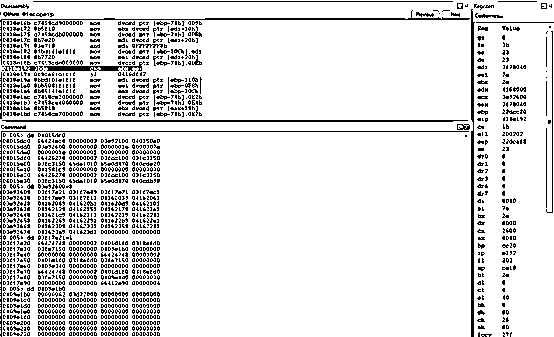

之后对 1e~7e 间的 ar[i]进行赋值，每个模块为 Vector.<uint>(8),其中第一个字节设置标记位，用于之后快速定位越界单元。

 

查看对应的内存，可以发现 1e~7e 中为长度为 8 的 Vector.<uint>(8)

 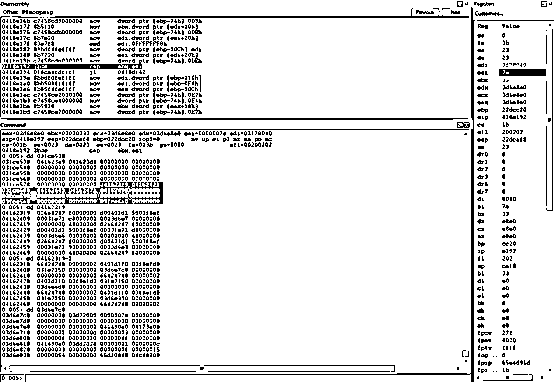

a[i]中被赋值之后的数组 1e~2e 处已被赋值

总的 a[i]内存

 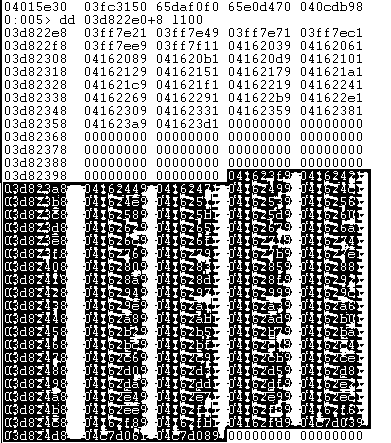

对 a[i]中 1e~2e 处的单元进行赋值，赋值对象为一个 TextLine 对象

 

开始赋值

 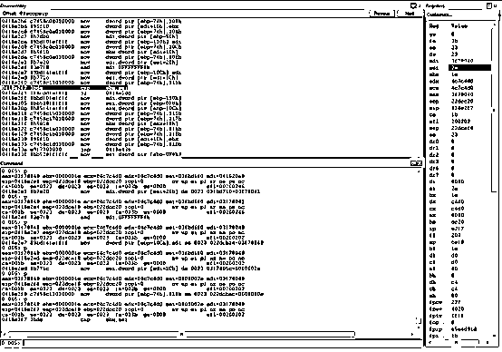

赋值结束之后的内存空间

 

此时 a[i]中赋值完毕,整体的 a 结构

 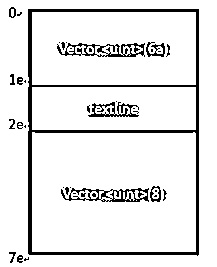

     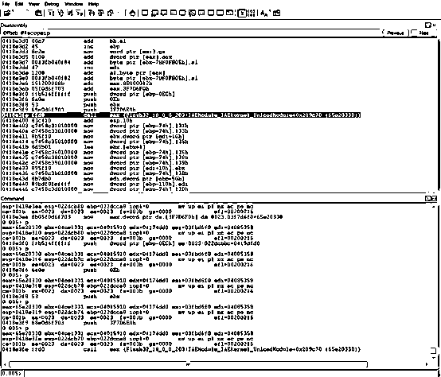                       

获取对应的 textline 的对象

 

对 a[i]中 1e~2e 中的 textline 单元设置 opaqueBackground 属性，该属性会导致 avm 为每个单元分配大小为 0x390 的内存空间

 

获取对应的 textline 对象

首先调用 0418e3b3 处的函数用于返回对应的 textline 单元，获取该单元之后在 0418e3fecc 处通过 call eax 创建 0x390 大小的内存,在该函数中随后会有对 valueOf2 的操作进行判断，成功的话会由此进入 valueOf2 的判断，从而导致 uaf,而在 call eax 返回前会对 0x390 的内存空间偏移 0x320 的地方进行 6a 的赋值，通过精心的内存布局，可致使 6a 被写入到 vector 的 length 域中。

 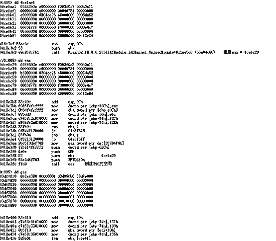

整个内存分配结束之后

生成的 vector<uint>(62)

 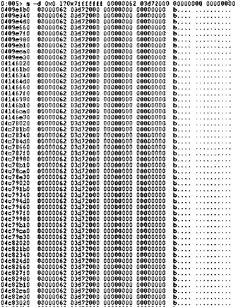

生成的 Vector<8>

 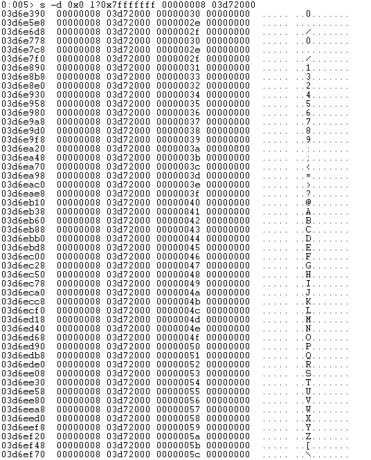

生成的 backGroundObj 空间

 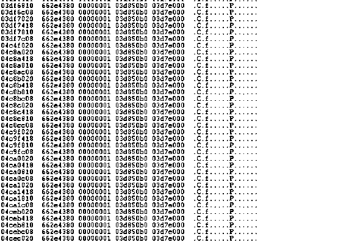

对 textline 对象的 opaqueBackgroind 属性进行赋值，此处赋值的对象为 MyClass32，由于 array 为 Byte 属性，此时赋值的话将导致 MyClass 类的 valudfo 函数调用。

 

进入 valueOf 函数中，对 a[i]中的 textline 对象进行释放，大小

 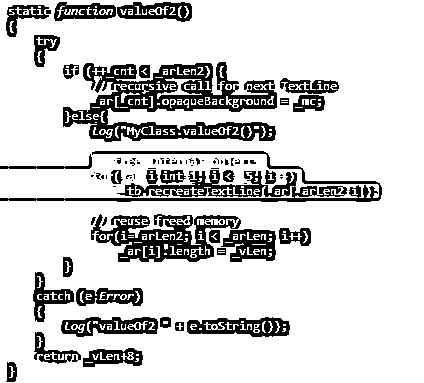

释放前的 backgroudObj

 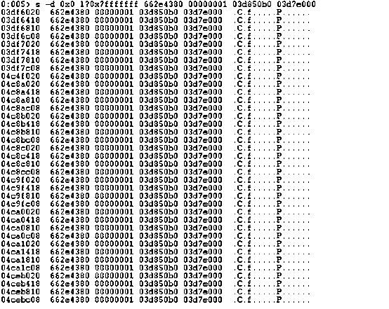

完全释放 5 个 backgroudObj 之后。

 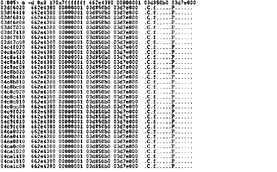

释放之后立即，对 a[i]中 1e~7e 的数据单元的长度进行重置，由于 avm 中的内存管理机制，会导致之前分配的内存被优先分配，从而致使之前释放掉的 5 个 backgroudObj 的内存被重新分配的 ar 数组中的十个单元所占有。

 

如下图所示内存出处最后一个单元外，之前所有的单元已经重新分配完毕

 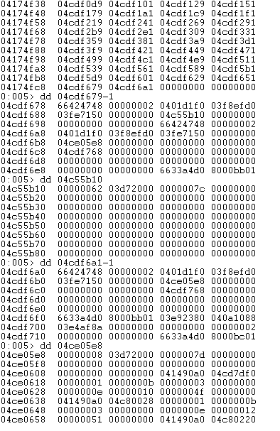

通过对比释放掉的五个 backgroundObj，此处可以在内存中搜索出是那几个单元重用了之前释放的内存，如下图所示。

 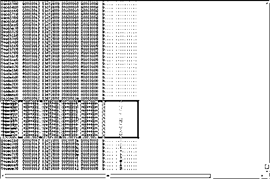

之前提到该操作会导致对应 MyClass 类的 ValueOf 函数被调用，在该函数中我们释放 5 个 backgroundObj 对象，同时使用通过重置 ar[i]中 1e~7e 单元的大小，重新占有了这 5 个 backgroundObj 对象之前的空间，ValueOf 函数返回后，在其后的对应操作中，会对之前的 5 个 backgroundObj 对象中 x320 的位置进行想 x190 的赋值操作，由于重置之后的 ar[i]单元大小为 x190，因此正好导致其中某处单元的 vector 的长度值从 62 被设置为 6a。

 

整个过程如下图

 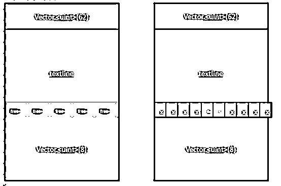

被设置的 ar[3b]单元，可见此处的 length 域已经被赋值为 6a。

 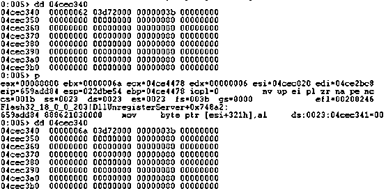

获取越界的 a[i],并将其相邻的 vector 结构的长度设置成 40000000，因而获取一个超长的全内存读写 vector

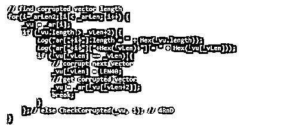 

生成的全局内存读写 vector

 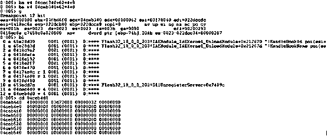