# cve-2015-5199 漏洞分析 - goabout2 - 博客园

> 原文：[`www.cnblogs.com/goabout2/p/4708898.html`](https://www.cnblogs.com/goabout2/p/4708898.html)

继续之前 hackteam 的 flash 漏洞，这次的对象为 cve-2015-5199,遂做一下记录。

首先，在该 exp 中 TryExpl 函数为漏洞的触发函数，该函数也为本次调试的主要对象，函数的开始首先创建两个 Array 对象 a 和 _gc.

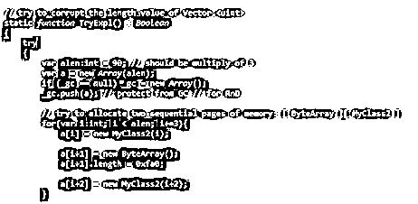 

此处对 Array 函数下断，对象断在 array。

 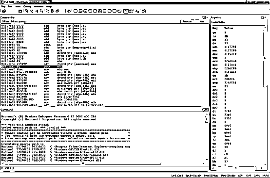

函数返回之后 a  array 对象生成，地址为 04115a30，对于 Array 对象在其偏移+10 的地方保存了实际 Array 内容的地址。此处为 03d800d8，03d800d8+8 即可观察到 array 中实际保存的内容。

 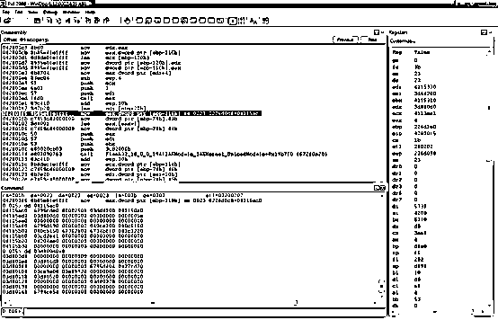

Gc array 对象生成，此处为 04115a30。

 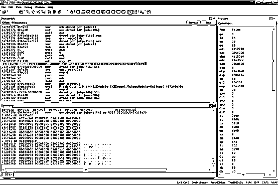

将 a（喷射对象）保存在 _gc 中，此处主要是考虑到之后会有大量的释放操作，以此来保护 a 对象内存。

 

gc.push(a)，push 之后，a 对象的地址保存到了 _gc 对象中，如下图所示。

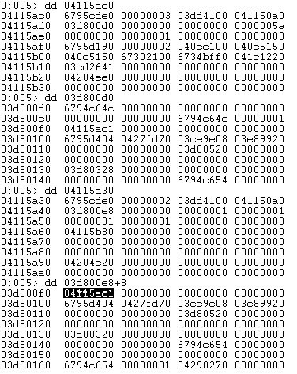 

开始对 a 进行循环赋值，一共操作 5a 次。

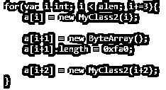 

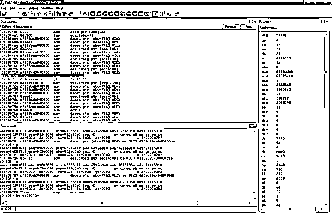

生成一次之后，得到一组 MyClass2，ByteArray，MyClass2 的内存结构。

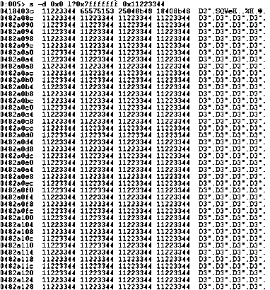

A 对象中对应的两个 myclass2 和一个 array

 

对应的 myclass2

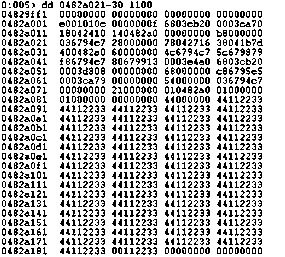 

具体对 MyClass2 结构的布局如下

 

接下来详细分析一个 MyClass2 对象的生成过程，下图的 call eax jitcode 中，实现对 MyClass2 对象的生成。

 

该处完成 0x11223344 赋值，该处 jit 结束之后，myclass2 已经完成赋值。

 

生成的 Bytearray。

 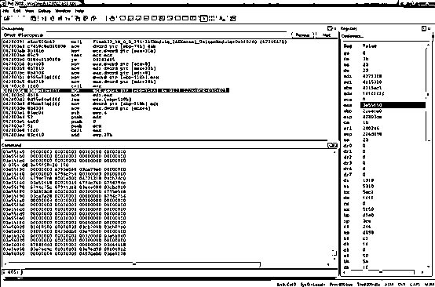

生成的第二个 Myclass2

 

循环几次之后 a 中保存的多组结构。

 

如下图图所示，最后生成的 a ，注意由于内存分配的原因，可以发现，在分配的一开始，每一组 myclass2，array，myclass2 在内存中并不是连续的，如下图所示，之后内存的分配趋于稳定，最后形成的每一组中的这三个对象在内存空中内存布局连续，这也是为什么之后的 exp 中循环赋值的时候是从数组后面往前赋值的原因，因为后面内存连续。

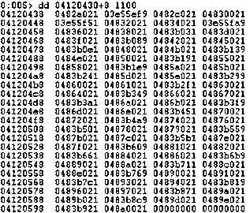 

a 中内存布局完成之后，进入以下循环，在该循环中，会依次将 a 中 Bytearray 赋值给 _ba,之后 MyClass 对象的赋值将导致 valueof 函数的调用。

 

对应的 valuefo 函数，该函数中对 ba.length 的修改，将导致 a 中对应的 Array 对象的内存释放，之后代码中的一个循环操作完成对释放对象的站位。

 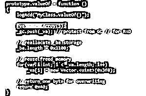

_va Array 对象生成，此处的地址为 041152e0。

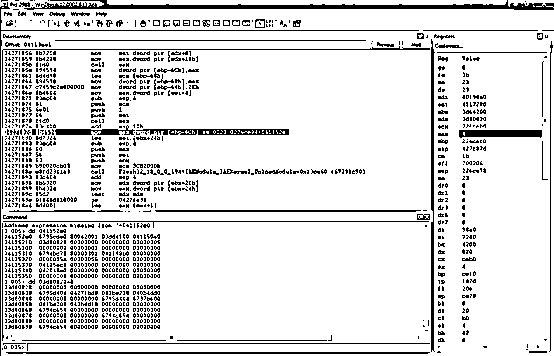

同样申城的 _va 对象会进行 gc.push(_va)的操作。

 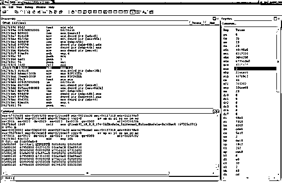

对 _ba.length 进行 1100 赋值操作。

 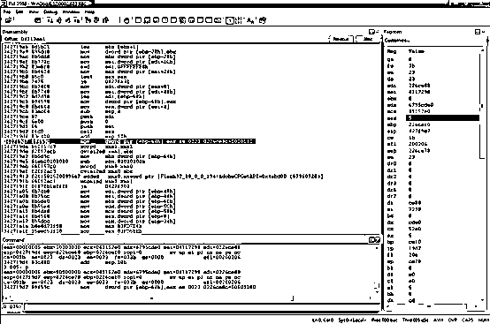

改变长度之后会导致 _ba 中的内存重新分配，因为 _ba 中的值其实就是 a 中所有的 ByteArray 结构，所以对于一组 Myclass2，ByteArray，Myclass2 的连续空间而言，相当于中间的 ByetArray

直接被释放。

 

因为发释放时循环从 a array 的后向前，如下图所示。

 

结合之前的中 a array 的结构，可以确定第一个释放的 ByteArra 结构的地址为 0483b8c9

 

站位之后可以发现，此时 0483b8c9 处指向的地址和正常的 ByteArray 已经不同,此时已被

释放。

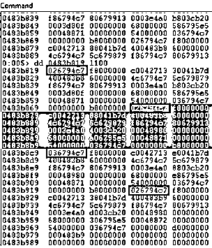 

释放之后，生成 vector.<uint>(0x3f0)用于站位，此处 0x3f0*4 = fc0，内存对齐之后，为 0x1000，正好满足站位的条件。

 

查看 _va 的内存，可以发现，此时 vector 对象的地址 040f8ab1 已经保存在 _va 中，在该对象偏移 1c 处保存了 vector 的内存空间的地址，不过同样该处的地址需要>>16 的操作，最后 vector 在 0x0489c000 处，可以看到在偏移 0 处正好为 vector 的长度 3f0.

 

此时释放的 ByteArray 空间已经被站位，当返回的时候，0x40 的值会被赋值给 _ba[3]中指向 ByteArray 的地址，因为此处对于 ByteArray 的引用存在问题，依然指向 old 的 ByteArray，此时 ByteArray 内存的地址实际上是我们站位的 vector,此时的赋值会将 0x40 赋值到 vector 对象长度地址的高位处，从而导致一个超长的 vector 产生，如下图下断点。

 

运行之后，产生一个超长的 vector

 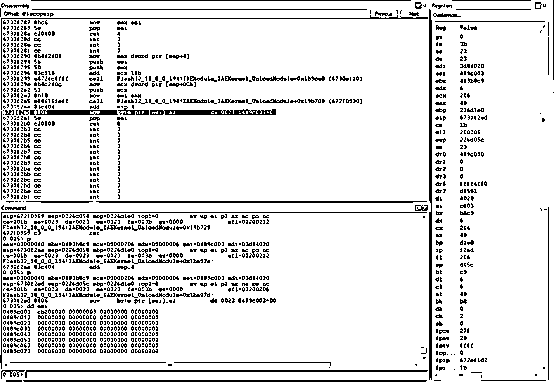

此时已经赋值成功。

 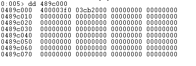