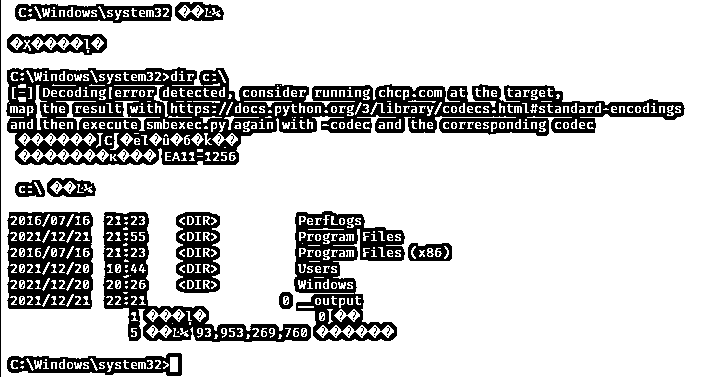
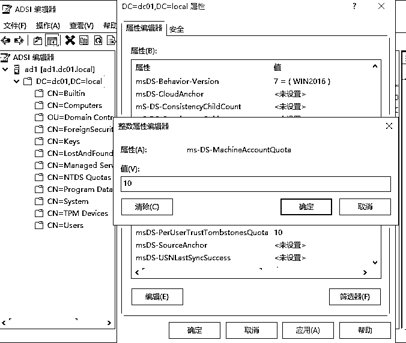
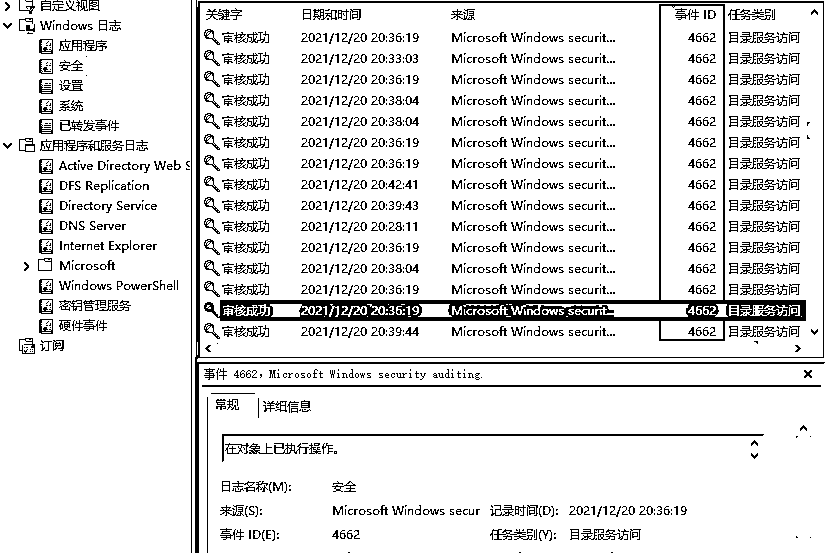

# cve-2021-42287 和 cve-2021-42278 漏洞复现 - KubeSec - 博客园

> 原文：[`www.cnblogs.com/0x00000/p/15625328.html`](https://www.cnblogs.com/0x00000/p/15625328.html)

# 一、漏洞概述

cve-2021-42287 : 由于 Active Directory 没有对域中计算机与服务器账号进行验证，经过身份验证的攻击 者利用该漏洞绕过完全限制，可将域中普通用户权限提升为域管理员权限并执行任意代码。
cve-2021-42278 ：由于应用程序缺少 Active Directory Domain Services 的安全限制，经过身份验证的 攻击者利用该漏洞绕过安全限制，导致 在目标系统上提升为管理员权限并执行任意代码。
https://msrc.microsoft.com/update-guide/vulnerability/CVE-2021-42287
https://msrc.microsoft.com/update-guide/vulnerability/CVE-2021-42278

# 二、影响范围

| 漏洞编号 | 受影响产品版本 |
| CVE-2021-42287 | Windows Server 2012 R2 (Server Core installation) |
| Windows Server 2012 R2 |
| Windows Server 2012 (Server Core installation) |
| Windows Server 2012 |
| Windows Server 2008 R2 for x64-based Systems Service Pack 1 (Server Core installation) |
| Windows Server 2008 R2 for x64-based Systems Service Pack 1 |
| Windows Server 2008 for x64-based Systems Service Pack 2 (Server Core installation) |
| Windows Server 2008 for x64-based Systems Service Pack 2 |
| Windows Server 2008 for 32-bit Systems Service Pack 2 (Server Core installation) |
| Windows Server 2016 (Server Core installation) |
| Windows Server 2016 |
| Windows Server, version 20H2 (Server Core Installation) |
| Windows Server, version 2004 (Server Core installation) |
| Windows Server 2022 (Server Core installation) |
| Windows Server 2022 |
| Windows Server 2019 (Server Core installation) |
| Windows Server 2019 |
| CVE-2021-42278 | Windows Server 2012 R2 (Server Core installation) |
| Windows Server 2012 R2 |
| Windows Server 2012 (Server Core installation) |
| Windows Server 2012 |
| Windows Server 2008 R2 for x64-based Systems Service Pack 1 (Server Core installation)Windows Server 2008 R2 for x64-based Systems Service Pack 1 (Server Core installation) |
| Windows Server 2008 R2 for x64-based Systems Service Pack 1 |
| Windows Server 2008 for x64-based Systems Service Pack 2 (Server Core installation) |
| Windows Server 2008 for x64-based Systems Service Pack 2 |
| Windows Server 2008 for 32-bit Systems Service Pack 2 (Server Core installation) |
| Windows Server 2008 for 32-bit Systems Service Pack 2 |
| Windows Server 2016 (Server Core installation) |
| Windows Server 2016 |
| Windows Server, version 20H2 (Server Core Installation) |
| Windows Server, version 2004 (Server Core installation) |
| Windows Server 2022 (Server Core installation) |
| Windows Server 2022 |
| Windows Server 2019 (Server Core installation) |
| Windows Server 2019 |

# 漏洞利用示例

 

# 漏洞防护

## 补丁更新

`https://msrc.microsoft.com/update-guide/vulnerability/CVE-2021-42287`

`https://msrc.microsoft.com/update-guide/vulnerability/CVE-2021-42278`

## 临时防护措施

通过 域控的 ADSI 编辑器工具将 AD 的 MAQ 配置为 0，可中断此漏洞利用链。

# 如何检测利用和攻陷迹象

*   sAMAccountName 变更事件 4662，需确保在域控制器上已启用才能捕获到这类活动 。

*   Windows Event 4741 找到这些机器是否为新建

`https://docs.microsoft.com/zh-cn/windows/security/threat-protection/auditing/event-4741`

