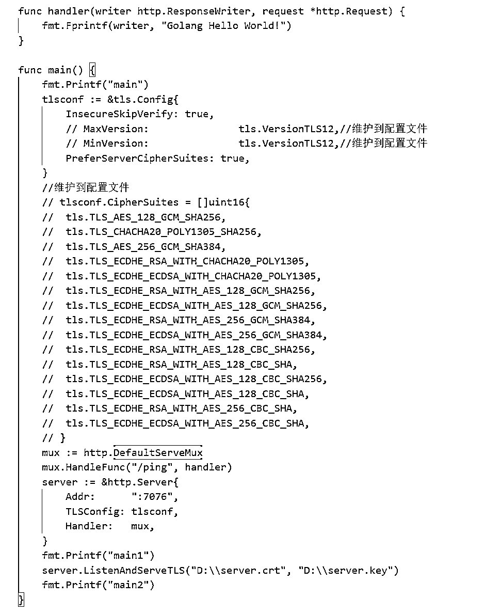
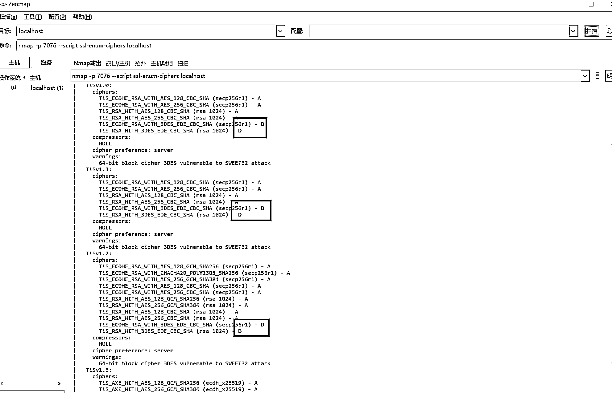
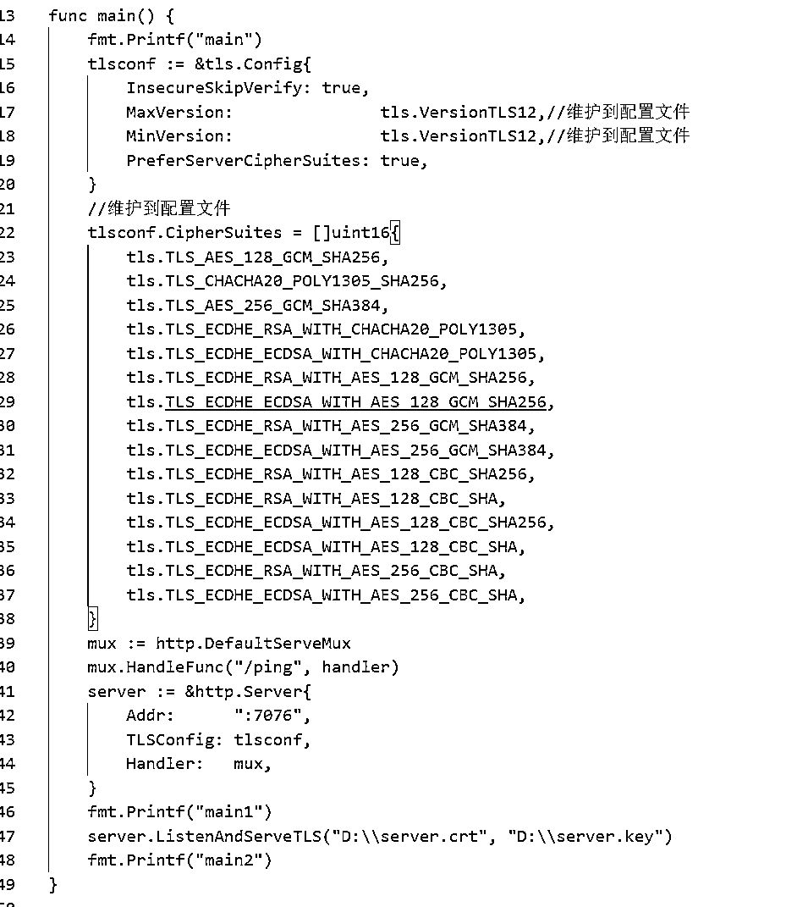
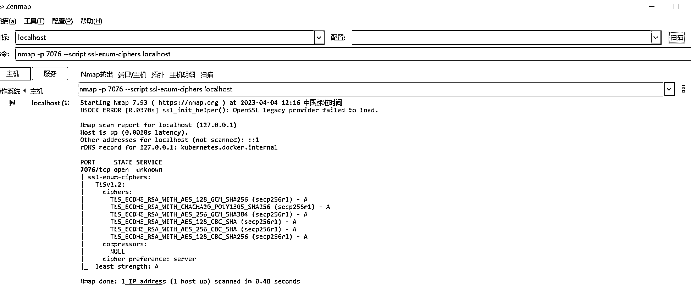

# golang CVE-2016-2183 漏洞，https 需要添加 tls 设置加密算法 CipherSuites 白名单，将弱加密算法 DES 和 3DES 去掉。 - 圣叹&北京 - 博客园

> 原文：[`www.cnblogs.com/stjwy/p/17286010.html`](https://www.cnblogs.com/stjwy/p/17286010.html)

golang CVE-2016-2183 漏洞，https 需要添加 tls 设置加密算法白名单，将弱加密算法 DES 和 3DES 去掉。

**服务端样例代码**

```
package main import ( "crypto/tls"
    "fmt"
    "net/http" ) func handler(writer http.ResponseWriter, request *http.Request) {
    fmt.Fprintf(writer, "Golang Hello World!")
} func main() {
    fmt.Printf("main")
    tlsconf := &tls.Config{
        InsecureSkipVerify: true,
        MaxVersion:               tls.VersionTLS12,//维护到配置文件
        MinVersion:               tls.VersionTLS12,//维护到配置文件
        PreferServerCipherSuites: true,
    } //维护到配置文件
    tlsconf.CipherSuites = []uint16{
        tls.TLS_AES_128_GCM_SHA256,
        tls.TLS_CHACHA20_POLY1305_SHA256,
        tls.TLS_AES_256_GCM_SHA384,
        tls.TLS_ECDHE_RSA_WITH_CHACHA20_POLY1305,
        tls.TLS_ECDHE_ECDSA_WITH_CHACHA20_POLY1305,
        tls.TLS_ECDHE_RSA_WITH_AES_128_GCM_SHA256,
        tls.TLS_ECDHE_ECDSA_WITH_AES_128_GCM_SHA256,
        tls.TLS_ECDHE_RSA_WITH_AES_256_GCM_SHA384,
        tls.TLS_ECDHE_ECDSA_WITH_AES_256_GCM_SHA384,
        tls.TLS_ECDHE_RSA_WITH_AES_128_CBC_SHA256,
        tls.TLS_ECDHE_RSA_WITH_AES_128_CBC_SHA,
        tls.TLS_ECDHE_ECDSA_WITH_AES_128_CBC_SHA256,
        tls.TLS_ECDHE_ECDSA_WITH_AES_128_CBC_SHA,
        tls.TLS_ECDHE_RSA_WITH_AES_256_CBC_SHA,
        tls.TLS_ECDHE_ECDSA_WITH_AES_256_CBC_SHA,
    }
    mux := http.DefaultServeMux
    mux.HandleFunc("/ping", handler)
    server := &http.Server{
        Addr: ":7076",
        TLSConfig: tlsconf,
        Handler:   mux,
    }
    fmt.Printf("main1")
    server.ListenAndServeTLS("D:\\server.crt", "D:\\server.key")
    fmt.Printf("main2")
}
```

**测试方法**

**当注释掉 Cipher 部分时验证效果，可以看到很多 D 级别的加密算法（扫描命令 nmap -sV -p 7076 --script ssl-enum-ciphers）**

****

 

** 将 CipherSuites 配置生效后，看到已经扫描不到 D 级别的密码算法**



 

参考网址

[使用 namp 验证 SSL/TSL 相关漏洞 CVE-2015-2808,CVE-2013-2566,CVE-2014-3566,CVE-2016-2183,CVE-2015-4000,瞬时 Diffie-Hellman 公共密钥过弱 等 - 迪克推多 0 - 博客园 (cnblogs.com)](https://www.cnblogs.com/zcg-cpdd/p/15573841.html)

[TLS 完全指南（三）：用 Go 语言写 HTTPS 程序 - 知乎 (zhihu.com)](https://zhuanlan.zhihu.com/p/26684081)

[(36 条消息) 在 Windows 上安装 NMAP_nmap windows_allway2 的博客-CSDN 博客](https://blog.csdn.net/allway2/article/details/120160955)

[HTTPS 原理以及 GOLANG 指定 HTTPS 密码套件 - lvlooo - SegmentFault 思否](https://segmentfault.com/a/1190000022196131)

 其它问题

一开始我尝试用 postman 来提交指定算法套件到服务端查看返回结果中用的密码套件是否有变化，用 Wireshark 来监控 TLS 中密码套件的交换过程，但是结果很不稳定，postman 提交时套件名称无法匹配（不能有下划线=》变中横线，不能有 WITH,部分算法不能有 TLS,算法和数字间不能有“-”，很蛋疼没找到完整名单），而且在 wireshark 中存在未指定的算法套件，感觉向提交的设置部分情况不生效，返回的算法套件也不一定在我们设置的集合里边。

猜测可能 postman 提交方式有问题，并且 golang http 库内部做了其它逻辑处理，最终转换思路采用扫描测试法来验证，希望读者不要在走我的老路。