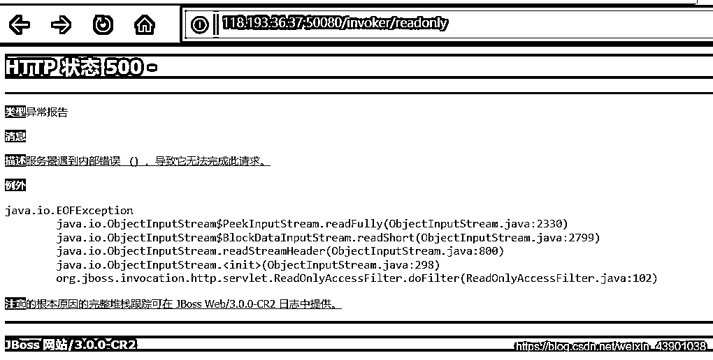
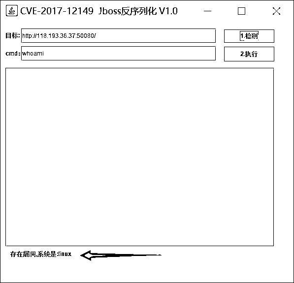
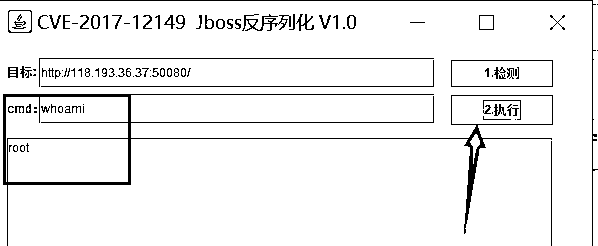

# jboss 反序列化漏洞(CVE-2017-12149) - Xor0ne - 博客园

> 原文：[`www.cnblogs.com/Xor0ne/p/13405353.html`](https://www.cnblogs.com/Xor0ne/p/13405353.html)

# jboss 反序列化漏洞(CVE-2017-12149)

参考链接：

> 作者：雨中落叶
> 参考链接：https://www.cnblogs.com/yuzly/p/11240145.html

### 文章目录

*   [1、漏洞描述](https://blog.csdn.net/weixin_43901038/article/details/107693970#1_6)
*   [2、漏洞复现](https://blog.csdn.net/weixin_43901038/article/details/107693970#2_14)
*   [3、漏洞防御](https://blog.csdn.net/weixin_43901038/article/details/107693970#3_25)

# 1、漏洞描述

该漏洞位于 JBoss 的 HttpInvoker 组件中的 ReadOnlyAccessFilter 过滤器中，其 doFilter 方法在没有进行任何安全检查和限制的情况下尝试将来自客户端的序列化数据流进行反序列化，导致攻击者可以通过精心设计的序列化数据来执行任意代码。有安全研究者发现 JBOSSAS 6.x 也受该漏洞影响，攻击者利用该漏洞无需用户验证在系统上执行任意命令，获得服务器的控制权。

环境：vulfocus/CVE-2017-712149

漏洞影响版本：Jboss 5.x 和 Jboss 6.x

# 2、漏洞复现

浏览器访问：http://118.193.36.37:50080/invoker/readonly
若显示 HTTP status 500，则说明漏洞存在。

下载检测工具：https://github.com/yunxu1/jboss-_CVE-2017-12149
输入目标 URL，点击检测，如下显示漏洞存在。

接下来执行命令。

# 3、漏洞防御

1、升级版本
2、不需要的 http-invoker.sar 组件,删除此组件