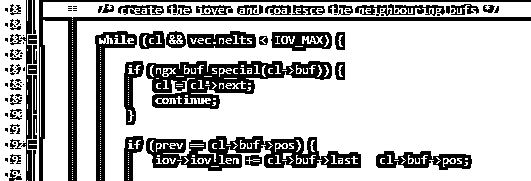

# nginx 补丁格式说明（CVE-2016-4450 为例） - 诸子流 - 博客园

> 原文：[`www.cnblogs.com/lsdb/p/6553027.html`](https://www.cnblogs.com/lsdb/p/6553027.html)

nginx 安全公告地址：[`nginx.org/en/security_advisories.html`](http://nginx.org/en/security_advisories.html)

CVE-2016-4450：一个特定构造的数据包，可引发 nginx 引用空指针，导致 nginx 出错造成拒绝服务攻击。

说明：

查阅代码发现 nginx 应该是将补丁集成到开发版（Mainline）和稳定版（Stable）中，而历史版本（legacy）并不会将补丁打上；

也就意味着更新到当前提供下的的开发版和稳定版漏洞就修复了（比如这个 CVE-2016-4450），而历史版本是不会修复漏洞的原来有漏洞的依然有漏洞即便当前提供下载。

CVE-2016-4450 针对 1.3.9-1.9.12 版本的补丁如下（//是我加的说明）：

```
--- src/os/unix/ngx_files.c　　　　　　　　　　　　　　　　//表示问题产生在 src/os/unix/ngx_files.c 文件中，该行不要加到 ngx_files.c 文件 +++ src/os/unix/ngx_files.c　　　　　　　　　　　　　　　　//表示问题要在 src/os/unix/ngx_files.c 文件中修改以修复，该行不要加到 ngx_files.c 文件中
@@ -183,6 +183,12 @@ ngx_write_chain_to_file(ngx_file_t *file　　//-182,6 表示修复前该处代码的位置为 183 行的后 6 行，+183,12 表示修复后该处代码占 183 行的后 12 行 /* create the iovec and coalesce the neighbouring bufs */

         while (cl && vec.nelts < IOV_MAX) { +
+            if (ngx_buf_special(cl->buf)) {　　　　　　//+号表示该行代码原来没有，要新加进去；修复时+号不要加到代码中 +                cl = cl->next; +                continue; + } +
             if (prev == cl->buf->pos) {
                 iov->iov_len += cl->buf->last - cl->buf->pos;
```

作为对比原来该处代码如下：


修复后代码如下：

