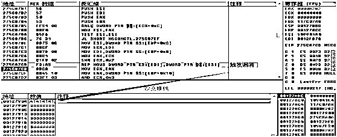
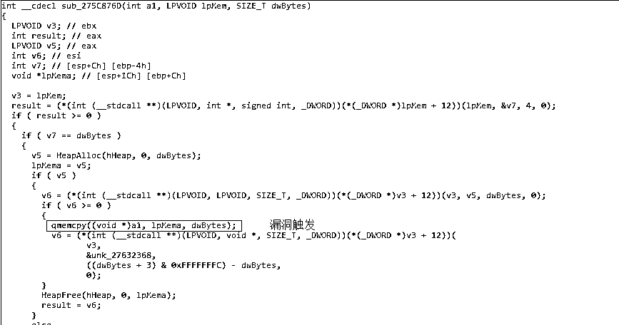
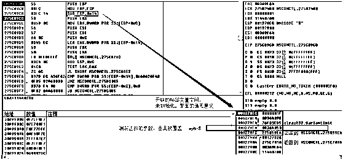
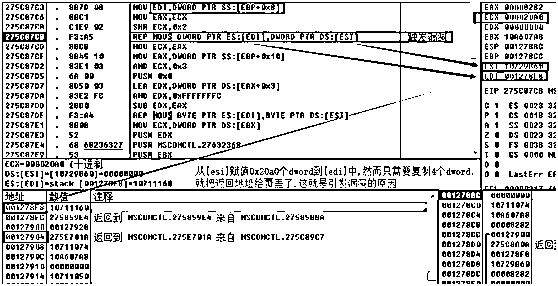
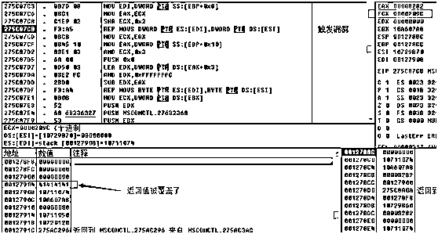
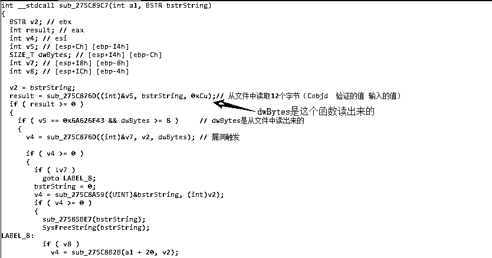
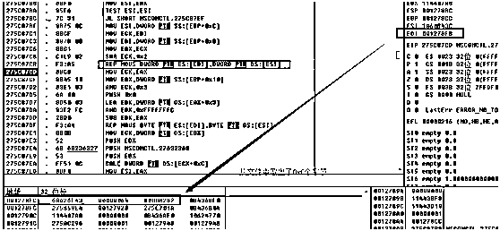
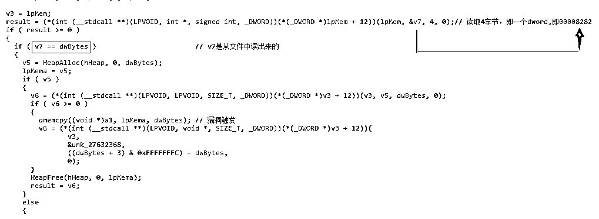
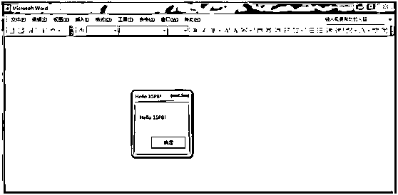

# office（CVE-2012-0158）漏洞分析报告 - 一曲沙丶天涯 - 博客园

> 原文：[`www.cnblogs.com/jf-blog/p/12368618.html`](https://www.cnblogs.com/jf-blog/p/12368618.html)

# 2019/9/12

# 1.漏洞复现

①发现崩溃

 

②找到漏洞所在的函数，下断点，重新跑起来，单步调试，找到栈被改写的地方

 

③分析该函数

把 MSCOMCTL 拖入 IDA，查看该函数代码

 

④查看调用栈，回溯。

 

先找到会被覆盖的返回地址的地址，再查看它是如何被覆盖的

 

找到触发漏洞的函数，查看它的参数，触发漏洞的指针是它的第一个参数

 

    进入函数，找到触发漏洞的语句

 

 

可以看出，向一个四字节的局部变量中复制大量数据，导致栈溢出，覆盖了局部变量所属函数的返回地址，从而引发了漏洞。

# 2.漏洞利用

    ①原理分析

经分析，漏洞数据传入靠一个函数，它被调用了两次。

第一次：先获取文件中保存的字节数（0xC），将它与传入的参数作对比，如果相等，就复制该字节数（0xC）的数据出来。

第二次：将第一次提取的数据当做参数，从文件取出 4 字节数据与参数作比较，如果相等，就复制参数数值大小的字节数。

 

sub_275C876D 函数调用两次

 

第一次复制

 

只要文件中保存的两次用来比较的数值（读取的字节数）相等，且大于等于 4，必然产生漏洞，而且非常好利用，只需要一个 jmp esp 指令就行了

    ②shellcode

1.  在模块中找 jmp esp 的地址，最好是没有各种保护并且是系统内置

我选择 immunityDebugger!找到符合条件的 MSVBVM60.DLL

 

    在模块中找 jmp esp 地址，属性要是可读可执行，刚好有个 0x729a0535

 

将 41414141 换成 jmp esp 地址，由于函数最后有 ret 8，所以空八字节，加入 shellcode 就行了，读取大小随便写，简直是为所欲为。

Poc 文件

 

 