# office CVE-2015-1641 杂谈 - goabout2 - 博客园

> 原文：[`www.cnblogs.com/goabout2/p/8832855.html`](https://www.cnblogs.com/goabout2/p/8832855.html)

之前看 CVE-2017-11826 的时候发现该漏洞和早年的 CVE-2015-1641 不仅在漏洞类型上相似，甚至部分漏洞代码也一致，遂将之前的分析有回顾了一下，留个记录。

 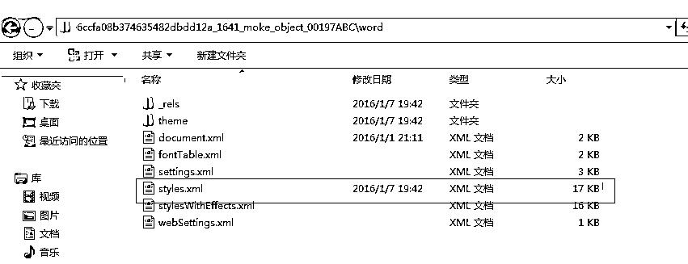

具体触发漏洞的字段如下所示，为<w:p>标签下的四个 smartTag，该标签用于 word 和 excel 中的智能标签，针对任命，日期，时间，地址，等进行智能识别并允许用户执行特征操作的标签，其中 displacedByCustomxml 字段在多个标签中被使用，其目的在于标记当前标签被一个 cumtomxml 标签替代，替代的方式基于 displacedByCustomxml 字段的参数，prev 表示上一个，next 表示下一个，该漏洞的本质在于 wwlib 中相关的标签解析函数在处理 customxml 标签是没有进行校验，导致 customxml 可被混淆为 smartTag 标签，从而导致代码执行。

 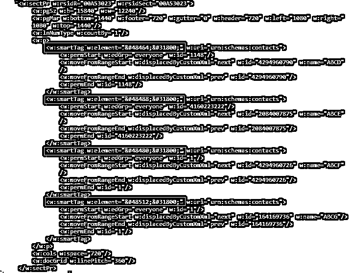

由于手中的是标准的利用样本，无法触发函数的崩溃，因此需要对该样本进行改造，这里的思路在于将除了漏洞触发以外的 ole objdata 代码删除，从而导致利用代码执行出错崩溃（一般样本有三或四个 ole 对象，区别在于是否具备绕过 alsr 的 ole，找到对应的漏洞出发 ole 对象，其他的全部删除即可）。

此时再运行调试器断下。 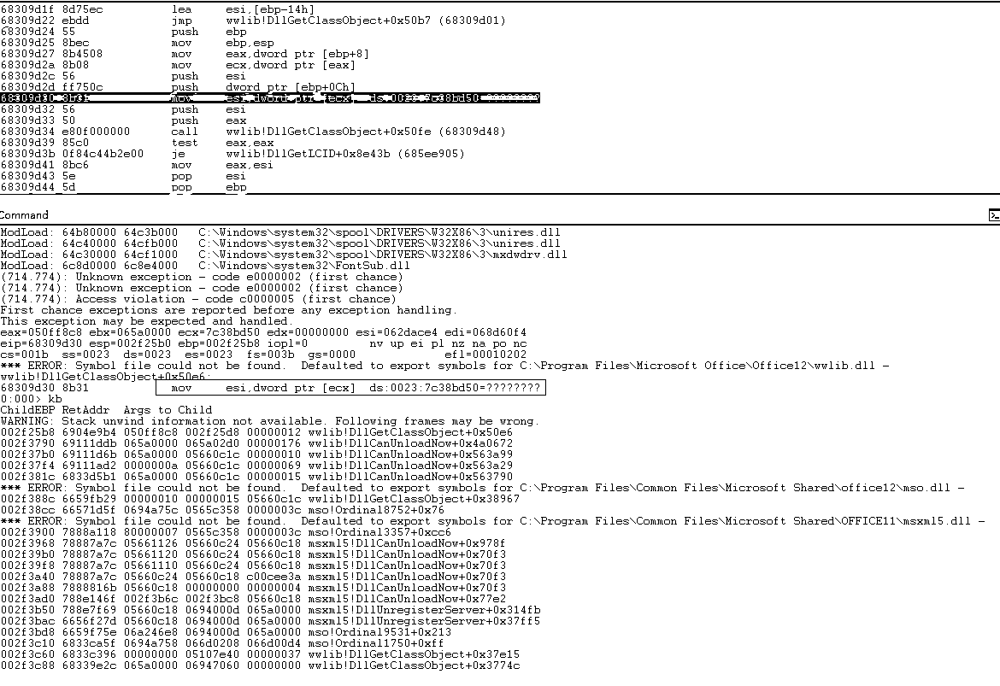

Heapspra 内存如下所示:

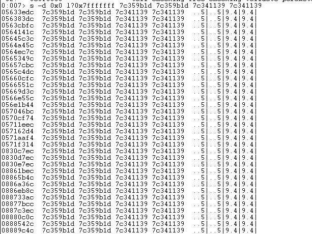 

09c9080c 即为对应的漏洞利用后跳转的 shellcode 地址。

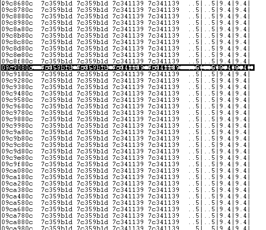 

Poc 断下的地址处对应的代码如下所示，由于 trigger 处，ecx 中指向的地址为非法地址导致调试器崩溃断下，此处知道对应的漏洞触发函数，即可设置断点，并运行正常的样本。

断点如下：bp wwlib+0x00009d30，如下图所示此时红框中函数的参数如下所示

Eax：7c38bd50(SmartTag element 值)

Esi：标签层级

Src：smartTag 下的 w:id 值

 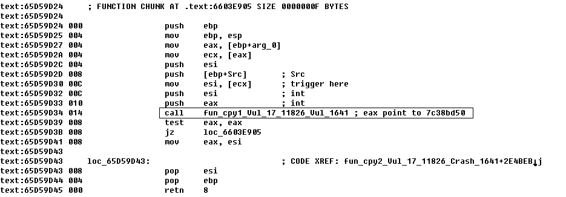

如下图所示

 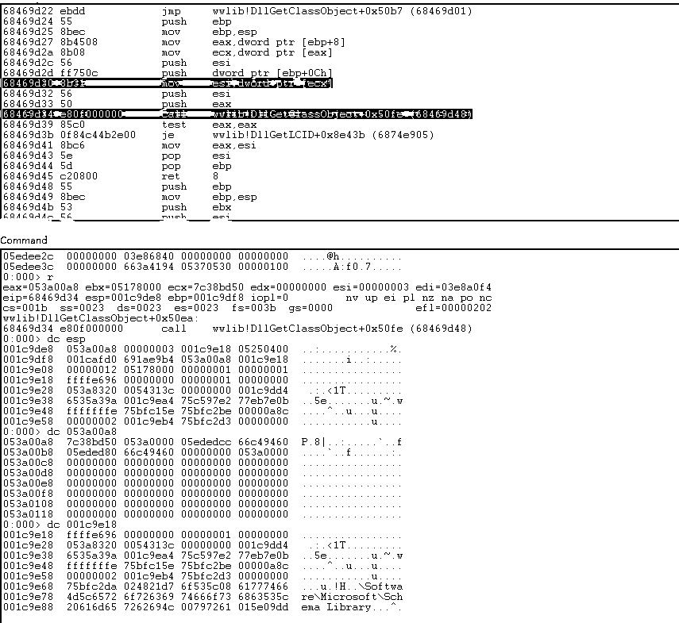

进入 fun_cpy1_Vul_17_11826_Vul_1641，之后执行函数 fun_CalcspectalTagobject（详见 11826 分析），该函数通过这两个参数（两个参数分别为 taglist base address 及 index，由此可知此处的 element 被作为 taglist base address 来计算对应的标签对象地址）会返回一个具体的标签对象地址，之后通过函数 fun_cpy_Vul_17_11826_Memcpy_1641 将参数 src 中的内容拷贝到该地址中（可以看到起逻辑和 11826 中十分相似）。

如下图所示进入对应的 fun_CalcspectalTagobject 函数前。

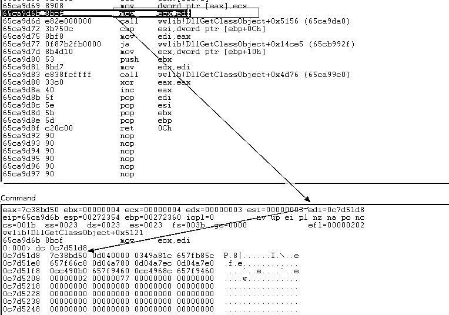 

具体的计算代码如下所示（对象地址+对象头长度+对象长度*index），如下所示

 

taglist base + head len + index * objectsize

0x7c38bd50 + 0x18 + 3 * 4 = 0x7c38bd74。

如下所示生成地址 0x7c38bd74

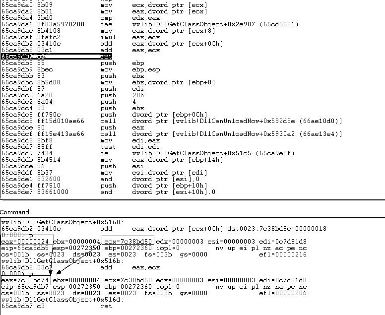 

进入拷贝函数。

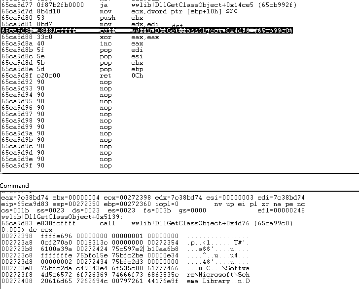 

拷贝前

 

拷贝后，写入的值为 ffffe696。

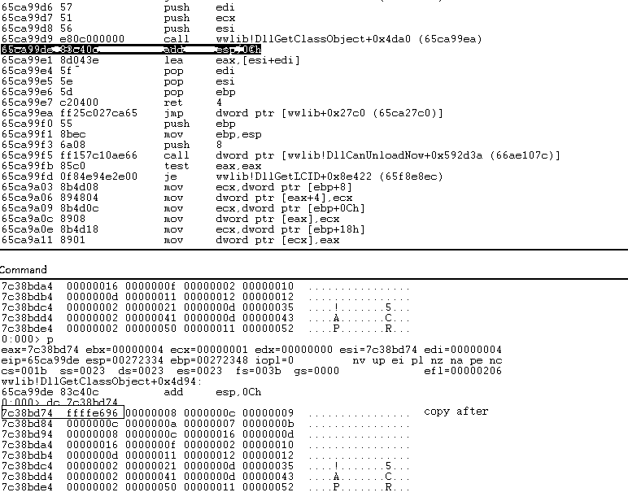 

之后处理第二个 tag，同样的公式，此时

taglist base + head len + index * objectsize

0x7c38bd68 + ffffe696 +6*7 = 0x7c38a428，此时可以看到 head len 的值即为上次写入的 ffffe696，用于辅助第二个标签生成对应的地址（此时第一次写入的位置为第二次 tag 对象的 headlen 域），以此控制生成对应的写入地址。

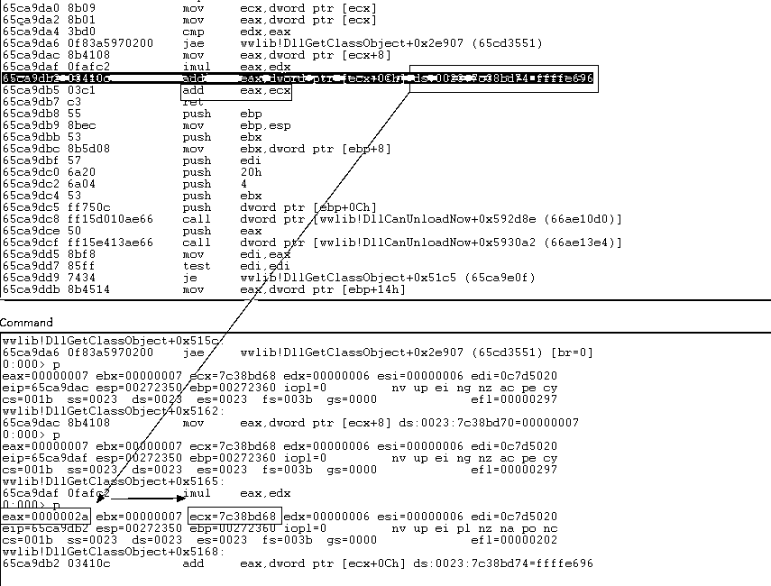 

进入之后的拷贝函数。

 

如下所示 0x7c38a428 这个地址原本保存了 kernel32!FlsGetValueStub 的地址

 

此时写入的地址为 7c376fc3，该地址代码如下所示：

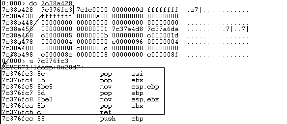 

之后的第三，第四个标签和之前一致，用于将 9c90808 写入到 0x7c38a430 中。

下断点到前面的劫持地址 7c376fc3，重新运行，漏洞触发，布置好两处写入地址后，之后的程序会调用之前修改的 0x7c38a428 函数指针，即 kernel32!FlsGetValueStub 的函数调用，而该地址已经被修改为 7c376fc3。

 

运行到 7c376fc3，通过简单的操作设置好 esp 栈值后，通过 ret 返回。

 

通过回溯可知实际上对该函数指针的调用处如下所示，其传入的参数 ecx 为之前修改过的指向 9c90800 的 7c38a430。

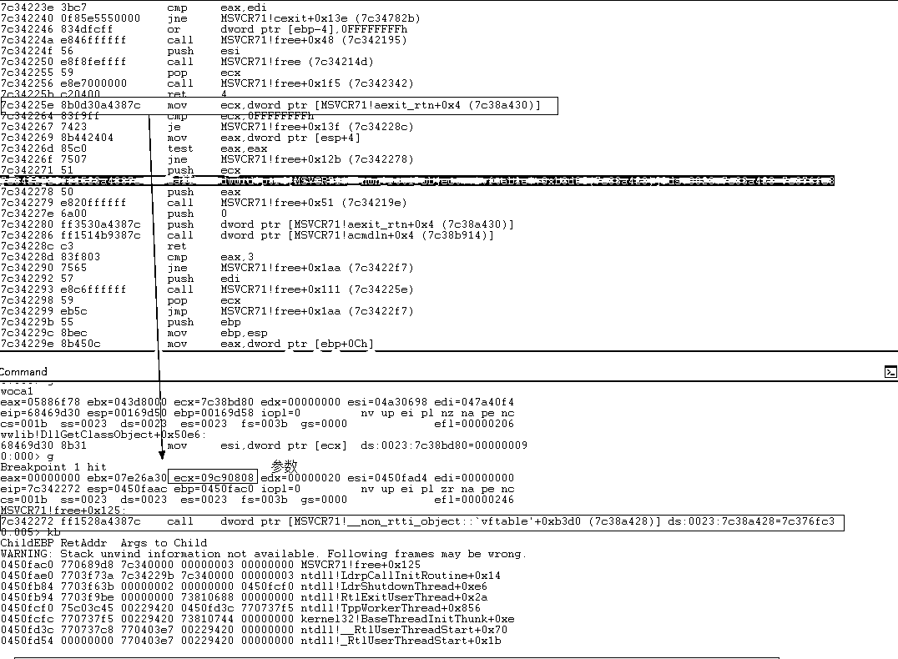

9c90808 通过计算得出 9c9080c，并布置于 esp 上，最后 ret 返回进入该 heapspray 布置的 shellcode 处执行。

 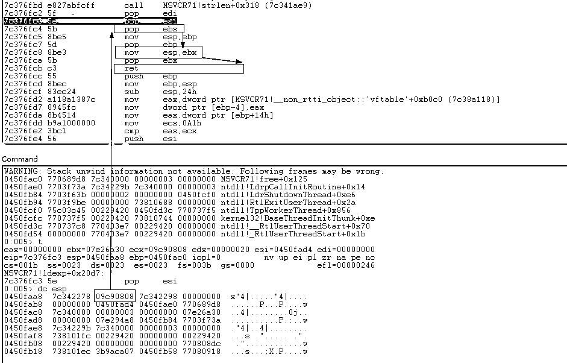

进入 shellcode。

 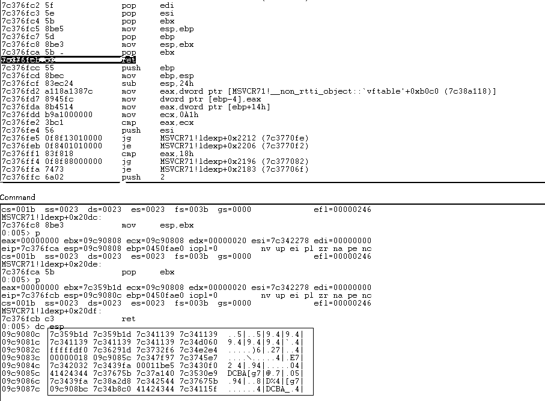

此时再来回顾之前的触发漏洞 poc，如下所示的 4 个 smartag 两两配合，用于完成两次内存写入，每次内存写入依赖两个 smarttag，第一个用于初始化真实写入的地址，第二次通过第一次初始写入的地址，生成最后的写入地址。前两个 smarttag 用于完成对函数指针的篡改劫持，后两个 smarttag 用于准备篡改后的函数参数，之后 wwlib 往后运行到劫持函数时导致代码执行。

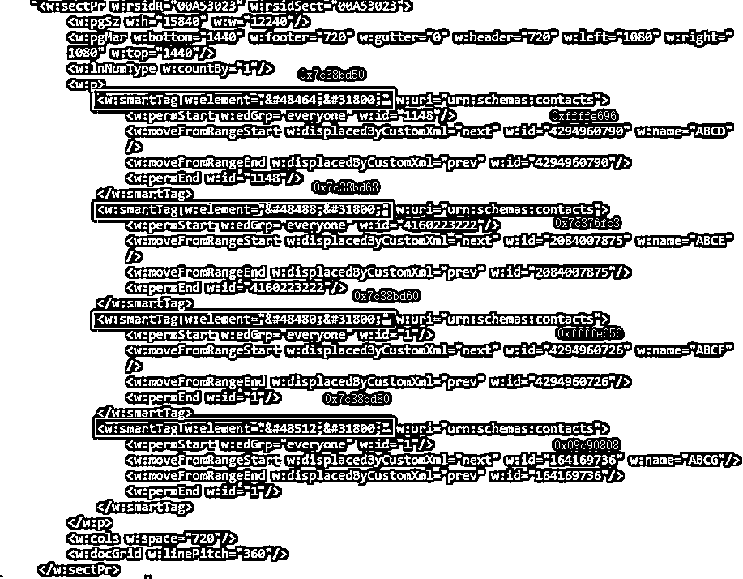 

具体的篡改流程如下所示：

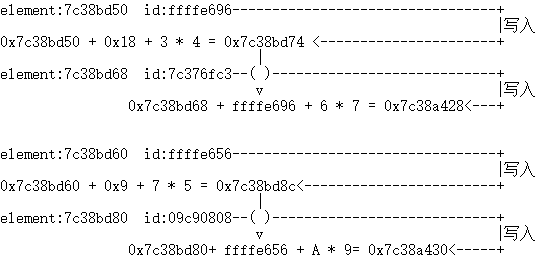 

回溯 trigger 函数，其父函数调用如下所示，可以看到*（v9+4）即为指向 element 的指针，SRC 为对应的写入 id，v9 的值来自于 v27+0x44 的位置。 

往上回溯，可以看到 v27 来自于 v25，而 v25 的值为 fun_GettagObject，很熟悉吧，在之前 CVE-2017-11826 的文章中我们提到该函数用于返回具体的 tag 标签的对象。

 

通过分析发现进入解析 smartag 解析流程时，对应的 xml 返回的结构如下所示，其中 Tagobeject[3]标签为此时返回的标签，对应 Tagobeject[3]+44 的位置即为之后导致漏洞的所谓 smarttag 结构，(Tagobeject[3]+44)+4 位置指向 smarttag 中对应的 element。

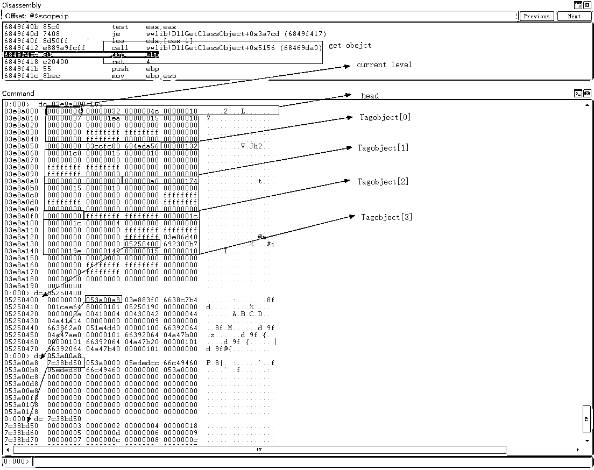 

如下图所示可知每个对象对应的 xml 中的标签，对于正常的子 costomxml 标签而言，其 taglist 应该位于（Tagobeject[3]+44）+4 中的位置，由于 wwlib 对 costomxml 及 smarttag 的校验不严，构造非法的 smarttag 标签被 costomxml 的代码逻辑处理，最为致命的在于，此时的处理中 smarttag 标签的 element 被识别为 taglist 的 baseaddress，导致在标签解析时 fun_CalcspectalTagobject 函数计算出的对象地址为攻击者所控制（通过两个 smarttag 标签可实现指定地址的写入），而 costomxml 的处理逻辑中 fun_CalcspectalTagobject 计算的地址后续会进行内存写入，此时写入的值正好也是攻击者可控的 smarttag 中的 id 字段，此时攻击者具备完整的内存任意地址写的能力，从而导致代码执行

补丁代码中，在进入 Tagobeject[3]+44 的处理前，会对 Tagobeject[3]+48 处的函数指针进行校验，以防止不合法的标签混入。

 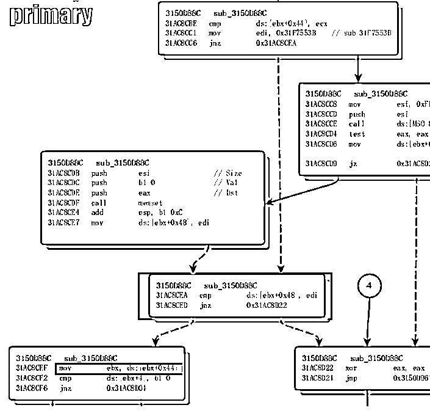

相关断点

bp wwlib+0x00009d30 ".if(ecx = 7c38bd50 | ecx = 7c38bd68| ecx = 7c38bd60| ecx = 7c38bd80){.printf\"woca1\\n\"}.else{gc}"  four memory copy

bp wwlib+0x00e1211c  get parent tag object of smarttag

相关参考

http://www.freebuf.com/vuls/81868.html

https://paper.seebug.org/351/

 转载请注明出处