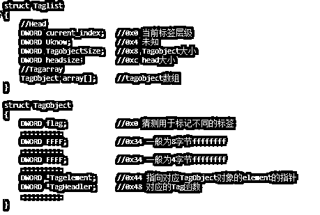
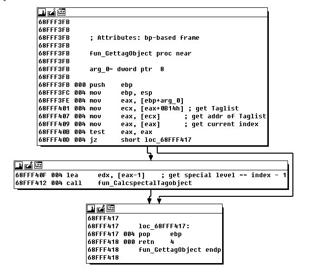
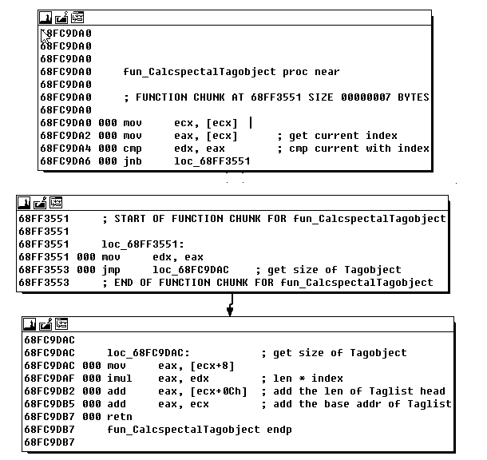
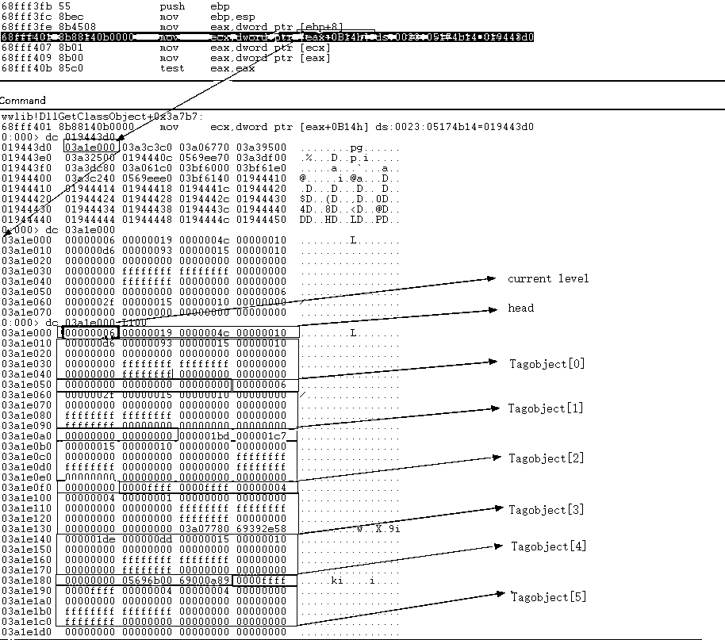
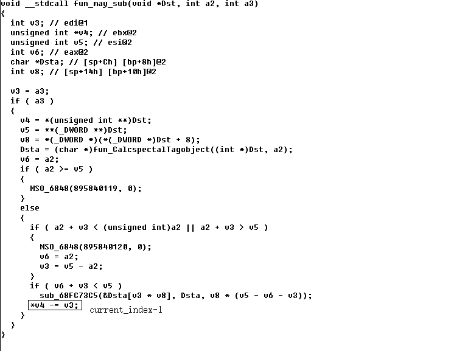
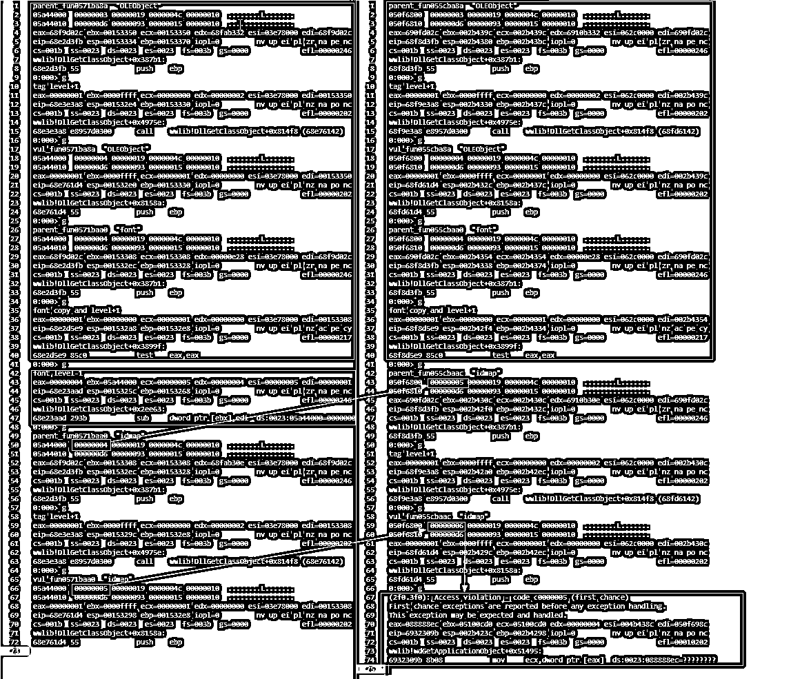
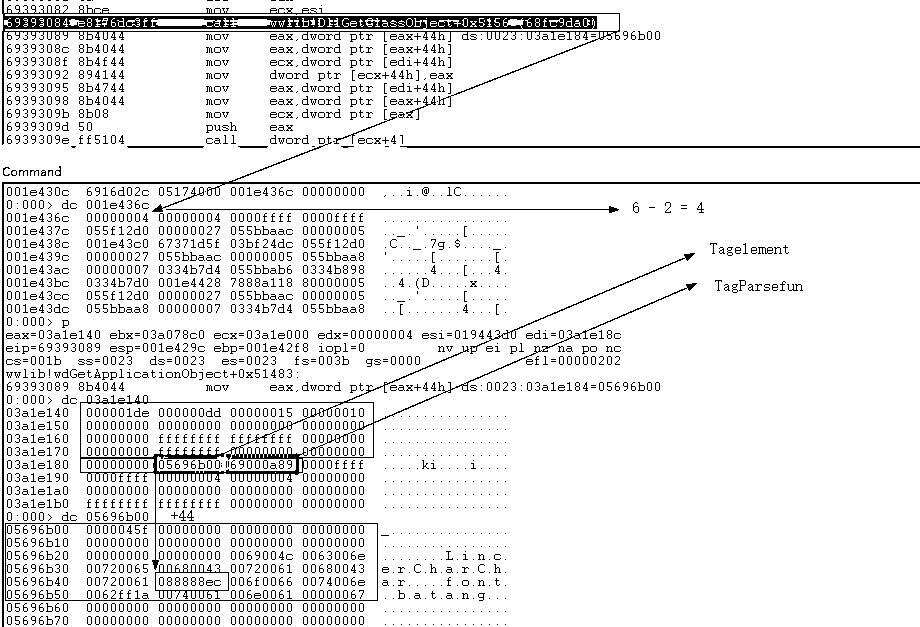
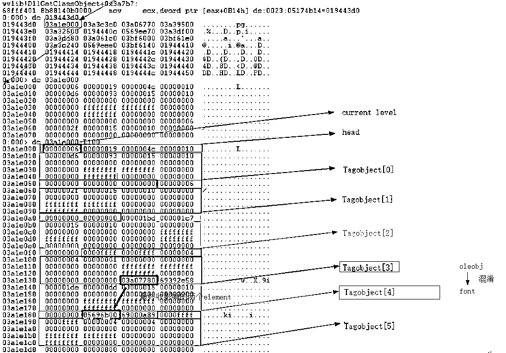

# office CVE-2017-11826 杂谈 - goabout2 - 博客园

> 原文：[`www.cnblogs.com/goabout2/p/8186018.html`](https://www.cnblogs.com/goabout2/p/8186018.html)

该漏洞为 office 中的一处混淆漏洞，相应的 poc 如下所示：可以看到其中 font 标签未闭合。

该漏洞中一个重要的点在于明白对应 poc 中解析标签在内存中的结构，如下所示为其中漏洞触发时的地方，这里有两个重要的函数即 fun_GettagObject，fun_CalcspectailTagobject，

fun_GettagObject:返回当前 tag 对象，传入的参数为一个 taglist 对象，实际索引依赖于 fun_CalcspectailTagobject

fun_CalcspectailTagobject:通过传入的 level 层级返回数组中对应的 tag 对象，如下所示漏洞触发时使用的正是 fun_CalcspectailTagobject 返回的 Tagobject 对象，在 poc 下该对象被混淆为一个 font 对象，从而导致后续调用对象虚表函数时的代码执行。

具体的 Taglist/TagObject 结构如下所示(这个地方感谢部门魔法师同学的提醒)：

 

如下所示为对应的 fun_GettagObject 函数，该函数的参数为一个 Taglist，首先获取对应的 current_index，之后通过 fun_CalcspectailTagobject 获取当前 curren_index 标记的 Tagobject

 

fun_CalcspectailTagobject,首先比较索引层级和当前层级，之后获取对应 TagObect 数组中对应的 tag 对象，公式为 taglist base address + head len + index * tagobject len

 

如下图所示为正常对应的 Taglist 在内存中的布局，头部长度为 0x10，偏移 0x0 的位置为 current_index，之后为对应 TagObject arragy，如下所示 

将下图对应到 poc 中，可以看到此时对应的标签，由于对象存在数组中，所以实际标签层级要比数组中大一，这也就是索引时减一的原因。

下图为漏洞函数的父函数，在处理对应的 poc 时，font 标签会在 fun_copy5_Vul_17_11826 中生成并完成对应对象的初始化，然后返回，而对于其余的标签，如 oleobject 则在第二个红框 fun_may_TagobjInit 中完成初始化，注意初始化时会将 taglist 中的 curren_index+1，如 oleobject 对象进入漏洞父函数是 current_index 为 3，在 fun_may_TagobjInit 中完成初始化后变成 4（即实际的 level，对照上图），font 进入漏洞函数父函数时 current_index 为 4，fun_copy5_Vul_17_11826 执行之后为 5。

当一个标签解析完后，会调用以下函数对 current_index 减一，如正常闭合 font 标签的 doc 中在解析完 font 后会将 current_index 减一，之后再进入到 idmap 的解析流程中，而 office 中这个减一的过程应该是依赖于结束标签，至少 font 标签如果没有对应的结束标签则不会对 curren_index 减一，这也是导致该漏洞的根本原因(即无闭合标签，导致 fun_may_sub 函数未调用，Taglist 中的 current_index 未减一，后续标签寻址的时出错)。

 

通过以下断点对比正常 doc 和漏洞 poc 标签处理的过程，可以首先下第一个断点，断下之后 g 两次，然后再下后续的断点，这样可以减少大量不必要的断下。

bp wwlib+0x000861d4 ".printf \"vul_fun\";du poi(poi(esp + 8) + 18) Lpoi(poi(esp + 8) + 1c);dc poi(poi(poi(esp + 4) + b14)) L8"

bp wwlib+0x0003d3fb ".printf \"parent_fun\";du poi(poi(esp + 8) + 18) Lpoi(poi(esp + 8) + 1c);dc poi(poi(poi(poi(esp+4)+b10) + b14)) L8"

bp wwlib+0x0003d5e9 ".printf \"font copy and level+1\\n\""

bp wwlib+0x0004e3a8 ".printf\"tag level+1\\n\""

bp wwlib+0x00033aad ".printf\"font level-1\\n\""

如下图所示可以看到左右两边分别是从处理 oleobject 开始到漏洞触发函数正常和不正常的文档的标签输出（左为正常 doc，右为 poc），其中最大的区别就在于正常情况下 font 会对 current_index 中减一，最终到处理 idmap 时进入漏洞父函数时为 4，之后+1=5，最后传入漏洞函数时为 5，而 poc 中传入漏洞函数时为 6。

回到触发漏洞时的代码，此时如果是正常情况，进入 idmap 是 current_index 为 5，函数 fun_CalcspectialTagobject 中索引的位置为 5-2=3，即 Tagobject array[3]的对象，为 oleobject 对象，但是当运行 poc 时，current_index 为 6，6-2=4，即 Tagobject array[4]的对象，为 font 对象，即正常情况上用于处理 oleobject 对象的代码，被用于处理 font 对象，由于这两个对象在内存中是完全不同的内存布局从而导致代码执行。

下图为触发时通过 fun_CalcspectialTagobject 返回的 Tagobj 对象，可以看到该对象就是 font 对象

下图为漏洞触发时对应的 Taglist，可以看到正常应该调用时获取的应该是 Tagobject[3]的 oleobj 对象，由于漏洞导致 current_index 未减一，通过 6-2=4 获取的却是之后 Tagobject[4]中的 font 对象，反应到之后具体的比特位就是正常应该返回 03a07780，却返回了 05696b00

可以看 05696b00+44 的位置就是 poc 中攻击者可控的 heap sprey 地址，从而导致之后 call [ecx+4]时代码执行，而正常的 03a07780+44 位置是一处虚表，从而在 call [ecx+4]中调用的时正常的函数处理流程。

相关参考：

https://www.anquanke.com/post/id/87122

https://bbs.pediy.com/thread-221995.htm

感谢魔法师的提醒-_-

 转载请注明出处