# office CVE-2017-11882 exp 构造 - goabout2 - 博客园

> 原文：[`www.cnblogs.com/goabout2/p/7990667.html`](https://www.cnblogs.com/goabout2/p/7990667.html)

尝试了一下 CVE-2017-11882 的手动构造，过程有些小坑，遂记录一下。

如下图所示通过传入对象的方式向 docx 中插入一个 equation 的对象。

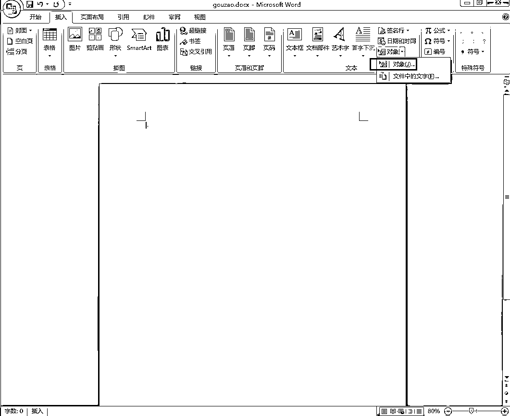

选择的对象为微软公式 microsoft 3.0。

 

之后会弹出对应的对象工具，即导致该漏洞的核心组件 equation.exe，在公式中写入一串字符，注意一定要写（后面会说到），保存退出。

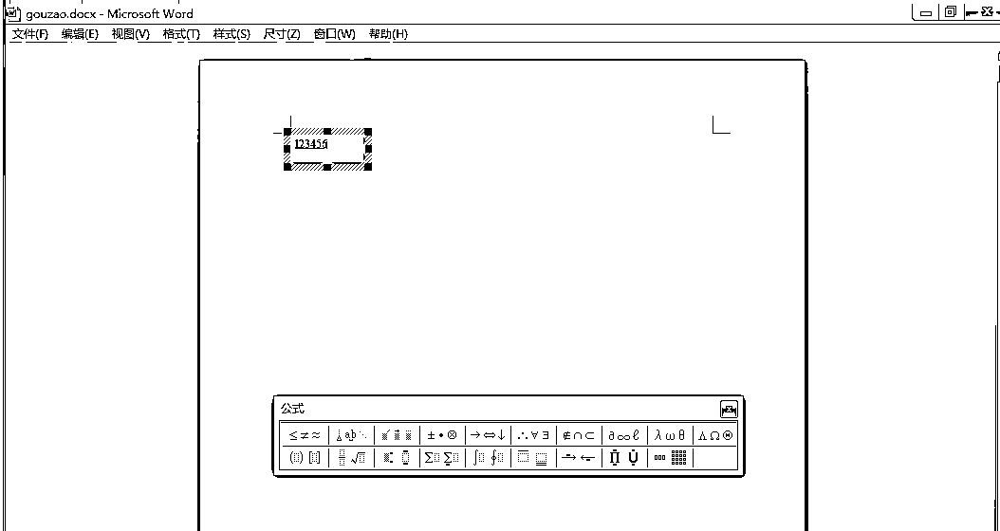

使用解压工具解压，如下所示

 

进入 word/embeddings 这个目录，该目录下保存着对应的 ole 对象。

将该 bin 拖到 010 edit 中，如下所示，其中比较重要的是 900-9f0 这一段区间，所有的 exp 构造都在该段数据中实现，大致分为三个部分

1.  eqnolefilehdr
2.  mtef header
3.  size
4.  之后的部分可供插入 mtef byte stream，由一个个 records 组成，导致漏洞的 records 为对应的 fonts 类型 records

 

因此直接往之后插入 font 即可，font record 如下所示为其中蓝色和褐色部分，其中蓝色部分为固定的 tag+typeface+style，褐色为 font_name（也即是导致溢出的部分）。

 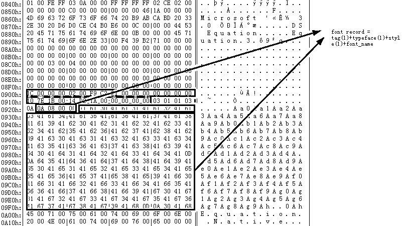

如下所示为漏洞部分代码，其中 a1 即为上图构造的 font_name，由于没有做长度检测，导致溢出。

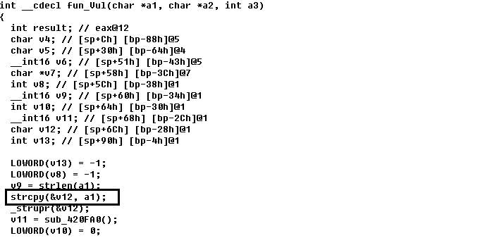 

通过解压工具将该修改过的 bin 文件替换原 docx 中的 bin 文件，注意不要解压后替换再打包，这样会报错。

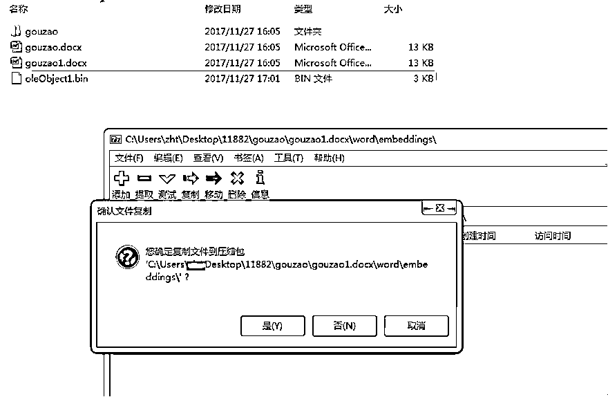

如下所示，由于没有相关的自动执行的功能（可以通过 rtf 实现，这里不再赘述），因此需要点击该 equation 才能触发漏洞程序。

 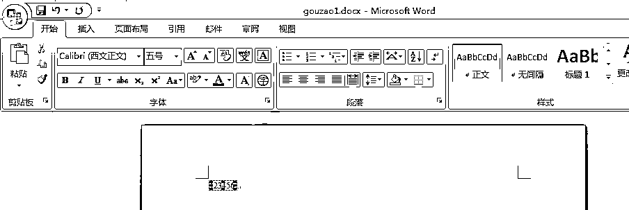

点击后发现并不会崩溃，挂上调试器可以看到如下所示，溢出时准备的 string 被截断了 24 位的长度（缓冲区为 0x2c），从而导致溢出无法发生。

 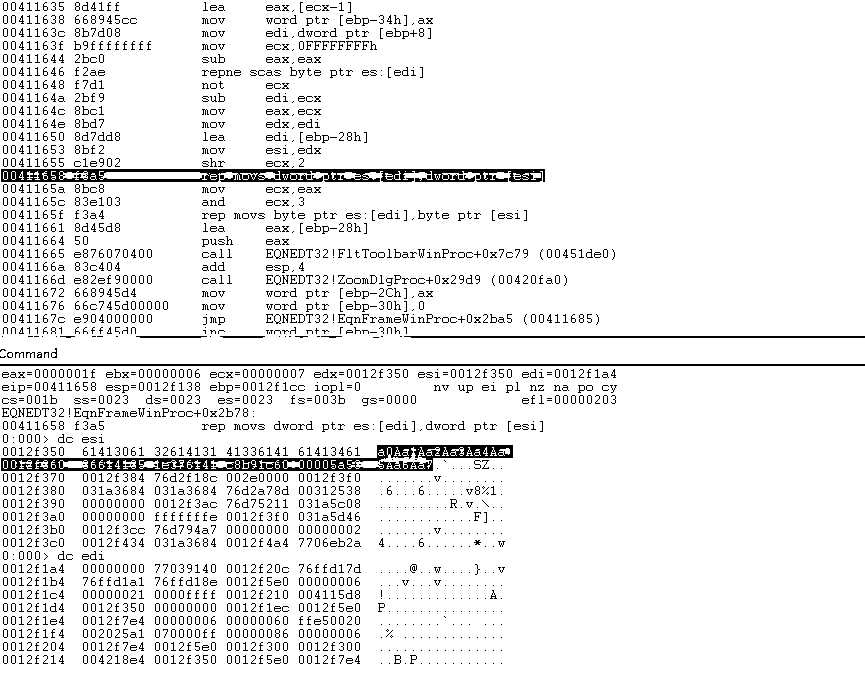

这是因为输入的公式中的字符长度问题（目前看来该字符的长度决定了可以往溢出地址拷贝的长度，也就是说拷贝的字符并不由 bin 中 font_name 的长度决定，如之前字符为 123456,长度 6*4=24，即为上面的拷贝长度），同时也要注意实际上最短的长度也是有限制的，即最少保证 24 长度的拷贝，哪怕你将公式中的字符改为 12（长度为 2），其拷贝长度也是 24，而不是 8，通过对比可以知道字符长度不同导致该 bin 文件中一下三处差异，第一处为这个 0x45,0x45 为对应的 font_name 的长度，第二处为 61，效果目前未知。

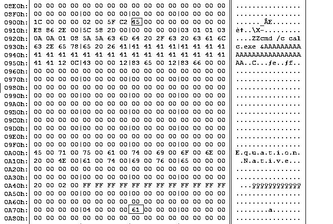

及第三处的 80，即字符不同长度影响的生成的两个 docx 中 oleObject1.bin 主要会有这三处的不同，从而导致 wwlib 在解析这个 docx 时拷贝的 font_name 长度不一致，具体细节感兴趣的童鞋可以调试一下，其实只要记住控制插入公式的字符长度大于缓冲区的 0x2c 即可。

如下控制字符为 123456789abcdef。

因此增加该字符的长度后，如下所示 123456789abcdef，15*4=60，即现在可往缓冲区拷贝的长度为 60，可以看到此时 esi 指向的字符长度正是 60，目标地址中红框为对应的返回地址。

 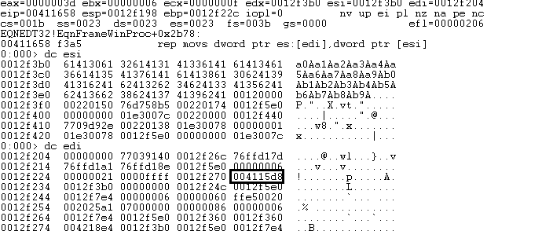

此时运行崩溃。

 

修改对应的 bin，使返回地址为对应的 Winexec 地址即可，注意以 00 结尾

 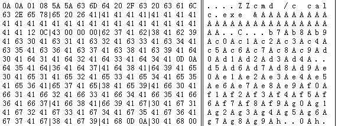

此时运行

 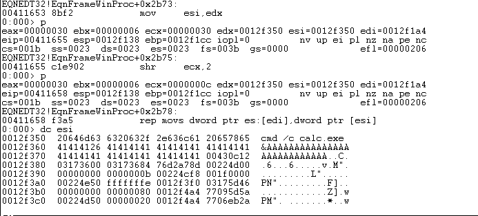

Strcpy 之后返回地址被覆盖为 Winexc。

 

可以看到由于该漏洞函数的特性（第一个参数时溢出字符，第二个参数为 null）正好符合 Winexe 的调用规则，因此只要将返回地址覆盖为 Winexec 的地址即可导致代码执行。

执行后通过 Winexec 启动计算器。

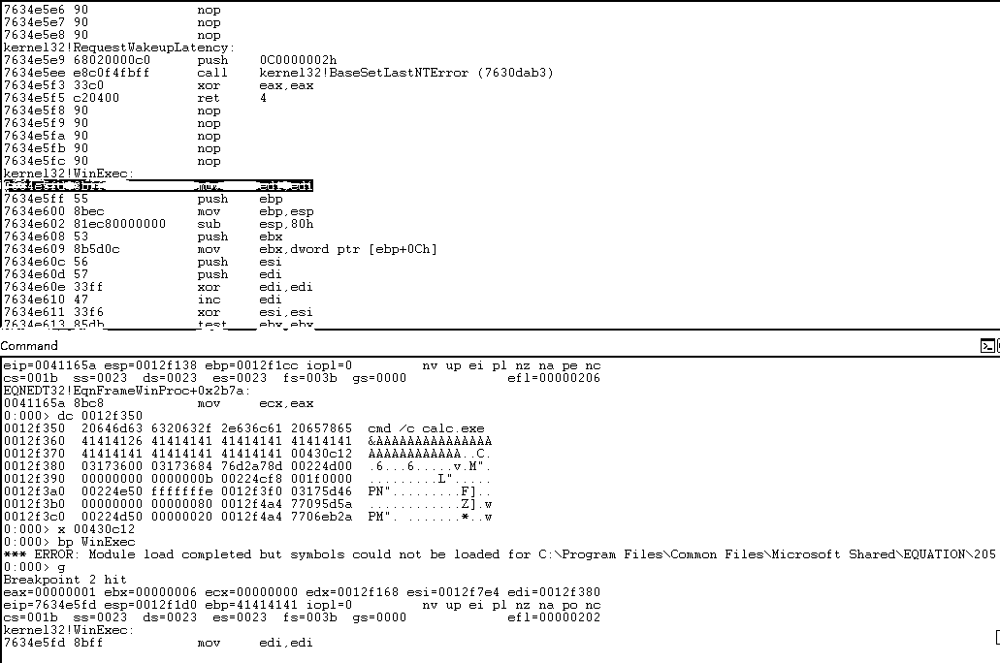

效果如下: 

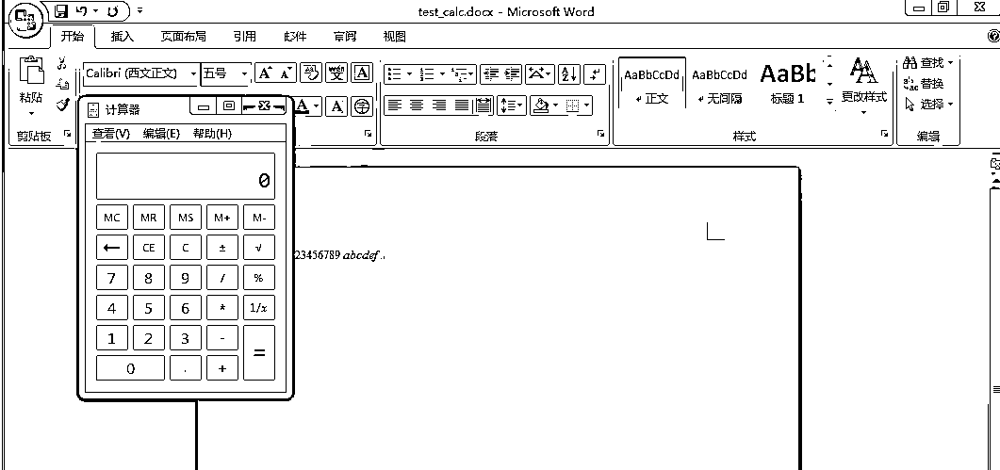

该文章 http://bobao.360.cn/learning/detail/4753.html

中作者构造是提到了漏洞函数之前有两个坑，实际上应该是其一开始的 equation 中的字符过长导致，如果只是 123456789abcdef 这么长，我们往溢出地址拷贝的长度就只有 60，可完美实现 exp，同时不触发其余的函数溢出。

如下所示构造一个公式中字符串超长的 docx，运行，此时可以看到该文章中对应的溢出。

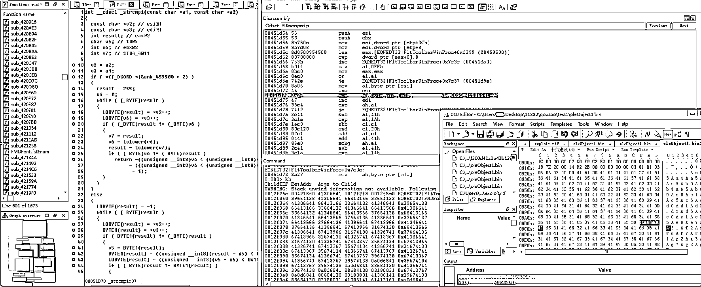

相关参考：http://bobao.360.cn/learning/detail/4753.html

 转载请注明出处