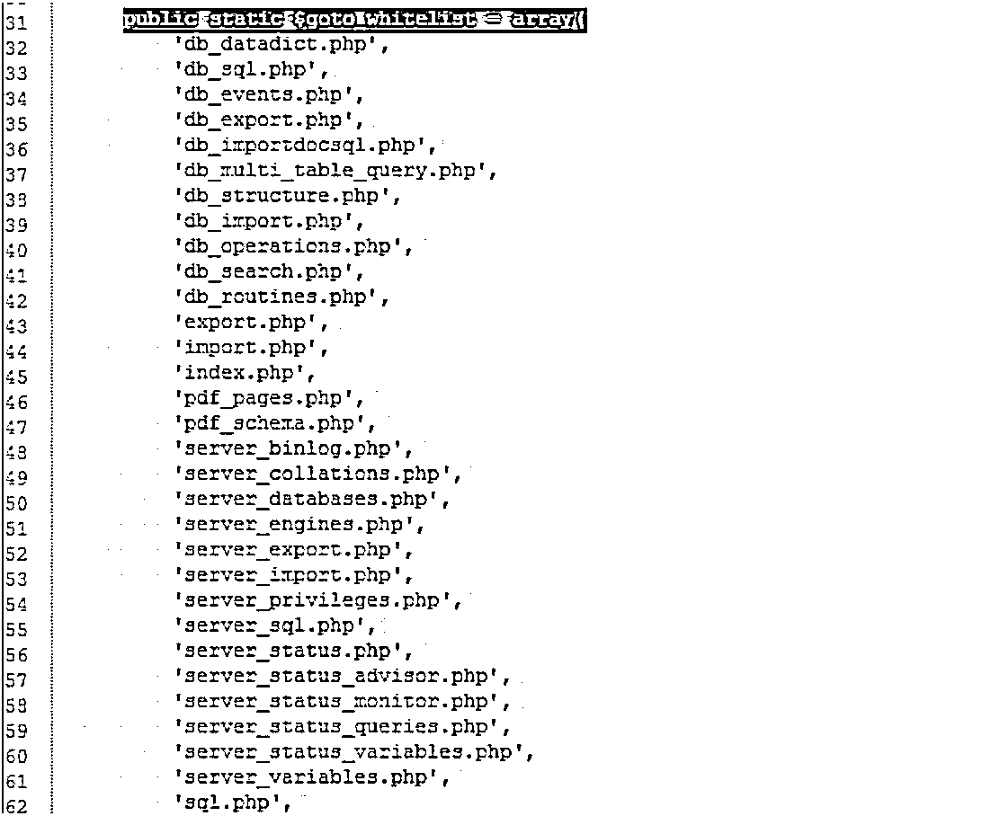
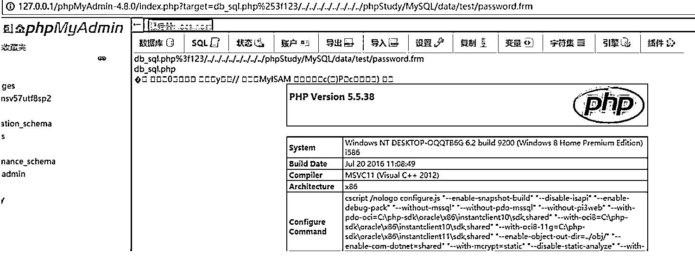

# phpmyadmin 4.8.1 远程文件包含漏洞（CVE-2018-12613） - 小丸子 3689 - 博客园

> 原文：[`www.cnblogs.com/ffx1/p/12653550.html`](https://www.cnblogs.com/ffx1/p/12653550.html)

phpMyAdmin 是一套开源的、基于 Web 的 MySQL 数据库管理工具。其 index.php 中存在一处文件包含逻辑，通过二次编码即可绕过检查，造成远程文件包含漏洞。

### phpmyadmin 登录模式设置

我们通过身份验证模式的要求，可以有两种配置方案，一种是 HTTP 和 cookie 身份验证模式。在这两种模式下，用户必须先在一个登录窗口里输入 MySQL 数据库的有效用户名和密码，才能使用 phpMyAdmin 程序。这种做法有两个明显的好处：首先，因为 MySQL 数据库的密码没有出现在 config.inc.php 文件里，所以身份验证过程更加安全；其次，允许以不同的用户身份登录对自己的数据库进行管理。这两种身份验证模式尤其适合数据库中多个用户账号的情况。

第二种方案是，config 身份验证模式。这种模式下，密码以明文形式保存在 config.inc.php 文件里。只需要把 MySQL 用户名和密码直接写入到 config.inc.php 文件即可。这样，在登录 phpMyAdmin 时就不会提示输入用户名和密码了，而只直接用 config.inc.php 文件里写入的用户登录。如果只是在一个本地测试系统上使用 phpMyAdmin，可以使用这种模式。

### 漏洞分析

攻击者必须拥有后台权限，phpMyAdmin4.8.0 - 4.8.1 版本均受漏洞影响。
漏洞的入口在 index.php 54-63 行：

```
$target_blacklist = array (
    'import.php', 'export.php'
);

// If we have a valid target, let's load that script instead
if (! empty($_REQUEST['target'])
    && is_string($_REQUEST['target'])
    && ! preg_match('/^index/', $_REQUEST['target'])
    && ! in_array($_REQUEST['target'], $target_blacklist)
    && Core::checkPageValidity($_REQUEST['target'])
) {
    include $_REQUEST['target'];
    exit;
} 
```

`include $_REQUEST['target'];` , 这里的 target 可以直接传值输入，我们可以传入一个本地文件路径去让其包含，就会造成 LFI 漏洞。
要想成功包含 target，需要满足五个条件：

*   非空
*   必须为字符串
*   不能是 index 开头
*   不能是黑名单中的文件名（import.php、export.php）
*   通过函数`Core::checkPageValidity`的校验

进入函数 `libraries/classes/Core.php`

```
public static function checkPageValidity(&$page, array $whitelist = [])
{
    if (empty($whitelist)) {
        $whitelist = self::$goto_whitelist;
    }
    if (! isset($page) || !is_string($page)) {
        return false;
    }

    if (in_array($page, $whitelist)) {
        return true;
    }

    $_page = mb_substr(
        $page,
        0,
        mb_strpos($page . '?', '?')
    ); //按?分割字符串，取前半部分
    if (in_array($_page, $whitelist)) {
        return true;
    }

    $_page = urldecode($page);
    $_page = mb_substr(
        $_page,
        0,
        mb_strpos($_page . '?', '?')
    ); //按?分割字符串，取前半部分
    if (in_array($_page, $whitelist)) {
        return true;
    }

    return false;
} 
```

要想使该函数返回 true，包含的文件必须包含在白名单`$whitelist`中，
下面是白名单`$whitelist`的内容：
`\libraries\classes\Core.php`



第一个返回 true 的地方，`$page`参数必须要在白名单中

第二个返回 ture 的地方需要通过 `mb_substr()和`mb_strpos()`函数处理。

```
$_page = mb_substr(
        $page,
        0,
        mb_strpos($page . '?', '?')
    ); //按?分割字符串，取前半部分
    if (in_array($_page, $whitelist)) {
        return true;
    } 
```

`mb_substr()` 截取字符串：


`mb_strpos()`查找字符串在另一字符串中的首次出现位置


即判断?后面的字符串是否满足白名单.

第三处返回 true 的地方：

```
$_page = urldecode($page);
    $_page = mb_substr(
        $_page,
        0,
        mb_strpos($_page . '?', '?')
    ); //按?分割字符串，取前半部分
    if (in_array($_page, $whitelist)) {
        return true;
    } 
```

此处判断，先将\(page 进行 urldecode 解码，然后再进行？的分割，取值进行判断，只要解码后分割出来的值在\)whitelist 中即可满足条件。而在$target 里问号被二次编码为%253f， db_sql.php%253f 也会被认为是一个目录，可以用../跨越，成功实现包含。因此命名规范里面没有将%放进去也是该漏洞能在 windows 下成功利用的一个关键点。（windows 文件名不能包含`? /\ *`等符号。）
这样我们可以将？进行二次编码。如果传入 target=db_sql.php%253f。在倒数第二个判断中进行白名单校验时，为 db_sql.php%3f，不满足，最后一个判断的 urldecode 后，进行校验时为 db_sql.php,符合条件，然后即可成功包含文件。

### 漏洞复现



可以利用本地文件包含漏洞的特点：

*   上传 sql 文件，然后进行包含；
*   开启 webshell 日志功能，查询 webshell 语句后，包含日志；
*   将 webshell 写入字段中，如果数据库在本地，可以直接通过查询数据库文件位置：select @@datadir；然后得到数据库文件存放路径，而字段内容则在数据库名/表名.frm 中