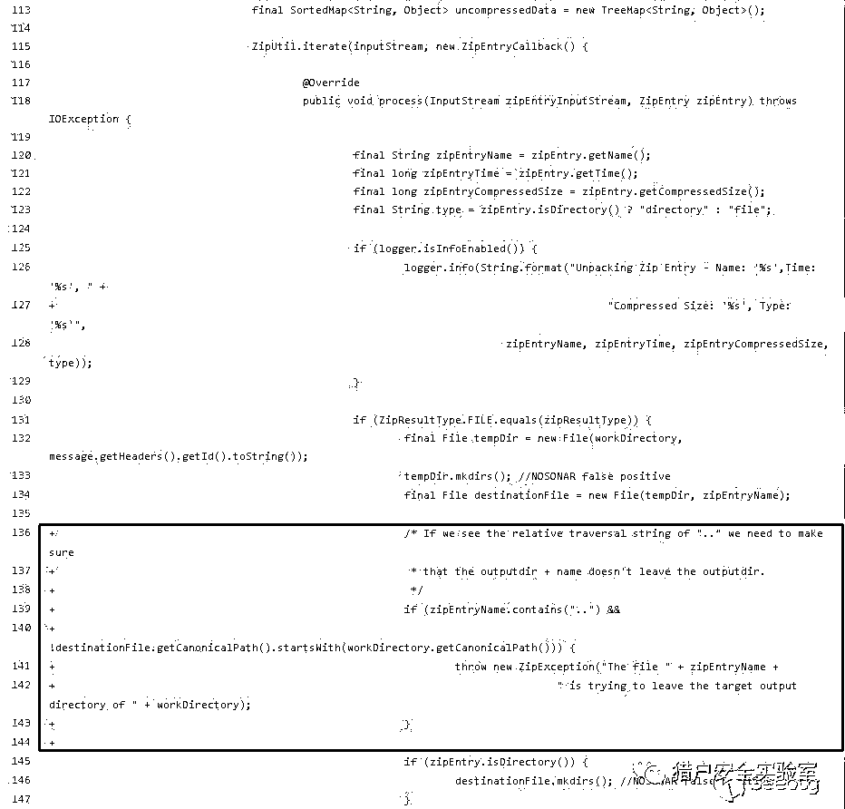
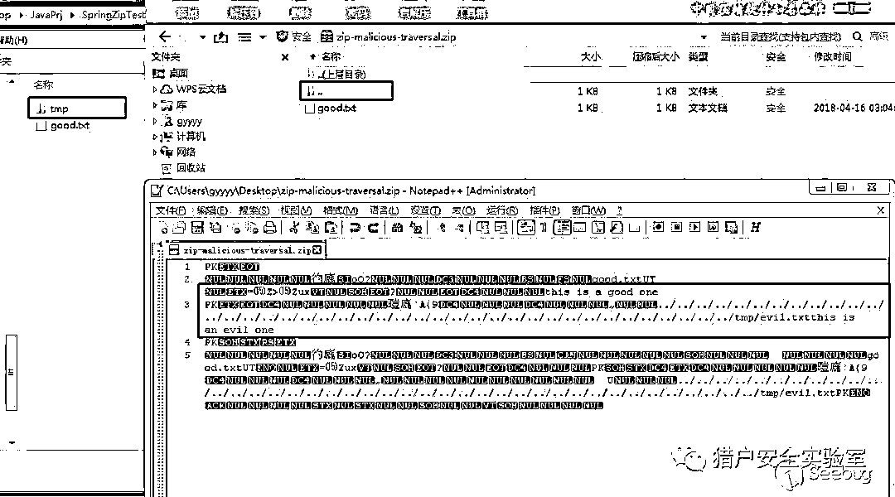
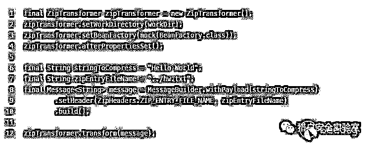
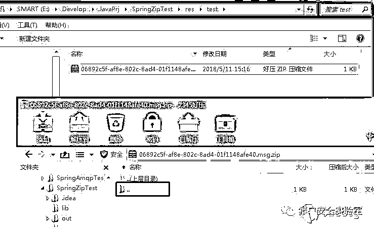
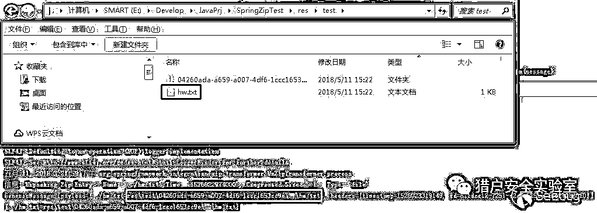

# ref:Spring Integration Zip 不安全解压（CVE-2018-1261）漏洞分析 - studyskill - 博客园

> 原文：[`www.cnblogs.com/studyskill/p/9177929.html`](https://www.cnblogs.com/studyskill/p/9177929.html)

ref:[`mp.weixin.qq.com/s/SJPXdZWNKypvWmL-roIE0Q`](https://mp.weixin.qq.com/s/SJPXdZWNKypvWmL-roIE0Q)

#### 0x00 漏洞概览

漏洞名称：Spring Integration Zip 不安全解压

漏洞编号：CVE-2018-1261

漏洞级别：严重（官方定级，比高危还高）

漏洞危害：在 spring-integration-zip.v1.0.1.RELEASE 之前的版本中，恶意用户通过在压缩文件中构造包含有特定文件名称的文件（受影响文件格式有 bzip2, tar, xz, war, cpio, 7z），应用程序使用 spring-integration-zip 进行解压时，会导致跨目录任意写入文件漏洞的攻击。进而有可能被 Getshell，远程控制。

漏洞加固：更新升级，zip.v1.0.2.RELEASE 版本

漏洞利用前置条件：

使用了 spring-integration-zip 库

接收并解压了来自不可信来源的压缩文件

#### 0x01 漏洞分析

补丁比对

zip.v1.0.1.RELEASE 在 UnZipTransformer 调用`ZipUtil.iterate()`时定义的回调中增加了一段对文件名称校验的代码片段（在 5 月 11 日凌晨更新的 zip.v1.0.2.RELEASE 版本中，对 Byte[]类型的分支逻辑也增加了文件名称校验，并且删除了对名称中..的判断，直接校验名称是否以工作区目录开头）。

通过上述内容我们大致可以猜测这个漏洞的原理：攻击者可以通过构造一个包含名称带../前缀的文件的压缩包，使 spring-integration-zip 进行解压时该文件跳出解压目录被创建。

而且在 zip.v1.0.1.RELEASE 也增加了对这类压缩包的测试用例，并且十分贴心的附上了一个“恶意”的压缩包测试文件 zip-malicious-traversal.zip。

我们先看看这个压缩包长什么样子：

稍微说明一下：

右上，压缩包正常打开的目录结构

右下，压缩包的文本形式数据

左，压缩包解压后的目录结构

从文本数据中不难看出，这个压缩包中存在一个以很多../开头为名称的文件 evil.txt。以压缩工具打开查看时，它以目录树形式显示，而解压后最深层的有效目录及文件被提取至根目录（说明使用的这个工具不存在这类解压漏洞）。

这样就可以很清楚的知道，这个压缩包如果被 zip.v1.0.0.RELEASE 解压，evil.txt 文件将会被写入工作区目录对应盘符下的 tmp 目录中。

搭个调试环境跑起来看看。

#### 0x02 环境搭建

IDE：IDEA

JDK：1.7

Libraries

spring-integration-zip.1.0.0.RELEASE

spring-integration-core.4.3.10.RELEASE

spring-integration-file.4.3.10.RELEASE

zt-zip.1.11

关键代码如下（参考官方测试用例即可）：

###### 流程跟踪

流程很简单，示例中的 UnZipTransformer.transform()会调用 doZipTransform()解压，在遍历压缩包内目录及文件时，回调 ZipEntryCallback.process()对其进行处理。

当遍历到 evil.txt 时，它被识别为一个文件，而并不是多层的目录结构，那一堆乱七八糟的只是它的文件名：

而对正常压缩包遍历到目录时应该是这样的：

然后根据文件名在工作区目录中创建对应文件（子目录会在遍历时被提前创建），并调用 org.apache.commons.io 包中的 IOUtils.copy()复制文件数据。

此时，解压的文件名被转换为绝对路径：

程序运行结束，查看 E:\tmp\目录下发现 evil.txt 文件（由于 Win 操作系统默认没有/tmp 目录，因此我在测试前提前创建了一个，也可以直接使用已存在目录，如 Web Root:P）：

#### 0x03 POC 生成

知道了漏洞原理后，我们比较好奇的是如何生成这种特殊的压缩文件，已知方法有（如果有更方便的方法，请告诉我）：

用二进制数据构造符合压缩包数据结构的文件

使用 spring-integration-zip 压缩

我们用方法 2 做个测试，关键代码如下：

再解压试试

可以看到 hw.txt 跳出解压目录外层来了，OK，打完收工。

#### 参考

*   [`pivotal.io/security/cve-2018-1261`](https://pivotal.io/security/cve-2018-1261)

*   [`github.com/spring-projects/spring-integration-extensions/`](https://github.com/spring-projects/spring-integration-extensions/)