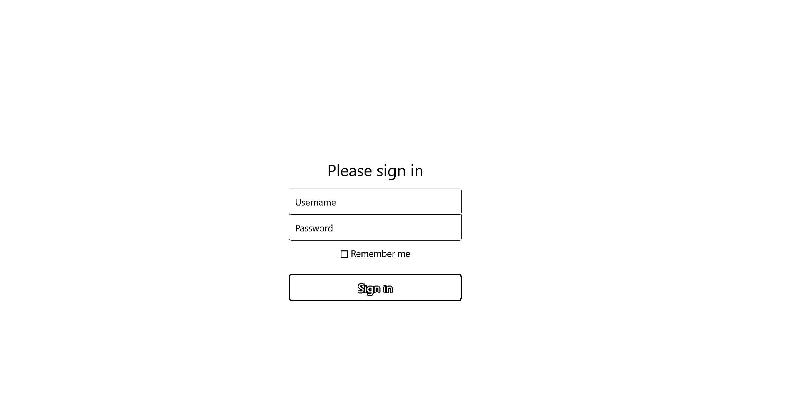
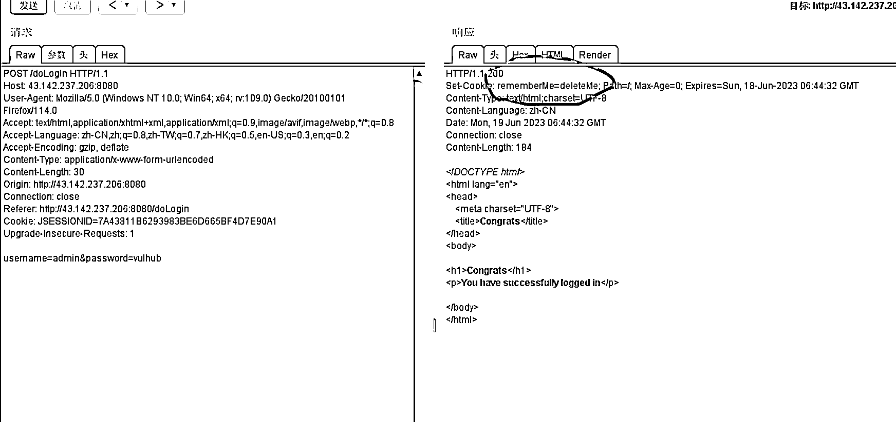
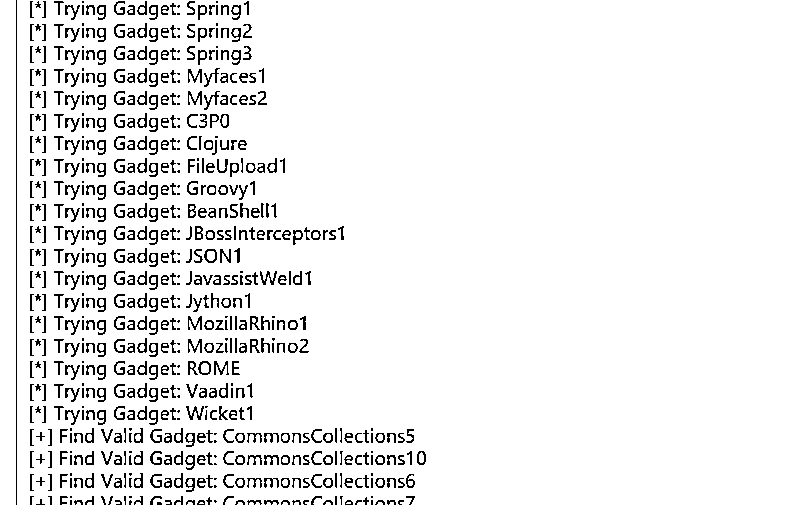

# shiro 反序列化（cve-2016-4437） - fugodd - 博客园

> 原文：[`www.cnblogs.com/fugodd-hacker/p/17491722.html`](https://www.cnblogs.com/fugodd-hacker/p/17491722.html)

一.shiro 是什么。

Shiro 是 Apache 的一个强大且易用的 Java 安全框架,用于执行身份验证、授权、密码和会话管理。使用 Shiro 易于理解的 API，可以快速轻松地对应用程序进行保护。

二.shiro550 反序列化原理

编号：cve-2016-4437

在 Apache shiro 的框架中，执行身份验证时提供了一个记住密码的功能（RememberMe），如果用户登录时勾选了这个选项。用户的请求数据包中将会在 cookie 字段多出一段数据，这一段数据包含了用户的身份信息，且是经过加密的。加密的过程是：用户信息=>序列化=>AES 加密（这一步需要用密钥 key）=>base64 编码=>添加到 RememberMe Cookie 字段。勾选记住密码之后，下次登录时，服务端会根据客户端请求包中的 cookie 值进行身份验证，无需登录即可访问。那么显然，服务端进行对 cookie 进行验证的步骤就是：取出请求包中 rememberMe 的 cookie 值 => Base64 解码=>AES 解密（用到密钥 key）=>反序列化。

三.漏洞复现

利用 vulhub 打开 shiro 漏洞环境

使用 admin::vulhub 进行登录。

利用 burp 抓包。

发现返回包中含有 rember me 字段，判断为 shiro 框架。

利用 shiro 探测 exp

存在 shiro 漏洞，反弹 shell 至 kali 端口 192.168.111.128:6666

反弹 shell 成功。