# 代码审计之 CVE-2019-9081 Laravel5.7 反序列化 RCE 复现分析 - tr1ple - 博客园

> 原文：[`www.cnblogs.com/tr1ple/p/11079354.html`](https://www.cnblogs.com/tr1ple/p/11079354.html)

```
本文首发于先知社区：https://xz.aliyun.com/t/5510
```

环境：

php7.2+apache+laravel5.7

漏洞描述：

Laravel Framework 是 Taylor Otwell 软件开发者开发的一款基于 PHP 的 Web 应用程序开发框架。Illuminate 是其中的一个组件。Laravel Framework 5.7.x 版本中的 Illuminate 组件存在反序列化漏洞，远程攻击者可利用该漏洞执行代码。

假设存在以下二次开发漏洞点：

```
    public function index()

    { if(isset($_GET['code']))
        { $code = $_GET['code']; unserialize($code); return "2333";
        }
    }
```

exp.php:

放在 public 文件夹下执行

```
<?php

namespace Illuminate\Foundation\Testing{ class PendingCommand{ protected $command; protected $parameters; protected $app; public $test; public function __construct($command, $parameters,$class,$app){ $this->command = $command; $this->parameters = $parameters; $this->test=$class; $this->app=$app;
        }
    }
}

namespace Illuminate\Auth{ class GenericUser{ protected $attributes; public function __construct(array $attributes){ $this->attributes = $attributes;
        }
    }
}

namespace Illuminate\Foundation{ class Application{ protected $hasBeenBootstrapped = false; protected $bindings; public function __construct($bind){ $this->bindings=$bind;
        }
    }
}

namespace{ $genericuser = new Illuminate\Auth\GenericUser(array("expectedOutput"=>array("0"=>"1"),"expectedQuestions"=>array("0"=>"1"))); $application = new Illuminate\Foundation\Application(array("Illuminate\Contracts\Console\Kernel"=>array("concrete"=>"Illuminate\Foundation\Application"))); $pendingcommand = new Illuminate\Foundation\Testing\PendingCommand("system",array('id'),$genericuser,$application); echo urlencode(serialize($pendingcommand));
} ?>
```

攻击效果：

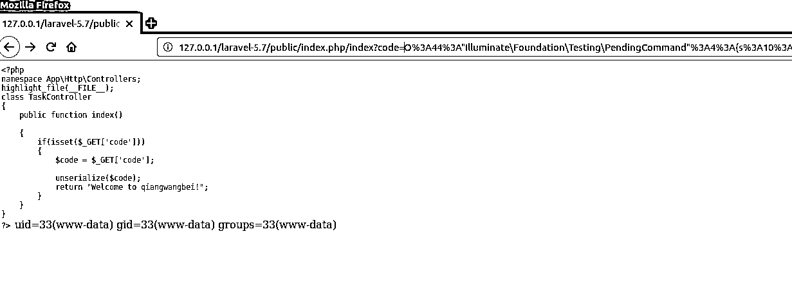

 分析过程：

首先因为在 laravel5.7 核心包里面，那么在 github 中看看 5.7 相对于 5.6 增加了哪些东西：


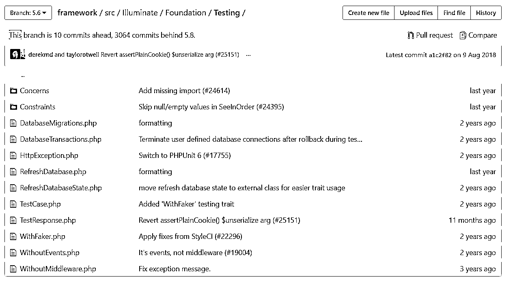

其中可以看到 5.7 中多了一个


对于新增加的文件，可以通过官方文档的 api 函数说明去了解该文件的作用，其中定义了 PendingCommand 类

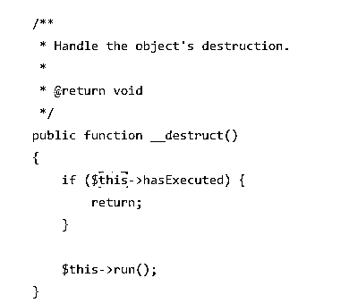

其中存在反序列化方法 __destruct()，在此析构函数中调用了 run()方法：

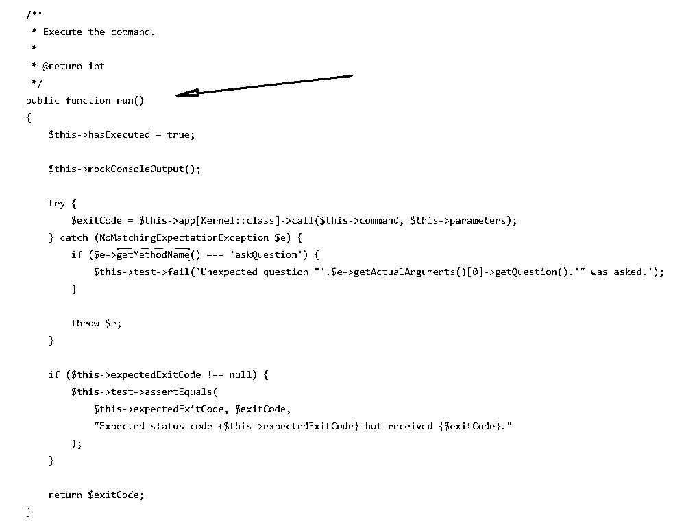

 而此方法可以在其注释中发现其用于执行命令，那么思路就为通过反序列化该类的实例对象来调用 run 方法执行命令达到 rce 的效果。在对一个类进行研究时，首先要看看与其相关的成员变量：


 在其构造方法中，有以下四个重要变量：

```
$this->app;         //一个实例化的类 Illuminate\Foundation\Application
$this->test;        //一个实例化的类 Illuminate\Auth\GenericUser
$this->command;     //要执行的 php 函数 system
$this->parameters;  //要执行的 php 函数的参数  array('id')
```


 断点跟踪分析：

首先在反序列化方法 unserialize()处下断点，执行 exp 生成的 payload 后将停在此处，此时 F7 进入 unserialize 函数进行分析：


按道理说反序列化的下一步接下来就是触发 __destruct 函数，那么我们继续 F7，可以在左下方的函数调用栈中发现出现了两处调用，


首先调用 spl_autoload_call()方法


因为我们在 payload 中使用的类在 Task 控制器中并没有加载进来，因此便触发了 PHP 的自动加载的功能，也就是实现了 lazy loading，以加载类 PendingCommand 为例进行分析(其它所用到的类加载方式相同)：关于 PHP 自动加载的相关描述可以参考

```
https://learnku.com/articles/4681/analysis-of-the-principle-of-php-automatic-loading-function
```

 　　首先是类 AliasLoadder 中 load 方法的调用，其中涉及到使用 Laravel 框架所带有的 Facade 功能去尝试加载我们 payload 中所需要的类，这里的判断的逻辑主要是有 2 条：

```
1.用户提供所要加载的类是不是其中包含"Facades",如果是则通过 loadFacade()函数进行加载
2.在 Illuminate\Support\Facades 命名空间中寻找是否含有用户所要加载的类
```


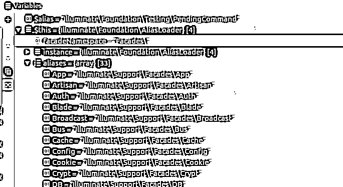

如果通过 load()方法没有加载成功，则会调用 loadclass()函数进行加载，而 loadclass()函数中通过调用 findfile()函数去尝试通过 Laravel 中的 composer 的自动加载功能含有的 classmap 去尝试寻找要加载的类所对应的类文件位置，此时将会加载 vendor 目录中所有组件， 并生成 namespace + classname 的一个 key => value 的 php 数组来对所包含的文件来进行一个匹配：

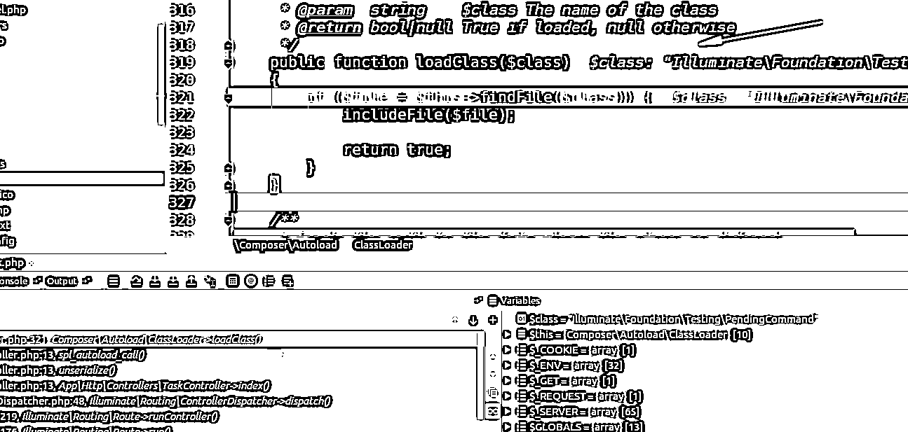


找到类 PendingCommand 所对应的文件后，将通过 includeFile()函数进行包含，从而完成类 PendingCommand 的整个加载流程


 加载完所需要的类后，将进入 __destruct 方法，此时 hasExecuted 属性默认为 false，即还没有执行命令，所以此时才能调用 run 方法：

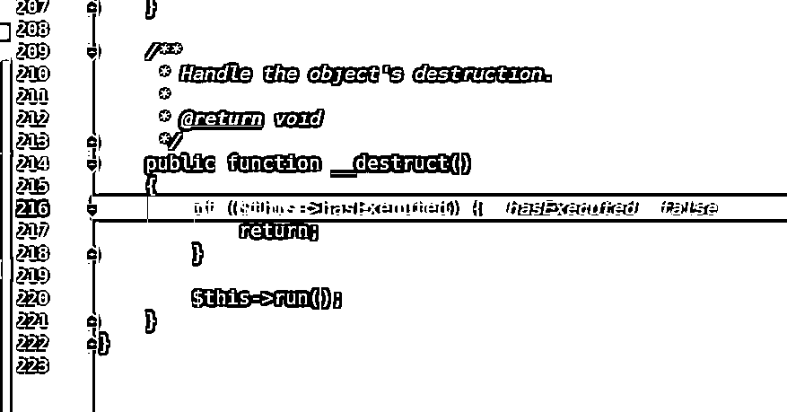

继续使用 F7 进入用于执行命令的 run()函数进行分析：

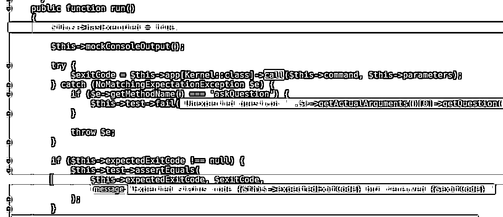

在 run 方法中，首先要调用 mockConsoleOutput()方法，该方法主要用于模拟应用程序的控制台输出，此时因为要加载类 Mockery 和类 Arrayinput，所以又要通过 spl_autoload_call->load->loadclass 加载所需要的类，并且此时又会调用 createABufferedOutputMock()函数

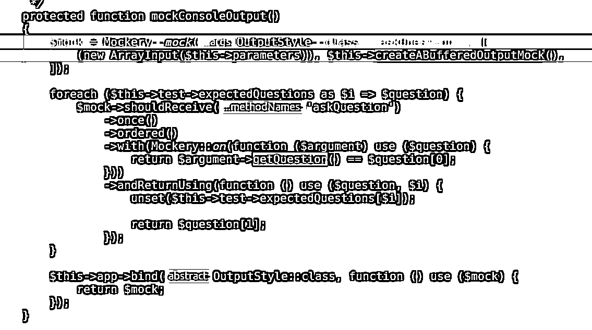

按 F7 进入 createABufferedOutputMock 观察一下其内部的实现，其中又调用了 Mockery 的 mock()函数,此时继续 F7 进入 mock 函数，进入以后直接 F8 单步执行即可，我们的目的只需要此段代码能够往下执行，在调试的时候我们并不一定要搞清每个变量每个函数的作用，调用链实在是太长太复杂，并且只要它不出错就行

```
Mockery 是一个简单而灵活的 PHP 模拟对象框架，在 Laravel 应用程序测试中，我们可能希望「模拟」应用程序的某些功能的行为，从而避免该部分在测试中真正执行
```

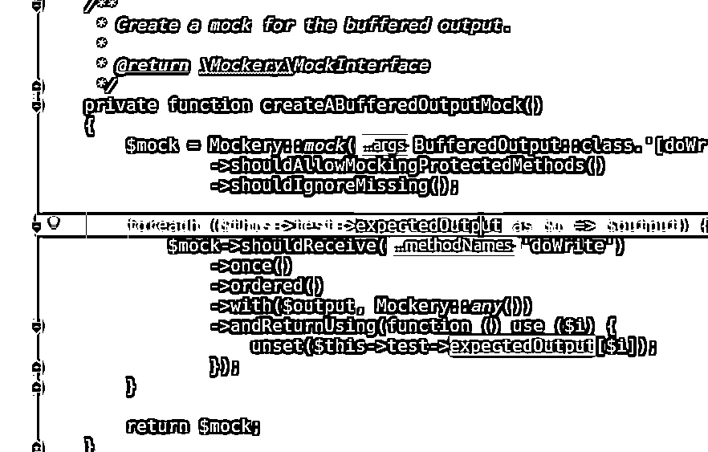

接下来是 exp 构造的第一个亮点：

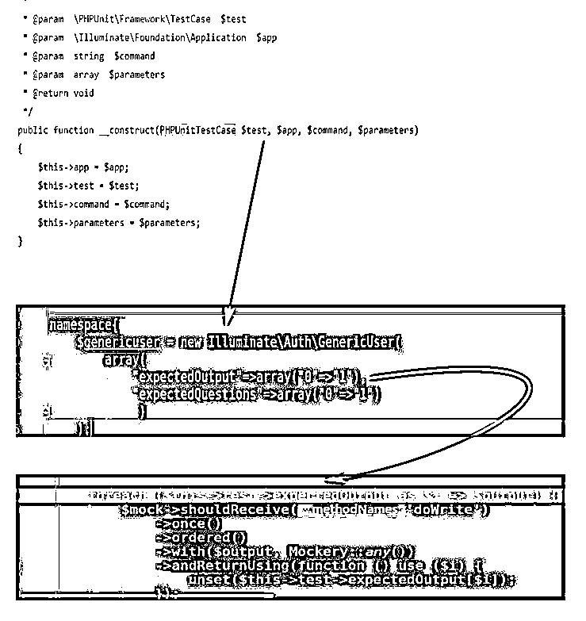

此时在 createABufferedOutputMock()方法中要进入 for 循环，并且在其中要调用 tes 对象的 expectedOutput 属性，然而在可以实例化的类中不存在 expectedOutput 属性(通过 ctrl+shift+F 即可进行全局搜索)，只在一些测试类中存在

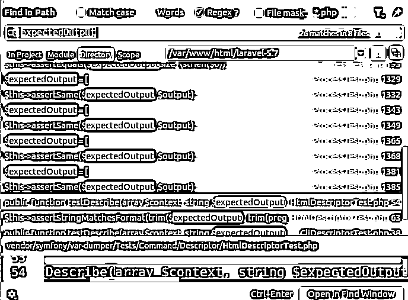

所以这里要用到 php 的一个小 trick，也是经常在 ctf 题中可能遇到的，当访问不存在的属性时会触发 __get()方法，通过去触发 __get()方法去进一步构造 pop 链，而在 Illuminate\Auth\GenericUser 的 __get 方法中存在：


而此时$this->test 是 Illuminate\Auth\GenericUser 的实例化对象，其是我们传入的，那么其是可以控制的，即 attributes 属性也是我们可以控制的，那当发生$this->test->expectedOutput 的调用时，我们只需要让 attributes 中存在键名为 expectedOutput 的数组，即数组中有内容就能够通过循环流程进行返回，继续 F8 单步执行即可跳出 createABufferedOutputMock()方法


此时回到 mockConsoleOutput()函数中，又进行了一个循环遍历，调用了 test 对象的的 expectedQuestions 属性，里面的循环体与 createABufferedOutputMock()函数的循环体相同，因此绕过方法也是通过调用 __get()方法，设置一个键名为 expectedQuestions 的数组即可，此时将继续往下走，继续 F8 单步调试就可以 return $mock，从而走出 mockConsoleOutput()函数。接下来回到 run 函数中，此时到了触发 rce 的关键点，也就是 exp 构造的第二个关键点：

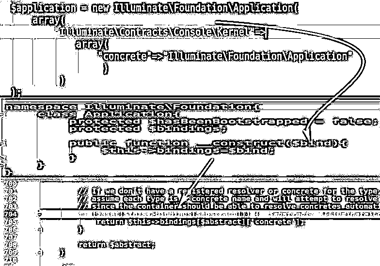

其中出现了$this->app[Kernel::class]->call 方法的调用，其中`Kernel::class`在这里是一个固定值`Illuminate\Contracts\Console\Kernel,`并且 call 的参数为我们所要执行的命令和命令参数($this->command, $this->parameters)，那我们此时需要弄清$this->app[Kernal::class]返回的是哪个类的对象，使用 F7 步入程序内部进行分析

 

`直到得到以下的调用栈,此时继续 F8 单步执行到利用 payload 的语句,此时因为$this 为 Illuminate\Foundation\Application，bindings 属性是 Container 类的，而这里也是 pauload 中选择 Applocation 作为 app 参数值的原因，那么通过反序列化我们可以控制 bindings 属性，而此时$abstract 为固定值，即只需要让$bindings 为一个二维数组，其中键$abstract 作为数组，其中存在键名为 concrete，键值为我们想要实例化的类 Application 即可`

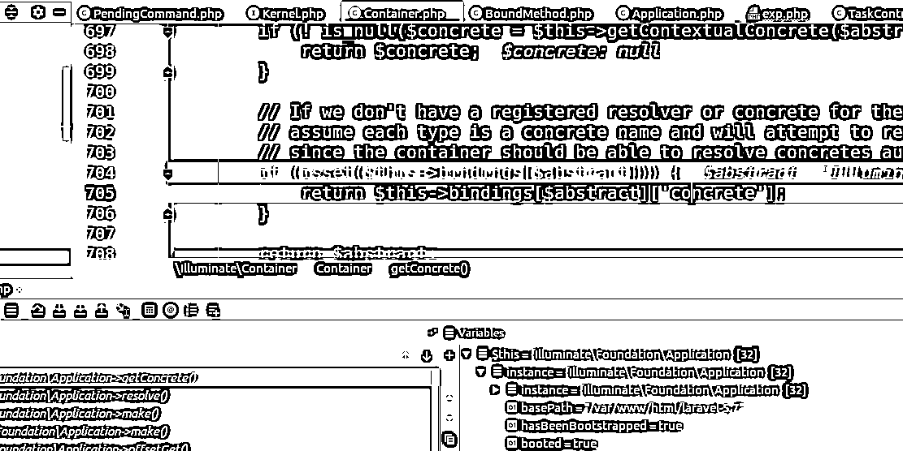

此时继续 F8 往下走，到了实例化 Application 类的时刻， 此时要满足 isBuildable 函数才可以进行 build，因此 F7 步入查看


此时$concrete 为 Application，而$abstract 为 kernal，显然不满足，并且||右边$concrete 明显不是闭包类的实例化，所以此时不满足 Application 实例化条件，此时继续 F7，此时将会调用 make 函数，并且此时将$abstract 赋值为了 Application，并且 make 函数又调用了 resolve 函数，即实现了第二次调用 isBuildable()函数判断是否可以进行实例化，即此时已经可以成功实例化类 Application，即完成了$this->app[Kernel::class]为 Application 对象的转化

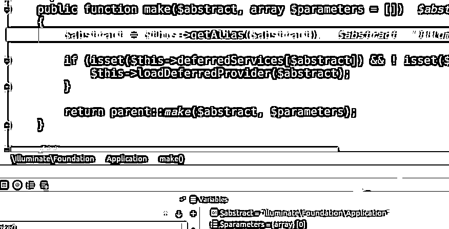

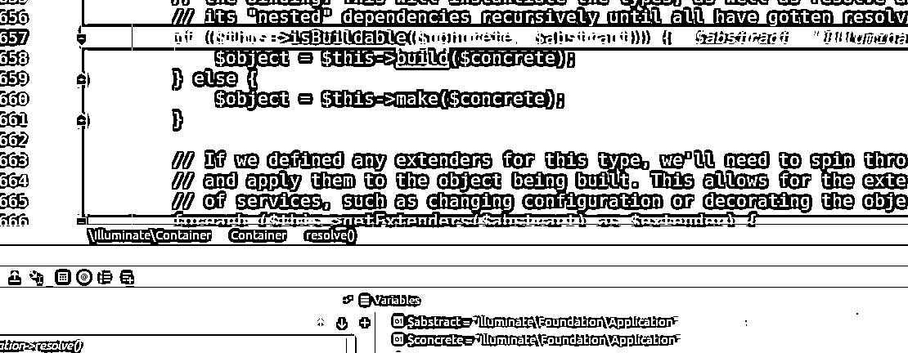

接下来将调用类 Application 中的 call 方法，即其父类 Container 中的 call 方法

 

 

其中第一个分支 isCallableWithAtSign()判断回调函数是否为字符串并且其中含有"@“,并且$defaultMethod 默认为 null，显然此时不满足 if 条件，即进入第二个分支，callBoundMethod()函数的调用


 在 callBoundMethod()函数中将调用 call_user_func_array()函数来执行最终的命令，首先$callback 为”system“,参数为静态方法 getMethodDependencies()函数的返回值，F7 步入看看


在 return 处可以看到此时调用 array_merge 函数将$dependencies 数组和$parameters 数组进行合并，但是$dependencies 数组为空，因此对我们要执行命令的参数不产生影响，即在此步返回将执行命令，即完成

```
call_user_func_array('system',array('id'))
```

 此时 run 函数中$exitcode 值即为命令的执行结果

 

 参考：

[`laworigin.github.io/2019/02/21/laravelv5-7%E5%8F%8D%E5%BA%8F%E5%88%97%E5%8C%96rce/`](https://laworigin.github.io/2019/02/21/laravelv5-7%E5%8F%8D%E5%BA%8F%E5%88%97%E5%8C%96rce/)

https://learnku.com/docs/laravel/5.7/facades/2251

https://learnku.com/articles/12575/deep-analysis-of-the-laravel-service-container

https://laravel.com/docs/5.7/structure#the-tests-directory