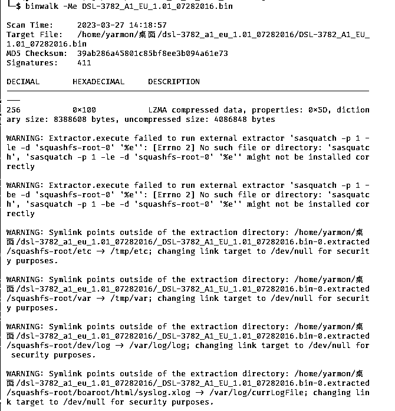
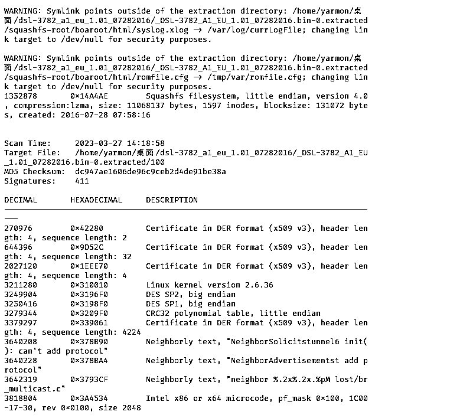
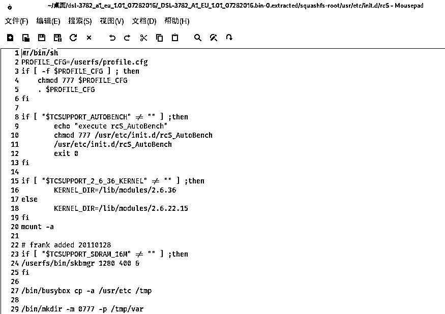
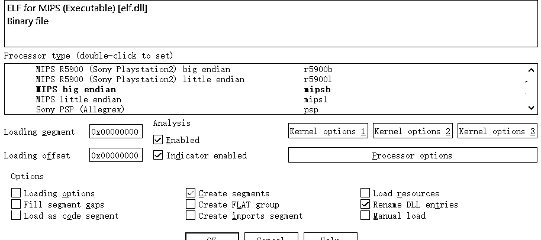
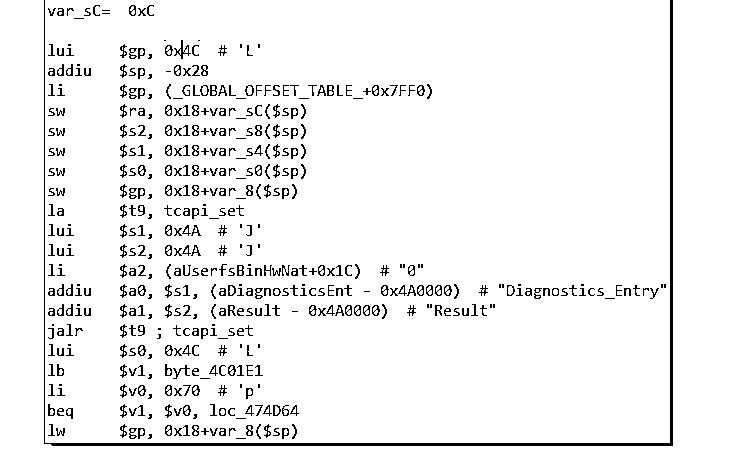
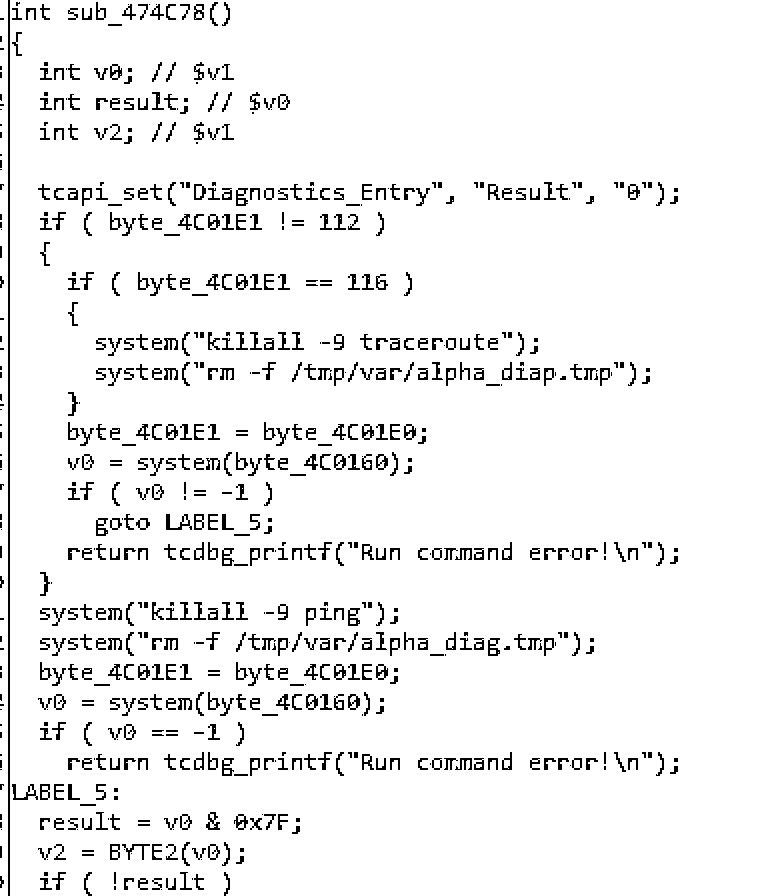
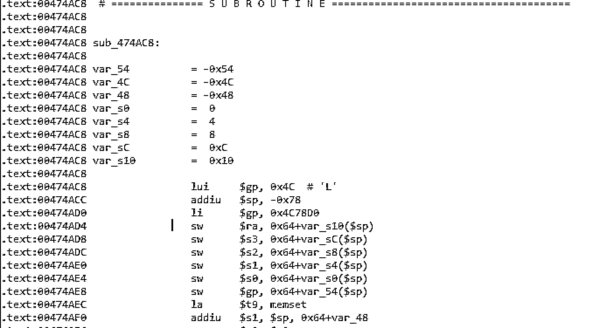
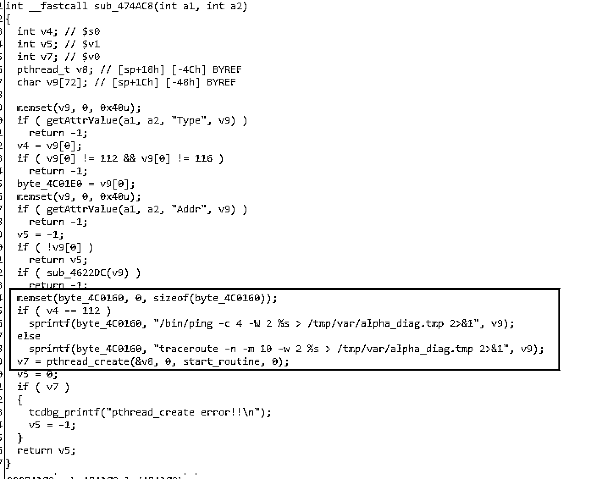
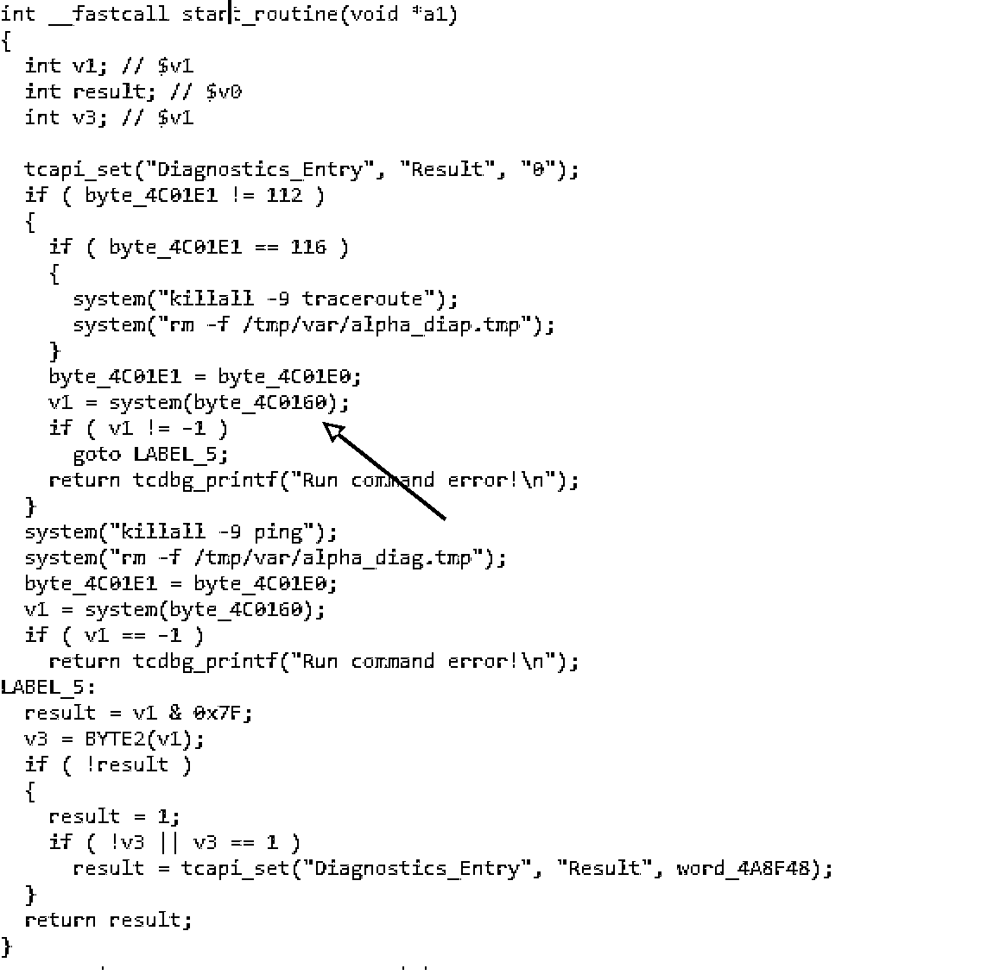

# 关于根据大佬的 (D-Link DSL-3782 的 CVE-2022-34527 漏洞分析) - 酹酒 - 博客园

> 原文：[`www.cnblogs.com/yarmon12/p/17261465.html`](https://www.cnblogs.com/yarmon12/p/17261465.html)

# 关于根据大佬的 (D-Link DSL-3782 的 CVE-2022-34527 漏洞分析) 

### 第一步、提取固件并分析

使用 binwalk 提取 DSL-3782 路由器的固件文件，

　　`binwalk -Me DSL-3782_A1_EU_1.01_07282016.bin`

### 然后就可以在系统文件里面随意分析了

###  随后查看 /usr/etc/init.d/rcS 配置文件 

###  CVE-2022-34527 存在于 cfg_manager

 

### 用 ida 打开 cfg_manager

### 搜索函数 sub_474c78

### 使用 F5 反编译，但是不知道为什么这个版本问题，反编译失败，下面就用别的师傅的图。

### 进入 sub_474c78，v0 = system(byte_4C0160); 中使用 system 进行命令执行。

### 但是无法判断 byte_4C0160 是否为用户可控，寻找 byte_4C0160 的赋值点，查看 byte_4C0160 的调用。

### 根据这段汇编，可以看到 byte_4c0160 传值给了$s2，然后给了$a0，然后调用了 sprintf，然后通过 pthread_create 调用了我们发现调用 system 函数的 sub_474c78。

###  然后查看伪代码，在`.text:00474AC8`代码处按 P 修复。

### 按 F5 反汇编。

 

###  红框标出的地方就是给 byte_4c0160 赋值的地方，创建的 start_routine 函数则是最开始定位到的 sub_474c78 函数。

### 继续分析给 byte_4c0160 赋值的代码
该值由 v9 控制，往上看代码

### 

### v9 由传递的参数 a1，a2 控制。那么，如果 sub_474AC8 的 a1，a2 可控，就可以进行命令执行了。根据代码的经验，sub_474AC8 是一个处理传入 start_routine 即 sub_474c78 函数的参数的前置函数，这一段的代码的主要目的是为了执行 sub_474c78 函数的功能。

### 代码中显然是在使用某一个 api 接口，全局搜索 Diagnostics_Entry。

 

###  那么该参数是来自 web 前端，参数由 Diagnostics_Entry 页面产生故可以利用。

logo