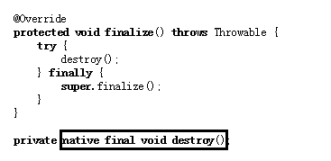
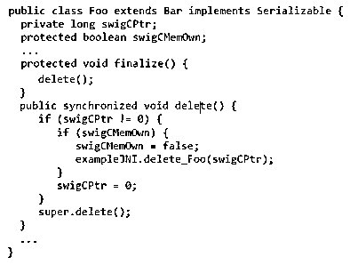

# 安卓序列化漏洞 —— CVE-2015-3525 - bamb00 - 博客园

> 原文：[`www.cnblogs.com/goodhacker/p/4806479.html`](https://www.cnblogs.com/goodhacker/p/4806479.html)

      在 2014 年，Jann Horn 发现一个安卓的提权漏洞，该漏洞允许恶意应用从普通应用权限提权到 system 用户执行命令，漏洞信息与 POC 见(1]。漏洞的成因源于在安卓系统（<5.0）中，java.io.ObjectInputStream 并未校验输入的 java 对象是否是实际可序列化的。攻击者因此可以构建一个不可序列化的 java 对象实例，恶意构建其成员变量，当该对象实例被 ObjectInputStream 反序列化时，将发生类型混淆，对象的 Field 被视为由本地代码处理的指针，使攻击者获得控制权。这就是 CVE-2014-7911。在了解它的详细信息之前我们先了解以下基础知识：

# Android IPC 机制

    Android 应用之间使用沙盒进行隔离用以保障安全性。不过，它们之间可以通过 Intent 消息机制进行交互。交互时复杂数据类型的传递必须由发送方进行序列化，然后由接收方反序列化。为了方便开发者，Java 为序列化提供了内置支持。

# Java 序列化

序列化 Serializable 的作用是将数据对象存入字节流当中，在需要时重新生成对象。Android 中 Intent 中传递对象进行序列化有两种方法，一种是 Bundle.putSerializable(Key,Object)，另一种是 Bundle.putParcelable(Key, Object)。前者是实现了 Serializable 接口，而后者是实现了 Parcelable 接口。Serializable 使用 IO 读写存储在硬盘上，而 Parcelable 是直接在内存中读写，很明显内存的读写速度通常大于 IO 读写，所以在 Android 中通常优先选择 Parcelable。但是 Parcelable 不能使用在要将数据存储在磁盘上的情况，因为 Parcelable 在外界有变化的情况下不能很好的保证数据的持续性。所以在这种情况下会使用 Serializable。

    implements Serializable 接口的的作用就是给对象打了一个标记，系统会自动将其序列化。

例如，序列化（和其它）的对象可以通过以下形式添加到 Intent 的 extras 中：

```
1 SerializableTypeobj = … 2 
3 Bundle b = intent.getExtras(); 4 
5 b.putString(“foo”, “some string”); 6 
7 b.putSerializable(“bar”, obj);
```

接收数据的代码如下：

```
1 Bundle b = intent.getExtras(); 2 
3 String foo = (String)b.getString(“foo”); 4 
5 SerializableTypeobj = (SerializableType)b.getSerializable(“bar”);
```

# java 垃圾回收机制（GC）

我们主要介绍一下 java 垃圾回收机制中的 finalize()方法。

       finalize()方法是所有实体对象都具有的方法，因为这个是 Object 类定义的，常被误认为是垃圾回收的方法或者叫做析构函数，其实并非如此。finalize 在 JVM 内存回收前会被调用（但并非绝对），而即使不调用它，JVM 回收机制通过后面所述的一些算法就可以定位哪些是垃圾内存，那么这个拿来干什么用呢？

finalize()其实是要做一些特殊的内存回收操作，如果对 JAVA 研究稍微多一点，大家会发现 JAVA 中有一种 JNI 的机制，即：Java native interface，这种属于 JAVA 本地接口调用，即调用本地的其它语言信息，JAVA 虚拟机底层调用也是这样实现的，这部分调用中可能存在一些对 C、C++语言的操作，在 C 和 C++内部通过 new、malloc、realloc 等关键词创建的对象垃圾回收机制是无能为力的，因为这不是它要管理的范围，而平时这些对象可能被 JAVA 对应的实体所调用，那么需要在对应 JAVA 对象放弃时（并不代表回收，只是程序中不使用它了）去调用对应的 C、C++提供的本地接口去释放这段内存信息，它们的释放同样需要通过 free 或 delete 去释放，所以我们一般情况下不要滥用 finalize()，可能你会联想到另一类某些特殊引用对象的释放，如层数引用太多，JAVA 虚拟机有些时候不知道这一线的对象是否都可能被回收，那么，你可以自己将 finalize()重写，并将内置对象的句柄先释放掉，这样也是没有问题的，不过一般不要滥用。

了解了这些知识后，我们说下 CVE-2014-7911 的细节，大概是这样的：system_server 是一个拥有 system 权限的关键系统进程，任意应用可向其发送可序列化对象，虽然 system_server 并不会主动调用该对象的方法，但是在系统 GC 该对象时会调用到其 finalize 方法。Jann Horn 发现 android.os.BinderProxy 这个类在 finalize 方法里调用了一个 native 指针，而这个指针可被攻击者控制指向任意地址，因此在 GC 时有机会造成代码执行。

 

但 android.os.BinderProxy 是一个不能被序列化的类，因此理论上我们并不能通过发送它的实例来控制将要攻击的目标进程代码执行，但由于 java.io.InputStream 没有检查接收到的对象是否可序列化，因此我们可以通过特殊方法构造一个被序列化了的伪 android.os.BinderProxy 来达到目的。值得注意的是，尽管 Android 采用了 ASLR 机制，但为了获得正确的地址，可以基于这样一个事实：system_server 和攻击者 app 都是从同一个进程-Zygote fork 而来，具有相同的基址，攻击者通过分析自己进程的 map 文件（位于/proc/maps）就可以知道 system_server 以及所加载模块的内存布局。Google 发布的补丁为 java.io.InputStream 添加了序列化检查来阻止攻击者发送 android.os.BinderProxy，但通过这个漏洞我们可以发现一个可序列化的类只要满足以下条件就能代替 android.os.BinderProxy 实现代码执行的目的：

（1）实现了 finalize 方法；

（2）在 finalize 方法里调用了一个 native 指针；

（3）该 native 指针是攻击者可控的（没有被声明为 transient 和 static）；

（4）implements 了 Serializable 接口（可序列化）；

（5）没有重载 readObject 和 readResolve 方法来阻止我们控制 native 指针。

IBM Security 在安卓原生框架中找到了一个这样的类 OpenSSLX509Certificate（CVE-2015-3525），在 Google Play Services APK 中就使用了 OpenSSLX509Certificate 类。另外还发现了 6 个存在漏洞的第三方 SDK:

*   Jumio (CVE-2015-2000)
*   MetaIO (CVE-2015-2001)
*   PJSIP PJSUA2 (CVE-2015-2003)
*   GraceNote GNSDK (CVE-2015-2004)
*   MyScript (CVE-2015-2020)
*   esriArcGis (CVE-2015-2002)

那么这些 SDK 是否存在某些相似之处呢？经过分析发现前 5 个都使用了 SWIG，这是一种连接 C/C++与 Java 等各种高级语言的互操作性工具。在某些开发者提供的配置中，SWIG 可以产生以下漏洞代码：

 

因为 Bar 能够被序列化，所以 Foo 可以被序列化，因此，攻击者可以控制 swigCPtr（和 swigCMemOwn），而 swigCPtr 被用于 native 代码中。因而这是一个高度符合条件可被利用的场景，特别是当原始的 C++类有虚拟析构函数的时候。

通过分析这个漏洞我们可以知道，CVE-2014-7911 的补丁只是紧缩了攻击界面，而没有真正解决问题。Google 随后发布了 CVE-2015-3525 的补丁，将存在于 OpenSSLX509Certificate 类中的 native 指针声明为 transient，使该指针不可被序列化。然而，即使安卓的原生世界修复了所有危险的可序列化类，如果第三方 SDK 中存在这样的类依然可被用于序列化攻击。IBM Security 建议将 Bundle 的解析内部资源修改为懒行为，并修改 readObject、readResolve 等读取方法来阻止攻击者控制危险变量。

参考文章：

[`github.com/retme7/CVE-2014-7911_poc`](https://github.com/retme7/CVE-2014-7911_poc)

[`researchcenter.paloaltonetworks.com/2015/01/cve-2014-7911-deep-dive-analysis-android-system-service-vulnerability-exploitation/`](http://researchcenter.paloaltonetworks.com/2015/01/cve-2014-7911-deep-dive-analysis-android-system-service-vulnerability-exploitation/)

[`www.freebuf.com/news/74676.html`](http://www.freebuf.com/news/74676.html)