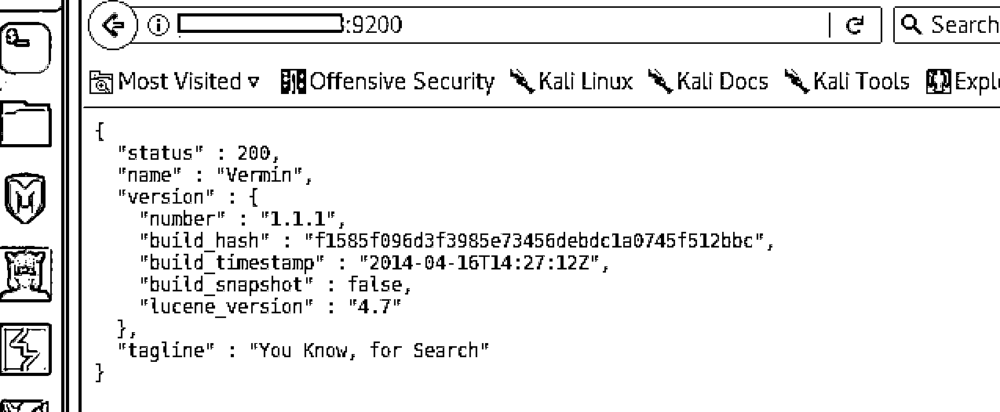
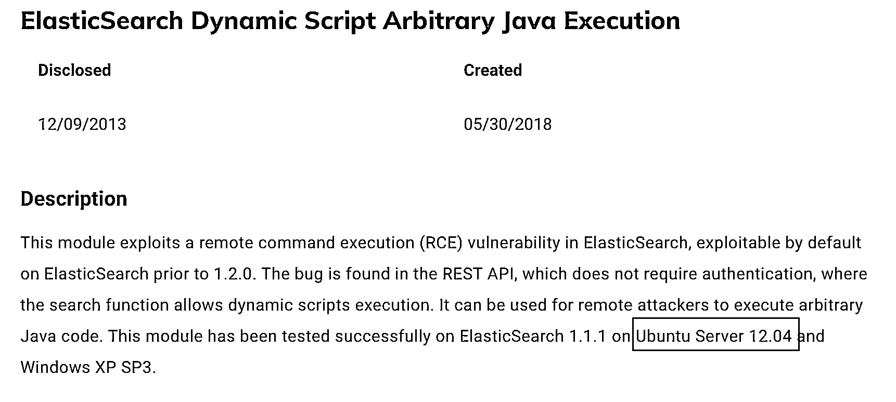

# 工具学习 - MetaSploit - CVE-2014-3120(ES) - Sally_Zhang - 博客园

> 原文：[`www.cnblogs.com/sallyzhang/p/12575056.html`](https://www.cnblogs.com/sallyzhang/p/12575056.html)

CVE-2014-3120 是 ES 的命令执行漏洞，之前在 vulhub 中做过漏洞复现([`www.cnblogs.com/sallyzhang/p/12450035.html`](https://www.cnblogs.com/sallyzhang/p/12450035.html))，复现方式为手工复现。学习了一段时间的 msf(metasploit 简称 msf)，现在尝试用使用 msf。

1\. 开启虚拟机。vulhub 和 kali 是两个虚拟机，两个虚拟机需要互相访问，应将网络配置为桥接模式

2\. vulhub 开启对应 docker 容器，kali 上尝试访问，访问成功：

3\. kali 打开终端，输入命令 msfconsole 开启 msf。

4\. 根据[`github.com/rapid7/metasploitable3/wiki/Vulnerabilities`](https://github.com/rapid7/metasploitable3/wiki/Vulnerabilities)找到该漏洞对应的 module：exploit/multi/elasticsearch/script_mvel_rce

5\. msf 进入对应模块，使用命令: use exploit/multi/elasticsearch/script_mvel_rce

exploit 是 msf 的其中一个模块，该模块有对应每一个具体漏洞的攻击方法，有主动攻击(active)和被动攻击(passive)两种方式

active 模式：被攻击方开放了端口或者服务，且存在服务器端口的漏洞

passive 模式：利用客户端程序的漏洞，没有开端口或者服务。留后门，反弹 shell 等

6\. 设置参数

查看参数命令：show options

只需要设置参数 RHOST：set RHOST ip

7\. 用命令 exploit 开始执行，木有执行成功>_<

报错的意思大概是 session 打开之后又被关掉了。如果执行成功，会反弹回来 shell，进入 session 就能连接 shell 了。

进入被攻击机器(也就是开启 ES 服务的另一台虚拟机)，发现 jar 包已经成功上传了，猜测是 jar 包没有执行成功

去官网查了下相关信息,官方说只在 Ubuntu12.04 上测试过。。。而我的 Ubuntu 是 14.06，尝试了一下从 Ubuntu 直接反弹到 kali，是可以成功的。。。

有空把 metaspolit3 的环境搭下，这里面应该的环境应该都是配套的。

[ ](https://www.cnblogs.com/sallyzhang/p/12450035.html)