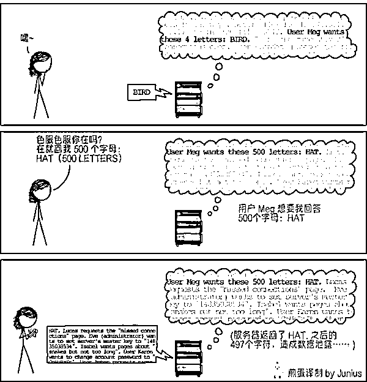
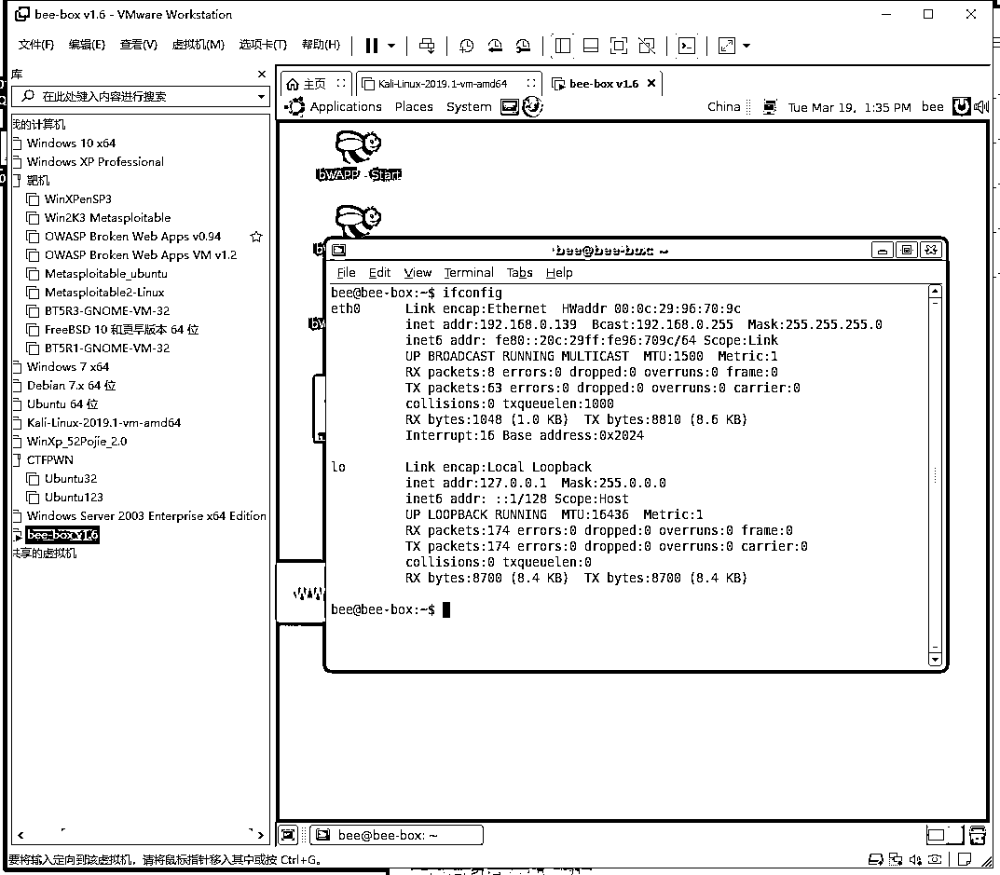
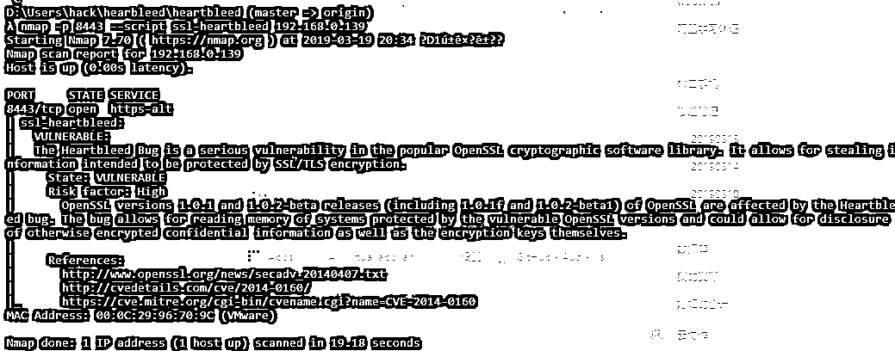
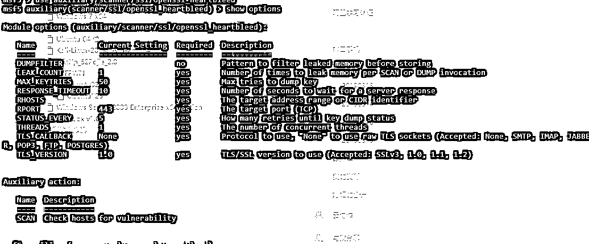

# 心脏滴血漏洞复现（CVE-2014-0160） - 秃桔子 - 博客园

> 原文：[`www.cnblogs.com/godoforange/p/10834773.html`](https://www.cnblogs.com/godoforange/p/10834773.html)

**漏洞范围：**

**OpenSSL 1.0.1 版本**

**漏洞成因：**

Heartbleed 漏洞是由于未能在 memcpy()调用受害用户输入内容作为长度参数之前正确进 行边界检查。攻击者可以追踪 OpenSSL 所分配的 64KB 缓存、将超出必要范围的字节信息复 制到缓存当中再返回缓存内容，这样一来受害者的内存内容就会以每次 64KB 的速度进行泄 露。

**漏洞危害：**

我们可以通过该漏洞读取每次攻击泄露出来的信息，所以可能也可以获取到服务器的 私钥，用户 cookie 和密码等。

**漏洞原理图： **

**漏洞利用：**

****

 

 

 SET RHOST 192.168.0.139

SET RPORT 8443

SET LEAK_COUNT 10

